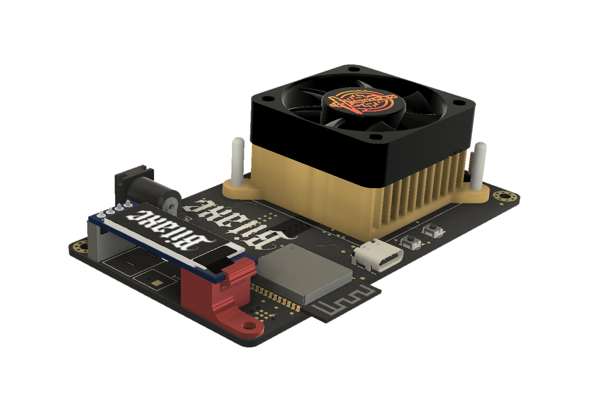

www.thesolomining.co


Screen Spacer / Retainer / Support for The Bitaxe Ultra 201-204 Series.

Print with 100% Infill.


<p align="center">
  
  
</p>


```stl
solid ASCII
  facet normal 1.000000e+00 -1.336920e-14 0.000000e+00
    outer loop
      vertex   -1.214190e+02 -5.773234e+01 1.150000e+01
      vertex   -1.214190e+02 -5.773234e+01 1.075000e+01
      vertex   -1.214190e+02 -5.029166e+01 1.150000e+01
    endloop
  endfacet
  facet normal 1.000000e+00 -1.336920e-14 0.000000e+00
    outer loop
      vertex   -1.214190e+02 -5.029166e+01 1.150000e+01
      vertex   -1.214190e+02 -5.773234e+01 1.075000e+01
      vertex   -1.214190e+02 -5.029166e+01 1.075000e+01
    endloop
  endfacet
  facet normal -2.804626e-02 2.657075e-16 9.996066e-01
    outer loop
      vertex   -1.248587e+02 -4.812099e+01 1.500000e+00
      vertex   -1.248587e+02 -5.412099e+01 1.500000e+00
      vertex   -1.246905e+02 -5.112099e+01 1.504720e+00
    endloop
  endfacet
  facet normal -2.804626e-02 4.375026e-17 9.996066e-01
    outer loop
      vertex   -1.246905e+02 -5.112099e+01 1.504720e+00
      vertex   -1.248587e+02 -5.412099e+01 1.500000e+00
      vertex   -1.246905e+02 -5.412099e+01 1.504720e+00
    endloop
  endfacet
  facet normal -8.405052e-02 5.750276e-16 9.964615e-01
    outer loop
      vertex   -1.246905e+02 -5.112099e+01 1.504720e+00
      vertex   -1.246905e+02 -5.412099e+01 1.504720e+00
      vertex   -1.245228e+02 -5.112099e+01 1.518863e+00
    endloop
  endfacet
  facet normal -8.405052e-02 7.962865e-16 9.964615e-01
    outer loop
      vertex   -1.245228e+02 -5.112099e+01 1.518863e+00
      vertex   -1.246905e+02 -5.412099e+01 1.504720e+00
      vertex   -1.245228e+02 -5.412099e+01 1.518863e+00
    endloop
  endfacet
  facet normal -1.397903e-01 1.324360e-15 9.901811e-01
    outer loop
      vertex   -1.245228e+02 -5.112099e+01 1.518863e+00
      vertex   -1.245228e+02 -5.412099e+01 1.518863e+00
      vertex   -1.243562e+02 -5.112099e+01 1.542387e+00
    endloop
  endfacet
  facet normal -1.397903e-01 -3.638537e-16 9.901811e-01
    outer loop
      vertex   -1.243562e+02 -5.112099e+01 1.542387e+00
      vertex   -1.245228e+02 -5.412099e+01 1.518863e+00
      vertex   -1.243562e+02 -5.412099e+01 1.542387e+00
    endloop
  endfacet
  facet normal -1.950903e-01 -9.216430e-17 9.807853e-01
    outer loop
      vertex   -1.243562e+02 -5.112099e+01 1.542387e+00
      vertex   -1.243562e+02 -5.412099e+01 1.542387e+00
      vertex   -1.241911e+02 -5.112099e+01 1.575216e+00
    endloop
  endfacet
  facet normal -1.950903e-01 1.412711e-15 9.807853e-01
    outer loop
      vertex   -1.241911e+02 -5.112099e+01 1.575216e+00
      vertex   -1.243562e+02 -5.412099e+01 1.542387e+00
      vertex   -1.241911e+02 -5.412099e+01 1.575216e+00
    endloop
  endfacet
  facet normal -2.497765e-01 1.936345e-15 9.683035e-01
    outer loop
      vertex   -1.241911e+02 -5.112099e+01 1.575216e+00
      vertex   -1.241911e+02 -5.412099e+01 1.575216e+00
      vertex   -1.240282e+02 -5.112099e+01 1.617248e+00
    endloop
  endfacet
  facet normal -2.497765e-01 -9.668866e-16 9.683035e-01
    outer loop
      vertex   -1.240282e+02 -5.112099e+01 1.617248e+00
      vertex   -1.241911e+02 -5.412099e+01 1.575216e+00
      vertex   -1.240282e+02 -5.412099e+01 1.617248e+00
    endloop
  endfacet
  facet normal -3.036767e-01 -6.770837e-16 9.527751e-01
    outer loop
      vertex   -1.240282e+02 -5.112099e+01 1.617248e+00
      vertex   -1.240282e+02 -5.412099e+01 1.617248e+00
      vertex   -1.238678e+02 -5.112099e+01 1.668350e+00
    endloop
  endfacet
  facet normal -3.036767e-01 1.466614e-15 9.527751e-01
    outer loop
      vertex   -1.238678e+02 -5.112099e+01 1.668350e+00
      vertex   -1.240282e+02 -5.412099e+01 1.617248e+00
      vertex   -1.238678e+02 -5.412099e+01 1.668350e+00
    endloop
  endfacet
  facet normal -3.566215e-01 1.995632e-15 9.342489e-01
    outer loop
      vertex   -1.238678e+02 -5.112099e+01 1.668350e+00
      vertex   -1.238678e+02 -5.412099e+01 1.668350e+00
      vertex   -1.237106e+02 -5.112099e+01 1.728361e+00
    endloop
  endfacet
  facet normal -3.566215e-01 1.689299e-15 9.342489e-01
    outer loop
      vertex   -1.237106e+02 -5.112099e+01 1.728361e+00
      vertex   -1.238678e+02 -5.412099e+01 1.668350e+00
      vertex   -1.237106e+02 -5.412099e+01 1.728361e+00
    endloop
  endfacet
  facet normal -4.084443e-01 1.934781e-15 9.127833e-01
    outer loop
      vertex   -1.237106e+02 -5.112099e+01 1.728361e+00
      vertex   -1.237106e+02 -5.412099e+01 1.728361e+00
      vertex   -1.235570e+02 -5.112099e+01 1.797093e+00
    endloop
  endfacet
  facet normal -4.084443e-01 1.326745e-15 9.127833e-01
    outer loop
      vertex   -1.235570e+02 -5.112099e+01 1.797093e+00
      vertex   -1.237106e+02 -5.412099e+01 1.728361e+00
      vertex   -1.235570e+02 -5.412099e+01 1.797093e+00
    endloop
  endfacet
  facet normal -4.589819e-01 1.582351e-15 8.884456e-01
    outer loop
      vertex   -1.235570e+02 -5.112099e+01 1.797093e+00
      vertex   -1.235570e+02 -5.412099e+01 1.797093e+00
      vertex   -1.234075e+02 -5.112099e+01 1.874330e+00
    endloop
  endfacet
  facet normal -4.589819e-01 1.319318e-15 8.884456e-01
    outer loop
      vertex   -1.234075e+02 -5.112099e+01 1.874330e+00
      vertex   -1.235570e+02 -5.412099e+01 1.797093e+00
      vertex   -1.234075e+02 -5.412099e+01 1.874330e+00
    endloop
  endfacet
  facet normal -5.080753e-01 1.577979e-15 8.613126e-01
    outer loop
      vertex   -1.234075e+02 -5.112099e+01 1.874330e+00
      vertex   -1.234075e+02 -5.412099e+01 1.874330e+00
      vertex   -1.232626e+02 -5.112099e+01 1.959827e+00
    endloop
  endfacet
  facet normal -5.080753e-01 7.492298e-16 8.613126e-01
    outer loop
      vertex   -1.232626e+02 -5.112099e+01 1.959827e+00
      vertex   -1.234075e+02 -5.412099e+01 1.874330e+00
      vertex   -1.232626e+02 -5.412099e+01 1.959827e+00
    endloop
  endfacet
  facet normal -5.555702e-01 1.031640e-15 8.314696e-01
    outer loop
      vertex   -1.232626e+02 -5.112099e+01 1.959827e+00
      vertex   -1.232626e+02 -5.412099e+01 1.959827e+00
      vertex   -1.231227e+02 -5.112099e+01 2.053317e+00
    endloop
  endfacet
  facet normal -5.555702e-01 3.171021e-15 8.314696e-01
    outer loop
      vertex   -1.231227e+02 -5.112099e+01 2.053317e+00
      vertex   -1.232626e+02 -5.412099e+01 1.959827e+00
      vertex   -1.231227e+02 -5.412099e+01 2.053317e+00
    endloop
  endfacet
  facet normal -6.013171e-01 3.686106e-15 7.990105e-01
    outer loop
      vertex   -1.231227e+02 -5.112099e+01 2.053317e+00
      vertex   -1.231227e+02 -5.412099e+01 2.053317e+00
      vertex   -1.229882e+02 -5.112099e+01 2.154506e+00
    endloop
  endfacet
  facet normal -6.013171e-01 -3.450775e-16 7.990105e-01
    outer loop
      vertex   -1.229882e+02 -5.112099e+01 2.154506e+00
      vertex   -1.231227e+02 -5.412099e+01 2.053317e+00
      vertex   -1.229882e+02 -5.412099e+01 2.154506e+00
    endloop
  endfacet
  facet normal -6.451720e-01 2.441651e-18 7.640374e-01
    outer loop
      vertex   -1.229882e+02 -5.112099e+01 2.154506e+00
      vertex   -1.229882e+02 -5.412099e+01 2.154506e+00
      vertex   -1.228596e+02 -5.112099e+01 2.263074e+00
    endloop
  endfacet
  facet normal -6.451720e-01 2.829948e-15 7.640374e-01
    outer loop
      vertex   -1.228596e+02 -5.112099e+01 2.263074e+00
      vertex   -1.229882e+02 -5.412099e+01 2.154506e+00
      vertex   -1.228596e+02 -5.412099e+01 2.263074e+00
    endloop
  endfacet
  facet normal -6.869969e-01 3.039136e-15 7.266603e-01
    outer loop
      vertex   -1.228596e+02 -5.112099e+01 2.263074e+00
      vertex   -1.228596e+02 -5.412099e+01 2.263074e+00
      vertex   -1.227374e+02 -5.112099e+01 2.378680e+00
    endloop
  endfacet
  facet normal -6.869969e-01 6.078273e-15 7.266603e-01
    outer loop
      vertex   -1.227374e+02 -5.112099e+01 2.378680e+00
      vertex   -1.228596e+02 -5.412099e+01 2.263074e+00
      vertex   -1.227374e+02 -5.412099e+01 2.378680e+00
    endloop
  endfacet
  facet normal -7.266603e-01 6.477526e-15 6.869969e-01
    outer loop
      vertex   -1.227374e+02 -5.112099e+01 2.378680e+00
      vertex   -1.227374e+02 -5.412099e+01 2.378680e+00
      vertex   -1.226218e+02 -5.112099e+01 2.500960e+00
    endloop
  endfacet
  facet normal -7.266603e-01 2.018411e-15 6.869969e-01
    outer loop
      vertex   -1.226218e+02 -5.112099e+01 2.500960e+00
      vertex   -1.227374e+02 -5.412099e+01 2.378680e+00
      vertex   -1.226218e+02 -5.412099e+01 2.500960e+00
    endloop
  endfacet
  facet normal -7.640374e-01 2.282143e-15 6.451720e-01
    outer loop
      vertex   -1.226218e+02 -5.112099e+01 2.500960e+00
      vertex   -1.226218e+02 -5.412099e+01 2.500960e+00
      vertex   -1.225132e+02 -5.112099e+01 2.629531e+00
    endloop
  endfacet
  facet normal -7.640374e-01 2.377648e-15 6.451720e-01
    outer loop
      vertex   -1.225132e+02 -5.112099e+01 2.629531e+00
      vertex   -1.226218e+02 -5.412099e+01 2.500960e+00
      vertex   -1.225132e+02 -5.412099e+01 2.629531e+00
    endloop
  endfacet
  facet normal -7.990105e-01 2.627707e-15 6.013171e-01
    outer loop
      vertex   -1.225132e+02 -5.112099e+01 2.629531e+00
      vertex   -1.225132e+02 -5.412099e+01 2.629531e+00
      vertex   -1.224120e+02 -5.112099e+01 2.763986e+00
    endloop
  endfacet
  facet normal -7.990105e-01 6.946658e-15 6.013171e-01
    outer loop
      vertex   -1.224120e+02 -5.112099e+01 2.763986e+00
      vertex   -1.225132e+02 -5.412099e+01 2.629531e+00
      vertex   -1.224120e+02 -5.412099e+01 2.763986e+00
    endloop
  endfacet
  facet normal -8.314696e-01 7.301576e-15 5.555702e-01
    outer loop
      vertex   -1.224120e+02 -5.112099e+01 2.763986e+00
      vertex   -1.224120e+02 -5.412099e+01 2.763986e+00
      vertex   -1.223185e+02 -5.112099e+01 2.903904e+00
    endloop
  endfacet
  facet normal -8.314696e-01 3.362945e-15 5.555702e-01
    outer loop
      vertex   -1.223185e+02 -5.112099e+01 2.903904e+00
      vertex   -1.224120e+02 -5.412099e+01 2.763986e+00
      vertex   -1.223185e+02 -5.412099e+01 2.903904e+00
    endloop
  endfacet
  facet normal -8.613126e-01 3.553524e-15 5.080753e-01
    outer loop
      vertex   -1.223185e+02 -5.112099e+01 2.903904e+00
      vertex   -1.223185e+02 -5.412099e+01 2.903904e+00
      vertex   -1.222330e+02 -5.112099e+01 3.048843e+00
    endloop
  endfacet
  facet normal -8.613126e-01 3.779155e-15 5.080753e-01
    outer loop
      vertex   -1.222330e+02 -5.112099e+01 3.048843e+00
      vertex   -1.223185e+02 -5.412099e+01 2.903904e+00
      vertex   -1.222330e+02 -5.412099e+01 3.048843e+00
    endloop
  endfacet
  facet normal -8.884456e-01 3.936752e-15 4.589819e-01
    outer loop
      vertex   -1.222330e+02 -5.112099e+01 3.048843e+00
      vertex   -1.222330e+02 -5.412099e+01 3.048843e+00
      vertex   -1.221558e+02 -5.112099e+01 3.198349e+00
    endloop
  endfacet
  facet normal -8.884456e-01 3.393208e-15 4.589819e-01
    outer loop
      vertex   -1.221558e+02 -5.112099e+01 3.198349e+00
      vertex   -1.222330e+02 -5.412099e+01 3.048843e+00
      vertex   -1.221558e+02 -5.412099e+01 3.198349e+00
    endloop
  endfacet
  facet normal -9.127833e-01 3.598267e-15 4.084443e-01
    outer loop
      vertex   -1.221558e+02 -5.112099e+01 3.198349e+00
      vertex   -1.221558e+02 -5.412099e+01 3.198349e+00
      vertex   -1.220870e+02 -5.112099e+01 3.351950e+00
    endloop
  endfacet
  facet normal -9.127833e-01 8.889468e-15 4.084443e-01
    outer loop
      vertex   -1.220870e+02 -5.112099e+01 3.351950e+00
      vertex   -1.221558e+02 -5.412099e+01 3.198349e+00
      vertex   -1.220870e+02 -5.412099e+01 3.351950e+00
    endloop
  endfacet
  facet normal -9.342489e-01 9.062146e-15 3.566215e-01
    outer loop
      vertex   -1.220870e+02 -5.112099e+01 3.351950e+00
      vertex   -1.220870e+02 -5.412099e+01 3.351950e+00
      vertex   -1.220270e+02 -5.112099e+01 3.509163e+00
    endloop
  endfacet
  facet normal -9.342489e-01 3.792005e-15 3.566215e-01
    outer loop
      vertex   -1.220270e+02 -5.112099e+01 3.509163e+00
      vertex   -1.220870e+02 -5.412099e+01 3.351950e+00
      vertex   -1.220270e+02 -5.412099e+01 3.509163e+00
    endloop
  endfacet
  facet normal -9.527751e-01 3.973811e-15 3.036767e-01
    outer loop
      vertex   -1.220270e+02 -5.112099e+01 3.509163e+00
      vertex   -1.220270e+02 -5.412099e+01 3.509163e+00
      vertex   -1.219759e+02 -5.112099e+01 3.669493e+00
    endloop
  endfacet
  facet normal -9.527751e-01 8.711827e-15 3.036767e-01
    outer loop
      vertex   -1.219759e+02 -5.112099e+01 3.669493e+00
      vertex   -1.220270e+02 -5.412099e+01 3.509163e+00
      vertex   -1.219759e+02 -5.412099e+01 3.669493e+00
    endloop
  endfacet
  facet normal -9.683035e-01 8.914793e-15 2.497765e-01
    outer loop
      vertex   -1.219759e+02 -5.112099e+01 3.669493e+00
      vertex   -1.219759e+02 -5.412099e+01 3.669493e+00
      vertex   -1.219339e+02 -5.112099e+01 3.832437e+00
    endloop
  endfacet
  facet normal -9.683035e-01 4.401935e-15 2.497765e-01
    outer loop
      vertex   -1.219339e+02 -5.112099e+01 3.832437e+00
      vertex   -1.219759e+02 -5.412099e+01 3.669493e+00
      vertex   -1.219339e+02 -5.412099e+01 3.832437e+00
    endloop
  endfacet
  facet normal -9.807853e-01 4.501537e-15 1.950903e-01
    outer loop
      vertex   -1.219339e+02 -5.112099e+01 3.832437e+00
      vertex   -1.219339e+02 -5.412099e+01 3.832437e+00
      vertex   -1.219011e+02 -5.112099e+01 3.997481e+00
    endloop
  endfacet
  facet normal -9.807853e-01 4.472657e-15 1.950903e-01
    outer loop
      vertex   -1.219011e+02 -5.112099e+01 3.997481e+00
      vertex   -1.219339e+02 -5.412099e+01 3.832437e+00
      vertex   -1.219011e+02 -5.412099e+01 3.997481e+00
    endloop
  endfacet
  facet normal -9.901811e-01 4.566281e-15 1.397903e-01
    outer loop
      vertex   -1.219011e+02 -5.112099e+01 3.997481e+00
      vertex   -1.219011e+02 -5.412099e+01 3.997481e+00
      vertex   -1.218775e+02 -5.112099e+01 4.164107e+00
    endloop
  endfacet
  facet normal -9.901811e-01 1.407132e-14 1.397903e-01
    outer loop
      vertex   -1.218775e+02 -5.112099e+01 4.164107e+00
      vertex   -1.219011e+02 -5.412099e+01 3.997481e+00
      vertex   -1.218775e+02 -5.412099e+01 4.164107e+00
    endloop
  endfacet
  facet normal -9.964615e-01 1.416057e-14 8.405052e-02
    outer loop
      vertex   -1.218775e+02 -5.112099e+01 4.164107e+00
      vertex   -1.218775e+02 -5.412099e+01 4.164107e+00
      vertex   -1.218634e+02 -5.112099e+01 4.331789e+00
    endloop
  endfacet
  facet normal -9.964615e-01 9.415496e-15 8.405052e-02
    outer loop
      vertex   -1.218634e+02 -5.112099e+01 4.331789e+00
      vertex   -1.218775e+02 -5.412099e+01 4.164107e+00
      vertex   -1.218634e+02 -5.412099e+01 4.331789e+00
    endloop
  endfacet
  facet normal -9.996066e-01 9.461873e-15 2.804626e-02
    outer loop
      vertex   -1.218634e+02 -5.112099e+01 4.331789e+00
      vertex   -1.218634e+02 -5.412099e+01 4.331789e+00
      vertex   -1.218587e+02 -5.412099e+01 4.500000e+00
    endloop
  endfacet
  facet normal -9.996066e-01 1.183772e-14 2.804626e-02
    outer loop
      vertex   -1.218587e+02 -5.412099e+01 4.500000e+00
      vertex   -1.218587e+02 -4.812099e+01 4.500000e+00
      vertex   -1.218634e+02 -5.112099e+01 4.331789e+00
    endloop
  endfacet
  facet normal -9.996066e-01 9.478480e-15 2.804626e-02
    outer loop
      vertex   -1.218634e+02 -5.112099e+01 4.331789e+00
      vertex   -1.218587e+02 -4.812099e+01 4.500000e+00
      vertex   -1.218634e+02 -4.812099e+01 4.331789e+00
    endloop
  endfacet
  facet normal -9.964615e-01 9.465264e-15 8.405052e-02
    outer loop
      vertex   -1.218634e+02 -5.112099e+01 4.331789e+00
      vertex   -1.218634e+02 -4.812099e+01 4.331789e+00
      vertex   -1.218775e+02 -5.112099e+01 4.164107e+00
    endloop
  endfacet
  facet normal -9.964615e-01 9.440380e-15 8.405052e-02
    outer loop
      vertex   -1.218775e+02 -5.112099e+01 4.164107e+00
      vertex   -1.218634e+02 -4.812099e+01 4.331789e+00
      vertex   -1.218775e+02 -4.812099e+01 4.164107e+00
    endloop
  endfacet
  facet normal -9.901811e-01 9.380880e-15 1.397903e-01
    outer loop
      vertex   -1.218775e+02 -5.112099e+01 4.164107e+00
      vertex   -1.218775e+02 -4.812099e+01 4.164107e+00
      vertex   -1.219011e+02 -5.112099e+01 3.997481e+00
    endloop
  endfacet
  facet normal -9.901811e-01 9.505039e-15 1.397903e-01
    outer loop
      vertex   -1.219011e+02 -5.112099e+01 3.997481e+00
      vertex   -1.218775e+02 -4.812099e+01 4.164107e+00
      vertex   -1.219011e+02 -4.812099e+01 3.997481e+00
    endloop
  endfacet
  facet normal -9.807853e-01 9.465140e-15 1.950903e-01
    outer loop
      vertex   -1.219011e+02 -5.112099e+01 3.997481e+00
      vertex   -1.219011e+02 -4.812099e+01 3.997481e+00
      vertex   -1.219339e+02 -5.112099e+01 3.832437e+00
    endloop
  endfacet
  facet normal -9.807853e-01 1.872813e-14 1.950903e-01
    outer loop
      vertex   -1.219339e+02 -5.112099e+01 3.832437e+00
      vertex   -1.219011e+02 -4.812099e+01 3.997481e+00
      vertex   -1.219339e+02 -4.812099e+01 3.832437e+00
    endloop
  endfacet
  facet normal -9.683035e-01 1.853210e-14 2.497765e-01
    outer loop
      vertex   -1.219339e+02 -5.112099e+01 3.832437e+00
      vertex   -1.219339e+02 -4.812099e+01 3.832437e+00
      vertex   -1.219759e+02 -5.112099e+01 3.669493e+00
    endloop
  endfacet
  facet normal -9.683035e-01 9.432434e-15 2.497765e-01
    outer loop
      vertex   -1.219759e+02 -5.112099e+01 3.669493e+00
      vertex   -1.219339e+02 -4.812099e+01 3.832437e+00
      vertex   -1.219759e+02 -4.812099e+01 3.669493e+00
    endloop
  endfacet
  facet normal -9.527751e-01 9.341172e-15 3.036767e-01
    outer loop
      vertex   -1.219759e+02 -5.112099e+01 3.669493e+00
      vertex   -1.219759e+02 -4.812099e+01 3.669493e+00
      vertex   -1.220270e+02 -5.112099e+01 3.509163e+00
    endloop
  endfacet
  facet normal -9.527751e-01 1.407919e-14 3.036767e-01
    outer loop
      vertex   -1.220270e+02 -5.112099e+01 3.509163e+00
      vertex   -1.219759e+02 -4.812099e+01 3.669493e+00
      vertex   -1.220270e+02 -4.812099e+01 3.509163e+00
    endloop
  endfacet
  facet normal -9.342489e-01 1.390996e-14 3.566215e-01
    outer loop
      vertex   -1.220270e+02 -5.112099e+01 3.509163e+00
      vertex   -1.220270e+02 -4.812099e+01 3.509163e+00
      vertex   -1.220870e+02 -5.112099e+01 3.351950e+00
    endloop
  endfacet
  facet normal -9.342489e-01 4.214330e-15 3.566215e-01
    outer loop
      vertex   -1.220870e+02 -5.112099e+01 3.351950e+00
      vertex   -1.220270e+02 -4.812099e+01 3.509163e+00
      vertex   -1.220870e+02 -4.812099e+01 3.351950e+00
    endloop
  endfacet
  facet normal -9.127833e-01 4.081963e-15 4.084443e-01
    outer loop
      vertex   -1.220870e+02 -5.112099e+01 3.351950e+00
      vertex   -1.220870e+02 -4.812099e+01 3.351950e+00
      vertex   -1.221558e+02 -5.112099e+01 3.198349e+00
    endloop
  endfacet
  facet normal -9.127833e-01 1.369697e-14 4.084443e-01
    outer loop
      vertex   -1.221558e+02 -5.112099e+01 3.198349e+00
      vertex   -1.220870e+02 -4.812099e+01 3.351950e+00
      vertex   -1.221558e+02 -4.812099e+01 3.198349e+00
    endloop
  endfacet
  facet normal -8.884456e-01 1.344089e-14 4.589819e-01
    outer loop
      vertex   -1.221558e+02 -5.112099e+01 3.198349e+00
      vertex   -1.221558e+02 -4.812099e+01 3.198349e+00
      vertex   -1.222330e+02 -5.112099e+01 3.048843e+00
    endloop
  endfacet
  facet normal -8.884456e-01 1.289734e-14 4.589819e-01
    outer loop
      vertex   -1.222330e+02 -5.112099e+01 3.048843e+00
      vertex   -1.221558e+02 -4.812099e+01 3.198349e+00
      vertex   -1.222330e+02 -4.812099e+01 3.048843e+00
    endloop
  endfacet
  facet normal -8.613126e-01 1.254083e-14 5.080753e-01
    outer loop
      vertex   -1.222330e+02 -5.112099e+01 3.048843e+00
      vertex   -1.222330e+02 -4.812099e+01 3.048843e+00
      vertex   -1.223185e+02 -5.112099e+01 2.903904e+00
    endloop
  endfacet
  facet normal -8.613126e-01 8.686464e-15 5.080753e-01
    outer loop
      vertex   -1.223185e+02 -5.112099e+01 2.903904e+00
      vertex   -1.222330e+02 -4.812099e+01 3.048843e+00
      vertex   -1.223185e+02 -4.812099e+01 2.903904e+00
    endloop
  endfacet
  facet normal -8.314696e-01 8.452949e-15 5.555702e-01
    outer loop
      vertex   -1.223185e+02 -5.112099e+01 2.903904e+00
      vertex   -1.223185e+02 -4.812099e+01 2.903904e+00
      vertex   -1.224120e+02 -5.112099e+01 2.763986e+00
    endloop
  endfacet
  facet normal -8.314696e-01 8.452949e-15 5.555702e-01
    outer loop
      vertex   -1.224120e+02 -5.112099e+01 2.763986e+00
      vertex   -1.223185e+02 -4.812099e+01 2.903904e+00
      vertex   -1.224120e+02 -4.812099e+01 2.763986e+00
    endloop
  endfacet
  facet normal -7.990105e-01 8.192838e-15 6.013171e-01
    outer loop
      vertex   -1.224120e+02 -5.112099e+01 2.763986e+00
      vertex   -1.224120e+02 -4.812099e+01 2.763986e+00
      vertex   -1.225132e+02 -5.112099e+01 2.629531e+00
    endloop
  endfacet
  facet normal -7.990105e-01 1.251179e-14 6.013171e-01
    outer loop
      vertex   -1.225132e+02 -5.112099e+01 2.629531e+00
      vertex   -1.224120e+02 -4.812099e+01 2.763986e+00
      vertex   -1.225132e+02 -4.812099e+01 2.629531e+00
    endloop
  endfacet
  facet normal -7.640374e-01 1.209918e-14 6.451720e-01
    outer loop
      vertex   -1.225132e+02 -5.112099e+01 2.629531e+00
      vertex   -1.225132e+02 -4.812099e+01 2.629531e+00
      vertex   -1.226218e+02 -5.112099e+01 2.500960e+00
    endloop
  endfacet
  facet normal -7.640374e-01 4.956273e-15 6.451720e-01
    outer loop
      vertex   -1.226218e+02 -5.112099e+01 2.500960e+00
      vertex   -1.225132e+02 -4.812099e+01 2.629531e+00
      vertex   -1.226218e+02 -4.812099e+01 2.500960e+00
    endloop
  endfacet
  facet normal -7.266603e-01 4.865898e-15 6.869969e-01
    outer loop
      vertex   -1.226218e+02 -5.112099e+01 2.500960e+00
      vertex   -1.226218e+02 -4.812099e+01 2.500960e+00
      vertex   -1.227374e+02 -5.112099e+01 2.378680e+00
    endloop
  endfacet
  facet normal -7.266603e-01 7.291093e-15 6.869969e-01
    outer loop
      vertex   -1.227374e+02 -5.112099e+01 2.378680e+00
      vertex   -1.226218e+02 -4.812099e+01 2.500960e+00
      vertex   -1.227374e+02 -4.812099e+01 2.378680e+00
    endloop
  endfacet
  facet normal -6.869969e-01 6.938812e-15 7.266603e-01
    outer loop
      vertex   -1.227374e+02 -5.112099e+01 2.378680e+00
      vertex   -1.227374e+02 -4.812099e+01 2.378680e+00
      vertex   -1.228596e+02 -5.112099e+01 2.263074e+00
    endloop
  endfacet
  facet normal -6.869969e-01 6.723677e-15 7.266603e-01
    outer loop
      vertex   -1.228596e+02 -5.112099e+01 2.263074e+00
      vertex   -1.227374e+02 -4.812099e+01 2.378680e+00
      vertex   -1.228596e+02 -4.812099e+01 2.263074e+00
    endloop
  endfacet
  facet normal -6.451720e-01 6.338497e-15 7.640374e-01
    outer loop
      vertex   -1.228596e+02 -5.112099e+01 2.263074e+00
      vertex   -1.228596e+02 -4.812099e+01 2.263074e+00
      vertex   -1.229882e+02 -5.112099e+01 2.154506e+00
    endloop
  endfacet
  facet normal -6.451720e-01 1.222215e-14 7.640374e-01
    outer loop
      vertex   -1.229882e+02 -5.112099e+01 2.154506e+00
      vertex   -1.228596e+02 -4.812099e+01 2.263074e+00
      vertex   -1.229882e+02 -4.812099e+01 2.154506e+00
    endloop
  endfacet
  facet normal -6.013171e-01 1.173872e-14 7.990105e-01
    outer loop
      vertex   -1.229882e+02 -5.112099e+01 2.154506e+00
      vertex   -1.229882e+02 -4.812099e+01 2.154506e+00
      vertex   -1.231227e+02 -5.112099e+01 2.053317e+00
    endloop
  endfacet
  facet normal -6.013171e-01 7.707534e-15 7.990105e-01
    outer loop
      vertex   -1.231227e+02 -5.112099e+01 2.053317e+00
      vertex   -1.229882e+02 -4.812099e+01 2.154506e+00
      vertex   -1.231227e+02 -4.812099e+01 2.053317e+00
    endloop
  endfacet
  facet normal -5.555702e-01 7.355816e-15 8.314696e-01
    outer loop
      vertex   -1.231227e+02 -5.112099e+01 2.053317e+00
      vertex   -1.231227e+02 -4.812099e+01 2.053317e+00
      vertex   -1.232626e+02 -5.112099e+01 1.959827e+00
    endloop
  endfacet
  facet normal -5.555702e-01 6.863488e-15 8.314696e-01
    outer loop
      vertex   -1.232626e+02 -5.112099e+01 1.959827e+00
      vertex   -1.231227e+02 -4.812099e+01 2.053317e+00
      vertex   -1.232626e+02 -4.812099e+01 1.959827e+00
    endloop
  endfacet
  facet normal -5.080753e-01 6.470955e-15 8.613126e-01
    outer loop
      vertex   -1.232626e+02 -5.112099e+01 1.959827e+00
      vertex   -1.232626e+02 -4.812099e+01 1.959827e+00
      vertex   -1.234075e+02 -5.112099e+01 1.874330e+00
    endloop
  endfacet
  facet normal -5.080753e-01 5.642206e-15 8.613126e-01
    outer loop
      vertex   -1.234075e+02 -5.112099e+01 1.874330e+00
      vertex   -1.232626e+02 -4.812099e+01 1.959827e+00
      vertex   -1.234075e+02 -4.812099e+01 1.874330e+00
    endloop
  endfacet
  facet normal -4.589819e-01 5.203206e-15 8.884456e-01
    outer loop
      vertex   -1.234075e+02 -5.112099e+01 1.874330e+00
      vertex   -1.234075e+02 -4.812099e+01 1.874330e+00
      vertex   -1.235570e+02 -5.112099e+01 1.797093e+00
    endloop
  endfacet
  facet normal -4.589819e-01 7.114348e-15 8.884456e-01
    outer loop
      vertex   -1.235570e+02 -5.112099e+01 1.797093e+00
      vertex   -1.234075e+02 -4.812099e+01 1.874330e+00
      vertex   -1.235570e+02 -4.812099e+01 1.797093e+00
    endloop
  endfacet
  facet normal -4.084443e-01 6.412378e-15 9.127833e-01
    outer loop
      vertex   -1.235570e+02 -5.112099e+01 1.797093e+00
      vertex   -1.235570e+02 -4.812099e+01 1.797093e+00
      vertex   -1.237106e+02 -5.112099e+01 1.728361e+00
    endloop
  endfacet
  facet normal -4.084443e-01 3.869561e-15 9.127833e-01
    outer loop
      vertex   -1.237106e+02 -5.112099e+01 1.728361e+00
      vertex   -1.235570e+02 -4.812099e+01 1.797093e+00
      vertex   -1.237106e+02 -4.812099e+01 1.728361e+00
    endloop
  endfacet
  facet normal -3.566215e-01 3.378598e-15 9.342489e-01
    outer loop
      vertex   -1.237106e+02 -5.112099e+01 1.728361e+00
      vertex   -1.237106e+02 -4.812099e+01 1.728361e+00
      vertex   -1.238678e+02 -5.112099e+01 1.668350e+00
    endloop
  endfacet
  facet normal -3.566215e-01 4.761564e-15 9.342489e-01
    outer loop
      vertex   -1.238678e+02 -5.112099e+01 1.668350e+00
      vertex   -1.237106e+02 -4.812099e+01 1.728361e+00
      vertex   -1.238678e+02 -4.812099e+01 1.668350e+00
    endloop
  endfacet
  facet normal -3.036767e-01 4.287395e-15 9.527751e-01
    outer loop
      vertex   -1.238678e+02 -5.112099e+01 1.668350e+00
      vertex   -1.238678e+02 -4.812099e+01 1.668350e+00
      vertex   -1.240282e+02 -5.112099e+01 1.617248e+00
    endloop
  endfacet
  facet normal -3.036767e-01 6.431092e-15 9.527751e-01
    outer loop
      vertex   -1.240282e+02 -5.112099e+01 1.617248e+00
      vertex   -1.238678e+02 -4.812099e+01 1.668350e+00
      vertex   -1.240282e+02 -4.812099e+01 1.617248e+00
    endloop
  endfacet
  facet normal -2.497765e-01 5.699603e-15 9.683035e-01
    outer loop
      vertex   -1.240282e+02 -5.112099e+01 1.617248e+00
      vertex   -1.240282e+02 -4.812099e+01 1.617248e+00
      vertex   -1.241911e+02 -5.112099e+01 1.575216e+00
    endloop
  endfacet
  facet normal -2.497765e-01 2.796371e-15 9.683035e-01
    outer loop
      vertex   -1.241911e+02 -5.112099e+01 1.575216e+00
      vertex   -1.240282e+02 -4.812099e+01 1.617248e+00
      vertex   -1.241911e+02 -4.812099e+01 1.575216e+00
    endloop
  endfacet
  facet normal -1.950903e-01 2.283823e-15 9.807853e-01
    outer loop
      vertex   -1.241911e+02 -5.112099e+01 1.575216e+00
      vertex   -1.241911e+02 -4.812099e+01 1.575216e+00
      vertex   -1.243562e+02 -5.112099e+01 1.542387e+00
    endloop
  endfacet
  facet normal -1.950903e-01 3.788698e-15 9.807853e-01
    outer loop
      vertex   -1.243562e+02 -5.112099e+01 1.542387e+00
      vertex   -1.241911e+02 -4.812099e+01 1.575216e+00
      vertex   -1.243562e+02 -4.812099e+01 1.542387e+00
    endloop
  endfacet
  facet normal -1.397903e-01 3.012574e-15 9.901811e-01
    outer loop
      vertex   -1.243562e+02 -5.112099e+01 1.542387e+00
      vertex   -1.243562e+02 -4.812099e+01 1.542387e+00
      vertex   -1.245228e+02 -5.112099e+01 1.518863e+00
    endloop
  endfacet
  facet normal -1.397903e-01 6.621801e-16 9.901811e-01
    outer loop
      vertex   -1.245228e+02 -5.112099e+01 1.518863e+00
      vertex   -1.243562e+02 -4.812099e+01 1.542387e+00
      vertex   -1.245228e+02 -4.812099e+01 1.518863e+00
    endloop
  endfacet
  facet normal -8.405052e-02 3.981433e-16 9.964615e-01
    outer loop
      vertex   -1.245228e+02 -5.112099e+01 1.518863e+00
      vertex   -1.245228e+02 -4.812099e+01 1.518863e+00
      vertex   -1.246905e+02 -5.112099e+01 1.504720e+00
    endloop
  endfacet
  facet normal -8.405052e-02 1.017545e-15 9.964615e-01
    outer loop
      vertex   -1.246905e+02 -5.112099e+01 1.504720e+00
      vertex   -1.245228e+02 -4.812099e+01 1.518863e+00
      vertex   -1.246905e+02 -4.812099e+01 1.504720e+00
    endloop
  endfacet
  facet normal -2.804626e-02 4.876648e-16 9.996066e-01
    outer loop
      vertex   -1.246905e+02 -5.112099e+01 1.504720e+00
      vertex   -1.246905e+02 -4.812099e+01 1.504720e+00
      vertex   -1.248587e+02 -4.812099e+01 1.500000e+00
    endloop
  endfacet
  facet normal -1.000000e+00 2.618707e-14 7.442812e-29
    outer loop
      vertex   -1.218587e+02 -4.812099e+01 9.500000e+00
      vertex   -1.218587e+02 -4.812099e+01 4.500000e+00
      vertex   -1.218587e+02 -5.029166e+01 6.020327e+00
    endloop
  endfacet
  facet normal -1.000000e+00 1.184238e-14 -2.048082e-14
    outer loop
      vertex   -1.218587e+02 -5.029166e+01 6.020327e+00
      vertex   -1.218587e+02 -4.812099e+01 4.500000e+00
      vertex   -1.218587e+02 -5.412099e+01 4.500000e+00
    endloop
  endfacet
  facet normal -1.000000e+00 9.549427e-15 -1.470544e-14
    outer loop
      vertex   -1.218587e+02 -5.029166e+01 6.020327e+00
      vertex   -1.218587e+02 -5.412099e+01 4.500000e+00
      vertex   -1.218587e+02 -5.773234e+01 6.020327e+00
    endloop
  endfacet
  facet normal -1.000000e+00 1.518642e-14 -1.315455e-15
    outer loop
      vertex   -1.218587e+02 -5.773234e+01 6.020327e+00
      vertex   -1.218587e+02 -5.412099e+01 4.500000e+00
      vertex   -1.218587e+02 -5.918959e+01 0.000000e+00
    endloop
  endfacet
  facet normal -1.000000e+00 9.751865e-15 0.000000e+00
    outer loop
      vertex   -1.218587e+02 -5.773234e+01 6.020327e+00
      vertex   -1.218587e+02 -5.918959e+01 0.000000e+00
      vertex   -1.218587e+02 -5.918959e+01 9.500000e+00
    endloop
  endfacet
  facet normal -1.000000e+00 1.401853e-14 -6.640509e-29
    outer loop
      vertex   -1.218587e+02 -5.412099e+01 4.500000e+00
      vertex   -1.218587e+02 -5.412099e+01 0.000000e+00
      vertex   -1.218587e+02 -5.918959e+01 0.000000e+00
    endloop
  endfacet
  facet normal -1.000000e+00 9.751865e-15 0.000000e+00
    outer loop
      vertex   -1.218587e+02 -5.918959e+01 9.500000e+00
      vertex   -1.218587e+02 -5.773234e+01 9.500000e+00
      vertex   -1.218587e+02 -5.773234e+01 6.020327e+00
    endloop
  endfacet
  facet normal -1.000000e+00 2.618707e-14 0.000000e+00
    outer loop
      vertex   -1.218587e+02 -5.029166e+01 6.020327e+00
      vertex   -1.218587e+02 -5.029166e+01 9.500000e+00
      vertex   -1.218587e+02 -4.812099e+01 9.500000e+00
    endloop
  endfacet
  facet normal -0.000000e+00 1.000000e+00 0.000000e+00
    outer loop
      vertex   -1.238062e+02 -5.029166e+01 1.149572e+01
      vertex   -1.237410e+02 -5.029166e+01 1.150000e+01
      vertex   -1.234190e+02 -5.029166e+01 1.075000e+01
    endloop
  endfacet
  facet normal 6.120199e-15 1.000000e+00 2.627275e-15
    outer loop
      vertex   -1.234190e+02 -5.029166e+01 1.075000e+01
      vertex   -1.237410e+02 -5.029166e+01 1.150000e+01
      vertex   -1.214190e+02 -5.029166e+01 1.150000e+01
    endloop
  endfacet
  facet normal 7.105427e-15 1.000000e+00 0.000000e+00
    outer loop
      vertex   -1.234190e+02 -5.029166e+01 1.075000e+01
      vertex   -1.214190e+02 -5.029166e+01 1.150000e+01
      vertex   -1.214190e+02 -5.029166e+01 1.075000e+01
    endloop
  endfacet
  facet normal 8.476928e-15 1.000000e+00 -9.637152e-29
    outer loop
      vertex   -1.234190e+02 -5.029166e+01 9.500000e+00
      vertex   -1.242572e+02 -5.029166e+01 1.037741e+01
      vertex   -1.234190e+02 -5.029166e+01 1.075000e+01
    endloop
  endfacet
  facet normal 8.961538e-15 1.000000e+00 -1.090205e-15
    outer loop
      vertex   -1.234190e+02 -5.029166e+01 1.075000e+01
      vertex   -1.242572e+02 -5.029166e+01 1.037741e+01
      vertex   -1.242450e+02 -5.029166e+01 1.047752e+01
    endloop
  endfacet
  facet normal 8.718027e-15 1.000000e+00 -3.519895e-16
    outer loop
      vertex   -1.234190e+02 -5.029166e+01 1.075000e+01
      vertex   -1.242450e+02 -5.029166e+01 1.047752e+01
      vertex   -1.242410e+02 -5.029166e+01 1.057830e+01
    endloop
  endfacet
  facet normal 9.107653e-15 1.000000e+00 3.016202e-15
    outer loop
      vertex   -1.218587e+02 -5.029166e+01 9.500000e+00
      vertex   -1.229508e+02 -5.029166e+01 8.086204e+00
      vertex   -1.234190e+02 -5.029166e+01 9.500000e+00
    endloop
  endfacet
  facet normal 0.000000e+00 1.000000e+00 0.000000e+00
    outer loop
      vertex   -1.234190e+02 -5.029166e+01 9.500000e+00
      vertex   -1.229508e+02 -5.029166e+01 8.086204e+00
      vertex   -1.230789e+02 -5.029166e+01 8.167917e+00
    endloop
  endfacet
  facet normal 6.233277e-14 1.000000e+00 1.591483e-14
    outer loop
      vertex   -1.234190e+02 -5.029166e+01 9.500000e+00
      vertex   -1.230789e+02 -5.029166e+01 8.167917e+00
      vertex   -1.232117e+02 -5.029166e+01 8.241697e+00
    endloop
  endfacet
  facet normal 1.538823e-12 1.000000e+00 -0.000000e+00
    outer loop
      vertex   -1.218587e+02 -5.029166e+01 6.020327e+00
      vertex   -1.218633e+02 -5.029166e+01 6.172202e+00
      vertex   -1.218587e+02 -5.029166e+01 9.500000e+00
    endloop
  endfacet
  facet normal 2.300289e-14 1.000000e+00 2.103256e-15
    outer loop
      vertex   -1.218587e+02 -5.029166e+01 9.500000e+00
      vertex   -1.218633e+02 -5.029166e+01 6.172202e+00
      vertex   -1.218771e+02 -5.029166e+01 6.323515e+00
    endloop
  endfacet
  facet normal 1.407216e-14 1.000000e+00 2.155136e-15
    outer loop
      vertex   -1.218587e+02 -5.029166e+01 9.500000e+00
      vertex   -1.218771e+02 -5.029166e+01 6.323515e+00
      vertex   -1.219001e+02 -5.029166e+01 6.473709e+00
    endloop
  endfacet
  facet normal 1.022057e-14 1.000000e+00 2.207896e-15
    outer loop
      vertex   -1.219001e+02 -5.029166e+01 6.473709e+00
      vertex   -1.219322e+02 -5.029166e+01 6.622228e+00
      vertex   -1.218587e+02 -5.029166e+01 9.500000e+00
    endloop
  endfacet
  facet normal 8.065439e-15 1.000000e+00 2.262968e-15
    outer loop
      vertex   -1.218587e+02 -5.029166e+01 9.500000e+00
      vertex   -1.219322e+02 -5.029166e+01 6.622228e+00
      vertex   -1.219733e+02 -5.029166e+01 6.768523e+00
    endloop
  endfacet
  facet normal 6.681683e-15 1.000000e+00 2.321017e-15
    outer loop
      vertex   -1.218587e+02 -5.029166e+01 9.500000e+00
      vertex   -1.219733e+02 -5.029166e+01 6.768523e+00
      vertex   -1.220231e+02 -5.029166e+01 6.912055e+00
    endloop
  endfacet
  facet normal 5.712928e-15 1.000000e+00 2.382574e-15
    outer loop
      vertex   -1.220231e+02 -5.029166e+01 6.912055e+00
      vertex   -1.220816e+02 -5.029166e+01 7.052292e+00
      vertex   -1.218587e+02 -5.029166e+01 9.500000e+00
    endloop
  endfacet
  facet normal 4.992628e-15 1.000000e+00 2.448177e-15
    outer loop
      vertex   -1.218587e+02 -5.029166e+01 9.500000e+00
      vertex   -1.220816e+02 -5.029166e+01 7.052292e+00
      vertex   -1.221485e+02 -5.029166e+01 7.188718e+00
    endloop
  endfacet
  facet normal 4.432455e-15 1.000000e+00 2.518421e-15
    outer loop
      vertex   -1.218587e+02 -5.029166e+01 9.500000e+00
      vertex   -1.221485e+02 -5.029166e+01 7.188718e+00
      vertex   -1.222236e+02 -5.029166e+01 7.320828e+00
    endloop
  endfacet
  facet normal 7.212873e-14 1.000000e+00 -8.816911e-15
    outer loop
      vertex   -1.222236e+02 -5.029166e+01 7.320828e+00
      vertex   -1.223065e+02 -5.029166e+01 7.448133e+00
      vertex   -1.218587e+02 -5.029166e+01 9.500000e+00
    endloop
  endfacet
  facet normal 7.213557e-15 1.000000e+00 5.351396e-15
    outer loop
      vertex   -1.218587e+02 -5.029166e+01 9.500000e+00
      vertex   -1.223065e+02 -5.029166e+01 7.448133e+00
      vertex   -1.223970e+02 -5.029166e+01 7.570165e+00
    endloop
  endfacet
  facet normal 6.576891e-15 1.000000e+00 5.529007e-15
    outer loop
      vertex   -1.218587e+02 -5.029166e+01 9.500000e+00
      vertex   -1.223970e+02 -5.029166e+01 7.570165e+00
      vertex   -1.224948e+02 -5.029166e+01 7.686471e+00
    endloop
  endfacet
  facet normal 6.023425e-15 1.000000e+00 5.723149e-15
    outer loop
      vertex   -1.224948e+02 -5.029166e+01 7.686471e+00
      vertex   -1.225995e+02 -5.029166e+01 7.796623e+00
      vertex   -1.218587e+02 -5.029166e+01 9.500000e+00
    endloop
  endfacet
  facet normal 5.532451e-15 1.000000e+00 5.936675e-15
    outer loop
      vertex   -1.218587e+02 -5.029166e+01 9.500000e+00
      vertex   -1.225995e+02 -5.029166e+01 7.796623e+00
      vertex   -1.227106e+02 -5.029166e+01 7.900213e+00
    endloop
  endfacet
  facet normal 5.088473e-15 1.000000e+00 6.173115e-15
    outer loop
      vertex   -1.218587e+02 -5.029166e+01 9.500000e+00
      vertex   -1.227106e+02 -5.029166e+01 7.900213e+00
      vertex   -1.228279e+02 -5.029166e+01 7.996859e+00
    endloop
  endfacet
  facet normal 4.679382e-15 1.000000e+00 6.436892e-15
    outer loop
      vertex   -1.228279e+02 -5.029166e+01 7.996859e+00
      vertex   -1.229508e+02 -5.029166e+01 8.086204e+00
      vertex   -1.218587e+02 -5.029166e+01 9.500000e+00
    endloop
  endfacet
  facet normal 2.932656e-15 1.000000e+00 6.129928e-15
    outer loop
      vertex   -1.232117e+02 -5.029166e+01 8.241697e+00
      vertex   -1.233488e+02 -5.029166e+01 8.307272e+00
      vertex   -1.234190e+02 -5.029166e+01 9.500000e+00
    endloop
  endfacet
  facet normal 2.476254e-15 1.000000e+00 6.103061e-15
    outer loop
      vertex   -1.234190e+02 -5.029166e+01 9.500000e+00
      vertex   -1.233488e+02 -5.029166e+01 8.307272e+00
      vertex   -1.234896e+02 -5.029166e+01 8.364399e+00
    endloop
  endfacet
  facet normal 2.062735e-15 1.000000e+00 6.128764e-15
    outer loop
      vertex   -1.234190e+02 -5.029166e+01 9.500000e+00
      vertex   -1.234896e+02 -5.029166e+01 8.364399e+00
      vertex   -1.236336e+02 -5.029166e+01 8.412867e+00
    endloop
  endfacet
  facet normal 1.676409e-15 1.000000e+00 6.205022e-15
    outer loop
      vertex   -1.236336e+02 -5.029166e+01 8.412867e+00
      vertex   -1.237803e+02 -5.029166e+01 8.452497e+00
      vertex   -1.234190e+02 -5.029166e+01 9.500000e+00
    endloop
  endfacet
  facet normal 1.304183e-15 1.000000e+00 6.333400e-15
    outer loop
      vertex   -1.234190e+02 -5.029166e+01 9.500000e+00
      vertex   -1.237803e+02 -5.029166e+01 8.452497e+00
      vertex   -1.239291e+02 -5.029166e+01 8.483143e+00
    endloop
  endfacet
  facet normal 8.908046e-14 1.000000e+00 -3.769898e-14
    outer loop
      vertex   -1.234190e+02 -5.029166e+01 9.500000e+00
      vertex   -1.239291e+02 -5.029166e+01 8.483143e+00
      vertex   -1.240795e+02 -5.029166e+01 8.504691e+00
    endloop
  endfacet
  facet normal -1.748019e-13 1.000000e+00 -4.427015e-14
    outer loop
      vertex   -1.241645e+02 -5.029166e+01 8.519226e+00
      vertex   -1.244352e+02 -5.029166e+01 9.909088e+00
      vertex   -1.240795e+02 -5.029166e+01 8.504691e+00
    endloop
  endfacet
  facet normal 1.956832e-13 1.000000e+00 4.955853e-14
    outer loop
      vertex   -1.240795e+02 -5.029166e+01 8.504691e+00
      vertex   -1.244352e+02 -5.029166e+01 9.909088e+00
      vertex   -1.243847e+02 -5.029166e+01 9.996381e+00
    endloop
  endfacet
  facet normal 1.369513e-14 1.000000e+00 1.232836e-14
    outer loop
      vertex   -1.240795e+02 -5.029166e+01 8.504691e+00
      vertex   -1.243847e+02 -5.029166e+01 9.996381e+00
      vertex   -1.234190e+02 -5.029166e+01 9.500000e+00
    endloop
  endfacet
  facet normal 5.912734e-15 1.000000e+00 -2.811698e-15
    outer loop
      vertex   -1.234190e+02 -5.029166e+01 9.500000e+00
      vertex   -1.243847e+02 -5.029166e+01 9.996381e+00
      vertex   -1.243414e+02 -5.029166e+01 1.008746e+01
    endloop
  endfacet
  facet normal 6.202286e-15 1.000000e+00 -2.357080e-15
    outer loop
      vertex   -1.234190e+02 -5.029166e+01 9.500000e+00
      vertex   -1.243414e+02 -5.029166e+01 1.008746e+01
      vertex   -1.243055e+02 -5.029166e+01 1.018174e+01
    endloop
  endfacet
  facet normal -3.169629e-15 1.000000e+00 -1.084199e-14
    outer loop
      vertex   -1.241645e+02 -5.029166e+01 8.519226e+00
      vertex   -1.242472e+02 -5.029166e+01 8.543418e+00
      vertex   -1.244352e+02 -5.029166e+01 9.909088e+00
    endloop
  endfacet
  facet normal 1.254369e-14 1.000000e+00 -8.679456e-15
    outer loop
      vertex   -1.244352e+02 -5.029166e+01 9.909088e+00
      vertex   -1.242472e+02 -5.029166e+01 8.543418e+00
      vertex   -1.244926e+02 -5.029166e+01 9.826151e+00
    endloop
  endfacet
  facet normal -5.087290e-15 1.000000e+00 -1.205157e-14
    outer loop
      vertex   -1.244926e+02 -5.029166e+01 9.826151e+00
      vertex   -1.242472e+02 -5.029166e+01 8.543418e+00
      vertex   -1.243267e+02 -5.029166e+01 8.576945e+00
    endloop
  endfacet
  facet normal -6.951649e-15 1.000000e+00 -1.229918e-14
    outer loop
      vertex   -1.244926e+02 -5.029166e+01 9.826151e+00
      vertex   -1.243267e+02 -5.029166e+01 8.576945e+00
      vertex   -1.244017e+02 -5.029166e+01 8.619366e+00
    endloop
  endfacet
  facet normal -9.073712e-15 1.000000e+00 -1.245895e-14
    outer loop
      vertex   -1.244017e+02 -5.029166e+01 8.619366e+00
      vertex   -1.244714e+02 -5.029166e+01 8.670120e+00
      vertex   -1.244926e+02 -5.029166e+01 9.826151e+00
    endloop
  endfacet
  facet normal -3.116715e-13 1.000000e+00 -1.799980e-14
    outer loop
      vertex   -1.244926e+02 -5.029166e+01 9.826151e+00
      vertex   -1.244714e+02 -5.029166e+01 8.670120e+00
      vertex   -1.245565e+02 -5.029166e+01 9.748111e+00
    endloop
  endfacet
  facet normal 2.482495e-13 1.000000e+00 2.617847e-14
    outer loop
      vertex   -1.245565e+02 -5.029166e+01 9.748111e+00
      vertex   -1.244714e+02 -5.029166e+01 8.670120e+00
      vertex   -1.245348e+02 -5.029166e+01 8.728536e+00
    endloop
  endfacet
  facet normal 2.487233e-14 1.000000e+00 2.143518e-14
    outer loop
      vertex   -1.245565e+02 -5.029166e+01 9.748111e+00
      vertex   -1.245348e+02 -5.029166e+01 8.728536e+00
      vertex   -1.245911e+02 -5.029166e+01 8.793843e+00
    endloop
  endfacet
  facet normal 3.883109e-13 1.000000e+00 8.245562e-15
    outer loop
      vertex   -1.245565e+02 -5.029166e+01 9.748111e+00
      vertex   -1.245911e+02 -5.029166e+01 8.793843e+00
      vertex   -1.246099e+02 -5.029166e+01 9.680474e+00
    endloop
  endfacet
  facet normal 0.000000e+00 1.000000e+00 0.000000e+00
    outer loop
      vertex   -1.246099e+02 -5.029166e+01 9.680474e+00
      vertex   -1.245911e+02 -5.029166e+01 8.793843e+00
      vertex   -1.246395e+02 -5.029166e+01 8.865177e+00
    endloop
  endfacet
  facet normal 0.000000e+00 1.000000e+00 0.000000e+00
    outer loop
      vertex   -1.246099e+02 -5.029166e+01 9.680474e+00
      vertex   -1.246395e+02 -5.029166e+01 8.865177e+00
      vertex   -1.246553e+02 -5.029166e+01 9.607150e+00
    endloop
  endfacet
  facet normal 0.000000e+00 1.000000e+00 0.000000e+00
    outer loop
      vertex   -1.246553e+02 -5.029166e+01 9.607150e+00
      vertex   -1.246395e+02 -5.029166e+01 8.865177e+00
      vertex   -1.246794e+02 -5.029166e+01 8.941595e+00
    endloop
  endfacet
  facet normal 0.000000e+00 1.000000e+00 0.000000e+00
    outer loop
      vertex   -1.246553e+02 -5.029166e+01 9.607150e+00
      vertex   -1.246794e+02 -5.029166e+01 8.941595e+00
      vertex   -1.246919e+02 -5.029166e+01 9.529106e+00
    endloop
  endfacet
  facet normal 0.000000e+00 1.000000e+00 0.000000e+00
    outer loop
      vertex   -1.246919e+02 -5.029166e+01 9.529106e+00
      vertex   -1.246794e+02 -5.029166e+01 8.941595e+00
      vertex   -1.247103e+02 -5.029166e+01 9.022089e+00
    endloop
  endfacet
  facet normal 0.000000e+00 1.000000e+00 0.000000e+00
    outer loop
      vertex   -1.246919e+02 -5.029166e+01 9.529106e+00
      vertex   -1.247103e+02 -5.029166e+01 9.022089e+00
      vertex   -1.247193e+02 -5.029166e+01 9.447374e+00
    endloop
  endfacet
  facet normal 0.000000e+00 1.000000e+00 0.000000e+00
    outer loop
      vertex   -1.247193e+02 -5.029166e+01 9.447374e+00
      vertex   -1.247103e+02 -5.029166e+01 9.022089e+00
      vertex   -1.247317e+02 -5.029166e+01 9.105594e+00
    endloop
  endfacet
  facet normal 0.000000e+00 1.000000e+00 0.000000e+00
    outer loop
      vertex   -1.247193e+02 -5.029166e+01 9.447374e+00
      vertex   -1.247317e+02 -5.029166e+01 9.105594e+00
      vertex   -1.247372e+02 -5.029166e+01 9.363034e+00
    endloop
  endfacet
  facet normal 0.000000e+00 1.000000e+00 0.000000e+00
    outer loop
      vertex   -1.247372e+02 -5.029166e+01 9.363034e+00
      vertex   -1.247317e+02 -5.029166e+01 9.105594e+00
      vertex   -1.247434e+02 -5.029166e+01 9.191008e+00
    endloop
  endfacet
  facet normal 0.000000e+00 1.000000e+00 0.000000e+00
    outer loop
      vertex   -1.247372e+02 -5.029166e+01 9.363034e+00
      vertex   -1.247434e+02 -5.029166e+01 9.191008e+00
      vertex   -1.247453e+02 -5.029166e+01 9.277200e+00
    endloop
  endfacet
  facet normal 6.552451e-15 1.000000e+00 -1.901727e-15
    outer loop
      vertex   -1.243055e+02 -5.029166e+01 1.018174e+01
      vertex   -1.242774e+02 -5.029166e+01 1.027860e+01
      vertex   -1.234190e+02 -5.029166e+01 9.500000e+00
    endloop
  endfacet
  facet normal 6.981989e-15 1.000000e+00 -1.428153e-15
    outer loop
      vertex   -1.234190e+02 -5.029166e+01 9.500000e+00
      vertex   -1.242774e+02 -5.029166e+01 1.027860e+01
      vertex   -1.242572e+02 -5.029166e+01 1.037741e+01
    endloop
  endfacet
  facet normal 8.644498e-15 1.000000e+00 -0.000000e+00
    outer loop
      vertex   -1.242410e+02 -5.029166e+01 1.057830e+01
      vertex   -1.242410e+02 -5.029166e+01 1.100000e+01
      vertex   -1.234190e+02 -5.029166e+01 1.075000e+01
    endloop
  endfacet
  facet normal 1.159866e-14 1.000000e+00 9.712794e-15
    outer loop
      vertex   -1.234190e+02 -5.029166e+01 1.075000e+01
      vertex   -1.242410e+02 -5.029166e+01 1.100000e+01
      vertex   -1.239910e+02 -5.029166e+01 1.143301e+01
    endloop
  endfacet
  facet normal 0.000000e+00 1.000000e+00 0.000000e+00
    outer loop
      vertex   -1.234190e+02 -5.029166e+01 1.075000e+01
      vertex   -1.239910e+02 -5.029166e+01 1.143301e+01
      vertex   -1.239323e+02 -5.029166e+01 1.146194e+01
    endloop
  endfacet
  facet normal -8.163341e-13 1.000000e+00 1.623790e-13
    outer loop
      vertex   -1.242367e+02 -5.029166e+01 1.106526e+01
      vertex   -1.242239e+02 -5.029166e+01 1.112941e+01
      vertex   -1.242410e+02 -5.029166e+01 1.100000e+01
    endloop
  endfacet
  facet normal -2.642255e-13 1.000000e+00 8.969247e-14
    outer loop
      vertex   -1.242410e+02 -5.029166e+01 1.100000e+01
      vertex   -1.242239e+02 -5.029166e+01 1.112941e+01
      vertex   -1.242029e+02 -5.029166e+01 1.119134e+01
    endloop
  endfacet
  facet normal -1.262086e-13 1.000000e+00 6.223921e-14
    outer loop
      vertex   -1.242410e+02 -5.029166e+01 1.100000e+01
      vertex   -1.242029e+02 -5.029166e+01 1.119134e+01
      vertex   -1.241740e+02 -5.029166e+01 1.125000e+01
    endloop
  endfacet
  facet normal -7.101354e-14 1.000000e+00 4.744973e-14
    outer loop
      vertex   -1.241740e+02 -5.029166e+01 1.125000e+01
      vertex   -1.241376e+02 -5.029166e+01 1.130438e+01
      vertex   -1.242410e+02 -5.029166e+01 1.100000e+01
    endloop
  endfacet
  facet normal -4.342868e-14 1.000000e+00 3.808593e-14
    outer loop
      vertex   -1.242410e+02 -5.029166e+01 1.100000e+01
      vertex   -1.241376e+02 -5.029166e+01 1.130438e+01
      vertex   -1.240945e+02 -5.029166e+01 1.135355e+01
    endloop
  endfacet
  facet normal -2.767948e-14 1.000000e+00 3.156240e-14
    outer loop
      vertex   -1.242410e+02 -5.029166e+01 1.100000e+01
      vertex   -1.240945e+02 -5.029166e+01 1.135355e+01
      vertex   -1.240453e+02 -5.029166e+01 1.139668e+01
    endloop
  endfacet
  facet normal -1.785062e-14 1.000000e+00 2.671534e-14
    outer loop
      vertex   -1.240453e+02 -5.029166e+01 1.139668e+01
      vertex   -1.239910e+02 -5.029166e+01 1.143301e+01
      vertex   -1.242410e+02 -5.029166e+01 1.100000e+01
    endloop
  endfacet
  facet normal -0.000000e+00 1.000000e+00 0.000000e+00
    outer loop
      vertex   -1.239323e+02 -5.029166e+01 1.146194e+01
      vertex   -1.238704e+02 -5.029166e+01 1.148296e+01
      vertex   -1.234190e+02 -5.029166e+01 1.075000e+01
    endloop
  endfacet
  facet normal 0.000000e+00 1.000000e+00 0.000000e+00
    outer loop
      vertex   -1.234190e+02 -5.029166e+01 1.075000e+01
      vertex   -1.238704e+02 -5.029166e+01 1.148296e+01
      vertex   -1.238062e+02 -5.029166e+01 1.149572e+01
    endloop
  endfacet
  facet normal -1.065814e-14 -1.000000e+00 0.000000e+00
    outer loop
      vertex   -1.214190e+02 -5.773234e+01 1.075000e+01
      vertex   -1.214190e+02 -5.773234e+01 1.150000e+01
      vertex   -1.234190e+02 -5.773234e+01 1.075000e+01
    endloop
  endfacet
  facet normal -9.180299e-15 -1.000000e+00 -3.940912e-15
    outer loop
      vertex   -1.234190e+02 -5.773234e+01 1.075000e+01
      vertex   -1.214190e+02 -5.773234e+01 1.150000e+01
      vertex   -1.237410e+02 -5.773234e+01 1.150000e+01
    endloop
  endfacet
  facet normal 2.117882e-13 -1.000000e+00 9.091630e-14
    outer loop
      vertex   -1.234190e+02 -5.773234e+01 1.075000e+01
      vertex   -1.237410e+02 -5.773234e+01 1.150000e+01
      vertex   -1.238062e+02 -5.773234e+01 1.149572e+01
    endloop
  endfacet
  facet normal 3.435709e-15 -1.000000e+00 -1.727247e-14
    outer loop
      vertex   -1.238062e+02 -5.773234e+01 1.149572e+01
      vertex   -1.238704e+02 -5.773234e+01 1.148296e+01
      vertex   -1.234190e+02 -5.773234e+01 1.075000e+01
    endloop
  endfacet
  facet normal 5.443504e-15 -1.000000e+00 -1.603604e-14
    outer loop
      vertex   -1.234190e+02 -5.773234e+01 1.075000e+01
      vertex   -1.238704e+02 -5.773234e+01 1.148296e+01
      vertex   -1.239323e+02 -5.773234e+01 1.146194e+01
    endloop
  endfacet
  facet normal 7.261654e-15 -1.000000e+00 -1.472518e-14
    outer loop
      vertex   -1.234190e+02 -5.773234e+01 1.075000e+01
      vertex   -1.239323e+02 -5.773234e+01 1.146194e+01
      vertex   -1.239910e+02 -5.773234e+01 1.143301e+01
    endloop
  endfacet
  facet normal -8.490806e-15 -1.000000e+00 -2.791639e-14
    outer loop
      vertex   -1.234190e+02 -5.773234e+01 1.075000e+01
      vertex   -1.239910e+02 -5.773234e+01 1.143301e+01
      vertex   -1.242410e+02 -5.773234e+01 1.100000e+01
    endloop
  endfacet
  facet normal 3.570124e-14 -1.000000e+00 -5.343069e-14
    outer loop
      vertex   -1.242410e+02 -5.773234e+01 1.100000e+01
      vertex   -1.239910e+02 -5.773234e+01 1.143301e+01
      vertex   -1.240453e+02 -5.773234e+01 1.139668e+01
    endloop
  endfacet
  facet normal 5.535896e-14 -1.000000e+00 -6.312480e-14
    outer loop
      vertex   -1.242410e+02 -5.773234e+01 1.100000e+01
      vertex   -1.240453e+02 -5.773234e+01 1.139668e+01
      vertex   -1.240945e+02 -5.773234e+01 1.135355e+01
    endloop
  endfacet
  facet normal 8.685737e-14 -1.000000e+00 -7.617187e-14
    outer loop
      vertex   -1.240945e+02 -5.773234e+01 1.135355e+01
      vertex   -1.241376e+02 -5.773234e+01 1.130438e+01
      vertex   -1.242410e+02 -5.773234e+01 1.100000e+01
    endloop
  endfacet
  facet normal 1.420271e-13 -1.000000e+00 -9.489946e-14
    outer loop
      vertex   -1.242410e+02 -5.773234e+01 1.100000e+01
      vertex   -1.241376e+02 -5.773234e+01 1.130438e+01
      vertex   -1.241740e+02 -5.773234e+01 1.125000e+01
    endloop
  endfacet
  facet normal 2.524173e-13 -1.000000e+00 -1.244784e-13
    outer loop
      vertex   -1.242410e+02 -5.773234e+01 1.100000e+01
      vertex   -1.241740e+02 -5.773234e+01 1.125000e+01
      vertex   -1.242029e+02 -5.773234e+01 1.119134e+01
    endloop
  endfacet
  facet normal 5.284510e-13 -1.000000e+00 -1.793849e-13
    outer loop
      vertex   -1.242029e+02 -5.773234e+01 1.119134e+01
      vertex   -1.242239e+02 -5.773234e+01 1.112941e+01
      vertex   -1.242410e+02 -5.773234e+01 1.100000e+01
    endloop
  endfacet
  facet normal 1.632668e-12 -1.000000e+00 -3.247579e-13
    outer loop
      vertex   -1.242410e+02 -5.773234e+01 1.100000e+01
      vertex   -1.242239e+02 -5.773234e+01 1.112941e+01
      vertex   -1.242367e+02 -5.773234e+01 1.106526e+01
    endloop
  endfacet
  facet normal 0.000000e+00 -1.000000e+00 0.000000e+00
    outer loop
      vertex   -1.242410e+02 -5.773234e+01 1.100000e+01
      vertex   -1.242410e+02 -5.773234e+01 1.057830e+01
      vertex   -1.234190e+02 -5.773234e+01 1.075000e+01
    endloop
  endfacet
  facet normal 0.000000e+00 -1.000000e+00 0.000000e+00
    outer loop
      vertex   -1.234190e+02 -5.773234e+01 1.075000e+01
      vertex   -1.242410e+02 -5.773234e+01 1.057830e+01
      vertex   -1.242450e+02 -5.773234e+01 1.047752e+01
    endloop
  endfacet
  facet normal 0.000000e+00 -1.000000e+00 0.000000e+00
    outer loop
      vertex   -1.234190e+02 -5.773234e+01 1.075000e+01
      vertex   -1.242450e+02 -5.773234e+01 1.047752e+01
      vertex   -1.242572e+02 -5.773234e+01 1.037741e+01
    endloop
  endfacet
  facet normal 0.000000e+00 -1.000000e+00 -0.000000e+00
    outer loop
      vertex   -1.234190e+02 -5.773234e+01 1.075000e+01
      vertex   -1.242572e+02 -5.773234e+01 1.037741e+01
      vertex   -1.234190e+02 -5.773234e+01 9.500000e+00
    endloop
  endfacet
  facet normal 0.000000e+00 -1.000000e+00 0.000000e+00
    outer loop
      vertex   -1.234190e+02 -5.773234e+01 9.500000e+00
      vertex   -1.242572e+02 -5.773234e+01 1.037741e+01
      vertex   -1.242774e+02 -5.773234e+01 1.027860e+01
    endloop
  endfacet
  facet normal 0.000000e+00 -1.000000e+00 0.000000e+00
    outer loop
      vertex   -1.234190e+02 -5.773234e+01 9.500000e+00
      vertex   -1.242774e+02 -5.773234e+01 1.027860e+01
      vertex   -1.243055e+02 -5.773234e+01 1.018174e+01
    endloop
  endfacet
  facet normal 0.000000e+00 -1.000000e+00 -0.000000e+00
    outer loop
      vertex   -1.243055e+02 -5.773234e+01 1.018174e+01
      vertex   -1.243414e+02 -5.773234e+01 1.008746e+01
      vertex   -1.234190e+02 -5.773234e+01 9.500000e+00
    endloop
  endfacet
  facet normal 0.000000e+00 -1.000000e+00 0.000000e+00
    outer loop
      vertex   -1.234190e+02 -5.773234e+01 9.500000e+00
      vertex   -1.243414e+02 -5.773234e+01 1.008746e+01
      vertex   -1.243847e+02 -5.773234e+01 9.996381e+00
    endloop
  endfacet
  facet normal -0.000000e+00 -1.000000e+00 0.000000e+00
    outer loop
      vertex   -1.234190e+02 -5.773234e+01 9.500000e+00
      vertex   -1.243847e+02 -5.773234e+01 9.996381e+00
      vertex   -1.240795e+02 -5.773234e+01 8.504691e+00
    endloop
  endfacet
  facet normal -1.039232e-13 -1.000000e+00 -2.126005e-14
    outer loop
      vertex   -1.240795e+02 -5.773234e+01 8.504691e+00
      vertex   -1.243847e+02 -5.773234e+01 9.996381e+00
      vertex   -1.244352e+02 -5.773234e+01 9.909088e+00
    endloop
  endfacet
  facet normal 9.045882e-16 -1.000000e+00 5.288510e-15
    outer loop
      vertex   -1.240795e+02 -5.773234e+01 8.504691e+00
      vertex   -1.244352e+02 -5.773234e+01 9.909088e+00
      vertex   -1.241645e+02 -5.773234e+01 8.519226e+00
    endloop
  endfacet
  facet normal 1.584814e-15 -1.000000e+00 5.420995e-15
    outer loop
      vertex   -1.241645e+02 -5.773234e+01 8.519226e+00
      vertex   -1.244352e+02 -5.773234e+01 9.909088e+00
      vertex   -1.242472e+02 -5.773234e+01 8.543418e+00
    endloop
  endfacet
  facet normal -6.271846e-15 -1.000000e+00 4.339728e-15
    outer loop
      vertex   -1.242472e+02 -5.773234e+01 8.543418e+00
      vertex   -1.244352e+02 -5.773234e+01 9.909088e+00
      vertex   -1.244926e+02 -5.773234e+01 9.826151e+00
    endloop
  endfacet
  facet normal 2.543645e-15 -1.000000e+00 6.025784e-15
    outer loop
      vertex   -1.242472e+02 -5.773234e+01 8.543418e+00
      vertex   -1.244926e+02 -5.773234e+01 9.826151e+00
      vertex   -1.243267e+02 -5.773234e+01 8.576945e+00
    endloop
  endfacet
  facet normal 3.475824e-15 -1.000000e+00 6.149589e-15
    outer loop
      vertex   -1.243267e+02 -5.773234e+01 8.576945e+00
      vertex   -1.244926e+02 -5.773234e+01 9.826151e+00
      vertex   -1.244017e+02 -5.773234e+01 8.619366e+00
    endloop
  endfacet
  facet normal 4.536856e-15 -1.000000e+00 6.229473e-15
    outer loop
      vertex   -1.244017e+02 -5.773234e+01 8.619366e+00
      vertex   -1.244926e+02 -5.773234e+01 9.826151e+00
      vertex   -1.244714e+02 -5.773234e+01 8.670120e+00
    endloop
  endfacet
  facet normal 1.014426e-13 -1.000000e+00 8.003909e-15
    outer loop
      vertex   -1.244714e+02 -5.773234e+01 8.670120e+00
      vertex   -1.244926e+02 -5.773234e+01 9.826151e+00
      vertex   -1.245565e+02 -5.773234e+01 9.748111e+00
    endloop
  endfacet
  facet normal -1.208503e-13 -1.000000e+00 -9.535200e-15
    outer loop
      vertex   -1.244714e+02 -5.773234e+01 8.670120e+00
      vertex   -1.245565e+02 -5.773234e+01 9.748111e+00
      vertex   -1.245348e+02 -5.773234e+01 8.728536e+00
    endloop
  endfacet
  facet normal -8.290778e-15 -1.000000e+00 -7.145061e-15
    outer loop
      vertex   -1.245348e+02 -5.773234e+01 8.728536e+00
      vertex   -1.245565e+02 -5.773234e+01 9.748111e+00
      vertex   -1.245911e+02 -5.773234e+01 8.793843e+00
    endloop
  endfacet
  facet normal -1.294370e-13 -1.000000e+00 -2.748521e-15
    outer loop
      vertex   -1.245911e+02 -5.773234e+01 8.793843e+00
      vertex   -1.245565e+02 -5.773234e+01 9.748111e+00
      vertex   -1.246099e+02 -5.773234e+01 9.680474e+00
    endloop
  endfacet
  facet normal 0.000000e+00 -1.000000e+00 0.000000e+00
    outer loop
      vertex   -1.245911e+02 -5.773234e+01 8.793843e+00
      vertex   -1.246099e+02 -5.773234e+01 9.680474e+00
      vertex   -1.246395e+02 -5.773234e+01 8.865177e+00
    endloop
  endfacet
  facet normal 0.000000e+00 -1.000000e+00 0.000000e+00
    outer loop
      vertex   -1.246395e+02 -5.773234e+01 8.865177e+00
      vertex   -1.246099e+02 -5.773234e+01 9.680474e+00
      vertex   -1.246553e+02 -5.773234e+01 9.607150e+00
    endloop
  endfacet
  facet normal 0.000000e+00 -1.000000e+00 0.000000e+00
    outer loop
      vertex   -1.246395e+02 -5.773234e+01 8.865177e+00
      vertex   -1.246553e+02 -5.773234e+01 9.607150e+00
      vertex   -1.246794e+02 -5.773234e+01 8.941595e+00
    endloop
  endfacet
  facet normal 0.000000e+00 -1.000000e+00 0.000000e+00
    outer loop
      vertex   -1.246794e+02 -5.773234e+01 8.941595e+00
      vertex   -1.246553e+02 -5.773234e+01 9.607150e+00
      vertex   -1.246919e+02 -5.773234e+01 9.529106e+00
    endloop
  endfacet
  facet normal 0.000000e+00 -1.000000e+00 0.000000e+00
    outer loop
      vertex   -1.246794e+02 -5.773234e+01 8.941595e+00
      vertex   -1.246919e+02 -5.773234e+01 9.529106e+00
      vertex   -1.247103e+02 -5.773234e+01 9.022089e+00
    endloop
  endfacet
  facet normal 0.000000e+00 -1.000000e+00 0.000000e+00
    outer loop
      vertex   -1.247103e+02 -5.773234e+01 9.022089e+00
      vertex   -1.246919e+02 -5.773234e+01 9.529106e+00
      vertex   -1.247193e+02 -5.773234e+01 9.447374e+00
    endloop
  endfacet
  facet normal 0.000000e+00 -1.000000e+00 0.000000e+00
    outer loop
      vertex   -1.247103e+02 -5.773234e+01 9.022089e+00
      vertex   -1.247193e+02 -5.773234e+01 9.447374e+00
      vertex   -1.247317e+02 -5.773234e+01 9.105594e+00
    endloop
  endfacet
  facet normal 0.000000e+00 -1.000000e+00 0.000000e+00
    outer loop
      vertex   -1.247317e+02 -5.773234e+01 9.105594e+00
      vertex   -1.247193e+02 -5.773234e+01 9.447374e+00
      vertex   -1.247372e+02 -5.773234e+01 9.363034e+00
    endloop
  endfacet
  facet normal 0.000000e+00 -1.000000e+00 0.000000e+00
    outer loop
      vertex   -1.247317e+02 -5.773234e+01 9.105594e+00
      vertex   -1.247372e+02 -5.773234e+01 9.363034e+00
      vertex   -1.247434e+02 -5.773234e+01 9.191008e+00
    endloop
  endfacet
  facet normal 0.000000e+00 -1.000000e+00 0.000000e+00
    outer loop
      vertex   -1.247434e+02 -5.773234e+01 9.191008e+00
      vertex   -1.247372e+02 -5.773234e+01 9.363034e+00
      vertex   -1.247453e+02 -5.773234e+01 9.277200e+00
    endloop
  endfacet
  facet normal 0.000000e+00 -1.000000e+00 0.000000e+00
    outer loop
      vertex   -1.240795e+02 -5.773234e+01 8.504691e+00
      vertex   -1.239291e+02 -5.773234e+01 8.483143e+00
      vertex   -1.234190e+02 -5.773234e+01 9.500000e+00
    endloop
  endfacet
  facet normal 0.000000e+00 -1.000000e+00 0.000000e+00
    outer loop
      vertex   -1.234190e+02 -5.773234e+01 9.500000e+00
      vertex   -1.239291e+02 -5.773234e+01 8.483143e+00
      vertex   -1.237803e+02 -5.773234e+01 8.452497e+00
    endloop
  endfacet
  facet normal 0.000000e+00 -1.000000e+00 0.000000e+00
    outer loop
      vertex   -1.234190e+02 -5.773234e+01 9.500000e+00
      vertex   -1.237803e+02 -5.773234e+01 8.452497e+00
      vertex   -1.236336e+02 -5.773234e+01 8.412867e+00
    endloop
  endfacet
  facet normal 0.000000e+00 -1.000000e+00 0.000000e+00
    outer loop
      vertex   -1.236336e+02 -5.773234e+01 8.412867e+00
      vertex   -1.234896e+02 -5.773234e+01 8.364399e+00
      vertex   -1.234190e+02 -5.773234e+01 9.500000e+00
    endloop
  endfacet
  facet normal 0.000000e+00 -1.000000e+00 -0.000000e+00
    outer loop
      vertex   -1.234190e+02 -5.773234e+01 9.500000e+00
      vertex   -1.234896e+02 -5.773234e+01 8.364399e+00
      vertex   -1.233488e+02 -5.773234e+01 8.307272e+00
    endloop
  endfacet
  facet normal 0.000000e+00 -1.000000e+00 0.000000e+00
    outer loop
      vertex   -1.234190e+02 -5.773234e+01 9.500000e+00
      vertex   -1.233488e+02 -5.773234e+01 8.307272e+00
      vertex   -1.232117e+02 -5.773234e+01 8.241697e+00
    endloop
  endfacet
  facet normal -1.177607e-13 -1.000000e+00 -1.939857e-14
    outer loop
      vertex   -1.232117e+02 -5.773234e+01 8.241697e+00
      vertex   -1.230789e+02 -5.773234e+01 8.167917e+00
      vertex   -1.234190e+02 -5.773234e+01 9.500000e+00
    endloop
  endfacet
  facet normal 8.128871e-15 -1.000000e+00 1.274361e-14
    outer loop
      vertex   -1.234190e+02 -5.773234e+01 9.500000e+00
      vertex   -1.230789e+02 -5.773234e+01 8.167917e+00
      vertex   -1.229508e+02 -5.773234e+01 8.086204e+00
    endloop
  endfacet
  facet normal -1.366148e-14 -1.000000e+00 5.527254e-15
    outer loop
      vertex   -1.234190e+02 -5.773234e+01 9.500000e+00
      vertex   -1.229508e+02 -5.773234e+01 8.086204e+00
      vertex   -1.218587e+02 -5.773234e+01 9.500000e+00
    endloop
  endfacet
  facet normal -2.339691e-15 -1.000000e+00 -3.218446e-15
    outer loop
      vertex   -1.218587e+02 -5.773234e+01 9.500000e+00
      vertex   -1.229508e+02 -5.773234e+01 8.086204e+00
      vertex   -1.228279e+02 -5.773234e+01 7.996859e+00
    endloop
  endfacet
  facet normal -2.544236e-15 -1.000000e+00 -3.086557e-15
    outer loop
      vertex   -1.218587e+02 -5.773234e+01 9.500000e+00
      vertex   -1.228279e+02 -5.773234e+01 7.996859e+00
      vertex   -1.227106e+02 -5.773234e+01 7.900213e+00
    endloop
  endfacet
  facet normal -2.766226e-15 -1.000000e+00 -2.968338e-15
    outer loop
      vertex   -1.227106e+02 -5.773234e+01 7.900213e+00
      vertex   -1.225995e+02 -5.773234e+01 7.796623e+00
      vertex   -1.218587e+02 -5.773234e+01 9.500000e+00
    endloop
  endfacet
  facet normal -3.011713e-15 -1.000000e+00 -2.861575e-15
    outer loop
      vertex   -1.218587e+02 -5.773234e+01 9.500000e+00
      vertex   -1.225995e+02 -5.773234e+01 7.796623e+00
      vertex   -1.224948e+02 -5.773234e+01 7.686471e+00
    endloop
  endfacet
  facet normal -3.288445e-15 -1.000000e+00 -2.764503e-15
    outer loop
      vertex   -1.218587e+02 -5.773234e+01 9.500000e+00
      vertex   -1.224948e+02 -5.773234e+01 7.686471e+00
      vertex   -1.223970e+02 -5.773234e+01 7.570165e+00
    endloop
  endfacet
  facet normal -3.606778e-15 -1.000000e+00 -2.675698e-15
    outer loop
      vertex   -1.223970e+02 -5.773234e+01 7.570165e+00
      vertex   -1.223065e+02 -5.773234e+01 7.448133e+00
      vertex   -1.218587e+02 -5.773234e+01 9.500000e+00
    endloop
  endfacet
  facet normal -6.814759e-14 -1.000000e+00 1.141090e-14
    outer loop
      vertex   -1.218587e+02 -5.773234e+01 9.500000e+00
      vertex   -1.223065e+02 -5.773234e+01 7.448133e+00
      vertex   -1.222236e+02 -5.773234e+01 7.320828e+00
    endloop
  endfacet
  facet normal 0.000000e+00 -1.000000e+00 0.000000e+00
    outer loop
      vertex   -1.218587e+02 -5.773234e+01 9.500000e+00
      vertex   -1.222236e+02 -5.773234e+01 7.320828e+00
      vertex   -1.221485e+02 -5.773234e+01 7.188718e+00
    endloop
  endfacet
  facet normal 0.000000e+00 -1.000000e+00 0.000000e+00
    outer loop
      vertex   -1.221485e+02 -5.773234e+01 7.188718e+00
      vertex   -1.220816e+02 -5.773234e+01 7.052292e+00
      vertex   -1.218587e+02 -5.773234e+01 9.500000e+00
    endloop
  endfacet
  facet normal 0.000000e+00 -1.000000e+00 0.000000e+00
    outer loop
      vertex   -1.218587e+02 -5.773234e+01 9.500000e+00
      vertex   -1.220816e+02 -5.773234e+01 7.052292e+00
      vertex   -1.220231e+02 -5.773234e+01 6.912055e+00
    endloop
  endfacet
  facet normal 0.000000e+00 -1.000000e+00 0.000000e+00
    outer loop
      vertex   -1.218587e+02 -5.773234e+01 9.500000e+00
      vertex   -1.220231e+02 -5.773234e+01 6.912055e+00
      vertex   -1.219733e+02 -5.773234e+01 6.768523e+00
    endloop
  endfacet
  facet normal 0.000000e+00 -1.000000e+00 0.000000e+00
    outer loop
      vertex   -1.219733e+02 -5.773234e+01 6.768523e+00
      vertex   -1.219322e+02 -5.773234e+01 6.622228e+00
      vertex   -1.218587e+02 -5.773234e+01 9.500000e+00
    endloop
  endfacet
  facet normal 0.000000e+00 -1.000000e+00 0.000000e+00
    outer loop
      vertex   -1.218587e+02 -5.773234e+01 9.500000e+00
      vertex   -1.219322e+02 -5.773234e+01 6.622228e+00
      vertex   -1.219001e+02 -5.773234e+01 6.473709e+00
    endloop
  endfacet
  facet normal 0.000000e+00 -1.000000e+00 0.000000e+00
    outer loop
      vertex   -1.218587e+02 -5.773234e+01 9.500000e+00
      vertex   -1.219001e+02 -5.773234e+01 6.473709e+00
      vertex   -1.218771e+02 -5.773234e+01 6.323515e+00
    endloop
  endfacet
  facet normal 0.000000e+00 -1.000000e+00 0.000000e+00
    outer loop
      vertex   -1.218771e+02 -5.773234e+01 6.323515e+00
      vertex   -1.218633e+02 -5.773234e+01 6.172202e+00
      vertex   -1.218587e+02 -5.773234e+01 9.500000e+00
    endloop
  endfacet
  facet normal 0.000000e+00 -1.000000e+00 -0.000000e+00
    outer loop
      vertex   -1.218587e+02 -5.773234e+01 9.500000e+00
      vertex   -1.218633e+02 -5.773234e+01 6.172202e+00
      vertex   -1.218587e+02 -5.773234e+01 6.020327e+00
    endloop
  endfacet
  facet normal 0.000000e+00 0.000000e+00 1.000000e+00
    outer loop
      vertex   -1.214190e+02 -5.029166e+01 1.150000e+01
      vertex   -1.237410e+02 -5.029166e+01 1.150000e+01
      vertex   -1.214190e+02 -5.773234e+01 1.150000e+01
    endloop
  endfacet
  facet normal 0.000000e+00 0.000000e+00 1.000000e+00
    outer loop
      vertex   -1.214190e+02 -5.773234e+01 1.150000e+01
      vertex   -1.237410e+02 -5.029166e+01 1.150000e+01
      vertex   -1.237410e+02 -5.773234e+01 1.150000e+01
    endloop
  endfacet
  facet normal -9.978589e-01 2.852322e-04 6.540313e-02
    outer loop
      vertex   -1.242367e+02 -5.773234e+01 1.106526e+01
      vertex   -1.242359e+02 -5.624421e+01 1.107116e+01
      vertex   -1.242410e+02 -5.773234e+01 1.100000e+01
    endloop
  endfacet
  facet normal -9.974521e-01 9.525356e-15 7.133918e-02
    outer loop
      vertex   -1.242410e+02 -5.773234e+01 1.100000e+01
      vertex   -1.242359e+02 -5.624421e+01 1.107116e+01
      vertex   -1.242359e+02 -5.475607e+01 1.107116e+01
    endloop
  endfacet
  facet normal -9.974521e-01 0.000000e+00 7.133918e-02
    outer loop
      vertex   -1.242410e+02 -5.773234e+01 1.100000e+01
      vertex   -1.242359e+02 -5.475607e+01 1.107116e+01
      vertex   -1.242359e+02 -5.326793e+01 1.107116e+01
    endloop
  endfacet
  facet normal -9.771469e-01 0.000000e+00 2.125653e-01
    outer loop
      vertex   -1.242359e+02 -5.326793e+01 1.107116e+01
      vertex   -1.242359e+02 -5.475607e+01 1.107116e+01
      vertex   -1.242207e+02 -5.326793e+01 1.114087e+01
    endloop
  endfacet
  facet normal -9.771469e-01 1.866263e-14 2.125653e-01
    outer loop
      vertex   -1.242359e+02 -5.326793e+01 1.107116e+01
      vertex   -1.242207e+02 -5.326793e+01 1.114087e+01
      vertex   -1.242207e+02 -5.177979e+01 1.114087e+01
    endloop
  endfacet
  facet normal -9.369497e-01 1.789467e-14 3.494642e-01
    outer loop
      vertex   -1.242207e+02 -5.177979e+01 1.114087e+01
      vertex   -1.242207e+02 -5.326793e+01 1.114087e+01
      vertex   -1.241958e+02 -5.177979e+01 1.120771e+01
    endloop
  endfacet
  facet normal -9.369495e-01 -6.419808e-04 3.494641e-01
    outer loop
      vertex   -1.242207e+02 -5.177979e+01 1.114087e+01
      vertex   -1.241958e+02 -5.177979e+01 1.120771e+01
      vertex   -1.242029e+02 -5.029166e+01 1.119134e+01
    endloop
  endfacet
  facet normal -8.968726e-01 5.707069e-04 4.422886e-01
    outer loop
      vertex   -1.242029e+02 -5.029166e+01 1.119134e+01
      vertex   -1.241958e+02 -5.177979e+01 1.120771e+01
      vertex   -1.241740e+02 -5.029166e+01 1.125000e+01
    endloop
  endfacet
  facet normal -8.776787e-01 -7.609110e-04 4.792488e-01
    outer loop
      vertex   -1.241740e+02 -5.029166e+01 1.125000e+01
      vertex   -1.241958e+02 -5.177979e+01 1.120771e+01
      vertex   -1.241616e+02 -5.177979e+01 1.127032e+01
    endloop
  endfacet
  facet normal -8.314694e-01 6.658561e-04 5.555701e-01
    outer loop
      vertex   -1.241740e+02 -5.029166e+01 1.125000e+01
      vertex   -1.241616e+02 -5.177979e+01 1.127032e+01
      vertex   -1.241376e+02 -5.029166e+01 1.130438e+01
    endloop
  endfacet
  facet normal -8.005410e-01 -8.322758e-04 5.992775e-01
    outer loop
      vertex   -1.241376e+02 -5.029166e+01 1.130438e+01
      vertex   -1.241616e+02 -5.177979e+01 1.127032e+01
      vertex   -1.241188e+02 -5.177979e+01 1.132743e+01
    endloop
  endfacet
  facet normal -7.518396e-01 7.134341e-04 6.593456e-01
    outer loop
      vertex   -1.241376e+02 -5.029166e+01 1.130438e+01
      vertex   -1.241188e+02 -5.177979e+01 1.132743e+01
      vertex   -1.240945e+02 -5.029166e+01 1.135355e+01
    endloop
  endfacet
  facet normal -7.071065e-01 -8.560652e-04 7.071065e-01
    outer loop
      vertex   -1.240945e+02 -5.029166e+01 1.135355e+01
      vertex   -1.241188e+02 -5.177979e+01 1.132743e+01
      vertex   -1.240684e+02 -5.177979e+01 1.137787e+01
    endloop
  endfacet
  facet normal -6.593456e-01 7.134341e-04 7.518396e-01
    outer loop
      vertex   -1.240945e+02 -5.029166e+01 1.135355e+01
      vertex   -1.240684e+02 -5.177979e+01 1.137787e+01
      vertex   -1.240453e+02 -5.029166e+01 1.139668e+01
    endloop
  endfacet
  facet normal -5.992775e-01 -8.322758e-04 8.005410e-01
    outer loop
      vertex   -1.240453e+02 -5.029166e+01 1.139668e+01
      vertex   -1.240684e+02 -5.177979e+01 1.137787e+01
      vertex   -1.240113e+02 -5.177979e+01 1.142063e+01
    endloop
  endfacet
  facet normal -5.555701e-01 6.658561e-04 8.314694e-01
    outer loop
      vertex   -1.240453e+02 -5.029166e+01 1.139668e+01
      vertex   -1.240113e+02 -5.177979e+01 1.142063e+01
      vertex   -1.239910e+02 -5.029166e+01 1.143301e+01
    endloop
  endfacet
  facet normal -4.792488e-01 -7.609110e-04 8.776787e-01
    outer loop
      vertex   -1.239910e+02 -5.029166e+01 1.143301e+01
      vertex   -1.240113e+02 -5.177979e+01 1.142063e+01
      vertex   -1.239487e+02 -5.177979e+01 1.145482e+01
    endloop
  endfacet
  facet normal -4.422886e-01 5.707069e-04 8.968726e-01
    outer loop
      vertex   -1.239910e+02 -5.029166e+01 1.143301e+01
      vertex   -1.239487e+02 -5.177979e+01 1.145482e+01
      vertex   -1.239323e+02 -5.029166e+01 1.146194e+01
    endloop
  endfacet
  facet normal -3.494641e-01 -6.419808e-04 9.369495e-01
    outer loop
      vertex   -1.239323e+02 -5.029166e+01 1.146194e+01
      vertex   -1.239487e+02 -5.177979e+01 1.145482e+01
      vertex   -1.238818e+02 -5.177979e+01 1.147975e+01
    endloop
  endfacet
  facet normal -3.214394e-01 4.279999e-04 9.469300e-01
    outer loop
      vertex   -1.239323e+02 -5.029166e+01 1.146194e+01
      vertex   -1.238818e+02 -5.177979e+01 1.147975e+01
      vertex   -1.238704e+02 -5.029166e+01 1.148296e+01
    endloop
  endfacet
  facet normal -2.125653e-01 -4.755021e-04 9.771468e-01
    outer loop
      vertex   -1.238704e+02 -5.029166e+01 1.148296e+01
      vertex   -1.238818e+02 -5.177979e+01 1.147975e+01
      vertex   -1.238121e+02 -5.177979e+01 1.149491e+01
    endloop
  endfacet
  facet normal -1.950903e-01 2.377553e-04 9.807853e-01
    outer loop
      vertex   -1.238704e+02 -5.029166e+01 1.148296e+01
      vertex   -1.238121e+02 -5.177979e+01 1.149491e+01
      vertex   -1.238062e+02 -5.029166e+01 1.149572e+01
    endloop
  endfacet
  facet normal -6.540313e-02 -2.852322e-04 9.978589e-01
    outer loop
      vertex   -1.238062e+02 -5.029166e+01 1.149572e+01
      vertex   -1.238121e+02 -5.177979e+01 1.149491e+01
      vertex   -1.237410e+02 -5.029166e+01 1.150000e+01
    endloop
  endfacet
  facet normal -7.133918e-02 6.811850e-16 9.974521e-01
    outer loop
      vertex   -1.237410e+02 -5.029166e+01 1.150000e+01
      vertex   -1.238121e+02 -5.177979e+01 1.149491e+01
      vertex   -1.238121e+02 -5.326793e+01 1.149491e+01
    endloop
  endfacet
  facet normal -7.133918e-02 0.000000e+00 9.974521e-01
    outer loop
      vertex   -1.237410e+02 -5.029166e+01 1.150000e+01
      vertex   -1.238121e+02 -5.326793e+01 1.149491e+01
      vertex   -1.238121e+02 -5.475607e+01 1.149491e+01
    endloop
  endfacet
  facet normal -2.125653e-01 0.000000e+00 9.771469e-01
    outer loop
      vertex   -1.238121e+02 -5.475607e+01 1.149491e+01
      vertex   -1.238121e+02 -5.326793e+01 1.149491e+01
      vertex   -1.238818e+02 -5.475607e+01 1.147975e+01
    endloop
  endfacet
  facet normal -2.125653e-01 2.030279e-15 9.771469e-01
    outer loop
      vertex   -1.238121e+02 -5.475607e+01 1.149491e+01
      vertex   -1.238818e+02 -5.475607e+01 1.147975e+01
      vertex   -1.238818e+02 -5.624421e+01 1.147975e+01
    endloop
  endfacet
  facet normal -3.494642e-01 3.337183e-15 9.369497e-01
    outer loop
      vertex   -1.238818e+02 -5.624421e+01 1.147975e+01
      vertex   -1.238818e+02 -5.475607e+01 1.147975e+01
      vertex   -1.239487e+02 -5.624421e+01 1.145482e+01
    endloop
  endfacet
  facet normal -3.494641e-01 6.419808e-04 9.369495e-01
    outer loop
      vertex   -1.238818e+02 -5.624421e+01 1.147975e+01
      vertex   -1.239487e+02 -5.624421e+01 1.145482e+01
      vertex   -1.239323e+02 -5.773234e+01 1.146194e+01
    endloop
  endfacet
  facet normal -4.422886e-01 -5.707069e-04 8.968726e-01
    outer loop
      vertex   -1.239323e+02 -5.773234e+01 1.146194e+01
      vertex   -1.239487e+02 -5.624421e+01 1.145482e+01
      vertex   -1.239910e+02 -5.773234e+01 1.143301e+01
    endloop
  endfacet
  facet normal -4.792488e-01 7.609110e-04 8.776787e-01
    outer loop
      vertex   -1.239910e+02 -5.773234e+01 1.143301e+01
      vertex   -1.239487e+02 -5.624421e+01 1.145482e+01
      vertex   -1.240113e+02 -5.624421e+01 1.142063e+01
    endloop
  endfacet
  facet normal -5.555701e-01 -6.658561e-04 8.314694e-01
    outer loop
      vertex   -1.239910e+02 -5.773234e+01 1.143301e+01
      vertex   -1.240113e+02 -5.624421e+01 1.142063e+01
      vertex   -1.240453e+02 -5.773234e+01 1.139668e+01
    endloop
  endfacet
  facet normal -5.992775e-01 8.322758e-04 8.005410e-01
    outer loop
      vertex   -1.240453e+02 -5.773234e+01 1.139668e+01
      vertex   -1.240113e+02 -5.624421e+01 1.142063e+01
      vertex   -1.240684e+02 -5.624421e+01 1.137787e+01
    endloop
  endfacet
  facet normal -6.593456e-01 -7.134341e-04 7.518396e-01
    outer loop
      vertex   -1.240453e+02 -5.773234e+01 1.139668e+01
      vertex   -1.240684e+02 -5.624421e+01 1.137787e+01
      vertex   -1.240945e+02 -5.773234e+01 1.135355e+01
    endloop
  endfacet
  facet normal -7.071065e-01 8.560652e-04 7.071065e-01
    outer loop
      vertex   -1.240945e+02 -5.773234e+01 1.135355e+01
      vertex   -1.240684e+02 -5.624421e+01 1.137787e+01
      vertex   -1.241188e+02 -5.624421e+01 1.132743e+01
    endloop
  endfacet
  facet normal -7.518396e-01 -7.134341e-04 6.593456e-01
    outer loop
      vertex   -1.240945e+02 -5.773234e+01 1.135355e+01
      vertex   -1.241188e+02 -5.624421e+01 1.132743e+01
      vertex   -1.241376e+02 -5.773234e+01 1.130438e+01
    endloop
  endfacet
  facet normal -8.005410e-01 8.322758e-04 5.992775e-01
    outer loop
      vertex   -1.241376e+02 -5.773234e+01 1.130438e+01
      vertex   -1.241188e+02 -5.624421e+01 1.132743e+01
      vertex   -1.241616e+02 -5.624421e+01 1.127032e+01
    endloop
  endfacet
  facet normal -8.314694e-01 -6.658561e-04 5.555701e-01
    outer loop
      vertex   -1.241376e+02 -5.773234e+01 1.130438e+01
      vertex   -1.241616e+02 -5.624421e+01 1.127032e+01
      vertex   -1.241740e+02 -5.773234e+01 1.125000e+01
    endloop
  endfacet
  facet normal -8.776787e-01 7.609110e-04 4.792488e-01
    outer loop
      vertex   -1.241740e+02 -5.773234e+01 1.125000e+01
      vertex   -1.241616e+02 -5.624421e+01 1.127032e+01
      vertex   -1.241958e+02 -5.624421e+01 1.120771e+01
    endloop
  endfacet
  facet normal -8.968726e-01 -5.707069e-04 4.422886e-01
    outer loop
      vertex   -1.241740e+02 -5.773234e+01 1.125000e+01
      vertex   -1.241958e+02 -5.624421e+01 1.120771e+01
      vertex   -1.242029e+02 -5.773234e+01 1.119134e+01
    endloop
  endfacet
  facet normal -9.369495e-01 6.419808e-04 3.494641e-01
    outer loop
      vertex   -1.242029e+02 -5.773234e+01 1.119134e+01
      vertex   -1.241958e+02 -5.624421e+01 1.120771e+01
      vertex   -1.242207e+02 -5.624421e+01 1.114087e+01
    endloop
  endfacet
  facet normal -9.469300e-01 -4.279999e-04 3.214394e-01
    outer loop
      vertex   -1.242029e+02 -5.773234e+01 1.119134e+01
      vertex   -1.242207e+02 -5.624421e+01 1.114087e+01
      vertex   -1.242239e+02 -5.773234e+01 1.112941e+01
    endloop
  endfacet
  facet normal -9.771468e-01 4.755021e-04 2.125653e-01
    outer loop
      vertex   -1.242239e+02 -5.773234e+01 1.112941e+01
      vertex   -1.242207e+02 -5.624421e+01 1.114087e+01
      vertex   -1.242359e+02 -5.624421e+01 1.107116e+01
    endloop
  endfacet
  facet normal -9.807853e-01 -2.377553e-04 1.950903e-01
    outer loop
      vertex   -1.242239e+02 -5.773234e+01 1.112941e+01
      vertex   -1.242359e+02 -5.624421e+01 1.107116e+01
      vertex   -1.242367e+02 -5.773234e+01 1.106526e+01
    endloop
  endfacet
  facet normal -3.214394e-01 -4.279999e-04 9.469300e-01
    outer loop
      vertex   -1.239323e+02 -5.773234e+01 1.146194e+01
      vertex   -1.238704e+02 -5.773234e+01 1.148296e+01
      vertex   -1.238818e+02 -5.624421e+01 1.147975e+01
    endloop
  endfacet
  facet normal -2.125653e-01 4.755021e-04 9.771468e-01
    outer loop
      vertex   -1.238818e+02 -5.624421e+01 1.147975e+01
      vertex   -1.238704e+02 -5.773234e+01 1.148296e+01
      vertex   -1.238121e+02 -5.624421e+01 1.149491e+01
    endloop
  endfacet
  facet normal -2.125653e-01 2.030279e-15 9.771469e-01
    outer loop
      vertex   -1.238818e+02 -5.624421e+01 1.147975e+01
      vertex   -1.238121e+02 -5.624421e+01 1.149491e+01
      vertex   -1.238121e+02 -5.475607e+01 1.149491e+01
    endloop
  endfacet
  facet normal -7.133918e-02 6.812483e-16 9.974521e-01
    outer loop
      vertex   -1.238121e+02 -5.475607e+01 1.149491e+01
      vertex   -1.238121e+02 -5.624421e+01 1.149491e+01
      vertex   -1.237410e+02 -5.029166e+01 1.150000e+01
    endloop
  endfacet
  facet normal -1.950903e-01 -2.377553e-04 9.807853e-01
    outer loop
      vertex   -1.238704e+02 -5.773234e+01 1.148296e+01
      vertex   -1.238062e+02 -5.773234e+01 1.149572e+01
      vertex   -1.238121e+02 -5.624421e+01 1.149491e+01
    endloop
  endfacet
  facet normal -8.765563e-02 1.961612e-04 9.961508e-01
    outer loop
      vertex   -1.238121e+02 -5.624421e+01 1.149491e+01
      vertex   -1.238062e+02 -5.773234e+01 1.149572e+01
      vertex   -1.237410e+02 -5.029166e+01 1.150000e+01
    endloop
  endfacet
  facet normal -6.540313e-02 6.244849e-16 9.978589e-01
    outer loop
      vertex   -1.238062e+02 -5.773234e+01 1.149572e+01
      vertex   -1.237410e+02 -5.773234e+01 1.150000e+01
      vertex   -1.237410e+02 -5.029166e+01 1.150000e+01
    endloop
  endfacet
  facet normal -9.469300e-01 4.279999e-04 3.214394e-01
    outer loop
      vertex   -1.242029e+02 -5.029166e+01 1.119134e+01
      vertex   -1.242239e+02 -5.029166e+01 1.112941e+01
      vertex   -1.242207e+02 -5.177979e+01 1.114087e+01
    endloop
  endfacet
  facet normal -9.771468e-01 -4.755021e-04 2.125653e-01
    outer loop
      vertex   -1.242207e+02 -5.177979e+01 1.114087e+01
      vertex   -1.242239e+02 -5.029166e+01 1.112941e+01
      vertex   -1.242359e+02 -5.177979e+01 1.107116e+01
    endloop
  endfacet
  facet normal -9.771469e-01 1.866263e-14 2.125653e-01
    outer loop
      vertex   -1.242207e+02 -5.177979e+01 1.114087e+01
      vertex   -1.242359e+02 -5.177979e+01 1.107116e+01
      vertex   -1.242359e+02 -5.326793e+01 1.107116e+01
    endloop
  endfacet
  facet normal -9.974521e-01 1.905019e-14 7.133918e-02
    outer loop
      vertex   -1.242359e+02 -5.326793e+01 1.107116e+01
      vertex   -1.242359e+02 -5.177979e+01 1.107116e+01
      vertex   -1.242410e+02 -5.773234e+01 1.100000e+01
    endloop
  endfacet
  facet normal -9.807853e-01 2.377553e-04 1.950903e-01
    outer loop
      vertex   -1.242239e+02 -5.029166e+01 1.112941e+01
      vertex   -1.242367e+02 -5.029166e+01 1.106526e+01
      vertex   -1.242359e+02 -5.177979e+01 1.107116e+01
    endloop
  endfacet
  facet normal -9.961508e-01 -1.961612e-04 8.765563e-02
    outer loop
      vertex   -1.242359e+02 -5.177979e+01 1.107116e+01
      vertex   -1.242367e+02 -5.029166e+01 1.106526e+01
      vertex   -1.242410e+02 -5.773234e+01 1.100000e+01
    endloop
  endfacet
  facet normal -9.978589e-01 9.528909e-15 6.540313e-02
    outer loop
      vertex   -1.242367e+02 -5.029166e+01 1.106526e+01
      vertex   -1.242410e+02 -5.029166e+01 1.100000e+01
      vertex   -1.242410e+02 -5.773234e+01 1.100000e+01
    endloop
  endfacet
  facet normal -9.771469e-01 9.331193e-15 2.125653e-01
    outer loop
      vertex   -1.242359e+02 -5.475607e+01 1.107116e+01
      vertex   -1.242359e+02 -5.624421e+01 1.107116e+01
      vertex   -1.242207e+02 -5.475607e+01 1.114087e+01
    endloop
  endfacet
  facet normal -9.771469e-01 9.331193e-15 2.125653e-01
    outer loop
      vertex   -1.242207e+02 -5.475607e+01 1.114087e+01
      vertex   -1.242359e+02 -5.624421e+01 1.107116e+01
      vertex   -1.242207e+02 -5.624421e+01 1.114087e+01
    endloop
  endfacet
  facet normal -9.369497e-01 8.947333e-15 3.494642e-01
    outer loop
      vertex   -1.242207e+02 -5.475607e+01 1.114087e+01
      vertex   -1.242207e+02 -5.624421e+01 1.114087e+01
      vertex   -1.241958e+02 -5.475607e+01 1.120771e+01
    endloop
  endfacet
  facet normal -9.369497e-01 8.947333e-15 3.494642e-01
    outer loop
      vertex   -1.241958e+02 -5.475607e+01 1.120771e+01
      vertex   -1.242207e+02 -5.624421e+01 1.114087e+01
      vertex   -1.241958e+02 -5.624421e+01 1.120771e+01
    endloop
  endfacet
  facet normal -8.776790e-01 8.381331e-15 4.792490e-01
    outer loop
      vertex   -1.241958e+02 -5.475607e+01 1.120771e+01
      vertex   -1.241958e+02 -5.624421e+01 1.120771e+01
      vertex   -1.241616e+02 -5.475607e+01 1.127032e+01
    endloop
  endfacet
  facet normal -8.776790e-01 8.381331e-15 4.792490e-01
    outer loop
      vertex   -1.241616e+02 -5.475607e+01 1.127032e+01
      vertex   -1.241958e+02 -5.624421e+01 1.120771e+01
      vertex   -1.241616e+02 -5.624421e+01 1.127032e+01
    endloop
  endfacet
  facet normal -8.005412e-01 7.644710e-15 5.992777e-01
    outer loop
      vertex   -1.241616e+02 -5.475607e+01 1.127032e+01
      vertex   -1.241616e+02 -5.624421e+01 1.127032e+01
      vertex   -1.241188e+02 -5.475607e+01 1.132743e+01
    endloop
  endfacet
  facet normal -8.005412e-01 7.644710e-15 5.992777e-01
    outer loop
      vertex   -1.241188e+02 -5.475607e+01 1.132743e+01
      vertex   -1.241616e+02 -5.624421e+01 1.127032e+01
      vertex   -1.241188e+02 -5.624421e+01 1.132743e+01
    endloop
  endfacet
  facet normal -7.071068e-01 6.752465e-15 7.071068e-01
    outer loop
      vertex   -1.241188e+02 -5.475607e+01 1.132743e+01
      vertex   -1.241188e+02 -5.624421e+01 1.132743e+01
      vertex   -1.240684e+02 -5.475607e+01 1.137787e+01
    endloop
  endfacet
  facet normal -7.071068e-01 6.752465e-15 7.071068e-01
    outer loop
      vertex   -1.240684e+02 -5.475607e+01 1.137787e+01
      vertex   -1.241188e+02 -5.624421e+01 1.132743e+01
      vertex   -1.240684e+02 -5.624421e+01 1.137787e+01
    endloop
  endfacet
  facet normal -5.992777e-01 5.722758e-15 8.005412e-01
    outer loop
      vertex   -1.240684e+02 -5.475607e+01 1.137787e+01
      vertex   -1.240684e+02 -5.624421e+01 1.137787e+01
      vertex   -1.240113e+02 -5.475607e+01 1.142063e+01
    endloop
  endfacet
  facet normal -5.992777e-01 5.722758e-15 8.005412e-01
    outer loop
      vertex   -1.240113e+02 -5.475607e+01 1.142063e+01
      vertex   -1.240684e+02 -5.624421e+01 1.137787e+01
      vertex   -1.240113e+02 -5.624421e+01 1.142063e+01
    endloop
  endfacet
  facet normal -4.792490e-01 4.576553e-15 8.776790e-01
    outer loop
      vertex   -1.240113e+02 -5.475607e+01 1.142063e+01
      vertex   -1.240113e+02 -5.624421e+01 1.142063e+01
      vertex   -1.239487e+02 -5.475607e+01 1.145482e+01
    endloop
  endfacet
  facet normal -4.792490e-01 9.153106e-15 8.776790e-01
    outer loop
      vertex   -1.239487e+02 -5.475607e+01 1.145482e+01
      vertex   -1.240113e+02 -5.624421e+01 1.142063e+01
      vertex   -1.239487e+02 -5.624421e+01 1.145482e+01
    endloop
  endfacet
  facet normal -3.494642e-01 6.674365e-15 9.369497e-01
    outer loop
      vertex   -1.239487e+02 -5.475607e+01 1.145482e+01
      vertex   -1.239487e+02 -5.624421e+01 1.145482e+01
      vertex   -1.238818e+02 -5.475607e+01 1.147975e+01
    endloop
  endfacet
  facet normal -9.771469e-01 0.000000e+00 2.125653e-01
    outer loop
      vertex   -1.242359e+02 -5.475607e+01 1.107116e+01
      vertex   -1.242207e+02 -5.475607e+01 1.114087e+01
      vertex   -1.242207e+02 -5.326793e+01 1.114087e+01
    endloop
  endfacet
  facet normal -9.369497e-01 0.000000e+00 3.494642e-01
    outer loop
      vertex   -1.242207e+02 -5.326793e+01 1.114087e+01
      vertex   -1.242207e+02 -5.475607e+01 1.114087e+01
      vertex   -1.241958e+02 -5.326793e+01 1.120771e+01
    endloop
  endfacet
  facet normal -9.369497e-01 8.946298e-15 3.494642e-01
    outer loop
      vertex   -1.242207e+02 -5.326793e+01 1.114087e+01
      vertex   -1.241958e+02 -5.326793e+01 1.120771e+01
      vertex   -1.241958e+02 -5.177979e+01 1.120771e+01
    endloop
  endfacet
  facet normal -8.776790e-01 8.381331e-15 4.792490e-01
    outer loop
      vertex   -1.241958e+02 -5.177979e+01 1.120771e+01
      vertex   -1.241958e+02 -5.326793e+01 1.120771e+01
      vertex   -1.241616e+02 -5.177979e+01 1.127032e+01
    endloop
  endfacet
  facet normal -9.369497e-01 0.000000e+00 3.494642e-01
    outer loop
      vertex   -1.241958e+02 -5.326793e+01 1.120771e+01
      vertex   -1.242207e+02 -5.475607e+01 1.114087e+01
      vertex   -1.241958e+02 -5.475607e+01 1.120771e+01
    endloop
  endfacet
  facet normal -8.776790e-01 0.000000e+00 4.792490e-01
    outer loop
      vertex   -1.241958e+02 -5.326793e+01 1.120771e+01
      vertex   -1.241958e+02 -5.475607e+01 1.120771e+01
      vertex   -1.241616e+02 -5.326793e+01 1.127032e+01
    endloop
  endfacet
  facet normal -8.776790e-01 0.000000e+00 4.792490e-01
    outer loop
      vertex   -1.241616e+02 -5.326793e+01 1.127032e+01
      vertex   -1.241958e+02 -5.475607e+01 1.120771e+01
      vertex   -1.241616e+02 -5.475607e+01 1.127032e+01
    endloop
  endfacet
  facet normal -8.005412e-01 0.000000e+00 5.992777e-01
    outer loop
      vertex   -1.241616e+02 -5.326793e+01 1.127032e+01
      vertex   -1.241616e+02 -5.475607e+01 1.127032e+01
      vertex   -1.241188e+02 -5.326793e+01 1.132743e+01
    endloop
  endfacet
  facet normal -8.005412e-01 0.000000e+00 5.992777e-01
    outer loop
      vertex   -1.241188e+02 -5.326793e+01 1.132743e+01
      vertex   -1.241616e+02 -5.475607e+01 1.127032e+01
      vertex   -1.241188e+02 -5.475607e+01 1.132743e+01
    endloop
  endfacet
  facet normal -7.071068e-01 0.000000e+00 7.071068e-01
    outer loop
      vertex   -1.241188e+02 -5.326793e+01 1.132743e+01
      vertex   -1.241188e+02 -5.475607e+01 1.132743e+01
      vertex   -1.240684e+02 -5.326793e+01 1.137787e+01
    endloop
  endfacet
  facet normal -7.071068e-01 0.000000e+00 7.071068e-01
    outer loop
      vertex   -1.240684e+02 -5.326793e+01 1.137787e+01
      vertex   -1.241188e+02 -5.475607e+01 1.132743e+01
      vertex   -1.240684e+02 -5.475607e+01 1.137787e+01
    endloop
  endfacet
  facet normal -5.992777e-01 0.000000e+00 8.005412e-01
    outer loop
      vertex   -1.240684e+02 -5.326793e+01 1.137787e+01
      vertex   -1.240684e+02 -5.475607e+01 1.137787e+01
      vertex   -1.240113e+02 -5.326793e+01 1.142063e+01
    endloop
  endfacet
  facet normal -5.992777e-01 0.000000e+00 8.005412e-01
    outer loop
      vertex   -1.240113e+02 -5.326793e+01 1.142063e+01
      vertex   -1.240684e+02 -5.475607e+01 1.137787e+01
      vertex   -1.240113e+02 -5.475607e+01 1.142063e+01
    endloop
  endfacet
  facet normal -4.792490e-01 0.000000e+00 8.776790e-01
    outer loop
      vertex   -1.240113e+02 -5.326793e+01 1.142063e+01
      vertex   -1.240113e+02 -5.475607e+01 1.142063e+01
      vertex   -1.239487e+02 -5.326793e+01 1.145482e+01
    endloop
  endfacet
  facet normal -4.792490e-01 0.000000e+00 8.776790e-01
    outer loop
      vertex   -1.239487e+02 -5.326793e+01 1.145482e+01
      vertex   -1.240113e+02 -5.475607e+01 1.142063e+01
      vertex   -1.239487e+02 -5.475607e+01 1.145482e+01
    endloop
  endfacet
  facet normal -3.494642e-01 0.000000e+00 9.369497e-01
    outer loop
      vertex   -1.239487e+02 -5.326793e+01 1.145482e+01
      vertex   -1.239487e+02 -5.475607e+01 1.145482e+01
      vertex   -1.238818e+02 -5.326793e+01 1.147975e+01
    endloop
  endfacet
  facet normal -3.494642e-01 0.000000e+00 9.369497e-01
    outer loop
      vertex   -1.238818e+02 -5.326793e+01 1.147975e+01
      vertex   -1.239487e+02 -5.475607e+01 1.145482e+01
      vertex   -1.238818e+02 -5.475607e+01 1.147975e+01
    endloop
  endfacet
  facet normal -2.125653e-01 0.000000e+00 9.771469e-01
    outer loop
      vertex   -1.238818e+02 -5.326793e+01 1.147975e+01
      vertex   -1.238818e+02 -5.475607e+01 1.147975e+01
      vertex   -1.238121e+02 -5.326793e+01 1.149491e+01
    endloop
  endfacet
  facet normal -8.005412e-01 1.529041e-14 5.992777e-01
    outer loop
      vertex   -1.241188e+02 -5.177979e+01 1.132743e+01
      vertex   -1.241616e+02 -5.177979e+01 1.127032e+01
      vertex   -1.241616e+02 -5.326793e+01 1.127032e+01
    endloop
  endfacet
  facet normal -8.776790e-01 1.676266e-14 4.792490e-01
    outer loop
      vertex   -1.241616e+02 -5.326793e+01 1.127032e+01
      vertex   -1.241616e+02 -5.177979e+01 1.127032e+01
      vertex   -1.241958e+02 -5.326793e+01 1.120771e+01
    endloop
  endfacet
  facet normal -8.005412e-01 1.528942e-14 5.992777e-01
    outer loop
      vertex   -1.241188e+02 -5.177979e+01 1.132743e+01
      vertex   -1.241616e+02 -5.326793e+01 1.127032e+01
      vertex   -1.241188e+02 -5.326793e+01 1.132743e+01
    endloop
  endfacet
  facet normal -7.071068e-01 1.350523e-14 7.071068e-01
    outer loop
      vertex   -1.240684e+02 -5.177979e+01 1.137787e+01
      vertex   -1.241188e+02 -5.177979e+01 1.132743e+01
      vertex   -1.241188e+02 -5.326793e+01 1.132743e+01
    endloop
  endfacet
  facet normal -7.071068e-01 1.350493e-14 7.071068e-01
    outer loop
      vertex   -1.240684e+02 -5.177979e+01 1.137787e+01
      vertex   -1.241188e+02 -5.326793e+01 1.132743e+01
      vertex   -1.240684e+02 -5.326793e+01 1.137787e+01
    endloop
  endfacet
  facet normal -5.992777e-01 1.144227e-14 8.005412e-01
    outer loop
      vertex   -1.240113e+02 -5.177979e+01 1.142063e+01
      vertex   -1.240684e+02 -5.177979e+01 1.137787e+01
      vertex   -1.240684e+02 -5.326793e+01 1.137787e+01
    endloop
  endfacet
  facet normal -5.992777e-01 5.722758e-15 8.005412e-01
    outer loop
      vertex   -1.240113e+02 -5.177979e+01 1.142063e+01
      vertex   -1.240684e+02 -5.326793e+01 1.137787e+01
      vertex   -1.240113e+02 -5.326793e+01 1.142063e+01
    endloop
  endfacet
  facet normal -4.792490e-01 4.579361e-15 8.776790e-01
    outer loop
      vertex   -1.239487e+02 -5.177979e+01 1.145482e+01
      vertex   -1.240113e+02 -5.177979e+01 1.142063e+01
      vertex   -1.240113e+02 -5.326793e+01 1.142063e+01
    endloop
  endfacet
  facet normal -4.792490e-01 4.576553e-15 8.776790e-01
    outer loop
      vertex   -1.239487e+02 -5.177979e+01 1.145482e+01
      vertex   -1.240113e+02 -5.326793e+01 1.142063e+01
      vertex   -1.239487e+02 -5.326793e+01 1.145482e+01
    endloop
  endfacet
  facet normal -3.494642e-01 3.337500e-15 9.369497e-01
    outer loop
      vertex   -1.238818e+02 -5.177979e+01 1.147975e+01
      vertex   -1.239487e+02 -5.177979e+01 1.145482e+01
      vertex   -1.239487e+02 -5.326793e+01 1.145482e+01
    endloop
  endfacet
  facet normal -3.494642e-01 6.674365e-15 9.369497e-01
    outer loop
      vertex   -1.238818e+02 -5.177979e+01 1.147975e+01
      vertex   -1.239487e+02 -5.326793e+01 1.145482e+01
      vertex   -1.238818e+02 -5.326793e+01 1.147975e+01
    endloop
  endfacet
  facet normal -2.125653e-01 4.060557e-15 9.771469e-01
    outer loop
      vertex   -1.238121e+02 -5.177979e+01 1.149491e+01
      vertex   -1.238818e+02 -5.177979e+01 1.147975e+01
      vertex   -1.238818e+02 -5.326793e+01 1.147975e+01
    endloop
  endfacet
  facet normal -2.125653e-01 2.029877e-15 9.771469e-01
    outer loop
      vertex   -1.238121e+02 -5.177979e+01 1.149491e+01
      vertex   -1.238818e+02 -5.326793e+01 1.147975e+01
      vertex   -1.238121e+02 -5.326793e+01 1.149491e+01
    endloop
  endfacet
  facet normal -9.995381e-01 -8.447463e-05 -3.038896e-02
    outer loop
      vertex   -1.218633e+02 -5.773234e+01 6.172202e+00
      vertex   -1.218637e+02 -5.525211e+01 6.178796e+00
      vertex   -1.218587e+02 -5.773234e+01 6.020327e+00
    endloop
  endfacet
  facet normal -9.994971e-01 1.154433e-14 -3.170978e-02
    outer loop
      vertex   -1.218587e+02 -5.773234e+01 6.020327e+00
      vertex   -1.218637e+02 -5.525211e+01 6.178796e+00
      vertex   -1.218637e+02 -5.277189e+01 6.178796e+00
    endloop
  endfacet
  facet normal -9.994202e-01 7.473007e-05 -3.404657e-02
    outer loop
      vertex   -1.218587e+02 -5.773234e+01 6.020327e+00
      vertex   -1.218637e+02 -5.277189e+01 6.178796e+00
      vertex   -1.218633e+02 -5.029166e+01 6.172202e+00
    endloop
  endfacet
  facet normal -9.958459e-01 -7.743715e-05 -9.105461e-02
    outer loop
      vertex   -1.218633e+02 -5.029166e+01 6.172202e+00
      vertex   -1.218637e+02 -5.277189e+01 6.178796e+00
      vertex   -1.218771e+02 -5.029166e+01 6.323515e+00
    endloop
  endfacet
  facet normal -9.954771e-01 1.548742e-04 -9.500180e-02
    outer loop
      vertex   -1.218771e+02 -5.029166e+01 6.323515e+00
      vertex   -1.218637e+02 -5.277189e+01 6.178796e+00
      vertex   -1.218788e+02 -5.277189e+01 6.336628e+00
    endloop
  endfacet
  facet normal -9.884750e-01 -1.478363e-04 -1.513839e-01
    outer loop
      vertex   -1.218771e+02 -5.029166e+01 6.323515e+00
      vertex   -1.218788e+02 -5.277189e+01 6.336628e+00
      vertex   -1.219001e+02 -5.029166e+01 6.473709e+00
    endloop
  endfacet
  facet normal -9.874532e-01 2.217541e-04 -1.579117e-01
    outer loop
      vertex   -1.219001e+02 -5.029166e+01 6.473709e+00
      vertex   -1.218788e+02 -5.277189e+01 6.336628e+00
      vertex   -1.219038e+02 -5.277189e+01 6.493188e+00
    endloop
  endfacet
  facet normal -9.774528e-01 -2.111969e-04 -2.111540e-01
    outer loop
      vertex   -1.219001e+02 -5.029166e+01 6.473709e+00
      vertex   -1.219038e+02 -5.277189e+01 6.493188e+00
      vertex   -1.219322e+02 -5.029166e+01 6.622228e+00
    endloop
  endfacet
  facet normal -9.754577e-01 2.815953e-04 -2.201865e-01
    outer loop
      vertex   -1.219322e+02 -5.029166e+01 6.622228e+00
      vertex   -1.219038e+02 -5.277189e+01 6.493188e+00
      vertex   -1.219387e+02 -5.277189e+01 6.647845e+00
    endloop
  endfacet
  facet normal -9.628199e-01 -2.675185e-04 -2.701441e-01
    outer loop
      vertex   -1.219322e+02 -5.029166e+01 6.622228e+00
      vertex   -1.219387e+02 -5.277189e+01 6.647845e+00
      vertex   -1.219733e+02 -5.029166e+01 6.768523e+00
    endloop
  endfacet
  facet normal -9.595390e-01 3.343973e-04 -2.815757e-01
    outer loop
      vertex   -1.219733e+02 -5.029166e+01 6.768523e+00
      vertex   -1.219387e+02 -5.277189e+01 6.647845e+00
      vertex   -1.219834e+02 -5.277189e+01 6.799979e+00
    endloop
  endfacet
  facet normal -9.446303e-01 -3.168009e-04 -3.281363e-01
    outer loop
      vertex   -1.219733e+02 -5.029166e+01 6.768523e+00
      vertex   -1.219834e+02 -5.277189e+01 6.799979e+00
      vertex   -1.220231e+02 -5.029166e+01 6.912055e+00
    endloop
  endfacet
  facet normal -9.397609e-01 3.801598e-04 -3.418324e-01
    outer loop
      vertex   -1.220231e+02 -5.029166e+01 6.912055e+00
      vertex   -1.219834e+02 -5.277189e+01 6.799979e+00
      vertex   -1.220376e+02 -5.277189e+01 6.948977e+00
    endloop
  endfacet
  facet normal -9.229514e-01 -3.590435e-04 -3.849164e-01
    outer loop
      vertex   -1.220231e+02 -5.029166e+01 6.912055e+00
      vertex   -1.220376e+02 -5.277189e+01 6.948977e+00
      vertex   -1.220816e+02 -5.029166e+01 7.052292e+00
    endloop
  endfacet
  facet normal -9.162030e-01 4.188825e-04 -4.007142e-01
    outer loop
      vertex   -1.220816e+02 -5.029166e+01 7.052292e+00
      vertex   -1.220376e+02 -5.277189e+01 6.948977e+00
      vertex   -1.221011e+02 -5.277189e+01 7.094240e+00
    endloop
  endfacet
  facet normal -8.978631e-01 -3.942461e-04 -4.402746e-01
    outer loop
      vertex   -1.220816e+02 -5.029166e+01 7.052292e+00
      vertex   -1.221011e+02 -5.277189e+01 7.094240e+00
      vertex   -1.221485e+02 -5.029166e+01 7.188718e+00
    endloop
  endfacet
  facet normal -8.889602e-01 4.505650e-04 -4.579843e-01
    outer loop
      vertex   -1.221485e+02 -5.029166e+01 7.188718e+00
      vertex   -1.221011e+02 -5.277189e+01 7.094240e+00
      vertex   -1.221737e+02 -5.277189e+01 7.235184e+00
    endloop
  endfacet
  facet normal -8.694581e-01 -4.224085e-04 -4.940065e-01
    outer loop
      vertex   -1.221485e+02 -5.029166e+01 7.188718e+00
      vertex   -1.221737e+02 -5.277189e+01 7.235184e+00
      vertex   -1.222236e+02 -5.029166e+01 7.320828e+00
    endloop
  endfacet
  facet normal -8.581419e-01 4.752072e-04 -5.134124e-01
    outer loop
      vertex   -1.222236e+02 -5.029166e+01 7.320828e+00
      vertex   -1.221737e+02 -5.277189e+01 7.235184e+00
      vertex   -1.222551e+02 -5.277189e+01 7.371241e+00
    endloop
  endfacet
  facet normal -8.378414e-01 -4.435305e-04 -5.459135e-01
    outer loop
      vertex   -1.222236e+02 -5.029166e+01 7.320828e+00
      vertex   -1.222551e+02 -5.277189e+01 7.371241e+00
      vertex   -1.223065e+02 -5.029166e+01 7.448133e+00
    endloop
  endfacet
  facet normal -8.238721e-01 4.928089e-04 -5.667755e-01
    outer loop
      vertex   -1.223065e+02 -5.029166e+01 7.448133e+00
      vertex   -1.222551e+02 -5.277189e+01 7.371241e+00
      vertex   -1.223450e+02 -5.277189e+01 7.501866e+00
    endloop
  endfacet
  facet normal -8.031298e-01 -4.576119e-04 -5.958039e-01
    outer loop
      vertex   -1.223065e+02 -5.029166e+01 7.448133e+00
      vertex   -1.223450e+02 -5.277189e+01 7.501866e+00
      vertex   -1.223970e+02 -5.029166e+01 7.570165e+00
    endloop
  endfacet
  facet normal -7.862887e-01 5.033700e-04 -6.178591e-01
    outer loop
      vertex   -1.223970e+02 -5.029166e+01 7.570165e+00
      vertex   -1.223450e+02 -5.277189e+01 7.501866e+00
      vertex   -1.224429e+02 -5.277189e+01 7.626531e+00
    endloop
  endfacet
  facet normal -7.654514e-01 -4.646526e-04 -6.434935e-01
    outer loop
      vertex   -1.223970e+02 -5.029166e+01 7.570165e+00
      vertex   -1.224429e+02 -5.277189e+01 7.626531e+00
      vertex   -1.224948e+02 -5.029166e+01 7.686471e+00
    endloop
  endfacet
  facet normal -7.455428e-01 5.068903e-04 -6.664575e-01
    outer loop
      vertex   -1.224948e+02 -5.029166e+01 7.686471e+00
      vertex   -1.224429e+02 -5.277189e+01 7.626531e+00
      vertex   -1.225486e+02 -5.277189e+01 7.744736e+00
    endloop
  endfacet
  facet normal -7.249456e-01 -4.646526e-04 -6.888060e-01
    outer loop
      vertex   -1.224948e+02 -5.029166e+01 7.686471e+00
      vertex   -1.225486e+02 -5.277189e+01 7.744736e+00
      vertex   -1.225995e+02 -5.029166e+01 7.796623e+00
    endloop
  endfacet
  facet normal -7.017983e-01 5.033700e-04 -7.123755e-01
    outer loop
      vertex   -1.225995e+02 -5.029166e+01 7.796623e+00
      vertex   -1.225486e+02 -5.277189e+01 7.744736e+00
      vertex   -1.226615e+02 -5.277189e+01 7.856005e+00
    endloop
  endfacet
  facet normal -6.817617e-01 -4.576119e-04 -7.315741e-01
    outer loop
      vertex   -1.225995e+02 -5.029166e+01 7.796623e+00
      vertex   -1.226615e+02 -5.277189e+01 7.856005e+00
      vertex   -1.227106e+02 -5.029166e+01 7.900213e+00
    endloop
  endfacet
  facet normal -6.552312e-01 4.928089e-04 -7.554283e-01
    outer loop
      vertex   -1.227106e+02 -5.029166e+01 7.900213e+00
      vertex   -1.226615e+02 -5.277189e+01 7.856005e+00
      vertex   -1.227813e+02 -5.277189e+01 7.959891e+00
    endloop
  endfacet
  facet normal -6.360595e-01 -4.435305e-04 -7.716399e-01
    outer loop
      vertex   -1.227106e+02 -5.029166e+01 7.900213e+00
      vertex   -1.227813e+02 -5.277189e+01 7.959891e+00
      vertex   -1.228279e+02 -5.029166e+01 7.996859e+00
    endloop
  endfacet
  facet normal -6.060287e-01 4.752072e-04 -7.954427e-01
    outer loop
      vertex   -1.228279e+02 -5.029166e+01 7.996859e+00
      vertex   -1.227813e+02 -5.277189e+01 7.959891e+00
      vertex   -1.229074e+02 -5.277189e+01 8.055977e+00
    endloop
  endfacet
  facet normal -5.880078e-01 -4.224085e-04 -8.088552e-01
    outer loop
      vertex   -1.228279e+02 -5.029166e+01 7.996859e+00
      vertex   -1.229074e+02 -5.277189e+01 8.055977e+00
      vertex   -1.229508e+02 -5.029166e+01 8.086204e+00
    endloop
  endfacet
  facet normal -5.543887e-01 4.505650e-04 -8.322578e-01
    outer loop
      vertex   -1.229508e+02 -5.029166e+01 8.086204e+00
      vertex   -1.229074e+02 -5.277189e+01 8.055977e+00
      vertex   -1.230394e+02 -5.277189e+01 8.143874e+00
    endloop
  endfacet
  facet normal -5.377839e-01 -3.942461e-04 -8.430826e-01
    outer loop
      vertex   -1.229508e+02 -5.029166e+01 8.086204e+00
      vertex   -1.230394e+02 -5.277189e+01 8.143874e+00
      vertex   -1.230789e+02 -5.029166e+01 8.167917e+00
    endloop
  endfacet
  facet normal -5.005189e-01 4.188825e-04 -8.657255e-01
    outer loop
      vertex   -1.230789e+02 -5.029166e+01 8.167917e+00
      vertex   -1.230394e+02 -5.277189e+01 8.143874e+00
      vertex   -1.231766e+02 -5.277189e+01 8.223231e+00
    endloop
  endfacet
  facet normal -4.855735e-01 -3.590435e-04 -8.741958e-01
    outer loop
      vertex   -1.230789e+02 -5.029166e+01 8.167917e+00
      vertex   -1.231766e+02 -5.277189e+01 8.223231e+00
      vertex   -1.232117e+02 -5.029166e+01 8.241697e+00
    endloop
  endfacet
  facet normal -4.446360e-01 3.801598e-04 -8.957113e-01
    outer loop
      vertex   -1.232117e+02 -5.029166e+01 8.241697e+00
      vertex   -1.231766e+02 -5.277189e+01 8.223231e+00
      vertex   -1.233187e+02 -5.277189e+01 8.293728e+00
    endloop
  endfacet
  facet normal -4.315694e-01 -3.168009e-04 -9.020797e-01
    outer loop
      vertex   -1.232117e+02 -5.029166e+01 8.241697e+00
      vertex   -1.233187e+02 -5.277189e+01 8.293728e+00
      vertex   -1.233488e+02 -5.029166e+01 8.307272e+00
    endloop
  endfacet
  facet normal -3.869648e-01 3.343973e-04 -9.220944e-01
    outer loop
      vertex   -1.233488e+02 -5.029166e+01 8.307272e+00
      vertex   -1.233187e+02 -5.277189e+01 8.293728e+00
      vertex   -1.234649e+02 -5.277189e+01 8.355080e+00
    endloop
  endfacet
  facet normal -3.759711e-01 -2.675185e-04 -9.266313e-01
    outer loop
      vertex   -1.233488e+02 -5.029166e+01 8.307272e+00
      vertex   -1.234649e+02 -5.277189e+01 8.355080e+00
      vertex   -1.234896e+02 -5.029166e+01 8.364399e+00
    endloop
  endfacet
  facet normal -3.277372e-01 2.815953e-04 -9.447689e-01
    outer loop
      vertex   -1.234896e+02 -5.029166e+01 8.364399e+00
      vertex   -1.234649e+02 -5.277189e+01 8.355080e+00
      vertex   -1.236146e+02 -5.277189e+01 8.407043e+00
    endloop
  endfacet
  facet normal -3.189840e-01 -2.111969e-04 -9.477601e-01
    outer loop
      vertex   -1.234896e+02 -5.029166e+01 8.364399e+00
      vertex   -1.236146e+02 -5.277189e+01 8.407043e+00
      vertex   -1.236336e+02 -5.029166e+01 8.412867e+00
    endloop
  endfacet
  facet normal -2.671914e-01 2.217541e-04 -9.636434e-01
    outer loop
      vertex   -1.236336e+02 -5.029166e+01 8.412867e+00
      vertex   -1.236146e+02 -5.277189e+01 8.407043e+00
      vertex   -1.237674e+02 -5.277189e+01 8.449406e+00
    endloop
  endfacet
  facet normal -2.608186e-01 -1.478363e-04 -9.653878e-01
    outer loop
      vertex   -1.236336e+02 -5.029166e+01 8.412867e+00
      vertex   -1.237674e+02 -5.277189e+01 8.449406e+00
      vertex   -1.237803e+02 -5.029166e+01 8.452497e+00
    endloop
  endfacet
  facet normal -2.055710e-01 1.548742e-04 -9.786422e-01
    outer loop
      vertex   -1.237803e+02 -5.029166e+01 8.452497e+00
      vertex   -1.237674e+02 -5.277189e+01 8.449406e+00
      vertex   -1.239226e+02 -5.277189e+01 8.481999e+00
    endloop
  endfacet
  facet normal -2.016897e-01 -7.743715e-05 -9.794495e-01
    outer loop
      vertex   -1.237803e+02 -5.029166e+01 8.452497e+00
      vertex   -1.239226e+02 -5.277189e+01 8.481999e+00
      vertex   -1.239291e+02 -5.029166e+01 8.483143e+00
    endloop
  endfacet
  facet normal -1.418158e-01 8.447463e-05 -9.898931e-01
    outer loop
      vertex   -1.239291e+02 -5.029166e+01 8.483143e+00
      vertex   -1.239226e+02 -5.277189e+01 8.481999e+00
      vertex   -1.240795e+02 -5.029166e+01 8.504691e+00
    endloop
  endfacet
  facet normal -1.431238e-01 3.767326e-15 -9.897048e-01
    outer loop
      vertex   -1.240795e+02 -5.029166e+01 8.504691e+00
      vertex   -1.239226e+02 -5.277189e+01 8.481999e+00
      vertex   -1.239226e+02 -5.525211e+01 8.481999e+00
    endloop
  endfacet
  facet normal -1.454373e-01 -7.473007e-05 -9.893675e-01
    outer loop
      vertex   -1.240795e+02 -5.029166e+01 8.504691e+00
      vertex   -1.239226e+02 -5.525211e+01 8.481999e+00
      vertex   -1.239291e+02 -5.773234e+01 8.483143e+00
    endloop
  endfacet
  facet normal -2.016897e-01 7.743715e-05 -9.794495e-01
    outer loop
      vertex   -1.239291e+02 -5.773234e+01 8.483143e+00
      vertex   -1.239226e+02 -5.525211e+01 8.481999e+00
      vertex   -1.237803e+02 -5.773234e+01 8.452497e+00
    endloop
  endfacet
  facet normal -2.055710e-01 -1.548742e-04 -9.786422e-01
    outer loop
      vertex   -1.237803e+02 -5.773234e+01 8.452497e+00
      vertex   -1.239226e+02 -5.525211e+01 8.481999e+00
      vertex   -1.237674e+02 -5.525211e+01 8.449406e+00
    endloop
  endfacet
  facet normal -2.608186e-01 1.478363e-04 -9.653878e-01
    outer loop
      vertex   -1.237803e+02 -5.773234e+01 8.452497e+00
      vertex   -1.237674e+02 -5.525211e+01 8.449406e+00
      vertex   -1.236336e+02 -5.773234e+01 8.412867e+00
    endloop
  endfacet
  facet normal -2.671914e-01 -2.217541e-04 -9.636434e-01
    outer loop
      vertex   -1.236336e+02 -5.773234e+01 8.412867e+00
      vertex   -1.237674e+02 -5.525211e+01 8.449406e+00
      vertex   -1.236146e+02 -5.525211e+01 8.407043e+00
    endloop
  endfacet
  facet normal -3.189840e-01 2.111969e-04 -9.477601e-01
    outer loop
      vertex   -1.236336e+02 -5.773234e+01 8.412867e+00
      vertex   -1.236146e+02 -5.525211e+01 8.407043e+00
      vertex   -1.234896e+02 -5.773234e+01 8.364399e+00
    endloop
  endfacet
  facet normal -3.277372e-01 -2.815953e-04 -9.447689e-01
    outer loop
      vertex   -1.234896e+02 -5.773234e+01 8.364399e+00
      vertex   -1.236146e+02 -5.525211e+01 8.407043e+00
      vertex   -1.234649e+02 -5.525211e+01 8.355080e+00
    endloop
  endfacet
  facet normal -3.759711e-01 2.675185e-04 -9.266313e-01
    outer loop
      vertex   -1.234896e+02 -5.773234e+01 8.364399e+00
      vertex   -1.234649e+02 -5.525211e+01 8.355080e+00
      vertex   -1.233488e+02 -5.773234e+01 8.307272e+00
    endloop
  endfacet
  facet normal -3.869648e-01 -3.343973e-04 -9.220944e-01
    outer loop
      vertex   -1.233488e+02 -5.773234e+01 8.307272e+00
      vertex   -1.234649e+02 -5.525211e+01 8.355080e+00
      vertex   -1.233187e+02 -5.525211e+01 8.293728e+00
    endloop
  endfacet
  facet normal -4.315694e-01 3.168009e-04 -9.020797e-01
    outer loop
      vertex   -1.233488e+02 -5.773234e+01 8.307272e+00
      vertex   -1.233187e+02 -5.525211e+01 8.293728e+00
      vertex   -1.232117e+02 -5.773234e+01 8.241697e+00
    endloop
  endfacet
  facet normal -4.446360e-01 -3.801598e-04 -8.957113e-01
    outer loop
      vertex   -1.232117e+02 -5.773234e+01 8.241697e+00
      vertex   -1.233187e+02 -5.525211e+01 8.293728e+00
      vertex   -1.231766e+02 -5.525211e+01 8.223231e+00
    endloop
  endfacet
  facet normal -4.855735e-01 3.590435e-04 -8.741958e-01
    outer loop
      vertex   -1.232117e+02 -5.773234e+01 8.241697e+00
      vertex   -1.231766e+02 -5.525211e+01 8.223231e+00
      vertex   -1.230789e+02 -5.773234e+01 8.167917e+00
    endloop
  endfacet
  facet normal -5.005189e-01 -4.188825e-04 -8.657255e-01
    outer loop
      vertex   -1.230789e+02 -5.773234e+01 8.167917e+00
      vertex   -1.231766e+02 -5.525211e+01 8.223231e+00
      vertex   -1.230394e+02 -5.525211e+01 8.143874e+00
    endloop
  endfacet
  facet normal -5.377839e-01 3.942461e-04 -8.430826e-01
    outer loop
      vertex   -1.230789e+02 -5.773234e+01 8.167917e+00
      vertex   -1.230394e+02 -5.525211e+01 8.143874e+00
      vertex   -1.229508e+02 -5.773234e+01 8.086204e+00
    endloop
  endfacet
  facet normal -5.543887e-01 -4.505650e-04 -8.322578e-01
    outer loop
      vertex   -1.229508e+02 -5.773234e+01 8.086204e+00
      vertex   -1.230394e+02 -5.525211e+01 8.143874e+00
      vertex   -1.229074e+02 -5.525211e+01 8.055977e+00
    endloop
  endfacet
  facet normal -5.880078e-01 4.224085e-04 -8.088552e-01
    outer loop
      vertex   -1.229508e+02 -5.773234e+01 8.086204e+00
      vertex   -1.229074e+02 -5.525211e+01 8.055977e+00
      vertex   -1.228279e+02 -5.773234e+01 7.996859e+00
    endloop
  endfacet
  facet normal -6.060287e-01 -4.752072e-04 -7.954427e-01
    outer loop
      vertex   -1.228279e+02 -5.773234e+01 7.996859e+00
      vertex   -1.229074e+02 -5.525211e+01 8.055977e+00
      vertex   -1.227813e+02 -5.525211e+01 7.959891e+00
    endloop
  endfacet
  facet normal -6.360595e-01 4.435305e-04 -7.716399e-01
    outer loop
      vertex   -1.228279e+02 -5.773234e+01 7.996859e+00
      vertex   -1.227813e+02 -5.525211e+01 7.959891e+00
      vertex   -1.227106e+02 -5.773234e+01 7.900213e+00
    endloop
  endfacet
  facet normal -6.552312e-01 -4.928089e-04 -7.554283e-01
    outer loop
      vertex   -1.227106e+02 -5.773234e+01 7.900213e+00
      vertex   -1.227813e+02 -5.525211e+01 7.959891e+00
      vertex   -1.226615e+02 -5.525211e+01 7.856005e+00
    endloop
  endfacet
  facet normal -6.817617e-01 4.576119e-04 -7.315741e-01
    outer loop
      vertex   -1.227106e+02 -5.773234e+01 7.900213e+00
      vertex   -1.226615e+02 -5.525211e+01 7.856005e+00
      vertex   -1.225995e+02 -5.773234e+01 7.796623e+00
    endloop
  endfacet
  facet normal -7.017983e-01 -5.033700e-04 -7.123755e-01
    outer loop
      vertex   -1.225995e+02 -5.773234e+01 7.796623e+00
      vertex   -1.226615e+02 -5.525211e+01 7.856005e+00
      vertex   -1.225486e+02 -5.525211e+01 7.744736e+00
    endloop
  endfacet
  facet normal -7.249456e-01 4.646526e-04 -6.888060e-01
    outer loop
      vertex   -1.225995e+02 -5.773234e+01 7.796623e+00
      vertex   -1.225486e+02 -5.525211e+01 7.744736e+00
      vertex   -1.224948e+02 -5.773234e+01 7.686471e+00
    endloop
  endfacet
  facet normal -7.455428e-01 -5.068903e-04 -6.664575e-01
    outer loop
      vertex   -1.224948e+02 -5.773234e+01 7.686471e+00
      vertex   -1.225486e+02 -5.525211e+01 7.744736e+00
      vertex   -1.224429e+02 -5.525211e+01 7.626531e+00
    endloop
  endfacet
  facet normal -7.654514e-01 4.646526e-04 -6.434935e-01
    outer loop
      vertex   -1.224948e+02 -5.773234e+01 7.686471e+00
      vertex   -1.224429e+02 -5.525211e+01 7.626531e+00
      vertex   -1.223970e+02 -5.773234e+01 7.570165e+00
    endloop
  endfacet
  facet normal -7.862887e-01 -5.033700e-04 -6.178591e-01
    outer loop
      vertex   -1.223970e+02 -5.773234e+01 7.570165e+00
      vertex   -1.224429e+02 -5.525211e+01 7.626531e+00
      vertex   -1.223450e+02 -5.525211e+01 7.501866e+00
    endloop
  endfacet
  facet normal -8.031298e-01 4.576119e-04 -5.958039e-01
    outer loop
      vertex   -1.223970e+02 -5.773234e+01 7.570165e+00
      vertex   -1.223450e+02 -5.525211e+01 7.501866e+00
      vertex   -1.223065e+02 -5.773234e+01 7.448133e+00
    endloop
  endfacet
  facet normal -8.238721e-01 -4.928089e-04 -5.667755e-01
    outer loop
      vertex   -1.223065e+02 -5.773234e+01 7.448133e+00
      vertex   -1.223450e+02 -5.525211e+01 7.501866e+00
      vertex   -1.222551e+02 -5.525211e+01 7.371241e+00
    endloop
  endfacet
  facet normal -8.378414e-01 4.435305e-04 -5.459135e-01
    outer loop
      vertex   -1.223065e+02 -5.773234e+01 7.448133e+00
      vertex   -1.222551e+02 -5.525211e+01 7.371241e+00
      vertex   -1.222236e+02 -5.773234e+01 7.320828e+00
    endloop
  endfacet
  facet normal -8.581419e-01 -4.752072e-04 -5.134124e-01
    outer loop
      vertex   -1.222236e+02 -5.773234e+01 7.320828e+00
      vertex   -1.222551e+02 -5.525211e+01 7.371241e+00
      vertex   -1.221737e+02 -5.525211e+01 7.235184e+00
    endloop
  endfacet
  facet normal -8.694581e-01 4.224085e-04 -4.940065e-01
    outer loop
      vertex   -1.222236e+02 -5.773234e+01 7.320828e+00
      vertex   -1.221737e+02 -5.525211e+01 7.235184e+00
      vertex   -1.221485e+02 -5.773234e+01 7.188718e+00
    endloop
  endfacet
  facet normal -8.889602e-01 -4.505650e-04 -4.579843e-01
    outer loop
      vertex   -1.221485e+02 -5.773234e+01 7.188718e+00
      vertex   -1.221737e+02 -5.525211e+01 7.235184e+00
      vertex   -1.221011e+02 -5.525211e+01 7.094240e+00
    endloop
  endfacet
  facet normal -8.978631e-01 3.942461e-04 -4.402746e-01
    outer loop
      vertex   -1.221485e+02 -5.773234e+01 7.188718e+00
      vertex   -1.221011e+02 -5.525211e+01 7.094240e+00
      vertex   -1.220816e+02 -5.773234e+01 7.052292e+00
    endloop
  endfacet
  facet normal -9.162030e-01 -4.188825e-04 -4.007142e-01
    outer loop
      vertex   -1.220816e+02 -5.773234e+01 7.052292e+00
      vertex   -1.221011e+02 -5.525211e+01 7.094240e+00
      vertex   -1.220376e+02 -5.525211e+01 6.948977e+00
    endloop
  endfacet
  facet normal -9.229514e-01 3.590435e-04 -3.849164e-01
    outer loop
      vertex   -1.220816e+02 -5.773234e+01 7.052292e+00
      vertex   -1.220376e+02 -5.525211e+01 6.948977e+00
      vertex   -1.220231e+02 -5.773234e+01 6.912055e+00
    endloop
  endfacet
  facet normal -9.397609e-01 -3.801598e-04 -3.418324e-01
    outer loop
      vertex   -1.220231e+02 -5.773234e+01 6.912055e+00
      vertex   -1.220376e+02 -5.525211e+01 6.948977e+00
      vertex   -1.219834e+02 -5.525211e+01 6.799979e+00
    endloop
  endfacet
  facet normal -9.446303e-01 3.168009e-04 -3.281363e-01
    outer loop
      vertex   -1.220231e+02 -5.773234e+01 6.912055e+00
      vertex   -1.219834e+02 -5.525211e+01 6.799979e+00
      vertex   -1.219733e+02 -5.773234e+01 6.768523e+00
    endloop
  endfacet
  facet normal -9.595390e-01 -3.343973e-04 -2.815757e-01
    outer loop
      vertex   -1.219733e+02 -5.773234e+01 6.768523e+00
      vertex   -1.219834e+02 -5.525211e+01 6.799979e+00
      vertex   -1.219387e+02 -5.525211e+01 6.647845e+00
    endloop
  endfacet
  facet normal -9.628199e-01 2.675185e-04 -2.701441e-01
    outer loop
      vertex   -1.219733e+02 -5.773234e+01 6.768523e+00
      vertex   -1.219387e+02 -5.525211e+01 6.647845e+00
      vertex   -1.219322e+02 -5.773234e+01 6.622228e+00
    endloop
  endfacet
  facet normal -9.754577e-01 -2.815953e-04 -2.201865e-01
    outer loop
      vertex   -1.219322e+02 -5.773234e+01 6.622228e+00
      vertex   -1.219387e+02 -5.525211e+01 6.647845e+00
      vertex   -1.219038e+02 -5.525211e+01 6.493188e+00
    endloop
  endfacet
  facet normal -9.774528e-01 2.111969e-04 -2.111540e-01
    outer loop
      vertex   -1.219322e+02 -5.773234e+01 6.622228e+00
      vertex   -1.219038e+02 -5.525211e+01 6.493188e+00
      vertex   -1.219001e+02 -5.773234e+01 6.473709e+00
    endloop
  endfacet
  facet normal -9.874532e-01 -2.217541e-04 -1.579117e-01
    outer loop
      vertex   -1.219001e+02 -5.773234e+01 6.473709e+00
      vertex   -1.219038e+02 -5.525211e+01 6.493188e+00
      vertex   -1.218788e+02 -5.525211e+01 6.336628e+00
    endloop
  endfacet
  facet normal -9.884750e-01 1.478363e-04 -1.513839e-01
    outer loop
      vertex   -1.219001e+02 -5.773234e+01 6.473709e+00
      vertex   -1.218788e+02 -5.525211e+01 6.336628e+00
      vertex   -1.218771e+02 -5.773234e+01 6.323515e+00
    endloop
  endfacet
  facet normal -9.954771e-01 -1.548742e-04 -9.500180e-02
    outer loop
      vertex   -1.218771e+02 -5.773234e+01 6.323515e+00
      vertex   -1.218788e+02 -5.525211e+01 6.336628e+00
      vertex   -1.218637e+02 -5.525211e+01 6.178796e+00
    endloop
  endfacet
  facet normal -9.958459e-01 7.743715e-05 -9.105461e-02
    outer loop
      vertex   -1.218771e+02 -5.773234e+01 6.323515e+00
      vertex   -1.218637e+02 -5.525211e+01 6.178796e+00
      vertex   -1.218633e+02 -5.773234e+01 6.172202e+00
    endloop
  endfacet
  facet normal -1.418158e-01 2.334168e-15 -9.898931e-01
    outer loop
      vertex   -1.239291e+02 -5.773234e+01 8.483143e+00
      vertex   -1.240795e+02 -5.773234e+01 8.504691e+00
      vertex   -1.240795e+02 -5.029166e+01 8.504691e+00
    endloop
  endfacet
  facet normal -9.995381e-01 9.617560e-15 -3.038896e-02
    outer loop
      vertex   -1.218633e+02 -5.029166e+01 6.172202e+00
      vertex   -1.218587e+02 -5.029166e+01 6.020327e+00
      vertex   -1.218587e+02 -5.773234e+01 6.020327e+00
    endloop
  endfacet
  facet normal -9.954771e-01 1.167915e-14 -9.500180e-02
    outer loop
      vertex   -1.218788e+02 -5.277189e+01 6.336628e+00
      vertex   -1.218637e+02 -5.277189e+01 6.178796e+00
      vertex   -1.218637e+02 -5.525211e+01 6.178796e+00
    endloop
  endfacet
  facet normal -9.874532e-01 1.171224e-14 -1.579117e-01
    outer loop
      vertex   -1.219038e+02 -5.277189e+01 6.493188e+00
      vertex   -1.218788e+02 -5.277189e+01 6.336628e+00
      vertex   -1.218788e+02 -5.525211e+01 6.336628e+00
    endloop
  endfacet
  facet normal -9.954771e-01 1.164563e-14 -9.500180e-02
    outer loop
      vertex   -1.218788e+02 -5.525211e+01 6.336628e+00
      vertex   -1.218788e+02 -5.277189e+01 6.336628e+00
      vertex   -1.218637e+02 -5.525211e+01 6.178796e+00
    endloop
  endfacet
  facet normal -9.754578e-01 1.172988e-14 -2.201865e-01
    outer loop
      vertex   -1.219387e+02 -5.277189e+01 6.647845e+00
      vertex   -1.219038e+02 -5.277189e+01 6.493188e+00
      vertex   -1.219038e+02 -5.525211e+01 6.493188e+00
    endloop
  endfacet
  facet normal -9.874532e-01 1.171138e-14 -1.579117e-01
    outer loop
      vertex   -1.219038e+02 -5.525211e+01 6.493188e+00
      vertex   -1.219038e+02 -5.277189e+01 6.493188e+00
      vertex   -1.218788e+02 -5.525211e+01 6.336628e+00
    endloop
  endfacet
  facet normal -9.595390e-01 1.180267e-14 -2.815757e-01
    outer loop
      vertex   -1.219834e+02 -5.277189e+01 6.799979e+00
      vertex   -1.219387e+02 -5.277189e+01 6.647845e+00
      vertex   -1.219387e+02 -5.525211e+01 6.647845e+00
    endloop
  endfacet
  facet normal -9.754578e-01 1.180887e-14 -2.201865e-01
    outer loop
      vertex   -1.219387e+02 -5.525211e+01 6.647845e+00
      vertex   -1.219387e+02 -5.277189e+01 6.647845e+00
      vertex   -1.219038e+02 -5.525211e+01 6.493188e+00
    endloop
  endfacet
  facet normal -9.397609e-01 1.174753e-14 -3.418324e-01
    outer loop
      vertex   -1.220376e+02 -5.277189e+01 6.948977e+00
      vertex   -1.219834e+02 -5.277189e+01 6.799979e+00
      vertex   -1.219834e+02 -5.525211e+01 6.799979e+00
    endloop
  endfacet
  facet normal -9.595390e-01 1.180232e-14 -2.815757e-01
    outer loop
      vertex   -1.219834e+02 -5.525211e+01 6.799979e+00
      vertex   -1.219834e+02 -5.277189e+01 6.799979e+00
      vertex   -1.219387e+02 -5.525211e+01 6.647845e+00
    endloop
  endfacet
  facet normal -9.162031e-01 1.164607e-14 -4.007142e-01
    outer loop
      vertex   -1.221011e+02 -5.277189e+01 7.094240e+00
      vertex   -1.220376e+02 -5.277189e+01 6.948977e+00
      vertex   -1.220376e+02 -5.525211e+01 6.948977e+00
    endloop
  endfacet
  facet normal -9.397609e-01 1.174831e-14 -3.418324e-01
    outer loop
      vertex   -1.220376e+02 -5.525211e+01 6.948977e+00
      vertex   -1.220376e+02 -5.277189e+01 6.948977e+00
      vertex   -1.219834e+02 -5.525211e+01 6.799979e+00
    endloop
  endfacet
  facet normal -8.889602e-01 1.133727e-14 -4.579844e-01
    outer loop
      vertex   -1.221737e+02 -5.277189e+01 7.235184e+00
      vertex   -1.221011e+02 -5.277189e+01 7.094240e+00
      vertex   -1.221011e+02 -5.525211e+01 7.094240e+00
    endloop
  endfacet
  facet normal -9.162031e-01 1.150354e-14 -4.007142e-01
    outer loop
      vertex   -1.221011e+02 -5.525211e+01 7.094240e+00
      vertex   -1.221011e+02 -5.277189e+01 7.094240e+00
      vertex   -1.220376e+02 -5.525211e+01 6.948977e+00
    endloop
  endfacet
  facet normal -8.581420e-01 1.603981e-14 -5.134125e-01
    outer loop
      vertex   -1.222551e+02 -5.277189e+01 7.371241e+00
      vertex   -1.221737e+02 -5.277189e+01 7.235184e+00
      vertex   -1.221737e+02 -5.525211e+01 7.235184e+00
    endloop
  endfacet
  facet normal -8.889602e-01 1.642835e-14 -4.579844e-01
    outer loop
      vertex   -1.221737e+02 -5.525211e+01 7.235184e+00
      vertex   -1.221737e+02 -5.277189e+01 7.235184e+00
      vertex   -1.221011e+02 -5.525211e+01 7.094240e+00
    endloop
  endfacet
  facet normal -8.238722e-01 1.106376e-14 -5.667756e-01
    outer loop
      vertex   -1.223450e+02 -5.277189e+01 7.501866e+00
      vertex   -1.222551e+02 -5.277189e+01 7.371241e+00
      vertex   -1.222551e+02 -5.525211e+01 7.371241e+00
    endloop
  endfacet
  facet normal -8.581420e-01 1.130456e-14 -5.134125e-01
    outer loop
      vertex   -1.222551e+02 -5.525211e+01 7.371241e+00
      vertex   -1.222551e+02 -5.277189e+01 7.371241e+00
      vertex   -1.221737e+02 -5.525211e+01 7.235184e+00
    endloop
  endfacet
  facet normal -7.862888e-01 1.528546e-14 -6.178591e-01
    outer loop
      vertex   -1.224429e+02 -5.277189e+01 7.626531e+00
      vertex   -1.223450e+02 -5.277189e+01 7.501866e+00
      vertex   -1.223450e+02 -5.525211e+01 7.501866e+00
    endloop
  endfacet
  facet normal -8.238722e-01 1.578523e-14 -5.667756e-01
    outer loop
      vertex   -1.223450e+02 -5.525211e+01 7.501866e+00
      vertex   -1.223450e+02 -5.277189e+01 7.501866e+00
      vertex   -1.222551e+02 -5.525211e+01 7.371241e+00
    endloop
  endfacet
  facet normal -7.455429e-01 1.448700e-14 -6.664576e-01
    outer loop
      vertex   -1.225486e+02 -5.277189e+01 7.744736e+00
      vertex   -1.224429e+02 -5.277189e+01 7.626531e+00
      vertex   -1.224429e+02 -5.525211e+01 7.626531e+00
    endloop
  endfacet
  facet normal -7.862888e-01 1.506430e-14 -6.178591e-01
    outer loop
      vertex   -1.224429e+02 -5.525211e+01 7.626531e+00
      vertex   -1.224429e+02 -5.277189e+01 7.626531e+00
      vertex   -1.223450e+02 -5.525211e+01 7.501866e+00
    endloop
  endfacet
  facet normal -7.017984e-01 1.384735e-14 -7.123756e-01
    outer loop
      vertex   -1.226615e+02 -5.277189e+01 7.856005e+00
      vertex   -1.225486e+02 -5.277189e+01 7.744736e+00
      vertex   -1.225486e+02 -5.525211e+01 7.744736e+00
    endloop
  endfacet
  facet normal -7.455429e-01 1.448574e-14 -6.664576e-01
    outer loop
      vertex   -1.225486e+02 -5.525211e+01 7.744736e+00
      vertex   -1.225486e+02 -5.277189e+01 7.744736e+00
      vertex   -1.224429e+02 -5.525211e+01 7.626531e+00
    endloop
  endfacet
  facet normal -6.552313e-01 1.315917e-14 -7.554284e-01
    outer loop
      vertex   -1.227813e+02 -5.277189e+01 7.959891e+00
      vertex   -1.226615e+02 -5.277189e+01 7.856005e+00
      vertex   -1.226615e+02 -5.525211e+01 7.856005e+00
    endloop
  endfacet
  facet normal -7.017984e-01 1.384892e-14 -7.123756e-01
    outer loop
      vertex   -1.226615e+02 -5.525211e+01 7.856005e+00
      vertex   -1.226615e+02 -5.277189e+01 7.856005e+00
      vertex   -1.225486e+02 -5.525211e+01 7.744736e+00
    endloop
  endfacet
  facet normal -6.060287e-01 1.269598e-14 -7.954428e-01
    outer loop
      vertex   -1.229074e+02 -5.277189e+01 8.055977e+00
      vertex   -1.227813e+02 -5.277189e+01 7.959891e+00
      vertex   -1.227813e+02 -5.525211e+01 7.959891e+00
    endloop
  endfacet
  facet normal -6.552313e-01 1.342692e-14 -7.554284e-01
    outer loop
      vertex   -1.227813e+02 -5.525211e+01 7.959891e+00
      vertex   -1.227813e+02 -5.277189e+01 7.959891e+00
      vertex   -1.226615e+02 -5.525211e+01 7.856005e+00
    endloop
  endfacet
  facet normal -5.543887e-01 8.734551e-15 -8.322579e-01
    outer loop
      vertex   -1.230394e+02 -5.277189e+01 8.143874e+00
      vertex   -1.229074e+02 -5.277189e+01 8.055977e+00
      vertex   -1.229074e+02 -5.525211e+01 8.055977e+00
    endloop
  endfacet
  facet normal -6.060287e-01 9.223479e-15 -7.954428e-01
    outer loop
      vertex   -1.229074e+02 -5.525211e+01 8.055977e+00
      vertex   -1.229074e+02 -5.277189e+01 8.055977e+00
      vertex   -1.227813e+02 -5.525211e+01 7.959891e+00
    endloop
  endfacet
  facet normal -5.005190e-01 8.214007e-15 -8.657256e-01
    outer loop
      vertex   -1.231766e+02 -5.277189e+01 8.223231e+00
      vertex   -1.230394e+02 -5.277189e+01 8.143874e+00
      vertex   -1.230394e+02 -5.525211e+01 8.143874e+00
    endloop
  endfacet
  facet normal -5.543887e-01 8.737189e-15 -8.322579e-01
    outer loop
      vertex   -1.230394e+02 -5.525211e+01 8.143874e+00
      vertex   -1.230394e+02 -5.277189e+01 8.143874e+00
      vertex   -1.229074e+02 -5.525211e+01 8.055977e+00
    endloop
  endfacet
  facet normal -4.446361e-01 7.662583e-15 -8.957113e-01
    outer loop
      vertex   -1.233187e+02 -5.277189e+01 8.293728e+00
      vertex   -1.231766e+02 -5.277189e+01 8.223231e+00
      vertex   -1.231766e+02 -5.525211e+01 8.223231e+00
    endloop
  endfacet
  facet normal -5.005190e-01 8.215758e-15 -8.657256e-01
    outer loop
      vertex   -1.231766e+02 -5.525211e+01 8.223231e+00
      vertex   -1.231766e+02 -5.277189e+01 8.223231e+00
      vertex   -1.230394e+02 -5.525211e+01 8.143874e+00
    endloop
  endfacet
  facet normal -3.869649e-01 9.294797e-15 -9.220945e-01
    outer loop
      vertex   -1.234649e+02 -5.277189e+01 8.355080e+00
      vertex   -1.233187e+02 -5.277189e+01 8.293728e+00
      vertex   -1.233187e+02 -5.525211e+01 8.293728e+00
    endloop
  endfacet
  facet normal -4.446361e-01 1.020889e-14 -8.957113e-01
    outer loop
      vertex   -1.233187e+02 -5.525211e+01 8.293728e+00
      vertex   -1.233187e+02 -5.277189e+01 8.293728e+00
      vertex   -1.231766e+02 -5.525211e+01 8.223231e+00
    endloop
  endfacet
  facet normal -3.277372e-01 6.462685e-15 -9.447689e-01
    outer loop
      vertex   -1.236146e+02 -5.277189e+01 8.407043e+00
      vertex   -1.234649e+02 -5.277189e+01 8.355080e+00
      vertex   -1.234649e+02 -5.525211e+01 8.355080e+00
    endloop
  endfacet
  facet normal -3.869649e-01 7.075993e-15 -9.220945e-01
    outer loop
      vertex   -1.234649e+02 -5.525211e+01 8.355080e+00
      vertex   -1.234649e+02 -5.277189e+01 8.355080e+00
      vertex   -1.233187e+02 -5.525211e+01 8.293728e+00
    endloop
  endfacet
  facet normal -2.671915e-01 5.132651e-15 -9.636435e-01
    outer loop
      vertex   -1.237674e+02 -5.277189e+01 8.449406e+00
      vertex   -1.236146e+02 -5.277189e+01 8.407043e+00
      vertex   -1.236146e+02 -5.525211e+01 8.407043e+00
    endloop
  endfacet
  facet normal -3.277372e-01 5.785594e-15 -9.447689e-01
    outer loop
      vertex   -1.236146e+02 -5.525211e+01 8.407043e+00
      vertex   -1.236146e+02 -5.277189e+01 8.407043e+00
      vertex   -1.234649e+02 -5.525211e+01 8.355080e+00
    endloop
  endfacet
  facet normal -2.055710e-01 5.159120e-15 -9.786422e-01
    outer loop
      vertex   -1.239226e+02 -5.277189e+01 8.481999e+00
      vertex   -1.237674e+02 -5.277189e+01 8.449406e+00
      vertex   -1.237674e+02 -5.525211e+01 8.449406e+00
    endloop
  endfacet
  facet normal -2.671915e-01 5.822503e-15 -9.636435e-01
    outer loop
      vertex   -1.237674e+02 -5.525211e+01 8.449406e+00
      vertex   -1.237674e+02 -5.277189e+01 8.449406e+00
      vertex   -1.236146e+02 -5.525211e+01 8.407043e+00
    endloop
  endfacet
  facet normal -2.055710e-01 4.458434e-15 -9.786422e-01
    outer loop
      vertex   -1.239226e+02 -5.525211e+01 8.481999e+00
      vertex   -1.239226e+02 -5.277189e+01 8.481999e+00
      vertex   -1.237674e+02 -5.525211e+01 8.449406e+00
    endloop
  endfacet
  facet normal -1.685992e-01 2.637986e-15 -9.856847e-01
    outer loop
      vertex   -1.240795e+02 -5.773234e+01 8.504691e+00
      vertex   -1.241645e+02 -5.401200e+01 8.519226e+00
      vertex   -1.240795e+02 -5.029166e+01 8.504691e+00
    endloop
  endfacet
  facet normal -1.685992e-01 3.170744e-15 -9.856847e-01
    outer loop
      vertex   -1.240795e+02 -5.029166e+01 8.504691e+00
      vertex   -1.241645e+02 -5.401200e+01 8.519226e+00
      vertex   -1.241645e+02 -5.215183e+01 8.519226e+00
    endloop
  endfacet
  facet normal -1.685992e-01 3.516889e-15 -9.856847e-01
    outer loop
      vertex   -1.240795e+02 -5.029166e+01 8.504691e+00
      vertex   -1.241645e+02 -5.215183e+01 8.519226e+00
      vertex   -1.241645e+02 -5.029166e+01 8.519226e+00
    endloop
  endfacet
  facet normal -2.806022e-01 5.203921e-15 -9.598242e-01
    outer loop
      vertex   -1.241645e+02 -5.029166e+01 8.519226e+00
      vertex   -1.241645e+02 -5.215183e+01 8.519226e+00
      vertex   -1.242472e+02 -5.029166e+01 8.543418e+00
    endloop
  endfacet
  facet normal -2.806022e-01 2.143672e-15 -9.598242e-01
    outer loop
      vertex   -1.242472e+02 -5.029166e+01 8.543418e+00
      vertex   -1.241645e+02 -5.215183e+01 8.519226e+00
      vertex   -1.242472e+02 -5.215183e+01 8.543418e+00
    endloop
  endfacet
  facet normal -3.888974e-01 2.970998e-15 -9.212811e-01
    outer loop
      vertex   -1.242472e+02 -5.029166e+01 8.543418e+00
      vertex   -1.242472e+02 -5.215183e+01 8.543418e+00
      vertex   -1.243267e+02 -5.029166e+01 8.576945e+00
    endloop
  endfacet
  facet normal -3.888974e-01 3.850769e-15 -9.212811e-01
    outer loop
      vertex   -1.243267e+02 -5.029166e+01 8.576945e+00
      vertex   -1.242472e+02 -5.215183e+01 8.543418e+00
      vertex   -1.243267e+02 -5.215183e+01 8.576945e+00
    endloop
  endfacet
  facet normal -4.920540e-01 4.590406e-15 -8.705647e-01
    outer loop
      vertex   -1.243267e+02 -5.029166e+01 8.576945e+00
      vertex   -1.243267e+02 -5.215183e+01 8.576945e+00
      vertex   -1.244017e+02 -5.029166e+01 8.619366e+00
    endloop
  endfacet
  facet normal -4.920540e-01 6.253085e-15 -8.705647e-01
    outer loop
      vertex   -1.244017e+02 -5.029166e+01 8.619366e+00
      vertex   -1.243267e+02 -5.215183e+01 8.576945e+00
      vertex   -1.244017e+02 -5.215183e+01 8.619366e+00
    endloop
  endfacet
  facet normal -5.887088e-01 6.813235e-15 -8.083452e-01
    outer loop
      vertex   -1.244017e+02 -5.029166e+01 8.619366e+00
      vertex   -1.244017e+02 -5.215183e+01 8.619366e+00
      vertex   -1.244714e+02 -5.029166e+01 8.670120e+00
    endloop
  endfacet
  facet normal -5.887088e-01 1.053878e-14 -8.083452e-01
    outer loop
      vertex   -1.244714e+02 -5.029166e+01 8.670120e+00
      vertex   -1.244017e+02 -5.215183e+01 8.619366e+00
      vertex   -1.244714e+02 -5.215183e+01 8.670120e+00
    endloop
  endfacet
  facet normal -6.775848e-01 1.175749e-14 -7.354446e-01
    outer loop
      vertex   -1.244714e+02 -5.029166e+01 8.670120e+00
      vertex   -1.244714e+02 -5.215183e+01 8.670120e+00
      vertex   -1.245348e+02 -5.029166e+01 8.728536e+00
    endloop
  endfacet
  facet normal -6.775848e-01 6.581052e-15 -7.354446e-01
    outer loop
      vertex   -1.245348e+02 -5.029166e+01 8.728536e+00
      vertex   -1.244714e+02 -5.215183e+01 8.670120e+00
      vertex   -1.245348e+02 -5.215183e+01 8.728536e+00
    endloop
  endfacet
  facet normal -7.575076e-01 7.033834e-15 -6.528264e-01
    outer loop
      vertex   -1.245348e+02 -5.029166e+01 8.728536e+00
      vertex   -1.245348e+02 -5.215183e+01 8.728536e+00
      vertex   -1.245911e+02 -5.029166e+01 8.793843e+00
    endloop
  endfacet
  facet normal -7.575076e-01 1.406767e-14 -6.528264e-01
    outer loop
      vertex   -1.245911e+02 -5.029166e+01 8.793843e+00
      vertex   -1.245348e+02 -5.215183e+01 8.728536e+00
      vertex   -1.245911e+02 -5.215183e+01 8.793843e+00
    endloop
  endfacet
  facet normal -8.274211e-01 1.478735e-14 -5.615820e-01
    outer loop
      vertex   -1.245911e+02 -5.029166e+01 8.793843e+00
      vertex   -1.245911e+02 -5.215183e+01 8.793843e+00
      vertex   -1.246395e+02 -5.029166e+01 8.865177e+00
    endloop
  endfacet
  facet normal -8.274211e-01 6.857396e-15 -5.615820e-01
    outer loop
      vertex   -1.246395e+02 -5.029166e+01 8.865177e+00
      vertex   -1.245911e+02 -5.215183e+01 8.793843e+00
      vertex   -1.246395e+02 -5.215183e+01 8.865177e+00
    endloop
  endfacet
  facet normal -8.864015e-01 7.213761e-15 -4.629172e-01
    outer loop
      vertex   -1.246395e+02 -5.029166e+01 8.865177e+00
      vertex   -1.246395e+02 -5.215183e+01 8.865177e+00
      vertex   -1.246794e+02 -5.029166e+01 8.941595e+00
    endloop
  endfacet
  facet normal -8.864015e-01 8.539939e-15 -4.629172e-01
    outer loop
      vertex   -1.246794e+02 -5.029166e+01 8.941595e+00
      vertex   -1.246395e+02 -5.215183e+01 8.865177e+00
      vertex   -1.246794e+02 -5.215183e+01 8.941595e+00
    endloop
  endfacet
  facet normal -9.336695e-01 8.500804e-15 -3.581357e-01
    outer loop
      vertex   -1.246794e+02 -5.029166e+01 8.941595e+00
      vertex   -1.246794e+02 -5.215183e+01 8.941595e+00
      vertex   -1.247103e+02 -5.029166e+01 9.022089e+00
    endloop
  endfacet
  facet normal -9.336695e-01 8.158804e-15 -3.581357e-01
    outer loop
      vertex   -1.247103e+02 -5.029166e+01 9.022089e+00
      vertex   -1.246794e+02 -5.215183e+01 8.941595e+00
      vertex   -1.247103e+02 -5.215183e+01 9.022089e+00
    endloop
  endfacet
  facet normal -9.686006e-01 8.111924e-15 -2.486220e-01
    outer loop
      vertex   -1.247103e+02 -5.029166e+01 9.022089e+00
      vertex   -1.247103e+02 -5.215183e+01 9.022089e+00
      vertex   -1.247317e+02 -5.029166e+01 9.105594e+00
    endloop
  endfacet
  facet normal -9.686006e-01 8.349344e-15 -2.486220e-01
    outer loop
      vertex   -1.247317e+02 -5.029166e+01 9.105594e+00
      vertex   -1.247103e+02 -5.215183e+01 9.022089e+00
      vertex   -1.247317e+02 -5.215183e+01 9.105594e+00
    endloop
  endfacet
  facet normal -9.907331e-01 8.087560e-15 -1.358232e-01
    outer loop
      vertex   -1.247317e+02 -5.029166e+01 9.105594e+00
      vertex   -1.247317e+02 -5.215183e+01 9.105594e+00
      vertex   -1.247434e+02 -5.029166e+01 9.191008e+00
    endloop
  endfacet
  facet normal -9.907331e-01 8.217263e-15 -1.358232e-01
    outer loop
      vertex   -1.247434e+02 -5.029166e+01 9.191008e+00
      vertex   -1.247317e+02 -5.215183e+01 9.105594e+00
      vertex   -1.247434e+02 -5.215183e+01 9.191008e+00
    endloop
  endfacet
  facet normal -9.997746e-01 7.739185e-15 -2.122965e-02
    outer loop
      vertex   -1.247434e+02 -5.029166e+01 9.191008e+00
      vertex   -1.247434e+02 -5.215183e+01 9.191008e+00
      vertex   -1.247453e+02 -5.029166e+01 9.277200e+00
    endloop
  endfacet
  facet normal -9.997746e-01 7.718912e-15 -2.122965e-02
    outer loop
      vertex   -1.247453e+02 -5.029166e+01 9.277200e+00
      vertex   -1.247434e+02 -5.215183e+01 9.191008e+00
      vertex   -1.247453e+02 -5.215183e+01 9.277200e+00
    endloop
  endfacet
  facet normal -9.956057e-01 7.248271e-15 9.364440e-02
    outer loop
      vertex   -1.247453e+02 -5.029166e+01 9.277200e+00
      vertex   -1.247453e+02 -5.215183e+01 9.277200e+00
      vertex   -1.247372e+02 -5.029166e+01 9.363034e+00
    endloop
  endfacet
  facet normal -9.956057e-01 7.158846e-15 9.364440e-02
    outer loop
      vertex   -1.247372e+02 -5.029166e+01 9.363034e+00
      vertex   -1.247453e+02 -5.215183e+01 9.277200e+00
      vertex   -1.247372e+02 -5.215183e+01 9.363034e+00
    endloop
  endfacet
  facet normal -9.782814e-01 6.483914e-15 2.072811e-01
    outer loop
      vertex   -1.247372e+02 -5.029166e+01 9.363034e+00
      vertex   -1.247372e+02 -5.215183e+01 9.363034e+00
      vertex   -1.247193e+02 -5.029166e+01 9.447374e+00
    endloop
  endfacet
  facet normal -9.782814e-01 6.879797e-15 2.072811e-01
    outer loop
      vertex   -1.247193e+02 -5.029166e+01 9.447374e+00
      vertex   -1.247372e+02 -5.215183e+01 9.363034e+00
      vertex   -1.247193e+02 -5.215183e+01 9.447374e+00
    endloop
  endfacet
  facet normal -9.480307e-01 6.330992e-15 3.181789e-01
    outer loop
      vertex   -1.247193e+02 -5.029166e+01 9.447374e+00
      vertex   -1.247193e+02 -5.215183e+01 9.447374e+00
      vertex   -1.246919e+02 -5.029166e+01 9.529106e+00
    endloop
  endfacet
  facet normal -9.480307e-01 6.027149e-15 3.181789e-01
    outer loop
      vertex   -1.246919e+02 -5.029166e+01 9.529106e+00
      vertex   -1.247193e+02 -5.215183e+01 9.447374e+00
      vertex   -1.246919e+02 -5.215183e+01 9.529106e+00
    endloop
  endfacet
  facet normal -9.052532e-01 5.292804e-15 4.248725e-01
    outer loop
      vertex   -1.246919e+02 -5.029166e+01 9.529106e+00
      vertex   -1.246919e+02 -5.215183e+01 9.529106e+00
      vertex   -1.246553e+02 -5.029166e+01 9.607150e+00
    endloop
  endfacet
  facet normal -9.052532e-01 1.301998e-14 4.248725e-01
    outer loop
      vertex   -1.246553e+02 -5.029166e+01 9.607150e+00
      vertex   -1.246919e+02 -5.215183e+01 9.529106e+00
      vertex   -1.246553e+02 -5.215183e+01 9.607150e+00
    endloop
  endfacet
  facet normal -8.505143e-01 1.199057e-14 5.259520e-01
    outer loop
      vertex   -1.246553e+02 -5.029166e+01 9.607150e+00
      vertex   -1.246553e+02 -5.215183e+01 9.607150e+00
      vertex   -1.246099e+02 -5.029166e+01 9.680474e+00
    endloop
  endfacet
  facet normal -8.505143e-01 4.488523e-15 5.259520e-01
    outer loop
      vertex   -1.246099e+02 -5.029166e+01 9.680474e+00
      vertex   -1.246553e+02 -5.215183e+01 9.607150e+00
      vertex   -1.246099e+02 -5.215183e+01 9.680474e+00
    endloop
  endfacet
  facet normal -7.845371e-01 3.624933e-15 6.200819e-01
    outer loop
      vertex   -1.246099e+02 -5.029166e+01 9.680474e+00
      vertex   -1.246099e+02 -5.215183e+01 9.680474e+00
      vertex   -1.245565e+02 -5.029166e+01 9.748111e+00
    endloop
  endfacet
  facet normal -7.845371e-01 2.278879e-14 6.200819e-01
    outer loop
      vertex   -1.245565e+02 -5.029166e+01 9.748111e+00
      vertex   -1.246099e+02 -5.215183e+01 9.680474e+00
      vertex   -1.246099e+02 -5.401200e+01 9.680474e+00
    endloop
  endfacet
  facet normal -7.845371e-01 9.322365e-15 6.200819e-01
    outer loop
      vertex   -1.245565e+02 -5.029166e+01 9.748111e+00
      vertex   -1.246099e+02 -5.401200e+01 9.680474e+00
      vertex   -1.245565e+02 -5.773234e+01 9.748111e+00
    endloop
  endfacet
  facet normal -7.845371e-01 1.679615e-14 6.200819e-01
    outer loop
      vertex   -1.245565e+02 -5.773234e+01 9.748111e+00
      vertex   -1.246099e+02 -5.401200e+01 9.680474e+00
      vertex   -1.246099e+02 -5.587217e+01 9.680474e+00
    endloop
  endfacet
  facet normal -7.845371e-01 4.218645e-15 6.200819e-01
    outer loop
      vertex   -1.245565e+02 -5.773234e+01 9.748111e+00
      vertex   -1.246099e+02 -5.587217e+01 9.680474e+00
      vertex   -1.246099e+02 -5.773234e+01 9.680474e+00
    endloop
  endfacet
  facet normal -8.505143e-01 4.990777e-15 5.259520e-01
    outer loop
      vertex   -1.246099e+02 -5.773234e+01 9.680474e+00
      vertex   -1.246099e+02 -5.587217e+01 9.680474e+00
      vertex   -1.246553e+02 -5.773234e+01 9.607150e+00
    endloop
  endfacet
  facet normal -8.505143e-01 1.098606e-14 5.259520e-01
    outer loop
      vertex   -1.246553e+02 -5.773234e+01 9.607150e+00
      vertex   -1.246099e+02 -5.587217e+01 9.680474e+00
      vertex   -1.246553e+02 -5.587217e+01 9.607150e+00
    endloop
  endfacet
  facet normal -9.052532e-01 1.220852e-14 4.248725e-01
    outer loop
      vertex   -1.246553e+02 -5.773234e+01 9.607150e+00
      vertex   -1.246553e+02 -5.587217e+01 9.607150e+00
      vertex   -1.246919e+02 -5.773234e+01 9.529106e+00
    endloop
  endfacet
  facet normal -9.052532e-01 5.292804e-15 4.248725e-01
    outer loop
      vertex   -1.246919e+02 -5.773234e+01 9.529106e+00
      vertex   -1.246553e+02 -5.587217e+01 9.607150e+00
      vertex   -1.246919e+02 -5.587217e+01 9.529106e+00
    endloop
  endfacet
  facet normal -9.480307e-01 6.027149e-15 3.181789e-01
    outer loop
      vertex   -1.246919e+02 -5.773234e+01 9.529106e+00
      vertex   -1.246919e+02 -5.587217e+01 9.529106e+00
      vertex   -1.247193e+02 -5.773234e+01 9.447374e+00
    endloop
  endfacet
  facet normal -9.480307e-01 1.326967e-14 3.181789e-01
    outer loop
      vertex   -1.247193e+02 -5.773234e+01 9.447374e+00
      vertex   -1.246919e+02 -5.587217e+01 9.529106e+00
      vertex   -1.247193e+02 -5.587217e+01 9.447374e+00
    endloop
  endfacet
  facet normal -9.782814e-01 1.415548e-14 2.072811e-01
    outer loop
      vertex   -1.247193e+02 -5.773234e+01 9.447374e+00
      vertex   -1.247193e+02 -5.587217e+01 9.447374e+00
      vertex   -1.247372e+02 -5.773234e+01 9.363034e+00
    endloop
  endfacet
  facet normal -9.782814e-01 6.681855e-15 2.072811e-01
    outer loop
      vertex   -1.247372e+02 -5.773234e+01 9.363034e+00
      vertex   -1.247193e+02 -5.587217e+01 9.447374e+00
      vertex   -1.247372e+02 -5.587217e+01 9.363034e+00
    endloop
  endfacet
  facet normal -9.956057e-01 7.248271e-15 9.364440e-02
    outer loop
      vertex   -1.247372e+02 -5.773234e+01 9.363034e+00
      vertex   -1.247372e+02 -5.587217e+01 9.363034e+00
      vertex   -1.247453e+02 -5.773234e+01 9.277200e+00
    endloop
  endfacet
  facet normal -9.956057e-01 7.248271e-15 9.364440e-02
    outer loop
      vertex   -1.247453e+02 -5.773234e+01 9.277200e+00
      vertex   -1.247372e+02 -5.587217e+01 9.363034e+00
      vertex   -1.247453e+02 -5.587217e+01 9.277200e+00
    endloop
  endfacet
  facet normal -9.997746e-01 7.718912e-15 -2.122965e-02
    outer loop
      vertex   -1.247453e+02 -5.773234e+01 9.277200e+00
      vertex   -1.247453e+02 -5.587217e+01 9.277200e+00
      vertex   -1.247434e+02 -5.773234e+01 9.191008e+00
    endloop
  endfacet
  facet normal -9.997746e-01 7.718912e-15 -2.122965e-02
    outer loop
      vertex   -1.247434e+02 -5.773234e+01 9.191008e+00
      vertex   -1.247453e+02 -5.587217e+01 9.277200e+00
      vertex   -1.247434e+02 -5.587217e+01 9.191008e+00
    endloop
  endfacet
  facet normal -9.907331e-01 8.087560e-15 -1.358232e-01
    outer loop
      vertex   -1.247434e+02 -5.773234e+01 9.191008e+00
      vertex   -1.247434e+02 -5.587217e+01 9.191008e+00
      vertex   -1.247317e+02 -5.773234e+01 9.105594e+00
    endloop
  endfacet
  facet normal -9.907331e-01 7.957857e-15 -1.358232e-01
    outer loop
      vertex   -1.247317e+02 -5.773234e+01 9.105594e+00
      vertex   -1.247434e+02 -5.587217e+01 9.191008e+00
      vertex   -1.247317e+02 -5.587217e+01 9.105594e+00
    endloop
  endfacet
  facet normal -9.686006e-01 8.111924e-15 -2.486220e-01
    outer loop
      vertex   -1.247317e+02 -5.773234e+01 9.105594e+00
      vertex   -1.247317e+02 -5.587217e+01 9.105594e+00
      vertex   -1.247103e+02 -5.773234e+01 9.022089e+00
    endloop
  endfacet
  facet normal -9.686006e-01 1.551159e-14 -2.486220e-01
    outer loop
      vertex   -1.247103e+02 -5.773234e+01 9.022089e+00
      vertex   -1.247317e+02 -5.587217e+01 9.105594e+00
      vertex   -1.247103e+02 -5.587217e+01 9.022089e+00
    endloop
  endfacet
  facet normal -9.336695e-01 1.529161e-14 -3.581357e-01
    outer loop
      vertex   -1.247103e+02 -5.773234e+01 9.022089e+00
      vertex   -1.247103e+02 -5.587217e+01 9.022089e+00
      vertex   -1.246794e+02 -5.773234e+01 8.941595e+00
    endloop
  endfacet
  facet normal -9.336695e-01 1.494961e-14 -3.581357e-01
    outer loop
      vertex   -1.246794e+02 -5.773234e+01 8.941595e+00
      vertex   -1.247103e+02 -5.587217e+01 9.022089e+00
      vertex   -1.246794e+02 -5.587217e+01 8.941595e+00
    endloop
  endfacet
  facet normal -8.864015e-01 1.442752e-14 -4.629172e-01
    outer loop
      vertex   -1.246794e+02 -5.773234e+01 8.941595e+00
      vertex   -1.246794e+02 -5.587217e+01 8.941595e+00
      vertex   -1.246395e+02 -5.773234e+01 8.865177e+00
    endloop
  endfacet
  facet normal -8.864015e-01 1.531164e-14 -4.629172e-01
    outer loop
      vertex   -1.246395e+02 -5.773234e+01 8.865177e+00
      vertex   -1.246794e+02 -5.587217e+01 8.941595e+00
      vertex   -1.246395e+02 -5.587217e+01 8.865177e+00
    endloop
  endfacet
  facet normal -8.274211e-01 1.478735e-14 -5.615820e-01
    outer loop
      vertex   -1.246395e+02 -5.773234e+01 8.865177e+00
      vertex   -1.246395e+02 -5.587217e+01 8.865177e+00
      vertex   -1.245911e+02 -5.773234e+01 8.793843e+00
    endloop
  endfacet
  facet normal -8.274211e-01 6.857396e-15 -5.615820e-01
    outer loop
      vertex   -1.245911e+02 -5.773234e+01 8.793843e+00
      vertex   -1.246395e+02 -5.587217e+01 8.865177e+00
      vertex   -1.245911e+02 -5.587217e+01 8.793843e+00
    endloop
  endfacet
  facet normal -7.575076e-01 6.410422e-15 -6.528264e-01
    outer loop
      vertex   -1.245911e+02 -5.773234e+01 8.793843e+00
      vertex   -1.245911e+02 -5.587217e+01 8.793843e+00
      vertex   -1.245348e+02 -5.773234e+01 8.728536e+00
    endloop
  endfacet
  facet normal -7.575076e-01 8.280658e-15 -6.528264e-01
    outer loop
      vertex   -1.245348e+02 -5.773234e+01 8.728536e+00
      vertex   -1.245911e+02 -5.587217e+01 8.793843e+00
      vertex   -1.245348e+02 -5.587217e+01 8.728536e+00
    endloop
  endfacet
  facet normal -6.775848e-01 7.985667e-15 -7.354446e-01
    outer loop
      vertex   -1.245348e+02 -5.773234e+01 8.728536e+00
      vertex   -1.245348e+02 -5.587217e+01 8.728536e+00
      vertex   -1.244714e+02 -5.773234e+01 8.670120e+00
    endloop
  endfacet
  facet normal -6.775848e-01 7.985667e-15 -7.354446e-01
    outer loop
      vertex   -1.244714e+02 -5.773234e+01 8.670120e+00
      vertex   -1.245348e+02 -5.587217e+01 8.728536e+00
      vertex   -1.244714e+02 -5.587217e+01 8.670120e+00
    endloop
  endfacet
  facet normal -5.887088e-01 7.585159e-15 -8.083452e-01
    outer loop
      vertex   -1.244714e+02 -5.773234e+01 8.670120e+00
      vertex   -1.244714e+02 -5.587217e+01 8.670120e+00
      vertex   -1.244017e+02 -5.773234e+01 8.619366e+00
    endloop
  endfacet
  facet normal -5.887088e-01 6.041312e-15 -8.083452e-01
    outer loop
      vertex   -1.244017e+02 -5.773234e+01 8.619366e+00
      vertex   -1.244714e+02 -5.587217e+01 8.670120e+00
      vertex   -1.244017e+02 -5.587217e+01 8.619366e+00
    endloop
  endfacet
  facet normal -4.920540e-01 5.421746e-15 -8.705647e-01
    outer loop
      vertex   -1.244017e+02 -5.773234e+01 8.619366e+00
      vertex   -1.244017e+02 -5.587217e+01 8.619366e+00
      vertex   -1.243267e+02 -5.773234e+01 8.576945e+00
    endloop
  endfacet
  facet normal -4.920540e-01 5.421746e-15 -8.705647e-01
    outer loop
      vertex   -1.243267e+02 -5.773234e+01 8.576945e+00
      vertex   -1.244017e+02 -5.587217e+01 8.619366e+00
      vertex   -1.243267e+02 -5.587217e+01 8.576945e+00
    endloop
  endfacet
  facet normal -3.888974e-01 4.730539e-15 -9.212811e-01
    outer loop
      vertex   -1.243267e+02 -5.773234e+01 8.576945e+00
      vertex   -1.243267e+02 -5.587217e+01 8.576945e+00
      vertex   -1.242472e+02 -5.773234e+01 8.543418e+00
    endloop
  endfacet
  facet normal -3.888974e-01 4.730539e-15 -9.212811e-01
    outer loop
      vertex   -1.242472e+02 -5.773234e+01 8.543418e+00
      vertex   -1.243267e+02 -5.587217e+01 8.576945e+00
      vertex   -1.242472e+02 -5.587217e+01 8.543418e+00
    endloop
  endfacet
  facet normal -2.806022e-01 3.976826e-15 -9.598242e-01
    outer loop
      vertex   -1.242472e+02 -5.773234e+01 8.543418e+00
      vertex   -1.242472e+02 -5.587217e+01 8.543418e+00
      vertex   -1.241645e+02 -5.773234e+01 8.519226e+00
    endloop
  endfacet
  facet normal -2.806022e-01 2.143672e-15 -9.598242e-01
    outer loop
      vertex   -1.241645e+02 -5.773234e+01 8.519226e+00
      vertex   -1.242472e+02 -5.587217e+01 8.543418e+00
      vertex   -1.241645e+02 -5.587217e+01 8.519226e+00
    endloop
  endfacet
  facet normal -1.685992e-01 1.288021e-15 -9.856847e-01
    outer loop
      vertex   -1.241645e+02 -5.773234e+01 8.519226e+00
      vertex   -1.241645e+02 -5.587217e+01 8.519226e+00
      vertex   -1.240795e+02 -5.773234e+01 8.504691e+00
    endloop
  endfacet
  facet normal -1.685992e-01 2.229662e-15 -9.856847e-01
    outer loop
      vertex   -1.240795e+02 -5.773234e+01 8.504691e+00
      vertex   -1.241645e+02 -5.587217e+01 8.519226e+00
      vertex   -1.241645e+02 -5.401200e+01 8.519226e+00
    endloop
  endfacet
  facet normal -2.806022e-01 3.975261e-15 -9.598242e-01
    outer loop
      vertex   -1.242472e+02 -5.215183e+01 8.543418e+00
      vertex   -1.241645e+02 -5.215183e+01 8.519226e+00
      vertex   -1.241645e+02 -5.401200e+01 8.519226e+00
    endloop
  endfacet
  facet normal -2.806022e-01 3.060249e-15 -9.598242e-01
    outer loop
      vertex   -1.241645e+02 -5.401200e+01 8.519226e+00
      vertex   -1.241645e+02 -5.587217e+01 8.519226e+00
      vertex   -1.242472e+02 -5.401200e+01 8.543418e+00
    endloop
  endfacet
  facet normal -2.806022e-01 3.976826e-15 -9.598242e-01
    outer loop
      vertex   -1.242472e+02 -5.401200e+01 8.543418e+00
      vertex   -1.241645e+02 -5.587217e+01 8.519226e+00
      vertex   -1.242472e+02 -5.587217e+01 8.543418e+00
    endloop
  endfacet
  facet normal -3.888974e-01 4.730539e-15 -9.212811e-01
    outer loop
      vertex   -1.242472e+02 -5.401200e+01 8.543418e+00
      vertex   -1.242472e+02 -5.587217e+01 8.543418e+00
      vertex   -1.243267e+02 -5.401200e+01 8.576945e+00
    endloop
  endfacet
  facet normal -3.888974e-01 4.730539e-15 -9.212811e-01
    outer loop
      vertex   -1.243267e+02 -5.401200e+01 8.576945e+00
      vertex   -1.242472e+02 -5.587217e+01 8.543418e+00
      vertex   -1.243267e+02 -5.587217e+01 8.576945e+00
    endloop
  endfacet
  facet normal -4.920540e-01 5.421746e-15 -8.705647e-01
    outer loop
      vertex   -1.243267e+02 -5.401200e+01 8.576945e+00
      vertex   -1.243267e+02 -5.587217e+01 8.576945e+00
      vertex   -1.244017e+02 -5.401200e+01 8.619366e+00
    endloop
  endfacet
  facet normal -4.920540e-01 6.253085e-15 -8.705647e-01
    outer loop
      vertex   -1.244017e+02 -5.401200e+01 8.619366e+00
      vertex   -1.243267e+02 -5.587217e+01 8.576945e+00
      vertex   -1.244017e+02 -5.587217e+01 8.619366e+00
    endloop
  endfacet
  facet normal -5.887088e-01 6.813235e-15 -8.083452e-01
    outer loop
      vertex   -1.244017e+02 -5.401200e+01 8.619366e+00
      vertex   -1.244017e+02 -5.587217e+01 8.619366e+00
      vertex   -1.244714e+02 -5.401200e+01 8.670120e+00
    endloop
  endfacet
  facet normal -5.887088e-01 1.131070e-14 -8.083452e-01
    outer loop
      vertex   -1.244714e+02 -5.401200e+01 8.670120e+00
      vertex   -1.244017e+02 -5.587217e+01 8.619366e+00
      vertex   -1.244714e+02 -5.587217e+01 8.670120e+00
    endloop
  endfacet
  facet normal -6.775848e-01 1.245980e-14 -7.354446e-01
    outer loop
      vertex   -1.244714e+02 -5.401200e+01 8.670120e+00
      vertex   -1.244714e+02 -5.587217e+01 8.670120e+00
      vertex   -1.245348e+02 -5.401200e+01 8.728536e+00
    endloop
  endfacet
  facet normal -6.775848e-01 1.763623e-14 -7.354446e-01
    outer loop
      vertex   -1.245348e+02 -5.401200e+01 8.728536e+00
      vertex   -1.244714e+02 -5.587217e+01 8.670120e+00
      vertex   -1.245348e+02 -5.587217e+01 8.728536e+00
    endloop
  endfacet
  facet normal -7.575076e-01 1.923127e-14 -6.528264e-01
    outer loop
      vertex   -1.245348e+02 -5.401200e+01 8.728536e+00
      vertex   -1.245348e+02 -5.587217e+01 8.728536e+00
      vertex   -1.245911e+02 -5.401200e+01 8.793843e+00
    endloop
  endfacet
  facet normal -7.575076e-01 8.904069e-15 -6.528264e-01
    outer loop
      vertex   -1.245911e+02 -5.401200e+01 8.793843e+00
      vertex   -1.245348e+02 -5.587217e+01 8.728536e+00
      vertex   -1.245911e+02 -5.587217e+01 8.793843e+00
    endloop
  endfacet
  facet normal -8.274211e-01 9.002511e-15 -5.615820e-01
    outer loop
      vertex   -1.245911e+02 -5.401200e+01 8.793843e+00
      vertex   -1.245911e+02 -5.587217e+01 8.793843e+00
      vertex   -1.246395e+02 -5.401200e+01 8.865177e+00
    endloop
  endfacet
  facet normal -8.274211e-01 1.478735e-14 -5.615820e-01
    outer loop
      vertex   -1.246395e+02 -5.401200e+01 8.865177e+00
      vertex   -1.245911e+02 -5.587217e+01 8.793843e+00
      vertex   -1.246395e+02 -5.587217e+01 8.865177e+00
    endloop
  endfacet
  facet normal -8.864015e-01 1.531164e-14 -4.629172e-01
    outer loop
      vertex   -1.246395e+02 -5.401200e+01 8.865177e+00
      vertex   -1.246395e+02 -5.587217e+01 8.865177e+00
      vertex   -1.246794e+02 -5.401200e+01 8.941595e+00
    endloop
  endfacet
  facet normal -8.864015e-01 8.981998e-15 -4.629172e-01
    outer loop
      vertex   -1.246794e+02 -5.401200e+01 8.941595e+00
      vertex   -1.246395e+02 -5.587217e+01 8.865177e+00
      vertex   -1.246794e+02 -5.587217e+01 8.941595e+00
    endloop
  endfacet
  facet normal -9.336695e-01 8.842803e-15 -3.581357e-01
    outer loop
      vertex   -1.246794e+02 -5.401200e+01 8.941595e+00
      vertex   -1.246794e+02 -5.587217e+01 8.941595e+00
      vertex   -1.247103e+02 -5.401200e+01 9.022089e+00
    endloop
  endfacet
  facet normal -9.336695e-01 8.842803e-15 -3.581357e-01
    outer loop
      vertex   -1.247103e+02 -5.401200e+01 9.022089e+00
      vertex   -1.246794e+02 -5.587217e+01 8.941595e+00
      vertex   -1.247103e+02 -5.587217e+01 9.022089e+00
    endloop
  endfacet
  facet normal -9.686006e-01 8.586763e-15 -2.486220e-01
    outer loop
      vertex   -1.247103e+02 -5.401200e+01 9.022089e+00
      vertex   -1.247103e+02 -5.587217e+01 9.022089e+00
      vertex   -1.247317e+02 -5.401200e+01 9.105594e+00
    endloop
  endfacet
  facet normal -9.686006e-01 2.314867e-14 -2.486220e-01
    outer loop
      vertex   -1.247317e+02 -5.401200e+01 9.105594e+00
      vertex   -1.247103e+02 -5.587217e+01 9.022089e+00
      vertex   -1.247317e+02 -5.587217e+01 9.105594e+00
    endloop
  endfacet
  facet normal -9.907331e-01 2.322505e-14 -1.358232e-01
    outer loop
      vertex   -1.247317e+02 -5.401200e+01 9.105594e+00
      vertex   -1.247317e+02 -5.587217e+01 9.105594e+00
      vertex   -1.247434e+02 -5.401200e+01 9.191008e+00
    endloop
  endfacet
  facet normal -9.907331e-01 1.565631e-14 -1.358232e-01
    outer loop
      vertex   -1.247434e+02 -5.401200e+01 9.191008e+00
      vertex   -1.247317e+02 -5.587217e+01 9.105594e+00
      vertex   -1.247434e+02 -5.587217e+01 9.191008e+00
    endloop
  endfacet
  facet normal -9.997746e-01 1.535673e-14 -2.122965e-02
    outer loop
      vertex   -1.247434e+02 -5.401200e+01 9.191008e+00
      vertex   -1.247434e+02 -5.587217e+01 9.191008e+00
      vertex   -1.247453e+02 -5.401200e+01 9.277200e+00
    endloop
  endfacet
  facet normal -9.997746e-01 2.299455e-14 -2.122965e-02
    outer loop
      vertex   -1.247453e+02 -5.401200e+01 9.277200e+00
      vertex   -1.247434e+02 -5.587217e+01 9.191008e+00
      vertex   -1.247453e+02 -5.587217e+01 9.277200e+00
    endloop
  endfacet
  facet normal -9.956057e-01 2.246021e-14 9.364440e-02
    outer loop
      vertex   -1.247453e+02 -5.401200e+01 9.277200e+00
      vertex   -1.247453e+02 -5.587217e+01 9.277200e+00
      vertex   -1.247372e+02 -5.401200e+01 9.363034e+00
    endloop
  endfacet
  facet normal -9.956057e-01 2.254964e-14 9.364440e-02
    outer loop
      vertex   -1.247372e+02 -5.401200e+01 9.363034e+00
      vertex   -1.247453e+02 -5.587217e+01 9.277200e+00
      vertex   -1.247372e+02 -5.587217e+01 9.363034e+00
    endloop
  endfacet
  facet normal -9.782814e-01 2.182704e-14 2.072811e-01
    outer loop
      vertex   -1.247372e+02 -5.401200e+01 9.363034e+00
      vertex   -1.247372e+02 -5.587217e+01 9.363034e+00
      vertex   -1.247193e+02 -5.401200e+01 9.447374e+00
    endloop
  endfacet
  facet normal -9.782814e-01 2.930066e-14 2.072811e-01
    outer loop
      vertex   -1.247193e+02 -5.401200e+01 9.447374e+00
      vertex   -1.247372e+02 -5.587217e+01 9.363034e+00
      vertex   -1.247193e+02 -5.587217e+01 9.447374e+00
    endloop
  endfacet
  facet normal -9.480307e-01 2.805855e-14 3.181789e-01
    outer loop
      vertex   -1.247193e+02 -5.401200e+01 9.447374e+00
      vertex   -1.247193e+02 -5.587217e+01 9.447374e+00
      vertex   -1.246919e+02 -5.401200e+01 9.529106e+00
    endloop
  endfacet
  facet normal -9.480307e-01 1.387735e-14 3.181789e-01
    outer loop
      vertex   -1.246919e+02 -5.401200e+01 9.529106e+00
      vertex   -1.247193e+02 -5.587217e+01 9.447374e+00
      vertex   -1.246919e+02 -5.587217e+01 9.529106e+00
    endloop
  endfacet
  facet normal -9.052532e-01 1.301998e-14 4.248725e-01
    outer loop
      vertex   -1.246919e+02 -5.401200e+01 9.529106e+00
      vertex   -1.246919e+02 -5.587217e+01 9.529106e+00
      vertex   -1.246553e+02 -5.401200e+01 9.607150e+00
    endloop
  endfacet
  facet normal -9.052532e-01 1.261425e-14 4.248725e-01
    outer loop
      vertex   -1.246553e+02 -5.401200e+01 9.607150e+00
      vertex   -1.246919e+02 -5.587217e+01 9.529106e+00
      vertex   -1.246553e+02 -5.587217e+01 9.607150e+00
    endloop
  endfacet
  facet normal -8.505143e-01 1.148832e-14 5.259520e-01
    outer loop
      vertex   -1.246553e+02 -5.401200e+01 9.607150e+00
      vertex   -1.246553e+02 -5.587217e+01 9.607150e+00
      vertex   -1.246099e+02 -5.401200e+01 9.680474e+00
    endloop
  endfacet
  facet normal -8.505143e-01 1.848811e-14 5.259520e-01
    outer loop
      vertex   -1.246099e+02 -5.401200e+01 9.680474e+00
      vertex   -1.246553e+02 -5.587217e+01 9.607150e+00
      vertex   -1.246099e+02 -5.587217e+01 9.680474e+00
    endloop
  endfacet
  facet normal -3.888974e-01 7.701731e-15 -9.212811e-01
    outer loop
      vertex   -1.243267e+02 -5.215183e+01 8.576945e+00
      vertex   -1.242472e+02 -5.215183e+01 8.543418e+00
      vertex   -1.242472e+02 -5.401200e+01 8.543418e+00
    endloop
  endfacet
  facet normal -2.806022e-01 6.120498e-15 -9.598242e-01
    outer loop
      vertex   -1.242472e+02 -5.401200e+01 8.543418e+00
      vertex   -1.242472e+02 -5.215183e+01 8.543418e+00
      vertex   -1.241645e+02 -5.401200e+01 8.519226e+00
    endloop
  endfacet
  facet normal -3.888974e-01 8.581308e-15 -9.212811e-01
    outer loop
      vertex   -1.243267e+02 -5.215183e+01 8.576945e+00
      vertex   -1.242472e+02 -5.401200e+01 8.543418e+00
      vertex   -1.243267e+02 -5.401200e+01 8.576945e+00
    endloop
  endfacet
  facet normal -4.920540e-01 1.001117e-14 -8.705647e-01
    outer loop
      vertex   -1.244017e+02 -5.215183e+01 8.619366e+00
      vertex   -1.243267e+02 -5.215183e+01 8.576945e+00
      vertex   -1.243267e+02 -5.401200e+01 8.576945e+00
    endloop
  endfacet
  facet normal -4.920540e-01 1.293988e-14 -8.705647e-01
    outer loop
      vertex   -1.244017e+02 -5.215183e+01 8.619366e+00
      vertex   -1.243267e+02 -5.401200e+01 8.576945e+00
      vertex   -1.244017e+02 -5.401200e+01 8.619366e+00
    endloop
  endfacet
  facet normal -5.887088e-01 1.503568e-14 -8.083452e-01
    outer loop
      vertex   -1.244714e+02 -5.215183e+01 8.670120e+00
      vertex   -1.244017e+02 -5.215183e+01 8.619366e+00
      vertex   -1.244017e+02 -5.401200e+01 8.619366e+00
    endloop
  endfacet
  facet normal -5.887088e-01 6.813235e-15 -8.083452e-01
    outer loop
      vertex   -1.244714e+02 -5.215183e+01 8.670120e+00
      vertex   -1.244017e+02 -5.401200e+01 8.619366e+00
      vertex   -1.244714e+02 -5.401200e+01 8.670120e+00
    endloop
  endfacet
  facet normal -6.775848e-01 7.285275e-15 -7.354446e-01
    outer loop
      vertex   -1.245348e+02 -5.215183e+01 8.728536e+00
      vertex   -1.244714e+02 -5.215183e+01 8.670120e+00
      vertex   -1.244714e+02 -5.401200e+01 8.670120e+00
    endloop
  endfacet
  facet normal -6.775848e-01 7.985667e-15 -7.354446e-01
    outer loop
      vertex   -1.245348e+02 -5.215183e+01 8.728536e+00
      vertex   -1.244714e+02 -5.401200e+01 8.670120e+00
      vertex   -1.245348e+02 -5.401200e+01 8.728536e+00
    endloop
  endfacet
  facet normal -7.575076e-01 8.280442e-15 -6.528264e-01
    outer loop
      vertex   -1.245911e+02 -5.215183e+01 8.793843e+00
      vertex   -1.245348e+02 -5.215183e+01 8.728536e+00
      vertex   -1.245348e+02 -5.401200e+01 8.728536e+00
    endloop
  endfacet
  facet normal -7.575076e-01 1.406767e-14 -6.528264e-01
    outer loop
      vertex   -1.245911e+02 -5.215183e+01 8.793843e+00
      vertex   -1.245348e+02 -5.401200e+01 8.728536e+00
      vertex   -1.245911e+02 -5.401200e+01 8.793843e+00
    endloop
  endfacet
  facet normal -8.274211e-01 1.478689e-14 -5.615820e-01
    outer loop
      vertex   -1.246395e+02 -5.215183e+01 8.865177e+00
      vertex   -1.245911e+02 -5.215183e+01 8.793843e+00
      vertex   -1.245911e+02 -5.401200e+01 8.793843e+00
    endloop
  endfacet
  facet normal -8.274211e-01 9.002511e-15 -5.615820e-01
    outer loop
      vertex   -1.246395e+02 -5.215183e+01 8.865177e+00
      vertex   -1.245911e+02 -5.401200e+01 8.793843e+00
      vertex   -1.246395e+02 -5.401200e+01 8.865177e+00
    endloop
  endfacet
  facet normal -8.864015e-01 8.983550e-15 -4.629172e-01
    outer loop
      vertex   -1.246794e+02 -5.215183e+01 8.941595e+00
      vertex   -1.246395e+02 -5.215183e+01 8.865177e+00
      vertex   -1.246395e+02 -5.401200e+01 8.865177e+00
    endloop
  endfacet
  facet normal -8.864015e-01 1.575370e-14 -4.629172e-01
    outer loop
      vertex   -1.246794e+02 -5.215183e+01 8.941595e+00
      vertex   -1.246395e+02 -5.401200e+01 8.865177e+00
      vertex   -1.246794e+02 -5.401200e+01 8.941595e+00
    endloop
  endfacet
  facet normal -9.336695e-01 1.597406e-14 -3.581357e-01
    outer loop
      vertex   -1.247103e+02 -5.215183e+01 9.022089e+00
      vertex   -1.246794e+02 -5.215183e+01 8.941595e+00
      vertex   -1.246794e+02 -5.401200e+01 8.941595e+00
    endloop
  endfacet
  facet normal -9.336695e-01 2.310842e-14 -3.581357e-01
    outer loop
      vertex   -1.247103e+02 -5.215183e+01 9.022089e+00
      vertex   -1.246794e+02 -5.401200e+01 8.941595e+00
      vertex   -1.247103e+02 -5.401200e+01 9.022089e+00
    endloop
  endfacet
  facet normal -9.686006e-01 2.338643e-14 -2.486220e-01
    outer loop
      vertex   -1.247317e+02 -5.215183e+01 9.105594e+00
      vertex   -1.247103e+02 -5.215183e+01 9.022089e+00
      vertex   -1.247103e+02 -5.401200e+01 9.022089e+00
    endloop
  endfacet
  facet normal -9.686006e-01 1.574901e-14 -2.486220e-01
    outer loop
      vertex   -1.247317e+02 -5.215183e+01 9.105594e+00
      vertex   -1.247103e+02 -5.401200e+01 9.022089e+00
      vertex   -1.247317e+02 -5.401200e+01 9.105594e+00
    endloop
  endfacet
  facet normal -9.907331e-01 1.565631e-14 -1.358232e-01
    outer loop
      vertex   -1.247434e+02 -5.215183e+01 9.191008e+00
      vertex   -1.247317e+02 -5.215183e+01 9.105594e+00
      vertex   -1.247317e+02 -5.401200e+01 9.105594e+00
    endloop
  endfacet
  facet normal -9.907331e-01 2.309535e-14 -1.358232e-01
    outer loop
      vertex   -1.247434e+02 -5.215183e+01 9.191008e+00
      vertex   -1.247317e+02 -5.401200e+01 9.105594e+00
      vertex   -1.247434e+02 -5.401200e+01 9.191008e+00
    endloop
  endfacet
  facet normal -9.997746e-01 2.297420e-14 -2.122965e-02
    outer loop
      vertex   -1.247453e+02 -5.215183e+01 9.277200e+00
      vertex   -1.247434e+02 -5.215183e+01 9.191008e+00
      vertex   -1.247434e+02 -5.401200e+01 9.191008e+00
    endloop
  endfacet
  facet normal -9.997746e-01 1.533646e-14 -2.122965e-02
    outer loop
      vertex   -1.247453e+02 -5.215183e+01 9.277200e+00
      vertex   -1.247434e+02 -5.401200e+01 9.191008e+00
      vertex   -1.247453e+02 -5.401200e+01 9.277200e+00
    endloop
  endfacet
  facet normal -9.956057e-01 1.494374e-14 9.364440e-02
    outer loop
      vertex   -1.247372e+02 -5.215183e+01 9.363034e+00
      vertex   -1.247453e+02 -5.215183e+01 9.277200e+00
      vertex   -1.247453e+02 -5.401200e+01 9.277200e+00
    endloop
  endfacet
  facet normal -9.956057e-01 1.494367e-14 9.364440e-02
    outer loop
      vertex   -1.247372e+02 -5.215183e+01 9.363034e+00
      vertex   -1.247453e+02 -5.401200e+01 9.277200e+00
      vertex   -1.247372e+02 -5.401200e+01 9.363034e+00
    endloop
  endfacet
  facet normal -9.782814e-01 1.435421e-14 2.072811e-01
    outer loop
      vertex   -1.247193e+02 -5.215183e+01 9.447374e+00
      vertex   -1.247372e+02 -5.215183e+01 9.363034e+00
      vertex   -1.247372e+02 -5.401200e+01 9.363034e+00
    endloop
  endfacet
  facet normal -9.782814e-01 1.415548e-14 2.072811e-01
    outer loop
      vertex   -1.247193e+02 -5.215183e+01 9.447374e+00
      vertex   -1.247372e+02 -5.401200e+01 9.363034e+00
      vertex   -1.247193e+02 -5.401200e+01 9.447374e+00
    endloop
  endfacet
  facet normal -9.480307e-01 1.326980e-14 3.181789e-01
    outer loop
      vertex   -1.246919e+02 -5.215183e+01 9.529106e+00
      vertex   -1.247193e+02 -5.215183e+01 9.447374e+00
      vertex   -1.247193e+02 -5.401200e+01 9.447374e+00
    endloop
  endfacet
  facet normal -9.480307e-01 2.081603e-14 3.181789e-01
    outer loop
      vertex   -1.246919e+02 -5.215183e+01 9.529106e+00
      vertex   -1.247193e+02 -5.401200e+01 9.447374e+00
      vertex   -1.246919e+02 -5.401200e+01 9.529106e+00
    endloop
  endfacet
  facet normal -9.052532e-01 1.953016e-14 4.248725e-01
    outer loop
      vertex   -1.246553e+02 -5.215183e+01 9.607150e+00
      vertex   -1.246919e+02 -5.215183e+01 9.529106e+00
      vertex   -1.246919e+02 -5.401200e+01 9.529106e+00
    endloop
  endfacet
  facet normal -9.052532e-01 1.952997e-14 4.248725e-01
    outer loop
      vertex   -1.246553e+02 -5.215183e+01 9.607150e+00
      vertex   -1.246919e+02 -5.401200e+01 9.529106e+00
      vertex   -1.246553e+02 -5.401200e+01 9.607150e+00
    endloop
  endfacet
  facet normal -8.505143e-01 1.798603e-14 5.259520e-01
    outer loop
      vertex   -1.246099e+02 -5.215183e+01 9.680474e+00
      vertex   -1.246553e+02 -5.215183e+01 9.607150e+00
      vertex   -1.246553e+02 -5.401200e+01 9.607150e+00
    endloop
  endfacet
  facet normal -8.505143e-01 2.498565e-14 5.259520e-01
    outer loop
      vertex   -1.246099e+02 -5.215183e+01 9.680474e+00
      vertex   -1.246553e+02 -5.401200e+01 9.607150e+00
      vertex   -1.246099e+02 -5.401200e+01 9.680474e+00
    endloop
  endfacet
  facet normal -7.737856e-01 9.100656e-15 6.334476e-01
    outer loop
      vertex   -1.245565e+02 -5.773234e+01 9.748111e+00
      vertex   -1.244926e+02 -5.401200e+01 9.826151e+00
      vertex   -1.245565e+02 -5.029166e+01 9.748111e+00
    endloop
  endfacet
  facet normal -7.737856e-01 9.399116e-15 6.334476e-01
    outer loop
      vertex   -1.245565e+02 -5.029166e+01 9.748111e+00
      vertex   -1.244926e+02 -5.401200e+01 9.826151e+00
      vertex   -1.244926e+02 -5.215183e+01 9.826151e+00
    endloop
  endfacet
  facet normal -7.737856e-01 7.586792e-15 6.334476e-01
    outer loop
      vertex   -1.245565e+02 -5.029166e+01 9.748111e+00
      vertex   -1.244926e+02 -5.215183e+01 9.826151e+00
      vertex   -1.244926e+02 -5.029166e+01 9.826151e+00
    endloop
  endfacet
  facet normal -8.223345e-01 8.760950e-15 5.690044e-01
    outer loop
      vertex   -1.244926e+02 -5.029166e+01 9.826151e+00
      vertex   -1.244926e+02 -5.215183e+01 9.826151e+00
      vertex   -1.244352e+02 -5.029166e+01 9.909088e+00
    endloop
  endfacet
  facet normal -8.223345e-01 9.304317e-15 5.690044e-01
    outer loop
      vertex   -1.244352e+02 -5.029166e+01 9.909088e+00
      vertex   -1.244926e+02 -5.215183e+01 9.826151e+00
      vertex   -1.244352e+02 -5.215183e+01 9.909088e+00
    endloop
  endfacet
  facet normal -8.655300e-01 1.035477e-14 5.008571e-01
    outer loop
      vertex   -1.244352e+02 -5.029166e+01 9.909088e+00
      vertex   -1.244352e+02 -5.215183e+01 9.909088e+00
      vertex   -1.243847e+02 -5.029166e+01 9.996381e+00
    endloop
  endfacet
  facet normal -8.655300e-01 2.785934e-15 5.008571e-01
    outer loop
      vertex   -1.243847e+02 -5.029166e+01 9.996381e+00
      vertex   -1.244352e+02 -5.215183e+01 9.909088e+00
      vertex   -1.243847e+02 -5.215183e+01 9.996381e+00
    endloop
  endfacet
  facet normal -9.030910e-01 3.618406e-15 4.294492e-01
    outer loop
      vertex   -1.243847e+02 -5.029166e+01 9.996381e+00
      vertex   -1.243847e+02 -5.215183e+01 9.996381e+00
      vertex   -1.243414e+02 -5.029166e+01 1.008746e+01
    endloop
  endfacet
  facet normal -9.030910e-01 4.438605e-15 4.294492e-01
    outer loop
      vertex   -1.243414e+02 -5.029166e+01 1.008746e+01
      vertex   -1.243847e+02 -5.215183e+01 9.996381e+00
      vertex   -1.243414e+02 -5.215183e+01 1.008746e+01
    endloop
  endfacet
  facet normal -9.347730e-01 5.105802e-15 3.552456e-01
    outer loop
      vertex   -1.243414e+02 -5.029166e+01 1.008746e+01
      vertex   -1.243414e+02 -5.215183e+01 1.008746e+01
      vertex   -1.243055e+02 -5.029166e+01 1.018174e+01
    endloop
  endfacet
  facet normal -9.347730e-01 1.292552e-14 3.552456e-01
    outer loop
      vertex   -1.243055e+02 -5.029166e+01 1.018174e+01
      vertex   -1.243414e+02 -5.215183e+01 1.008746e+01
      vertex   -1.243055e+02 -5.215183e+01 1.018174e+01
    endloop
  endfacet
  facet normal -9.603697e-01 1.360889e-14 2.787294e-01
    outer loop
      vertex   -1.243055e+02 -5.029166e+01 1.018174e+01
      vertex   -1.243055e+02 -5.215183e+01 1.018174e+01
      vertex   -1.242774e+02 -5.029166e+01 1.027860e+01
    endloop
  endfacet
  facet normal -9.603697e-01 1.360889e-14 2.787294e-01
    outer loop
      vertex   -1.242774e+02 -5.029166e+01 1.027860e+01
      vertex   -1.243055e+02 -5.215183e+01 1.018174e+01
      vertex   -1.242774e+02 -5.215183e+01 1.027860e+01
    endloop
  endfacet
  facet normal -9.797144e-01 1.420366e-14 2.003987e-01
    outer loop
      vertex   -1.242774e+02 -5.029166e+01 1.027860e+01
      vertex   -1.242774e+02 -5.215183e+01 1.027860e+01
      vertex   -1.242572e+02 -5.029166e+01 1.037741e+01
    endloop
  endfacet
  facet normal -9.797144e-01 6.719092e-15 2.003987e-01
    outer loop
      vertex   -1.242572e+02 -5.029166e+01 1.037741e+01
      vertex   -1.242774e+02 -5.215183e+01 1.027860e+01
      vertex   -1.242572e+02 -5.215183e+01 1.037741e+01
    endloop
  endfacet
  facet normal -9.926813e-01 7.122341e-15 1.207635e-01
    outer loop
      vertex   -1.242572e+02 -5.029166e+01 1.037741e+01
      vertex   -1.242572e+02 -5.215183e+01 1.037741e+01
      vertex   -1.242450e+02 -5.029166e+01 1.047752e+01
    endloop
  endfacet
  facet normal -9.926813e-01 7.122341e-15 1.207635e-01
    outer loop
      vertex   -1.242450e+02 -5.029166e+01 1.047752e+01
      vertex   -1.242572e+02 -5.215183e+01 1.037741e+01
      vertex   -1.242450e+02 -5.215183e+01 1.047752e+01
    endloop
  endfacet
  facet normal -9.991859e-01 7.479225e-15 4.034203e-02
    outer loop
      vertex   -1.242450e+02 -5.029166e+01 1.047752e+01
      vertex   -1.242450e+02 -5.215183e+01 1.047752e+01
      vertex   -1.242410e+02 -5.029166e+01 1.057830e+01
    endloop
  endfacet
  facet normal -9.991859e-01 1.538221e-14 4.034203e-02
    outer loop
      vertex   -1.242410e+02 -5.029166e+01 1.057830e+01
      vertex   -1.242450e+02 -5.215183e+01 1.047752e+01
      vertex   -1.242450e+02 -5.401200e+01 1.047752e+01
    endloop
  endfacet
  facet normal -9.991859e-01 9.541653e-15 4.034203e-02
    outer loop
      vertex   -1.242410e+02 -5.029166e+01 1.057830e+01
      vertex   -1.242450e+02 -5.401200e+01 1.047752e+01
      vertex   -1.242410e+02 -5.773234e+01 1.057830e+01
    endloop
  endfacet
  facet normal -9.991859e-01 7.787327e-15 4.034203e-02
    outer loop
      vertex   -1.242410e+02 -5.773234e+01 1.057830e+01
      vertex   -1.242450e+02 -5.401200e+01 1.047752e+01
      vertex   -1.242450e+02 -5.587217e+01 1.047752e+01
    endloop
  endfacet
  facet normal -9.991859e-01 7.440581e-15 4.034203e-02
    outer loop
      vertex   -1.242410e+02 -5.773234e+01 1.057830e+01
      vertex   -1.242450e+02 -5.587217e+01 1.047752e+01
      vertex   -1.242450e+02 -5.773234e+01 1.047752e+01
    endloop
  endfacet
  facet normal -9.926813e-01 7.007019e-15 1.207635e-01
    outer loop
      vertex   -1.242450e+02 -5.773234e+01 1.047752e+01
      vertex   -1.242450e+02 -5.587217e+01 1.047752e+01
      vertex   -1.242572e+02 -5.773234e+01 1.037741e+01
    endloop
  endfacet
  facet normal -9.926813e-01 6.891697e-15 1.207635e-01
    outer loop
      vertex   -1.242572e+02 -5.773234e+01 1.037741e+01
      vertex   -1.242450e+02 -5.587217e+01 1.047752e+01
      vertex   -1.242572e+02 -5.587217e+01 1.037741e+01
    endloop
  endfacet
  facet normal -9.797144e-01 6.336353e-15 2.003987e-01
    outer loop
      vertex   -1.242572e+02 -5.773234e+01 1.037741e+01
      vertex   -1.242572e+02 -5.587217e+01 1.037741e+01
      vertex   -1.242774e+02 -5.773234e+01 1.027860e+01
    endloop
  endfacet
  facet normal -9.797144e-01 1.382092e-14 2.003987e-01
    outer loop
      vertex   -1.242774e+02 -5.773234e+01 1.027860e+01
      vertex   -1.242572e+02 -5.587217e+01 1.037741e+01
      vertex   -1.242774e+02 -5.587217e+01 1.027860e+01
    endloop
  endfacet
  facet normal -9.603697e-01 1.307654e-14 2.787294e-01
    outer loop
      vertex   -1.242774e+02 -5.773234e+01 1.027860e+01
      vertex   -1.242774e+02 -5.587217e+01 1.027860e+01
      vertex   -1.243055e+02 -5.773234e+01 1.018174e+01
    endloop
  endfacet
  facet normal -9.603697e-01 1.254420e-14 2.787294e-01
    outer loop
      vertex   -1.243055e+02 -5.773234e+01 1.018174e+01
      vertex   -1.242774e+02 -5.587217e+01 1.027860e+01
      vertex   -1.243055e+02 -5.587217e+01 1.018174e+01
    endloop
  endfacet
  facet normal -9.347730e-01 1.156856e-14 3.552456e-01
    outer loop
      vertex   -1.243055e+02 -5.773234e+01 1.018174e+01
      vertex   -1.243055e+02 -5.587217e+01 1.018174e+01
      vertex   -1.243414e+02 -5.773234e+01 1.008746e+01
    endloop
  endfacet
  facet normal -9.347730e-01 4.766563e-15 3.552456e-01
    outer loop
      vertex   -1.243414e+02 -5.773234e+01 1.008746e+01
      vertex   -1.243055e+02 -5.587217e+01 1.018174e+01
      vertex   -1.243414e+02 -5.587217e+01 1.008746e+01
    endloop
  endfacet
  facet normal -9.030910e-01 4.028506e-15 4.294492e-01
    outer loop
      vertex   -1.243414e+02 -5.773234e+01 1.008746e+01
      vertex   -1.243414e+02 -5.587217e+01 1.008746e+01
      vertex   -1.243847e+02 -5.773234e+01 9.996381e+00
    endloop
  endfacet
  facet normal -9.030910e-01 1.215801e-14 4.294492e-01
    outer loop
      vertex   -1.243847e+02 -5.773234e+01 9.996381e+00
      vertex   -1.243414e+02 -5.587217e+01 1.008746e+01
      vertex   -1.243847e+02 -5.587217e+01 9.996381e+00
    endloop
  endfacet
  facet normal -8.655300e-01 1.131135e-14 5.008571e-01
    outer loop
      vertex   -1.243847e+02 -5.773234e+01 9.996381e+00
      vertex   -1.243847e+02 -5.587217e+01 9.996381e+00
      vertex   -1.244352e+02 -5.773234e+01 9.909088e+00
    endloop
  endfacet
  facet normal -8.655300e-01 1.131135e-14 5.008571e-01
    outer loop
      vertex   -1.244352e+02 -5.773234e+01 9.909088e+00
      vertex   -1.243847e+02 -5.587217e+01 9.996381e+00
      vertex   -1.244352e+02 -5.587217e+01 9.909088e+00
    endloop
  endfacet
  facet normal -8.223345e-01 1.039105e-14 5.690044e-01
    outer loop
      vertex   -1.244352e+02 -5.773234e+01 9.909088e+00
      vertex   -1.244352e+02 -5.587217e+01 9.909088e+00
      vertex   -1.244926e+02 -5.773234e+01 9.826151e+00
    endloop
  endfacet
  facet normal -8.223345e-01 1.039105e-14 5.690044e-01
    outer loop
      vertex   -1.244926e+02 -5.773234e+01 9.826151e+00
      vertex   -1.244352e+02 -5.587217e+01 9.909088e+00
      vertex   -1.244926e+02 -5.587217e+01 9.826151e+00
    endloop
  endfacet
  facet normal -7.737856e-01 9.403109e-15 6.334476e-01
    outer loop
      vertex   -1.244926e+02 -5.773234e+01 9.826151e+00
      vertex   -1.244926e+02 -5.587217e+01 9.826151e+00
      vertex   -1.245565e+02 -5.773234e+01 9.748111e+00
    endloop
  endfacet
  facet normal -7.737856e-01 9.403739e-15 6.334476e-01
    outer loop
      vertex   -1.245565e+02 -5.773234e+01 9.748111e+00
      vertex   -1.244926e+02 -5.587217e+01 9.826151e+00
      vertex   -1.244926e+02 -5.401200e+01 9.826151e+00
    endloop
  endfacet
  facet normal -8.223345e-01 1.039312e-14 5.690044e-01
    outer loop
      vertex   -1.244352e+02 -5.215183e+01 9.909088e+00
      vertex   -1.244926e+02 -5.215183e+01 9.826151e+00
      vertex   -1.244926e+02 -5.401200e+01 9.826151e+00
    endloop
  endfacet
  facet normal -8.223345e-01 1.039105e-14 5.690044e-01
    outer loop
      vertex   -1.244926e+02 -5.401200e+01 9.826151e+00
      vertex   -1.244926e+02 -5.587217e+01 9.826151e+00
      vertex   -1.244352e+02 -5.401200e+01 9.909088e+00
    endloop
  endfacet
  facet normal -8.223345e-01 4.108792e-15 5.690044e-01
    outer loop
      vertex   -1.244352e+02 -5.401200e+01 9.909088e+00
      vertex   -1.244926e+02 -5.587217e+01 9.826151e+00
      vertex   -1.244352e+02 -5.587217e+01 9.909088e+00
    endloop
  endfacet
  facet normal -8.655300e-01 4.699093e-15 5.008571e-01
    outer loop
      vertex   -1.244352e+02 -5.401200e+01 9.909088e+00
      vertex   -1.244352e+02 -5.587217e+01 9.909088e+00
      vertex   -1.243847e+02 -5.401200e+01 9.996381e+00
    endloop
  endfacet
  facet normal -8.655300e-01 1.226793e-14 5.008571e-01
    outer loop
      vertex   -1.243847e+02 -5.401200e+01 9.996381e+00
      vertex   -1.244352e+02 -5.587217e+01 9.909088e+00
      vertex   -1.243847e+02 -5.587217e+01 9.996381e+00
    endloop
  endfacet
  facet normal -9.030910e-01 1.297820e-14 4.294492e-01
    outer loop
      vertex   -1.243847e+02 -5.401200e+01 9.996381e+00
      vertex   -1.243847e+02 -5.587217e+01 9.996381e+00
      vertex   -1.243414e+02 -5.401200e+01 1.008746e+01
    endloop
  endfacet
  facet normal -9.030910e-01 7.309301e-15 4.294492e-01
    outer loop
      vertex   -1.243414e+02 -5.401200e+01 1.008746e+01
      vertex   -1.243847e+02 -5.587217e+01 9.996381e+00
      vertex   -1.243414e+02 -5.587217e+01 1.008746e+01
    endloop
  endfacet
  facet normal -9.347730e-01 7.480476e-15 3.552456e-01
    outer loop
      vertex   -1.243414e+02 -5.401200e+01 1.008746e+01
      vertex   -1.243414e+02 -5.587217e+01 1.008746e+01
      vertex   -1.243055e+02 -5.401200e+01 1.018174e+01
    endloop
  endfacet
  facet normal -9.347730e-01 7.480476e-15 3.552456e-01
    outer loop
      vertex   -1.243055e+02 -5.401200e+01 1.018174e+01
      vertex   -1.243414e+02 -5.587217e+01 1.008746e+01
      vertex   -1.243055e+02 -5.587217e+01 1.018174e+01
    endloop
  endfacet
  facet normal -9.603697e-01 7.602955e-15 2.787294e-01
    outer loop
      vertex   -1.243055e+02 -5.401200e+01 1.018174e+01
      vertex   -1.243055e+02 -5.587217e+01 1.018174e+01
      vertex   -1.242774e+02 -5.401200e+01 1.027860e+01
    endloop
  endfacet
  facet normal -9.603697e-01 7.869125e-15 2.787294e-01
    outer loop
      vertex   -1.242774e+02 -5.401200e+01 1.027860e+01
      vertex   -1.243055e+02 -5.587217e+01 1.018174e+01
      vertex   -1.242774e+02 -5.587217e+01 1.027860e+01
    endloop
  endfacet
  facet normal -9.797144e-01 7.867308e-15 2.003987e-01
    outer loop
      vertex   -1.242774e+02 -5.401200e+01 1.027860e+01
      vertex   -1.242774e+02 -5.587217e+01 1.027860e+01
      vertex   -1.242572e+02 -5.401200e+01 1.037741e+01
    endloop
  endfacet
  facet normal -9.797144e-01 8.250046e-15 2.003987e-01
    outer loop
      vertex   -1.242572e+02 -5.401200e+01 1.037741e+01
      vertex   -1.242774e+02 -5.587217e+01 1.027860e+01
      vertex   -1.242572e+02 -5.587217e+01 1.037741e+01
    endloop
  endfacet
  facet normal -9.926813e-01 8.044919e-15 1.207635e-01
    outer loop
      vertex   -1.242572e+02 -5.401200e+01 1.037741e+01
      vertex   -1.242572e+02 -5.587217e+01 1.037741e+01
      vertex   -1.242450e+02 -5.401200e+01 1.047752e+01
    endloop
  endfacet
  facet normal -9.926813e-01 8.044919e-15 1.207635e-01
    outer loop
      vertex   -1.242450e+02 -5.401200e+01 1.047752e+01
      vertex   -1.242572e+02 -5.587217e+01 1.037741e+01
      vertex   -1.242450e+02 -5.587217e+01 1.047752e+01
    endloop
  endfacet
  facet normal -8.655300e-01 1.130853e-14 5.008571e-01
    outer loop
      vertex   -1.243847e+02 -5.215183e+01 9.996381e+00
      vertex   -1.244352e+02 -5.215183e+01 9.909088e+00
      vertex   -1.244352e+02 -5.401200e+01 9.909088e+00
    endloop
  endfacet
  facet normal -8.223345e-01 1.039105e-14 5.690044e-01
    outer loop
      vertex   -1.244352e+02 -5.401200e+01 9.909088e+00
      vertex   -1.244352e+02 -5.215183e+01 9.909088e+00
      vertex   -1.244926e+02 -5.401200e+01 9.826151e+00
    endloop
  endfacet
  facet normal -8.655300e-01 5.655673e-15 5.008571e-01
    outer loop
      vertex   -1.243847e+02 -5.215183e+01 9.996381e+00
      vertex   -1.244352e+02 -5.401200e+01 9.909088e+00
      vertex   -1.243847e+02 -5.401200e+01 9.996381e+00
    endloop
  endfacet
  facet normal -9.030910e-01 6.074982e-15 4.294492e-01
    outer loop
      vertex   -1.243414e+02 -5.215183e+01 1.008746e+01
      vertex   -1.243847e+02 -5.215183e+01 9.996381e+00
      vertex   -1.243847e+02 -5.401200e+01 9.996381e+00
    endloop
  endfacet
  facet normal -9.030910e-01 6.899201e-15 4.294492e-01
    outer loop
      vertex   -1.243414e+02 -5.215183e+01 1.008746e+01
      vertex   -1.243847e+02 -5.401200e+01 9.996381e+00
      vertex   -1.243414e+02 -5.401200e+01 1.008746e+01
    endloop
  endfacet
  facet normal -9.347730e-01 7.140646e-15 3.552456e-01
    outer loop
      vertex   -1.243055e+02 -5.215183e+01 1.018174e+01
      vertex   -1.243414e+02 -5.215183e+01 1.008746e+01
      vertex   -1.243414e+02 -5.401200e+01 1.008746e+01
    endloop
  endfacet
  facet normal -9.347730e-01 7.480476e-15 3.552456e-01
    outer loop
      vertex   -1.243055e+02 -5.215183e+01 1.018174e+01
      vertex   -1.243414e+02 -5.401200e+01 1.008746e+01
      vertex   -1.243055e+02 -5.401200e+01 1.018174e+01
    endloop
  endfacet
  facet normal -9.603697e-01 7.602974e-15 2.787294e-01
    outer loop
      vertex   -1.242774e+02 -5.215183e+01 1.027860e+01
      vertex   -1.243055e+02 -5.215183e+01 1.018174e+01
      vertex   -1.243055e+02 -5.401200e+01 1.018174e+01
    endloop
  endfacet
  facet normal -9.603697e-01 7.336784e-15 2.787294e-01
    outer loop
      vertex   -1.242774e+02 -5.215183e+01 1.027860e+01
      vertex   -1.243055e+02 -5.401200e+01 1.018174e+01
      vertex   -1.242774e+02 -5.401200e+01 1.027860e+01
    endloop
  endfacet
  facet normal -9.797144e-01 7.482769e-15 2.003987e-01
    outer loop
      vertex   -1.242572e+02 -5.215183e+01 1.037741e+01
      vertex   -1.242774e+02 -5.215183e+01 1.027860e+01
      vertex   -1.242774e+02 -5.401200e+01 1.027860e+01
    endloop
  endfacet
  facet normal -9.797144e-01 1.535188e-14 2.003987e-01
    outer loop
      vertex   -1.242572e+02 -5.215183e+01 1.037741e+01
      vertex   -1.242774e+02 -5.401200e+01 1.027860e+01
      vertex   -1.242572e+02 -5.401200e+01 1.037741e+01
    endloop
  endfacet
  facet normal -9.926813e-01 1.539781e-14 1.207635e-01
    outer loop
      vertex   -1.242450e+02 -5.215183e+01 1.047752e+01
      vertex   -1.242572e+02 -5.215183e+01 1.037741e+01
      vertex   -1.242572e+02 -5.401200e+01 1.037741e+01
    endloop
  endfacet
  facet normal -9.926813e-01 1.551323e-14 1.207635e-01
    outer loop
      vertex   -1.242450e+02 -5.215183e+01 1.047752e+01
      vertex   -1.242572e+02 -5.401200e+01 1.037741e+01
      vertex   -1.242450e+02 -5.401200e+01 1.047752e+01
    endloop
  endfacet
  facet normal -1.366148e-14 7.162070e-16 1.000000e+00
    outer loop
      vertex   -1.234190e+02 -5.773234e+01 9.500000e+00
      vertex   -1.218587e+02 -5.773234e+01 9.500000e+00
      vertex   -1.234190e+02 -5.029166e+01 9.500000e+00
    endloop
  endfacet
  facet normal -1.707685e-14 1.630741e-28 1.000000e+00
    outer loop
      vertex   -1.234190e+02 -5.029166e+01 9.500000e+00
      vertex   -1.218587e+02 -5.773234e+01 9.500000e+00
      vertex   -1.218587e+02 -5.029166e+01 9.500000e+00
    endloop
  endfacet
  facet normal 3.007825e-15 -2.872300e-29 1.000000e+00
    outer loop
      vertex   -1.218587e+02 -5.029166e+01 9.500000e+00
      vertex   -1.218587e+02 -5.773234e+01 9.500000e+00
      vertex   -1.130000e+02 -5.918959e+01 9.500000e+00
    endloop
  endfacet
  facet normal 3.007825e-15 3.604267e-30 1.000000e+00
    outer loop
      vertex   -1.218587e+02 -5.029166e+01 9.500000e+00
      vertex   -1.130000e+02 -5.918959e+01 9.500000e+00
      vertex   -1.130000e+02 -4.812099e+01 9.500000e+00
    endloop
  endfacet
  facet normal -2.493212e-28 -1.828475e-14 1.000000e+00
    outer loop
      vertex   -1.218587e+02 -5.773234e+01 9.500000e+00
      vertex   -1.218587e+02 -5.918959e+01 9.500000e+00
      vertex   -1.130000e+02 -5.918959e+01 9.500000e+00
    endloop
  endfacet
  facet normal -1.969153e-29 1.227519e-14 1.000000e+00
    outer loop
      vertex   -1.130000e+02 -4.812099e+01 9.500000e+00
      vertex   -1.218587e+02 -4.812099e+01 9.500000e+00
      vertex   -1.218587e+02 -5.029166e+01 9.500000e+00
    endloop
  endfacet
  facet normal -1.363547e-14 -1.000000e+00 -0.000000e+00
    outer loop
      vertex   -1.218587e+02 -5.918959e+01 9.500000e+00
      vertex   -1.218587e+02 -5.918959e+01 0.000000e+00
      vertex   -1.130000e+02 -5.918959e+01 9.500000e+00
    endloop
  endfacet
  facet normal -1.363547e-14 -1.000000e+00 -0.000000e+00
    outer loop
      vertex   -1.130000e+02 -5.918959e+01 9.500000e+00
      vertex   -1.218587e+02 -5.918959e+01 0.000000e+00
      vertex   -1.130000e+02 -5.918959e+01 0.000000e+00
    endloop
  endfacet
  facet normal 1.000000e+00 1.283889e-15 0.000000e+00
    outer loop
      vertex   -1.130000e+02 -4.812099e+01 9.500000e+00
      vertex   -1.130000e+02 -5.918959e+01 9.500000e+00
      vertex   -1.130000e+02 -4.812099e+01 0.000000e+00
    endloop
  endfacet
  facet normal 1.000000e+00 1.283889e-15 0.000000e+00
    outer loop
      vertex   -1.130000e+02 -4.812099e+01 0.000000e+00
      vertex   -1.130000e+02 -5.918959e+01 9.500000e+00
      vertex   -1.130000e+02 -5.918959e+01 0.000000e+00
    endloop
  endfacet
  facet normal 5.088957e-30 4.774713e-16 -1.000000e+00
    outer loop
      vertex   -1.234190e+02 -5.773234e+01 1.075000e+01
      vertex   -1.234190e+02 -5.029166e+01 1.075000e+01
      vertex   -1.214190e+02 -5.773234e+01 1.075000e+01
    endloop
  endfacet
  facet normal 3.392638e-30 4.774713e-16 -1.000000e+00
    outer loop
      vertex   -1.214190e+02 -5.773234e+01 1.075000e+01
      vertex   -1.234190e+02 -5.029166e+01 1.075000e+01
      vertex   -1.214190e+02 -5.029166e+01 1.075000e+01
    endloop
  endfacet
  facet normal 1.000000e+00 -1.145931e-14 -1.136868e-14
    outer loop
      vertex   -1.234190e+02 -5.029166e+01 1.075000e+01
      vertex   -1.234190e+02 -5.773234e+01 1.075000e+01
      vertex   -1.234190e+02 -5.029166e+01 9.500000e+00
    endloop
  endfacet
  facet normal 1.000000e+00 -9.549427e-15 0.000000e+00
    outer loop
      vertex   -1.234190e+02 -5.029166e+01 9.500000e+00
      vertex   -1.234190e+02 -5.773234e+01 1.075000e+01
      vertex   -1.234190e+02 -5.773234e+01 9.500000e+00
    endloop
  endfacet
  facet normal -1.000000e+00 9.549427e-15 0.000000e+00
    outer loop
      vertex   -1.242410e+02 -5.773234e+01 1.100000e+01
      vertex   -1.242410e+02 -5.029166e+01 1.100000e+01
      vertex   -1.242410e+02 -5.773234e+01 1.057830e+01
    endloop
  endfacet
  facet normal -1.000000e+00 9.549427e-15 0.000000e+00
    outer loop
      vertex   -1.242410e+02 -5.773234e+01 1.057830e+01
      vertex   -1.242410e+02 -5.029166e+01 1.100000e+01
      vertex   -1.242410e+02 -5.029166e+01 1.057830e+01
    endloop
  endfacet
  facet normal -2.855605e-02 9.995922e-01 0.000000e+00
    outer loop
      vertex   -1.292350e+02 -4.812099e+01 1.500000e+00
      vertex   -1.292350e+02 -4.812099e+01 0.000000e+00
      vertex   -1.294063e+02 -4.812588e+01 1.500000e+00
    endloop
  endfacet
  facet normal -2.855605e-02 9.995922e-01 0.000000e+00
    outer loop
      vertex   -1.294063e+02 -4.812588e+01 1.500000e+00
      vertex   -1.292350e+02 -4.812099e+01 0.000000e+00
      vertex   -1.294063e+02 -4.812588e+01 0.000000e+00
    endloop
  endfacet
  facet normal -8.557501e-02 9.963317e-01 0.000000e+00
    outer loop
      vertex   -1.294063e+02 -4.812588e+01 1.500000e+00
      vertex   -1.294063e+02 -4.812588e+01 0.000000e+00
      vertex   -1.295770e+02 -4.814054e+01 1.500000e+00
    endloop
  endfacet
  facet normal -8.557501e-02 9.963317e-01 0.000000e+00
    outer loop
      vertex   -1.295770e+02 -4.814054e+01 1.500000e+00
      vertex   -1.294063e+02 -4.812588e+01 0.000000e+00
      vertex   -1.295770e+02 -4.814054e+01 0.000000e+00
    endloop
  endfacet
  facet normal -1.423148e-01 9.898214e-01 0.000000e+00
    outer loop
      vertex   -1.295770e+02 -4.814054e+01 1.500000e+00
      vertex   -1.295770e+02 -4.814054e+01 0.000000e+00
      vertex   -1.297466e+02 -4.816493e+01 1.500000e+00
    endloop
  endfacet
  facet normal -1.423148e-01 9.898214e-01 0.000000e+00
    outer loop
      vertex   -1.297466e+02 -4.816493e+01 1.500000e+00
      vertex   -1.295770e+02 -4.814054e+01 0.000000e+00
      vertex   -1.297466e+02 -4.816493e+01 0.000000e+00
    endloop
  endfacet
  facet normal -1.985905e-01 9.800826e-01 0.000000e+00
    outer loop
      vertex   -1.297466e+02 -4.816493e+01 1.500000e+00
      vertex   -1.297466e+02 -4.816493e+01 0.000000e+00
      vertex   -1.299145e+02 -4.819895e+01 1.500000e+00
    endloop
  endfacet
  facet normal -1.985905e-01 9.800826e-01 0.000000e+00
    outer loop
      vertex   -1.299145e+02 -4.819895e+01 1.500000e+00
      vertex   -1.297466e+02 -4.816493e+01 0.000000e+00
      vertex   -1.299145e+02 -4.819895e+01 0.000000e+00
    endloop
  endfacet
  facet normal -2.542183e-01 9.671469e-01 0.000000e+00
    outer loop
      vertex   -1.299145e+02 -4.819895e+01 1.500000e+00
      vertex   -1.299145e+02 -4.819895e+01 0.000000e+00
      vertex   -1.300802e+02 -4.824251e+01 1.500000e+00
    endloop
  endfacet
  facet normal -2.542183e-01 9.671469e-01 0.000000e+00
    outer loop
      vertex   -1.300802e+02 -4.824251e+01 1.500000e+00
      vertex   -1.299145e+02 -4.819895e+01 0.000000e+00
      vertex   -1.300802e+02 -4.824251e+01 0.000000e+00
    endloop
  endfacet
  facet normal -3.090170e-01 9.510565e-01 0.000000e+00
    outer loop
      vertex   -1.300802e+02 -4.824251e+01 1.500000e+00
      vertex   -1.300802e+02 -4.824251e+01 0.000000e+00
      vertex   -1.302432e+02 -4.829546e+01 1.500000e+00
    endloop
  endfacet
  facet normal -3.090170e-01 9.510565e-01 0.000000e+00
    outer loop
      vertex   -1.302432e+02 -4.829546e+01 1.500000e+00
      vertex   -1.300802e+02 -4.824251e+01 0.000000e+00
      vertex   -1.302432e+02 -4.829546e+01 0.000000e+00
    endloop
  endfacet
  facet normal -3.628077e-01 9.318640e-01 0.000000e+00
    outer loop
      vertex   -1.302432e+02 -4.829546e+01 1.500000e+00
      vertex   -1.302432e+02 -4.829546e+01 0.000000e+00
      vertex   -1.304028e+02 -4.835762e+01 1.500000e+00
    endloop
  endfacet
  facet normal -3.628077e-01 9.318640e-01 0.000000e+00
    outer loop
      vertex   -1.304028e+02 -4.835762e+01 1.500000e+00
      vertex   -1.302432e+02 -4.829546e+01 0.000000e+00
      vertex   -1.304028e+02 -4.835762e+01 0.000000e+00
    endloop
  endfacet
  facet normal -4.154150e-01 9.096320e-01 0.000000e+00
    outer loop
      vertex   -1.304028e+02 -4.835762e+01 1.500000e+00
      vertex   -1.304028e+02 -4.835762e+01 0.000000e+00
      vertex   -1.305587e+02 -4.842879e+01 1.500000e+00
    endloop
  endfacet
  facet normal -4.154150e-01 9.096320e-01 0.000000e+00
    outer loop
      vertex   -1.305587e+02 -4.842879e+01 1.500000e+00
      vertex   -1.304028e+02 -4.835762e+01 0.000000e+00
      vertex   -1.305587e+02 -4.842879e+01 0.000000e+00
    endloop
  endfacet
  facet normal -4.666673e-01 8.844329e-01 0.000000e+00
    outer loop
      vertex   -1.305587e+02 -4.842879e+01 1.500000e+00
      vertex   -1.305587e+02 -4.842879e+01 0.000000e+00
      vertex   -1.307102e+02 -4.850875e+01 1.500000e+00
    endloop
  endfacet
  facet normal -4.666673e-01 8.844329e-01 0.000000e+00
    outer loop
      vertex   -1.307102e+02 -4.850875e+01 1.500000e+00
      vertex   -1.305587e+02 -4.842879e+01 0.000000e+00
      vertex   -1.307102e+02 -4.850875e+01 0.000000e+00
    endloop
  endfacet
  facet normal -5.163975e-01 8.563490e-01 0.000000e+00
    outer loop
      vertex   -1.307102e+02 -4.850875e+01 1.500000e+00
      vertex   -1.307102e+02 -4.850875e+01 0.000000e+00
      vertex   -1.308569e+02 -4.859723e+01 1.500000e+00
    endloop
  endfacet
  facet normal -5.163975e-01 8.563490e-01 0.000000e+00
    outer loop
      vertex   -1.308569e+02 -4.859723e+01 1.500000e+00
      vertex   -1.307102e+02 -4.850875e+01 0.000000e+00
      vertex   -1.308569e+02 -4.859723e+01 0.000000e+00
    endloop
  endfacet
  facet normal -5.644432e-01 8.254719e-01 0.000000e+00
    outer loop
      vertex   -1.308569e+02 -4.859723e+01 1.500000e+00
      vertex   -1.308569e+02 -4.859723e+01 0.000000e+00
      vertex   -1.309984e+02 -4.869394e+01 1.500000e+00
    endloop
  endfacet
  facet normal -5.644432e-01 8.254719e-01 0.000000e+00
    outer loop
      vertex   -1.309984e+02 -4.869394e+01 1.500000e+00
      vertex   -1.308569e+02 -4.859723e+01 0.000000e+00
      vertex   -1.309984e+02 -4.869394e+01 0.000000e+00
    endloop
  endfacet
  facet normal -6.106479e-01 7.919022e-01 0.000000e+00
    outer loop
      vertex   -1.309984e+02 -4.869394e+01 1.500000e+00
      vertex   -1.309984e+02 -4.869394e+01 0.000000e+00
      vertex   -1.311340e+02 -4.879857e+01 1.500000e+00
    endloop
  endfacet
  facet normal -6.106479e-01 7.919022e-01 0.000000e+00
    outer loop
      vertex   -1.311340e+02 -4.879857e+01 1.500000e+00
      vertex   -1.309984e+02 -4.869394e+01 0.000000e+00
      vertex   -1.311340e+02 -4.879857e+01 0.000000e+00
    endloop
  endfacet
  facet normal -6.548607e-01 7.557496e-01 0.000000e+00
    outer loop
      vertex   -1.311340e+02 -4.879857e+01 1.500000e+00
      vertex   -1.311340e+02 -4.879857e+01 0.000000e+00
      vertex   -1.312635e+02 -4.891077e+01 1.500000e+00
    endloop
  endfacet
  facet normal -6.548607e-01 7.557496e-01 0.000000e+00
    outer loop
      vertex   -1.312635e+02 -4.891077e+01 1.500000e+00
      vertex   -1.311340e+02 -4.879857e+01 0.000000e+00
      vertex   -1.312635e+02 -4.891077e+01 0.000000e+00
    endloop
  endfacet
  facet normal -6.969376e-01 7.171318e-01 0.000000e+00
    outer loop
      vertex   -1.312635e+02 -4.891077e+01 1.500000e+00
      vertex   -1.312635e+02 -4.891077e+01 0.000000e+00
      vertex   -1.313864e+02 -4.903018e+01 1.500000e+00
    endloop
  endfacet
  facet normal -6.969376e-01 7.171318e-01 0.000000e+00
    outer loop
      vertex   -1.313864e+02 -4.903018e+01 1.500000e+00
      vertex   -1.312635e+02 -4.891077e+01 0.000000e+00
      vertex   -1.313864e+02 -4.903018e+01 0.000000e+00
    endloop
  endfacet
  facet normal -7.367411e-01 6.761749e-01 0.000000e+00
    outer loop
      vertex   -1.313864e+02 -4.903018e+01 1.500000e+00
      vertex   -1.313864e+02 -4.903018e+01 0.000000e+00
      vertex   -1.315023e+02 -4.915641e+01 1.500000e+00
    endloop
  endfacet
  facet normal -7.367411e-01 6.761749e-01 0.000000e+00
    outer loop
      vertex   -1.315023e+02 -4.915641e+01 1.500000e+00
      vertex   -1.313864e+02 -4.903018e+01 0.000000e+00
      vertex   -1.315023e+02 -4.915641e+01 0.000000e+00
    endloop
  endfacet
  facet normal -7.741416e-01 6.330125e-01 0.000000e+00
    outer loop
      vertex   -1.315023e+02 -4.915641e+01 1.500000e+00
      vertex   -1.315023e+02 -4.915641e+01 0.000000e+00
      vertex   -1.316107e+02 -4.928905e+01 1.500000e+00
    endloop
  endfacet
  facet normal -7.741416e-01 6.330125e-01 0.000000e+00
    outer loop
      vertex   -1.316107e+02 -4.928905e+01 1.500000e+00
      vertex   -1.315023e+02 -4.915641e+01 0.000000e+00
      vertex   -1.316107e+02 -4.928905e+01 0.000000e+00
    endloop
  endfacet
  facet normal -8.090170e-01 5.877853e-01 0.000000e+00
    outer loop
      vertex   -1.316107e+02 -4.928905e+01 1.500000e+00
      vertex   -1.316107e+02 -4.928905e+01 0.000000e+00
      vertex   -1.317114e+02 -4.942766e+01 1.500000e+00
    endloop
  endfacet
  facet normal -8.090170e-01 5.877853e-01 0.000000e+00
    outer loop
      vertex   -1.317114e+02 -4.942766e+01 1.500000e+00
      vertex   -1.316107e+02 -4.928905e+01 0.000000e+00
      vertex   -1.317114e+02 -4.942766e+01 0.000000e+00
    endloop
  endfacet
  facet normal -8.412535e-01 5.406408e-01 0.000000e+00
    outer loop
      vertex   -1.317114e+02 -4.942766e+01 1.500000e+00
      vertex   -1.317114e+02 -4.942766e+01 0.000000e+00
      vertex   -1.318041e+02 -4.957180e+01 1.500000e+00
    endloop
  endfacet
  facet normal -8.412535e-01 5.406408e-01 0.000000e+00
    outer loop
      vertex   -1.318041e+02 -4.957180e+01 1.500000e+00
      vertex   -1.317114e+02 -4.942766e+01 0.000000e+00
      vertex   -1.318041e+02 -4.957180e+01 0.000000e+00
    endloop
  endfacet
  facet normal -8.707461e-01 4.917329e-01 0.000000e+00
    outer loop
      vertex   -1.318041e+02 -4.957180e+01 1.500000e+00
      vertex   -1.318041e+02 -4.957180e+01 0.000000e+00
      vertex   -1.318883e+02 -4.972099e+01 1.500000e+00
    endloop
  endfacet
  facet normal -8.707461e-01 4.917329e-01 0.000000e+00
    outer loop
      vertex   -1.318883e+02 -4.972099e+01 1.500000e+00
      vertex   -1.318041e+02 -4.957180e+01 0.000000e+00
      vertex   -1.318883e+02 -4.972099e+01 0.000000e+00
    endloop
  endfacet
  facet normal -8.973984e-01 4.412211e-01 0.000000e+00
    outer loop
      vertex   -1.318883e+02 -4.972099e+01 1.500000e+00
      vertex   -1.318883e+02 -4.972099e+01 0.000000e+00
      vertex   -1.319639e+02 -4.987474e+01 1.500000e+00
    endloop
  endfacet
  facet normal -8.973984e-01 4.412211e-01 0.000000e+00
    outer loop
      vertex   -1.319639e+02 -4.987474e+01 1.500000e+00
      vertex   -1.318883e+02 -4.972099e+01 0.000000e+00
      vertex   -1.319639e+02 -4.987474e+01 0.000000e+00
    endloop
  endfacet
  facet normal -9.211237e-01 3.892701e-01 0.000000e+00
    outer loop
      vertex   -1.319639e+02 -4.987474e+01 1.500000e+00
      vertex   -1.319639e+02 -4.987474e+01 0.000000e+00
      vertex   -1.320306e+02 -5.003257e+01 1.500000e+00
    endloop
  endfacet
  facet normal -9.211237e-01 3.892701e-01 -3.687907e-15
    outer loop
      vertex   -1.320306e+02 -5.003257e+01 1.500000e+00
      vertex   -1.319639e+02 -4.987474e+01 0.000000e+00
      vertex   -1.320306e+02 -5.003257e+01 0.000000e+00
    endloop
  endfacet
  facet normal -9.418444e-01 3.360494e-01 -3.183699e-15
    outer loop
      vertex   -1.320306e+02 -5.003257e+01 1.500000e+00
      vertex   -1.320306e+02 -5.003257e+01 0.000000e+00
      vertex   -1.320882e+02 -5.019394e+01 1.500000e+00
    endloop
  endfacet
  facet normal -9.418444e-01 3.360494e-01 0.000000e+00
    outer loop
      vertex   -1.320882e+02 -5.019394e+01 1.500000e+00
      vertex   -1.320306e+02 -5.003257e+01 0.000000e+00
      vertex   -1.320882e+02 -5.019394e+01 0.000000e+00
    endloop
  endfacet
  facet normal -9.594930e-01 2.817326e-01 0.000000e+00
    outer loop
      vertex   -1.320882e+02 -5.019394e+01 1.500000e+00
      vertex   -1.320882e+02 -5.019394e+01 0.000000e+00
      vertex   -1.321365e+02 -5.035833e+01 1.500000e+00
    endloop
  endfacet
  facet normal -9.594930e-01 2.817326e-01 0.000000e+00
    outer loop
      vertex   -1.321365e+02 -5.035833e+01 1.500000e+00
      vertex   -1.320882e+02 -5.019394e+01 0.000000e+00
      vertex   -1.321365e+02 -5.035833e+01 0.000000e+00
    endloop
  endfacet
  facet normal -9.740119e-01 2.264968e-01 0.000000e+00
    outer loop
      vertex   -1.321365e+02 -5.035833e+01 1.500000e+00
      vertex   -1.321365e+02 -5.035833e+01 0.000000e+00
      vertex   -1.321753e+02 -5.052522e+01 1.500000e+00
    endloop
  endfacet
  facet normal -9.740119e-01 2.264968e-01 0.000000e+00
    outer loop
      vertex   -1.321753e+02 -5.052522e+01 1.500000e+00
      vertex   -1.321365e+02 -5.035833e+01 0.000000e+00
      vertex   -1.321753e+02 -5.052522e+01 0.000000e+00
    endloop
  endfacet
  facet normal -9.853538e-01 1.705222e-01 0.000000e+00
    outer loop
      vertex   -1.321753e+02 -5.052522e+01 1.500000e+00
      vertex   -1.321753e+02 -5.052522e+01 0.000000e+00
      vertex   -1.322045e+02 -5.069405e+01 1.500000e+00
    endloop
  endfacet
  facet normal -9.853538e-01 1.705222e-01 0.000000e+00
    outer loop
      vertex   -1.322045e+02 -5.069405e+01 1.500000e+00
      vertex   -1.321753e+02 -5.052522e+01 0.000000e+00
      vertex   -1.322045e+02 -5.069405e+01 0.000000e+00
    endloop
  endfacet
  facet normal -9.934817e-01 1.139914e-01 0.000000e+00
    outer loop
      vertex   -1.322045e+02 -5.069405e+01 1.500000e+00
      vertex   -1.322045e+02 -5.069405e+01 0.000000e+00
      vertex   -1.322240e+02 -5.086426e+01 1.500000e+00
    endloop
  endfacet
  facet normal -9.934817e-01 1.139914e-01 -1.079944e-15
    outer loop
      vertex   -1.322240e+02 -5.086426e+01 1.500000e+00
      vertex   -1.322045e+02 -5.069405e+01 0.000000e+00
      vertex   -1.322240e+02 -5.086426e+01 0.000000e+00
    endloop
  endfacet
  facet normal -9.983691e-01 5.708881e-02 -5.408539e-16
    outer loop
      vertex   -1.322240e+02 -5.086426e+01 1.500000e+00
      vertex   -1.322240e+02 -5.086426e+01 0.000000e+00
      vertex   -1.322338e+02 -5.103532e+01 1.500000e+00
    endloop
  endfacet
  facet normal -9.983691e-01 5.708881e-02 0.000000e+00
    outer loop
      vertex   -1.322338e+02 -5.103532e+01 1.500000e+00
      vertex   -1.322240e+02 -5.086426e+01 0.000000e+00
      vertex   -1.322338e+02 -5.103532e+01 0.000000e+00
    endloop
  endfacet
  facet normal -1.000000e+00 -0.000000e+00 -0.000000e+00
    outer loop
      vertex   -1.322338e+02 -5.103532e+01 1.500000e+00
      vertex   -1.322338e+02 -5.103532e+01 0.000000e+00
      vertex   -1.322338e+02 -5.120666e+01 1.500000e+00
    endloop
  endfacet
  facet normal -1.000000e+00 0.000000e+00 0.000000e+00
    outer loop
      vertex   -1.322338e+02 -5.120666e+01 1.500000e+00
      vertex   -1.322338e+02 -5.103532e+01 0.000000e+00
      vertex   -1.322338e+02 -5.120666e+01 0.000000e+00
    endloop
  endfacet
  facet normal -9.983691e-01 -5.708881e-02 -0.000000e+00
    outer loop
      vertex   -1.322338e+02 -5.120666e+01 1.500000e+00
      vertex   -1.322338e+02 -5.120666e+01 0.000000e+00
      vertex   -1.322240e+02 -5.137772e+01 1.500000e+00
    endloop
  endfacet
  facet normal -9.983691e-01 -5.708881e-02 5.408539e-16
    outer loop
      vertex   -1.322240e+02 -5.137772e+01 1.500000e+00
      vertex   -1.322338e+02 -5.120666e+01 0.000000e+00
      vertex   -1.322240e+02 -5.137772e+01 0.000000e+00
    endloop
  endfacet
  facet normal -9.934817e-01 -1.139914e-01 1.079944e-15
    outer loop
      vertex   -1.322240e+02 -5.137772e+01 1.500000e+00
      vertex   -1.322240e+02 -5.137772e+01 0.000000e+00
      vertex   -1.322045e+02 -5.154793e+01 1.500000e+00
    endloop
  endfacet
  facet normal -9.934817e-01 -1.139914e-01 -0.000000e+00
    outer loop
      vertex   -1.322045e+02 -5.154793e+01 1.500000e+00
      vertex   -1.322240e+02 -5.137772e+01 0.000000e+00
      vertex   -1.322045e+02 -5.154793e+01 0.000000e+00
    endloop
  endfacet
  facet normal -9.853538e-01 -1.705222e-01 -0.000000e+00
    outer loop
      vertex   -1.322045e+02 -5.154793e+01 1.500000e+00
      vertex   -1.322045e+02 -5.154793e+01 0.000000e+00
      vertex   -1.321753e+02 -5.171676e+01 1.500000e+00
    endloop
  endfacet
  facet normal -9.853538e-01 -1.705222e-01 -0.000000e+00
    outer loop
      vertex   -1.321753e+02 -5.171676e+01 1.500000e+00
      vertex   -1.322045e+02 -5.154793e+01 0.000000e+00
      vertex   -1.321753e+02 -5.171676e+01 0.000000e+00
    endloop
  endfacet
  facet normal -9.740119e-01 -2.264968e-01 -0.000000e+00
    outer loop
      vertex   -1.321753e+02 -5.171676e+01 1.500000e+00
      vertex   -1.321753e+02 -5.171676e+01 0.000000e+00
      vertex   -1.321365e+02 -5.188365e+01 1.500000e+00
    endloop
  endfacet
  facet normal -9.740119e-01 -2.264968e-01 -0.000000e+00
    outer loop
      vertex   -1.321365e+02 -5.188365e+01 1.500000e+00
      vertex   -1.321753e+02 -5.171676e+01 0.000000e+00
      vertex   -1.321365e+02 -5.188365e+01 0.000000e+00
    endloop
  endfacet
  facet normal -9.594930e-01 -2.817326e-01 -0.000000e+00
    outer loop
      vertex   -1.321365e+02 -5.188365e+01 1.500000e+00
      vertex   -1.321365e+02 -5.188365e+01 0.000000e+00
      vertex   -1.320882e+02 -5.204804e+01 1.500000e+00
    endloop
  endfacet
  facet normal -9.594930e-01 -2.817326e-01 -0.000000e+00
    outer loop
      vertex   -1.320882e+02 -5.204804e+01 1.500000e+00
      vertex   -1.321365e+02 -5.188365e+01 0.000000e+00
      vertex   -1.320882e+02 -5.204804e+01 0.000000e+00
    endloop
  endfacet
  facet normal -9.418444e-01 -3.360494e-01 -0.000000e+00
    outer loop
      vertex   -1.320882e+02 -5.204804e+01 1.500000e+00
      vertex   -1.320882e+02 -5.204804e+01 0.000000e+00
      vertex   -1.320306e+02 -5.220941e+01 1.500000e+00
    endloop
  endfacet
  facet normal -9.418444e-01 -3.360494e-01 3.183699e-15
    outer loop
      vertex   -1.320306e+02 -5.220941e+01 1.500000e+00
      vertex   -1.320882e+02 -5.204804e+01 0.000000e+00
      vertex   -1.320306e+02 -5.220941e+01 0.000000e+00
    endloop
  endfacet
  facet normal -9.211237e-01 -3.892701e-01 3.687907e-15
    outer loop
      vertex   -1.320306e+02 -5.220941e+01 1.500000e+00
      vertex   -1.320306e+02 -5.220941e+01 0.000000e+00
      vertex   -1.319639e+02 -5.236724e+01 1.500000e+00
    endloop
  endfacet
  facet normal -9.211237e-01 -3.892701e-01 -0.000000e+00
    outer loop
      vertex   -1.319639e+02 -5.236724e+01 1.500000e+00
      vertex   -1.320306e+02 -5.220941e+01 0.000000e+00
      vertex   -1.319639e+02 -5.236724e+01 0.000000e+00
    endloop
  endfacet
  facet normal -8.973984e-01 -4.412211e-01 -0.000000e+00
    outer loop
      vertex   -1.319639e+02 -5.236724e+01 1.500000e+00
      vertex   -1.319639e+02 -5.236724e+01 0.000000e+00
      vertex   -1.318883e+02 -5.252099e+01 1.500000e+00
    endloop
  endfacet
  facet normal -8.973984e-01 -4.412211e-01 -0.000000e+00
    outer loop
      vertex   -1.318883e+02 -5.252099e+01 1.500000e+00
      vertex   -1.319639e+02 -5.236724e+01 0.000000e+00
      vertex   -1.318883e+02 -5.252099e+01 0.000000e+00
    endloop
  endfacet
  facet normal -8.707461e-01 -4.917329e-01 -0.000000e+00
    outer loop
      vertex   -1.318883e+02 -5.252099e+01 1.500000e+00
      vertex   -1.318883e+02 -5.252099e+01 0.000000e+00
      vertex   -1.318041e+02 -5.267018e+01 1.500000e+00
    endloop
  endfacet
  facet normal -8.707461e-01 -4.917329e-01 -0.000000e+00
    outer loop
      vertex   -1.318041e+02 -5.267018e+01 1.500000e+00
      vertex   -1.318883e+02 -5.252099e+01 0.000000e+00
      vertex   -1.318041e+02 -5.267018e+01 0.000000e+00
    endloop
  endfacet
  facet normal -8.412535e-01 -5.406408e-01 -0.000000e+00
    outer loop
      vertex   -1.318041e+02 -5.267018e+01 1.500000e+00
      vertex   -1.318041e+02 -5.267018e+01 0.000000e+00
      vertex   -1.317114e+02 -5.281432e+01 1.500000e+00
    endloop
  endfacet
  facet normal -8.412535e-01 -5.406408e-01 -0.000000e+00
    outer loop
      vertex   -1.317114e+02 -5.281432e+01 1.500000e+00
      vertex   -1.318041e+02 -5.267018e+01 0.000000e+00
      vertex   -1.317114e+02 -5.281432e+01 0.000000e+00
    endloop
  endfacet
  facet normal -8.090170e-01 -5.877853e-01 -0.000000e+00
    outer loop
      vertex   -1.317114e+02 -5.281432e+01 1.500000e+00
      vertex   -1.317114e+02 -5.281432e+01 0.000000e+00
      vertex   -1.316107e+02 -5.295293e+01 1.500000e+00
    endloop
  endfacet
  facet normal -8.090170e-01 -5.877853e-01 -0.000000e+00
    outer loop
      vertex   -1.316107e+02 -5.295293e+01 1.500000e+00
      vertex   -1.317114e+02 -5.281432e+01 0.000000e+00
      vertex   -1.316107e+02 -5.295293e+01 0.000000e+00
    endloop
  endfacet
  facet normal -7.741416e-01 -6.330125e-01 -0.000000e+00
    outer loop
      vertex   -1.316107e+02 -5.295293e+01 1.500000e+00
      vertex   -1.316107e+02 -5.295293e+01 0.000000e+00
      vertex   -1.315023e+02 -5.308557e+01 1.500000e+00
    endloop
  endfacet
  facet normal -7.741416e-01 -6.330125e-01 -0.000000e+00
    outer loop
      vertex   -1.315023e+02 -5.308557e+01 1.500000e+00
      vertex   -1.316107e+02 -5.295293e+01 0.000000e+00
      vertex   -1.315023e+02 -5.308557e+01 0.000000e+00
    endloop
  endfacet
  facet normal -7.367411e-01 -6.761749e-01 -0.000000e+00
    outer loop
      vertex   -1.315023e+02 -5.308557e+01 1.500000e+00
      vertex   -1.315023e+02 -5.308557e+01 0.000000e+00
      vertex   -1.313864e+02 -5.321180e+01 1.500000e+00
    endloop
  endfacet
  facet normal -7.367411e-01 -6.761749e-01 -0.000000e+00
    outer loop
      vertex   -1.313864e+02 -5.321180e+01 1.500000e+00
      vertex   -1.315023e+02 -5.308557e+01 0.000000e+00
      vertex   -1.313864e+02 -5.321180e+01 0.000000e+00
    endloop
  endfacet
  facet normal -6.969376e-01 -7.171318e-01 -0.000000e+00
    outer loop
      vertex   -1.313864e+02 -5.321180e+01 1.500000e+00
      vertex   -1.313864e+02 -5.321180e+01 0.000000e+00
      vertex   -1.312635e+02 -5.333121e+01 1.500000e+00
    endloop
  endfacet
  facet normal -6.969376e-01 -7.171318e-01 -0.000000e+00
    outer loop
      vertex   -1.312635e+02 -5.333121e+01 1.500000e+00
      vertex   -1.313864e+02 -5.321180e+01 0.000000e+00
      vertex   -1.312635e+02 -5.333121e+01 0.000000e+00
    endloop
  endfacet
  facet normal -6.548607e-01 -7.557496e-01 -0.000000e+00
    outer loop
      vertex   -1.312635e+02 -5.333121e+01 1.500000e+00
      vertex   -1.312635e+02 -5.333121e+01 0.000000e+00
      vertex   -1.311340e+02 -5.344341e+01 1.500000e+00
    endloop
  endfacet
  facet normal -6.548607e-01 -7.557496e-01 -0.000000e+00
    outer loop
      vertex   -1.311340e+02 -5.344341e+01 1.500000e+00
      vertex   -1.312635e+02 -5.333121e+01 0.000000e+00
      vertex   -1.311340e+02 -5.344341e+01 0.000000e+00
    endloop
  endfacet
  facet normal -6.106479e-01 -7.919022e-01 -0.000000e+00
    outer loop
      vertex   -1.311340e+02 -5.344341e+01 1.500000e+00
      vertex   -1.311340e+02 -5.344341e+01 0.000000e+00
      vertex   -1.309984e+02 -5.354804e+01 1.500000e+00
    endloop
  endfacet
  facet normal -6.106479e-01 -7.919022e-01 -0.000000e+00
    outer loop
      vertex   -1.309984e+02 -5.354804e+01 1.500000e+00
      vertex   -1.311340e+02 -5.344341e+01 0.000000e+00
      vertex   -1.309984e+02 -5.354804e+01 0.000000e+00
    endloop
  endfacet
  facet normal -5.644432e-01 -8.254719e-01 -0.000000e+00
    outer loop
      vertex   -1.309984e+02 -5.354804e+01 1.500000e+00
      vertex   -1.309984e+02 -5.354804e+01 0.000000e+00
      vertex   -1.308569e+02 -5.364475e+01 1.500000e+00
    endloop
  endfacet
  facet normal -5.644432e-01 -8.254719e-01 -0.000000e+00
    outer loop
      vertex   -1.308569e+02 -5.364475e+01 1.500000e+00
      vertex   -1.309984e+02 -5.354804e+01 0.000000e+00
      vertex   -1.308569e+02 -5.364475e+01 0.000000e+00
    endloop
  endfacet
  facet normal -5.163975e-01 -8.563490e-01 -0.000000e+00
    outer loop
      vertex   -1.308569e+02 -5.364475e+01 1.500000e+00
      vertex   -1.308569e+02 -5.364475e+01 0.000000e+00
      vertex   -1.307102e+02 -5.373323e+01 1.500000e+00
    endloop
  endfacet
  facet normal -5.163975e-01 -8.563490e-01 -0.000000e+00
    outer loop
      vertex   -1.307102e+02 -5.373323e+01 1.500000e+00
      vertex   -1.308569e+02 -5.364475e+01 0.000000e+00
      vertex   -1.307102e+02 -5.373323e+01 0.000000e+00
    endloop
  endfacet
  facet normal -4.666673e-01 -8.844329e-01 -0.000000e+00
    outer loop
      vertex   -1.307102e+02 -5.373323e+01 1.500000e+00
      vertex   -1.307102e+02 -5.373323e+01 0.000000e+00
      vertex   -1.305587e+02 -5.381319e+01 1.500000e+00
    endloop
  endfacet
  facet normal -4.666673e-01 -8.844329e-01 -0.000000e+00
    outer loop
      vertex   -1.305587e+02 -5.381319e+01 1.500000e+00
      vertex   -1.307102e+02 -5.373323e+01 0.000000e+00
      vertex   -1.305587e+02 -5.381319e+01 0.000000e+00
    endloop
  endfacet
  facet normal -4.154150e-01 -9.096320e-01 -0.000000e+00
    outer loop
      vertex   -1.305587e+02 -5.381319e+01 1.500000e+00
      vertex   -1.305587e+02 -5.381319e+01 0.000000e+00
      vertex   -1.304028e+02 -5.388436e+01 1.500000e+00
    endloop
  endfacet
  facet normal -4.154150e-01 -9.096320e-01 -0.000000e+00
    outer loop
      vertex   -1.304028e+02 -5.388436e+01 1.500000e+00
      vertex   -1.305587e+02 -5.381319e+01 0.000000e+00
      vertex   -1.304028e+02 -5.388436e+01 0.000000e+00
    endloop
  endfacet
  facet normal -3.628077e-01 -9.318640e-01 -0.000000e+00
    outer loop
      vertex   -1.304028e+02 -5.388436e+01 1.500000e+00
      vertex   -1.304028e+02 -5.388436e+01 0.000000e+00
      vertex   -1.302432e+02 -5.394652e+01 1.500000e+00
    endloop
  endfacet
  facet normal -3.628077e-01 -9.318640e-01 -0.000000e+00
    outer loop
      vertex   -1.302432e+02 -5.394652e+01 1.500000e+00
      vertex   -1.304028e+02 -5.388436e+01 0.000000e+00
      vertex   -1.302432e+02 -5.394652e+01 0.000000e+00
    endloop
  endfacet
  facet normal -3.090170e-01 -9.510565e-01 -0.000000e+00
    outer loop
      vertex   -1.302432e+02 -5.394652e+01 1.500000e+00
      vertex   -1.302432e+02 -5.394652e+01 0.000000e+00
      vertex   -1.300802e+02 -5.399947e+01 1.500000e+00
    endloop
  endfacet
  facet normal -3.090170e-01 -9.510565e-01 -0.000000e+00
    outer loop
      vertex   -1.300802e+02 -5.399947e+01 1.500000e+00
      vertex   -1.302432e+02 -5.394652e+01 0.000000e+00
      vertex   -1.300802e+02 -5.399947e+01 0.000000e+00
    endloop
  endfacet
  facet normal -2.542183e-01 -9.671469e-01 -0.000000e+00
    outer loop
      vertex   -1.300802e+02 -5.399947e+01 1.500000e+00
      vertex   -1.300802e+02 -5.399947e+01 0.000000e+00
      vertex   -1.299145e+02 -5.404303e+01 1.500000e+00
    endloop
  endfacet
  facet normal -2.542183e-01 -9.671469e-01 -0.000000e+00
    outer loop
      vertex   -1.299145e+02 -5.404303e+01 1.500000e+00
      vertex   -1.300802e+02 -5.399947e+01 0.000000e+00
      vertex   -1.299145e+02 -5.404303e+01 0.000000e+00
    endloop
  endfacet
  facet normal -1.985905e-01 -9.800826e-01 -0.000000e+00
    outer loop
      vertex   -1.299145e+02 -5.404303e+01 1.500000e+00
      vertex   -1.299145e+02 -5.404303e+01 0.000000e+00
      vertex   -1.297466e+02 -5.407705e+01 1.500000e+00
    endloop
  endfacet
  facet normal -1.985905e-01 -9.800826e-01 -0.000000e+00
    outer loop
      vertex   -1.297466e+02 -5.407705e+01 1.500000e+00
      vertex   -1.299145e+02 -5.404303e+01 0.000000e+00
      vertex   -1.297466e+02 -5.407705e+01 0.000000e+00
    endloop
  endfacet
  facet normal -1.423148e-01 -9.898214e-01 -0.000000e+00
    outer loop
      vertex   -1.297466e+02 -5.407705e+01 1.500000e+00
      vertex   -1.297466e+02 -5.407705e+01 0.000000e+00
      vertex   -1.295770e+02 -5.410144e+01 1.500000e+00
    endloop
  endfacet
  facet normal -1.423148e-01 -9.898214e-01 -0.000000e+00
    outer loop
      vertex   -1.295770e+02 -5.410144e+01 1.500000e+00
      vertex   -1.297466e+02 -5.407705e+01 0.000000e+00
      vertex   -1.295770e+02 -5.410144e+01 0.000000e+00
    endloop
  endfacet
  facet normal -8.557501e-02 -9.963317e-01 -0.000000e+00
    outer loop
      vertex   -1.295770e+02 -5.410144e+01 1.500000e+00
      vertex   -1.295770e+02 -5.410144e+01 0.000000e+00
      vertex   -1.294063e+02 -5.411610e+01 1.500000e+00
    endloop
  endfacet
  facet normal -8.557501e-02 -9.963317e-01 -0.000000e+00
    outer loop
      vertex   -1.294063e+02 -5.411610e+01 1.500000e+00
      vertex   -1.295770e+02 -5.410144e+01 0.000000e+00
      vertex   -1.294063e+02 -5.411610e+01 0.000000e+00
    endloop
  endfacet
  facet normal -2.855605e-02 -9.995922e-01 -0.000000e+00
    outer loop
      vertex   -1.294063e+02 -5.411610e+01 1.500000e+00
      vertex   -1.294063e+02 -5.411610e+01 0.000000e+00
      vertex   -1.292350e+02 -5.412099e+01 1.500000e+00
    endloop
  endfacet
  facet normal -2.855605e-02 -9.995922e-01 -0.000000e+00
    outer loop
      vertex   -1.292350e+02 -5.412099e+01 1.500000e+00
      vertex   -1.294063e+02 -5.411610e+01 0.000000e+00
      vertex   -1.292350e+02 -5.412099e+01 0.000000e+00
    endloop
  endfacet
  facet normal 0.000000e+00 -1.000000e+00 0.000000e+00
    outer loop
      vertex   -1.292350e+02 -5.412099e+01 1.500000e+00
      vertex   -1.292350e+02 -5.412099e+01 0.000000e+00
      vertex   -1.248587e+02 -5.412099e+01 1.500000e+00
    endloop
  endfacet
  facet normal -2.889822e-15 -1.000000e+00 8.431211e-15
    outer loop
      vertex   -1.248587e+02 -5.412099e+01 1.500000e+00
      vertex   -1.292350e+02 -5.412099e+01 0.000000e+00
      vertex   -1.218587e+02 -5.412099e+01 0.000000e+00
    endloop
  endfacet
  facet normal -3.203509e-13 -1.000000e+00 -6.264910e-13
    outer loop
      vertex   -1.248587e+02 -5.412099e+01 1.500000e+00
      vertex   -1.218587e+02 -5.412099e+01 0.000000e+00
      vertex   -1.246905e+02 -5.412099e+01 1.504720e+00
    endloop
  endfacet
  facet normal 1.718695e-15 -1.000000e+00 -2.037599e-14
    outer loop
      vertex   -1.246905e+02 -5.412099e+01 1.504720e+00
      vertex   -1.218587e+02 -5.412099e+01 0.000000e+00
      vertex   -1.245228e+02 -5.412099e+01 1.518863e+00
    endloop
  endfacet
  facet normal 2.646792e-15 -1.000000e+00 -1.874810e-14
    outer loop
      vertex   -1.245228e+02 -5.412099e+01 1.518863e+00
      vertex   -1.218587e+02 -5.412099e+01 0.000000e+00
      vertex   -1.243562e+02 -5.412099e+01 1.542387e+00
    endloop
  endfacet
  facet normal 3.465527e-15 -1.000000e+00 -1.742238e-14
    outer loop
      vertex   -1.243562e+02 -5.412099e+01 1.542387e+00
      vertex   -1.218587e+02 -5.412099e+01 0.000000e+00
      vertex   -1.241911e+02 -5.412099e+01 1.575216e+00
    endloop
  endfacet
  facet normal 4.209852e-15 -1.000000e+00 -1.632025e-14
    outer loop
      vertex   -1.241911e+02 -5.412099e+01 1.575216e+00
      vertex   -1.218587e+02 -5.412099e+01 0.000000e+00
      vertex   -1.240282e+02 -5.412099e+01 1.617248e+00
    endloop
  endfacet
  facet normal 4.904657e-15 -1.000000e+00 -1.538819e-14
    outer loop
      vertex   -1.240282e+02 -5.412099e+01 1.617248e+00
      vertex   -1.218587e+02 -5.412099e+01 0.000000e+00
      vertex   -1.238678e+02 -5.412099e+01 1.668350e+00
    endloop
  endfacet
  facet normal 5.568714e-15 -1.000000e+00 -1.458848e-14
    outer loop
      vertex   -1.238678e+02 -5.412099e+01 1.668350e+00
      vertex   -1.218587e+02 -5.412099e+01 0.000000e+00
      vertex   -1.237106e+02 -5.412099e+01 1.728361e+00
    endloop
  endfacet
  facet normal 6.217061e-15 -1.000000e+00 -1.389377e-14
    outer loop
      vertex   -1.237106e+02 -5.412099e+01 1.728361e+00
      vertex   -1.218587e+02 -5.412099e+01 0.000000e+00
      vertex   -1.235570e+02 -5.412099e+01 1.797093e+00
    endloop
  endfacet
  facet normal 6.862547e-15 -1.000000e+00 -1.328375e-14
    outer loop
      vertex   -1.235570e+02 -5.412099e+01 1.797093e+00
      vertex   -1.218587e+02 -5.412099e+01 0.000000e+00
      vertex   -1.234075e+02 -5.412099e+01 1.874330e+00
    endloop
  endfacet
  facet normal 7.516914e-15 -1.000000e+00 -1.274302e-14
    outer loop
      vertex   -1.234075e+02 -5.412099e+01 1.874330e+00
      vertex   -1.218587e+02 -5.412099e+01 0.000000e+00
      vertex   -1.232626e+02 -5.412099e+01 1.959827e+00
    endloop
  endfacet
  facet normal 8.191652e-15 -1.000000e+00 -1.225967e-14
    outer loop
      vertex   -1.232626e+02 -5.412099e+01 1.959827e+00
      vertex   -1.218587e+02 -5.412099e+01 0.000000e+00
      vertex   -1.231227e+02 -5.412099e+01 2.053317e+00
    endloop
  endfacet
  facet normal 8.898765e-15 -1.000000e+00 -1.182439e-14
    outer loop
      vertex   -1.231227e+02 -5.412099e+01 2.053317e+00
      vertex   -1.218587e+02 -5.412099e+01 0.000000e+00
      vertex   -1.229882e+02 -5.412099e+01 2.154506e+00
    endloop
  endfacet
  facet normal 9.651547e-15 -1.000000e+00 -1.142973e-14
    outer loop
      vertex   -1.229882e+02 -5.412099e+01 2.154506e+00
      vertex   -1.218587e+02 -5.412099e+01 0.000000e+00
      vertex   -1.228596e+02 -5.412099e+01 2.263074e+00
    endloop
  endfacet
  facet normal 1.046550e-14 -1.000000e+00 -1.106972e-14
    outer loop
      vertex   -1.228596e+02 -5.412099e+01 2.263074e+00
      vertex   -1.218587e+02 -5.412099e+01 0.000000e+00
      vertex   -1.227374e+02 -5.412099e+01 2.378680e+00
    endloop
  endfacet
  facet normal 1.135951e-14 -1.000000e+00 -1.073947e-14
    outer loop
      vertex   -1.227374e+02 -5.412099e+01 2.378680e+00
      vertex   -1.218587e+02 -5.412099e+01 0.000000e+00
      vertex   -1.226218e+02 -5.412099e+01 2.500960e+00
    endloop
  endfacet
  facet normal 1.235750e-14 -1.000000e+00 -1.043498e-14
    outer loop
      vertex   -1.226218e+02 -5.412099e+01 2.500960e+00
      vertex   -1.218587e+02 -5.412099e+01 0.000000e+00
      vertex   -1.225132e+02 -5.412099e+01 2.629531e+00
    endloop
  endfacet
  facet normal 1.349082e-14 -1.000000e+00 -1.015288e-14
    outer loop
      vertex   -1.225132e+02 -5.412099e+01 2.629531e+00
      vertex   -1.218587e+02 -5.412099e+01 0.000000e+00
      vertex   -1.224120e+02 -5.412099e+01 2.763986e+00
    endloop
  endfacet
  facet normal 1.480202e-14 -1.000000e+00 -9.890397e-15
    outer loop
      vertex   -1.224120e+02 -5.412099e+01 2.763986e+00
      vertex   -1.218587e+02 -5.412099e+01 0.000000e+00
      vertex   -1.223185e+02 -5.412099e+01 2.903904e+00
    endloop
  endfacet
  facet normal 1.635088e-14 -1.000000e+00 -9.645138e-15
    outer loop
      vertex   -1.223185e+02 -5.412099e+01 2.903904e+00
      vertex   -1.218587e+02 -5.412099e+01 0.000000e+00
      vertex   -1.222330e+02 -5.412099e+01 3.048843e+00
    endloop
  endfacet
  facet normal 1.822466e-14 -1.000000e+00 -9.415081e-15
    outer loop
      vertex   -1.222330e+02 -5.412099e+01 3.048843e+00
      vertex   -1.218587e+02 -5.412099e+01 0.000000e+00
      vertex   -1.221558e+02 -5.412099e+01 3.198349e+00
    endloop
  endfacet
  facet normal 2.055656e-14 -1.000000e+00 -9.198471e-15
    outer loop
      vertex   -1.221558e+02 -5.412099e+01 3.198349e+00
      vertex   -1.218587e+02 -5.412099e+01 0.000000e+00
      vertex   -1.220870e+02 -5.412099e+01 3.351950e+00
    endloop
  endfacet
  facet normal 2.356118e-14 -1.000000e+00 -8.993773e-15
    outer loop
      vertex   -1.220870e+02 -5.412099e+01 3.351950e+00
      vertex   -1.218587e+02 -5.412099e+01 0.000000e+00
      vertex   -1.220270e+02 -5.412099e+01 3.509163e+00
    endloop
  endfacet
  facet normal 2.760846e-14 -1.000000e+00 -8.799607e-15
    outer loop
      vertex   -1.220270e+02 -5.412099e+01 3.509163e+00
      vertex   -1.218587e+02 -5.412099e+01 0.000000e+00
      vertex   -1.219759e+02 -5.412099e+01 3.669493e+00
    endloop
  endfacet
  facet normal 3.339633e-14 -1.000000e+00 -8.614672e-15
    outer loop
      vertex   -1.219759e+02 -5.412099e+01 3.669493e+00
      vertex   -1.218587e+02 -5.412099e+01 0.000000e+00
      vertex   -1.219339e+02 -5.412099e+01 3.832437e+00
    endloop
  endfacet
  facet normal 4.241867e-14 -1.000000e+00 -8.437598e-15
    outer loop
      vertex   -1.219339e+02 -5.412099e+01 3.832437e+00
      vertex   -1.218587e+02 -5.412099e+01 0.000000e+00
      vertex   -1.219011e+02 -5.412099e+01 3.997481e+00
    endloop
  endfacet
  facet normal 5.855438e-14 -1.000000e+00 -8.266504e-15
    outer loop
      vertex   -1.219011e+02 -5.412099e+01 3.997481e+00
      vertex   -1.218587e+02 -5.412099e+01 0.000000e+00
      vertex   -1.218775e+02 -5.412099e+01 4.164107e+00
    endloop
  endfacet
  facet normal 9.599294e-14 -1.000000e+00 -8.096908e-15
    outer loop
      vertex   -1.218775e+02 -5.412099e+01 4.164107e+00
      vertex   -1.218587e+02 -5.412099e+01 0.000000e+00
      vertex   -1.218634e+02 -5.412099e+01 4.331789e+00
    endloop
  endfacet
  facet normal 1.187540e-11 -1.000000e+00 4.736952e-15
    outer loop
      vertex   -1.218634e+02 -5.412099e+01 4.331789e+00
      vertex   -1.218587e+02 -5.412099e+01 0.000000e+00
      vertex   -1.218587e+02 -5.412099e+01 4.500000e+00
    endloop
  endfacet
  facet normal 0.000000e+00 0.000000e+00 -1.000000e+00
    outer loop
      vertex   -1.292350e+02 -5.412099e+01 0.000000e+00
      vertex   -1.284411e+02 -5.239365e+01 0.000000e+00
      vertex   -1.218587e+02 -5.412099e+01 0.000000e+00
    endloop
  endfacet
  facet normal 0.000000e+00 0.000000e+00 -1.000000e+00
    outer loop
      vertex   -1.218587e+02 -5.412099e+01 0.000000e+00
      vertex   -1.284411e+02 -5.239365e+01 0.000000e+00
      vertex   -1.283400e+02 -5.232471e+01 0.000000e+00
    endloop
  endfacet
  facet normal 0.000000e+00 0.000000e+00 -1.000000e+00
    outer loop
      vertex   -1.218587e+02 -5.412099e+01 0.000000e+00
      vertex   -1.283400e+02 -5.232471e+01 0.000000e+00
      vertex   -1.282449e+02 -5.224775e+01 0.000000e+00
    endloop
  endfacet
  facet normal 0.000000e+00 0.000000e+00 -1.000000e+00
    outer loop
      vertex   -1.294063e+02 -5.411610e+01 0.000000e+00
      vertex   -1.292552e+02 -5.262085e+01 0.000000e+00
      vertex   -1.292350e+02 -5.412099e+01 0.000000e+00
    endloop
  endfacet
  facet normal 0.000000e+00 0.000000e+00 -1.000000e+00
    outer loop
      vertex   -1.292350e+02 -5.412099e+01 0.000000e+00
      vertex   -1.292552e+02 -5.262085e+01 0.000000e+00
      vertex   -1.291328e+02 -5.261751e+01 0.000000e+00
    endloop
  endfacet
  facet normal 0.000000e+00 0.000000e+00 -1.000000e+00
    outer loop
      vertex   -1.292350e+02 -5.412099e+01 0.000000e+00
      vertex   -1.291328e+02 -5.261751e+01 0.000000e+00
      vertex   -1.290112e+02 -5.260420e+01 0.000000e+00
    endloop
  endfacet
  facet normal 0.000000e+00 0.000000e+00 -1.000000e+00
    outer loop
      vertex   -1.294063e+02 -5.411610e+01 0.000000e+00
      vertex   -1.295770e+02 -5.410144e+01 0.000000e+00
      vertex   -1.292552e+02 -5.262085e+01 0.000000e+00
    endloop
  endfacet
  facet normal 0.000000e+00 0.000000e+00 -1.000000e+00
    outer loop
      vertex   -1.292552e+02 -5.262085e+01 0.000000e+00
      vertex   -1.295770e+02 -5.410144e+01 0.000000e+00
      vertex   -1.297466e+02 -5.407705e+01 0.000000e+00
    endloop
  endfacet
  facet normal 0.000000e+00 0.000000e+00 -1.000000e+00
    outer loop
      vertex   -1.292552e+02 -5.262085e+01 0.000000e+00
      vertex   -1.297466e+02 -5.407705e+01 0.000000e+00
      vertex   -1.299145e+02 -5.404303e+01 0.000000e+00
    endloop
  endfacet
  facet normal -0.000000e+00 0.000000e+00 -1.000000e+00
    outer loop
      vertex   -1.292552e+02 -5.262085e+01 0.000000e+00
      vertex   -1.299145e+02 -5.404303e+01 0.000000e+00
      vertex   -1.293774e+02 -5.261422e+01 0.000000e+00
    endloop
  endfacet
  facet normal 0.000000e+00 0.000000e+00 -1.000000e+00
    outer loop
      vertex   -1.293774e+02 -5.261422e+01 0.000000e+00
      vertex   -1.299145e+02 -5.404303e+01 0.000000e+00
      vertex   -1.300802e+02 -5.399947e+01 0.000000e+00
    endloop
  endfacet
  facet normal 0.000000e+00 0.000000e+00 -1.000000e+00
    outer loop
      vertex   -1.293774e+02 -5.261422e+01 0.000000e+00
      vertex   -1.300802e+02 -5.399947e+01 0.000000e+00
      vertex   -1.302432e+02 -5.394652e+01 0.000000e+00
    endloop
  endfacet
  facet normal 0.000000e+00 0.000000e+00 -1.000000e+00
    outer loop
      vertex   -1.302432e+02 -5.394652e+01 0.000000e+00
      vertex   -1.304028e+02 -5.388436e+01 0.000000e+00
      vertex   -1.293774e+02 -5.261422e+01 0.000000e+00
    endloop
  endfacet
  facet normal 0.000000e+00 0.000000e+00 -1.000000e+00
    outer loop
      vertex   -1.293774e+02 -5.261422e+01 0.000000e+00
      vertex   -1.304028e+02 -5.388436e+01 0.000000e+00
      vertex   -1.305587e+02 -5.381319e+01 0.000000e+00
    endloop
  endfacet
  facet normal -0.000000e+00 0.000000e+00 -1.000000e+00
    outer loop
      vertex   -1.293774e+02 -5.261422e+01 0.000000e+00
      vertex   -1.305587e+02 -5.381319e+01 0.000000e+00
      vertex   -1.294986e+02 -5.259765e+01 0.000000e+00
    endloop
  endfacet
  facet normal 0.000000e+00 0.000000e+00 -1.000000e+00
    outer loop
      vertex   -1.294986e+02 -5.259765e+01 0.000000e+00
      vertex   -1.305587e+02 -5.381319e+01 0.000000e+00
      vertex   -1.307102e+02 -5.373323e+01 0.000000e+00
    endloop
  endfacet
  facet normal 0.000000e+00 0.000000e+00 -1.000000e+00
    outer loop
      vertex   -1.294986e+02 -5.259765e+01 0.000000e+00
      vertex   -1.307102e+02 -5.373323e+01 0.000000e+00
      vertex   -1.308569e+02 -5.364475e+01 0.000000e+00
    endloop
  endfacet
  facet normal -0.000000e+00 0.000000e+00 -1.000000e+00
    outer loop
      vertex   -1.294986e+02 -5.259765e+01 0.000000e+00
      vertex   -1.308569e+02 -5.364475e+01 0.000000e+00
      vertex   -1.296181e+02 -5.257125e+01 0.000000e+00
    endloop
  endfacet
  facet normal 0.000000e+00 0.000000e+00 -1.000000e+00
    outer loop
      vertex   -1.296181e+02 -5.257125e+01 0.000000e+00
      vertex   -1.308569e+02 -5.364475e+01 0.000000e+00
      vertex   -1.309984e+02 -5.354804e+01 0.000000e+00
    endloop
  endfacet
  facet normal 0.000000e+00 0.000000e+00 -1.000000e+00
    outer loop
      vertex   -1.296181e+02 -5.257125e+01 0.000000e+00
      vertex   -1.309984e+02 -5.354804e+01 0.000000e+00
      vertex   -1.311340e+02 -5.344341e+01 0.000000e+00
    endloop
  endfacet
  facet normal -0.000000e+00 0.000000e+00 -1.000000e+00
    outer loop
      vertex   -1.296181e+02 -5.257125e+01 0.000000e+00
      vertex   -1.311340e+02 -5.344341e+01 0.000000e+00
      vertex   -1.297350e+02 -5.253520e+01 0.000000e+00
    endloop
  endfacet
  facet normal 0.000000e+00 0.000000e+00 -1.000000e+00
    outer loop
      vertex   -1.297350e+02 -5.253520e+01 0.000000e+00
      vertex   -1.311340e+02 -5.344341e+01 0.000000e+00
      vertex   -1.312635e+02 -5.333121e+01 0.000000e+00
    endloop
  endfacet
  facet normal -0.000000e+00 0.000000e+00 -1.000000e+00
    outer loop
      vertex   -1.297350e+02 -5.253520e+01 0.000000e+00
      vertex   -1.312635e+02 -5.333121e+01 0.000000e+00
      vertex   -1.298486e+02 -5.248974e+01 0.000000e+00
    endloop
  endfacet
  facet normal 0.000000e+00 0.000000e+00 -1.000000e+00
    outer loop
      vertex   -1.298486e+02 -5.248974e+01 0.000000e+00
      vertex   -1.312635e+02 -5.333121e+01 0.000000e+00
      vertex   -1.313864e+02 -5.321180e+01 0.000000e+00
    endloop
  endfacet
  facet normal -0.000000e+00 0.000000e+00 -1.000000e+00
    outer loop
      vertex   -1.298486e+02 -5.248974e+01 0.000000e+00
      vertex   -1.313864e+02 -5.321180e+01 0.000000e+00
      vertex   -1.299581e+02 -5.243517e+01 0.000000e+00
    endloop
  endfacet
  facet normal 0.000000e+00 0.000000e+00 -1.000000e+00
    outer loop
      vertex   -1.299581e+02 -5.243517e+01 0.000000e+00
      vertex   -1.313864e+02 -5.321180e+01 0.000000e+00
      vertex   -1.315023e+02 -5.308557e+01 0.000000e+00
    endloop
  endfacet
  facet normal 0.000000e+00 0.000000e+00 -1.000000e+00
    outer loop
      vertex   -1.299581e+02 -5.243517e+01 0.000000e+00
      vertex   -1.315023e+02 -5.308557e+01 0.000000e+00
      vertex   -1.316107e+02 -5.295293e+01 0.000000e+00
    endloop
  endfacet
  facet normal -0.000000e+00 0.000000e+00 -1.000000e+00
    outer loop
      vertex   -1.299581e+02 -5.243517e+01 0.000000e+00
      vertex   -1.316107e+02 -5.295293e+01 0.000000e+00
      vertex   -1.300629e+02 -5.237186e+01 0.000000e+00
    endloop
  endfacet
  facet normal 0.000000e+00 0.000000e+00 -1.000000e+00
    outer loop
      vertex   -1.300629e+02 -5.237186e+01 0.000000e+00
      vertex   -1.316107e+02 -5.295293e+01 0.000000e+00
      vertex   -1.317114e+02 -5.281432e+01 0.000000e+00
    endloop
  endfacet
  facet normal -0.000000e+00 0.000000e+00 -1.000000e+00
    outer loop
      vertex   -1.300629e+02 -5.237186e+01 0.000000e+00
      vertex   -1.317114e+02 -5.281432e+01 0.000000e+00
      vertex   -1.301621e+02 -5.230022e+01 0.000000e+00
    endloop
  endfacet
  facet normal 0.000000e+00 0.000000e+00 -1.000000e+00
    outer loop
      vertex   -1.301621e+02 -5.230022e+01 0.000000e+00
      vertex   -1.317114e+02 -5.281432e+01 0.000000e+00
      vertex   -1.318041e+02 -5.267018e+01 0.000000e+00
    endloop
  endfacet
  facet normal -0.000000e+00 0.000000e+00 -1.000000e+00
    outer loop
      vertex   -1.301621e+02 -5.230022e+01 0.000000e+00
      vertex   -1.318041e+02 -5.267018e+01 0.000000e+00
      vertex   -1.302551e+02 -5.222073e+01 0.000000e+00
    endloop
  endfacet
  facet normal 0.000000e+00 0.000000e+00 -1.000000e+00
    outer loop
      vertex   -1.302551e+02 -5.222073e+01 0.000000e+00
      vertex   -1.318041e+02 -5.267018e+01 0.000000e+00
      vertex   -1.318883e+02 -5.252099e+01 0.000000e+00
    endloop
  endfacet
  facet normal -0.000000e+00 0.000000e+00 -1.000000e+00
    outer loop
      vertex   -1.302551e+02 -5.222073e+01 0.000000e+00
      vertex   -1.318883e+02 -5.252099e+01 0.000000e+00
      vertex   -1.303413e+02 -5.213393e+01 0.000000e+00
    endloop
  endfacet
  facet normal 0.000000e+00 0.000000e+00 -1.000000e+00
    outer loop
      vertex   -1.303413e+02 -5.213393e+01 0.000000e+00
      vertex   -1.318883e+02 -5.252099e+01 0.000000e+00
      vertex   -1.319639e+02 -5.236724e+01 0.000000e+00
    endloop
  endfacet
  facet normal -0.000000e+00 0.000000e+00 -1.000000e+00
    outer loop
      vertex   -1.303413e+02 -5.213393e+01 0.000000e+00
      vertex   -1.319639e+02 -5.236724e+01 0.000000e+00
      vertex   -1.304202e+02 -5.204038e+01 0.000000e+00
    endloop
  endfacet
  facet normal 0.000000e+00 0.000000e+00 -1.000000e+00
    outer loop
      vertex   -1.304202e+02 -5.204038e+01 0.000000e+00
      vertex   -1.319639e+02 -5.236724e+01 0.000000e+00
      vertex   -1.320306e+02 -5.220941e+01 0.000000e+00
    endloop
  endfacet
  facet normal -0.000000e+00 0.000000e+00 -1.000000e+00
    outer loop
      vertex   -1.304202e+02 -5.204038e+01 0.000000e+00
      vertex   -1.320306e+02 -5.220941e+01 0.000000e+00
      vertex   -1.304912e+02 -5.194072e+01 0.000000e+00
    endloop
  endfacet
  facet normal -0.000000e+00 0.000000e+00 -1.000000e+00
    outer loop
      vertex   -1.304912e+02 -5.194072e+01 0.000000e+00
      vertex   -1.320306e+02 -5.220941e+01 0.000000e+00
      vertex   -1.305538e+02 -5.183560e+01 0.000000e+00
    endloop
  endfacet
  facet normal 0.000000e+00 0.000000e+00 -1.000000e+00
    outer loop
      vertex   -1.305538e+02 -5.183560e+01 0.000000e+00
      vertex   -1.320306e+02 -5.220941e+01 0.000000e+00
      vertex   -1.320882e+02 -5.204804e+01 0.000000e+00
    endloop
  endfacet
  facet normal -0.000000e+00 0.000000e+00 -1.000000e+00
    outer loop
      vertex   -1.305538e+02 -5.183560e+01 0.000000e+00
      vertex   -1.320882e+02 -5.204804e+01 0.000000e+00
      vertex   -1.306077e+02 -5.172572e+01 0.000000e+00
    endloop
  endfacet
  facet normal 0.000000e+00 0.000000e+00 -1.000000e+00
    outer loop
      vertex   -1.306077e+02 -5.172572e+01 0.000000e+00
      vertex   -1.320882e+02 -5.204804e+01 0.000000e+00
      vertex   -1.321365e+02 -5.188365e+01 0.000000e+00
    endloop
  endfacet
  facet normal -0.000000e+00 0.000000e+00 -1.000000e+00
    outer loop
      vertex   -1.306077e+02 -5.172572e+01 0.000000e+00
      vertex   -1.321365e+02 -5.188365e+01 0.000000e+00
      vertex   -1.306524e+02 -5.161182e+01 0.000000e+00
    endloop
  endfacet
  facet normal 0.000000e+00 0.000000e+00 -1.000000e+00
    outer loop
      vertex   -1.306524e+02 -5.161182e+01 0.000000e+00
      vertex   -1.321365e+02 -5.188365e+01 0.000000e+00
      vertex   -1.321753e+02 -5.171676e+01 0.000000e+00
    endloop
  endfacet
  facet normal -0.000000e+00 0.000000e+00 -1.000000e+00
    outer loop
      vertex   -1.306524e+02 -5.161182e+01 0.000000e+00
      vertex   -1.321753e+02 -5.171676e+01 0.000000e+00
      vertex   -1.306877e+02 -5.149466e+01 0.000000e+00
    endloop
  endfacet
  facet normal 0.000000e+00 0.000000e+00 -1.000000e+00
    outer loop
      vertex   -1.306877e+02 -5.149466e+01 0.000000e+00
      vertex   -1.321753e+02 -5.171676e+01 0.000000e+00
      vertex   -1.322045e+02 -5.154793e+01 0.000000e+00
    endloop
  endfacet
  facet normal -0.000000e+00 0.000000e+00 -1.000000e+00
    outer loop
      vertex   -1.306877e+02 -5.149466e+01 0.000000e+00
      vertex   -1.322045e+02 -5.154793e+01 0.000000e+00
      vertex   -1.307133e+02 -5.137500e+01 0.000000e+00
    endloop
  endfacet
  facet normal 0.000000e+00 0.000000e+00 -1.000000e+00
    outer loop
      vertex   -1.307133e+02 -5.137500e+01 0.000000e+00
      vertex   -1.322045e+02 -5.154793e+01 0.000000e+00
      vertex   -1.322240e+02 -5.137772e+01 0.000000e+00
    endloop
  endfacet
  facet normal -0.000000e+00 0.000000e+00 -1.000000e+00
    outer loop
      vertex   -1.307133e+02 -5.137500e+01 0.000000e+00
      vertex   -1.322240e+02 -5.137772e+01 0.000000e+00
      vertex   -1.307291e+02 -5.125366e+01 0.000000e+00
    endloop
  endfacet
  facet normal -0.000000e+00 0.000000e+00 -1.000000e+00
    outer loop
      vertex   -1.307291e+02 -5.125366e+01 0.000000e+00
      vertex   -1.322240e+02 -5.137772e+01 0.000000e+00
      vertex   -1.322338e+02 -5.120666e+01 0.000000e+00
    endloop
  endfacet
  facet normal 0.000000e+00 0.000000e+00 -1.000000e+00
    outer loop
      vertex   -1.307291e+02 -5.125366e+01 0.000000e+00
      vertex   -1.322338e+02 -5.120666e+01 0.000000e+00
      vertex   -1.307350e+02 -5.113143e+01 0.000000e+00
    endloop
  endfacet
  facet normal -0.000000e+00 0.000000e+00 -1.000000e+00
    outer loop
      vertex   -1.307350e+02 -5.113143e+01 0.000000e+00
      vertex   -1.322338e+02 -5.120666e+01 0.000000e+00
      vertex   -1.322338e+02 -5.103532e+01 0.000000e+00
    endloop
  endfacet
  facet normal 0.000000e+00 0.000000e+00 -1.000000e+00
    outer loop
      vertex   -1.307350e+02 -5.113143e+01 0.000000e+00
      vertex   -1.322338e+02 -5.103532e+01 0.000000e+00
      vertex   -1.307308e+02 -5.100914e+01 0.000000e+00
    endloop
  endfacet
  facet normal -0.000000e+00 0.000000e+00 -1.000000e+00
    outer loop
      vertex   -1.307308e+02 -5.100914e+01 0.000000e+00
      vertex   -1.322338e+02 -5.103532e+01 0.000000e+00
      vertex   -1.322240e+02 -5.086426e+01 0.000000e+00
    endloop
  endfacet
  facet normal 0.000000e+00 0.000000e+00 -1.000000e+00
    outer loop
      vertex   -1.307308e+02 -5.100914e+01 0.000000e+00
      vertex   -1.322240e+02 -5.086426e+01 0.000000e+00
      vertex   -1.307167e+02 -5.088759e+01 0.000000e+00
    endloop
  endfacet
  facet normal 0.000000e+00 0.000000e+00 -1.000000e+00
    outer loop
      vertex   -1.307167e+02 -5.088759e+01 0.000000e+00
      vertex   -1.322240e+02 -5.086426e+01 0.000000e+00
      vertex   -1.322045e+02 -5.069405e+01 0.000000e+00
    endloop
  endfacet
  facet normal 0.000000e+00 0.000000e+00 -1.000000e+00
    outer loop
      vertex   -1.307167e+02 -5.088759e+01 0.000000e+00
      vertex   -1.322045e+02 -5.069405e+01 0.000000e+00
      vertex   -1.306928e+02 -5.076759e+01 0.000000e+00
    endloop
  endfacet
  facet normal 0.000000e+00 0.000000e+00 -1.000000e+00
    outer loop
      vertex   -1.306928e+02 -5.076759e+01 0.000000e+00
      vertex   -1.322045e+02 -5.069405e+01 0.000000e+00
      vertex   -1.321753e+02 -5.052522e+01 0.000000e+00
    endloop
  endfacet
  facet normal 0.000000e+00 0.000000e+00 -1.000000e+00
    outer loop
      vertex   -1.306928e+02 -5.076759e+01 0.000000e+00
      vertex   -1.321753e+02 -5.052522e+01 0.000000e+00
      vertex   -1.306591e+02 -5.064994e+01 0.000000e+00
    endloop
  endfacet
  facet normal 0.000000e+00 0.000000e+00 -1.000000e+00
    outer loop
      vertex   -1.306591e+02 -5.064994e+01 0.000000e+00
      vertex   -1.321753e+02 -5.052522e+01 0.000000e+00
      vertex   -1.321365e+02 -5.035833e+01 0.000000e+00
    endloop
  endfacet
  facet normal 0.000000e+00 0.000000e+00 -1.000000e+00
    outer loop
      vertex   -1.306591e+02 -5.064994e+01 0.000000e+00
      vertex   -1.321365e+02 -5.035833e+01 0.000000e+00
      vertex   -1.306160e+02 -5.053543e+01 0.000000e+00
    endloop
  endfacet
  facet normal 0.000000e+00 0.000000e+00 -1.000000e+00
    outer loop
      vertex   -1.306160e+02 -5.053543e+01 0.000000e+00
      vertex   -1.321365e+02 -5.035833e+01 0.000000e+00
      vertex   -1.305637e+02 -5.042482e+01 0.000000e+00
    endloop
  endfacet
  facet normal 0.000000e+00 0.000000e+00 -1.000000e+00
    outer loop
      vertex   -1.305637e+02 -5.042482e+01 0.000000e+00
      vertex   -1.321365e+02 -5.035833e+01 0.000000e+00
      vertex   -1.320882e+02 -5.019394e+01 0.000000e+00
    endloop
  endfacet
  facet normal 0.000000e+00 0.000000e+00 -1.000000e+00
    outer loop
      vertex   -1.305637e+02 -5.042482e+01 0.000000e+00
      vertex   -1.320882e+02 -5.019394e+01 0.000000e+00
      vertex   -1.305025e+02 -5.031883e+01 0.000000e+00
    endloop
  endfacet
  facet normal 0.000000e+00 0.000000e+00 -1.000000e+00
    outer loop
      vertex   -1.305025e+02 -5.031883e+01 0.000000e+00
      vertex   -1.320882e+02 -5.019394e+01 0.000000e+00
      vertex   -1.320306e+02 -5.003257e+01 0.000000e+00
    endloop
  endfacet
  facet normal 0.000000e+00 0.000000e+00 -1.000000e+00
    outer loop
      vertex   -1.305025e+02 -5.031883e+01 0.000000e+00
      vertex   -1.320306e+02 -5.003257e+01 0.000000e+00
      vertex   -1.304329e+02 -5.021819e+01 0.000000e+00
    endloop
  endfacet
  facet normal 0.000000e+00 0.000000e+00 -1.000000e+00
    outer loop
      vertex   -1.304329e+02 -5.021819e+01 0.000000e+00
      vertex   -1.320306e+02 -5.003257e+01 0.000000e+00
      vertex   -1.319639e+02 -4.987474e+01 0.000000e+00
    endloop
  endfacet
  facet normal 0.000000e+00 0.000000e+00 -1.000000e+00
    outer loop
      vertex   -1.304329e+02 -5.021819e+01 0.000000e+00
      vertex   -1.319639e+02 -4.987474e+01 0.000000e+00
      vertex   -1.303553e+02 -5.012355e+01 0.000000e+00
    endloop
  endfacet
  facet normal 0.000000e+00 0.000000e+00 -1.000000e+00
    outer loop
      vertex   -1.303553e+02 -5.012355e+01 0.000000e+00
      vertex   -1.319639e+02 -4.987474e+01 0.000000e+00
      vertex   -1.318883e+02 -4.972099e+01 0.000000e+00
    endloop
  endfacet
  facet normal 0.000000e+00 0.000000e+00 -1.000000e+00
    outer loop
      vertex   -1.303553e+02 -5.012355e+01 0.000000e+00
      vertex   -1.318883e+02 -4.972099e+01 0.000000e+00
      vertex   -1.302703e+02 -5.003556e+01 0.000000e+00
    endloop
  endfacet
  facet normal 0.000000e+00 0.000000e+00 -1.000000e+00
    outer loop
      vertex   -1.302703e+02 -5.003556e+01 0.000000e+00
      vertex   -1.318883e+02 -4.972099e+01 0.000000e+00
      vertex   -1.318041e+02 -4.957180e+01 0.000000e+00
    endloop
  endfacet
  facet normal 0.000000e+00 0.000000e+00 -1.000000e+00
    outer loop
      vertex   -1.302703e+02 -5.003556e+01 0.000000e+00
      vertex   -1.318041e+02 -4.957180e+01 0.000000e+00
      vertex   -1.301784e+02 -4.995478e+01 0.000000e+00
    endloop
  endfacet
  facet normal 0.000000e+00 0.000000e+00 -1.000000e+00
    outer loop
      vertex   -1.301784e+02 -4.995478e+01 0.000000e+00
      vertex   -1.318041e+02 -4.957180e+01 0.000000e+00
      vertex   -1.317114e+02 -4.942766e+01 0.000000e+00
    endloop
  endfacet
  facet normal 0.000000e+00 0.000000e+00 -1.000000e+00
    outer loop
      vertex   -1.301784e+02 -4.995478e+01 0.000000e+00
      vertex   -1.317114e+02 -4.942766e+01 0.000000e+00
      vertex   -1.300802e+02 -4.988177e+01 0.000000e+00
    endloop
  endfacet
  facet normal 0.000000e+00 0.000000e+00 -1.000000e+00
    outer loop
      vertex   -1.300802e+02 -4.988177e+01 0.000000e+00
      vertex   -1.317114e+02 -4.942766e+01 0.000000e+00
      vertex   -1.316107e+02 -4.928905e+01 0.000000e+00
    endloop
  endfacet
  facet normal 0.000000e+00 0.000000e+00 -1.000000e+00
    outer loop
      vertex   -1.300802e+02 -4.988177e+01 0.000000e+00
      vertex   -1.316107e+02 -4.928905e+01 0.000000e+00
      vertex   -1.299764e+02 -4.981700e+01 0.000000e+00
    endloop
  endfacet
  facet normal 0.000000e+00 0.000000e+00 -1.000000e+00
    outer loop
      vertex   -1.299764e+02 -4.981700e+01 0.000000e+00
      vertex   -1.316107e+02 -4.928905e+01 0.000000e+00
      vertex   -1.315023e+02 -4.915641e+01 0.000000e+00
    endloop
  endfacet
  facet normal 0.000000e+00 0.000000e+00 -1.000000e+00
    outer loop
      vertex   -1.299764e+02 -4.981700e+01 0.000000e+00
      vertex   -1.315023e+02 -4.915641e+01 0.000000e+00
      vertex   -1.298676e+02 -4.976091e+01 0.000000e+00
    endloop
  endfacet
  facet normal 0.000000e+00 0.000000e+00 -1.000000e+00
    outer loop
      vertex   -1.298676e+02 -4.976091e+01 0.000000e+00
      vertex   -1.315023e+02 -4.915641e+01 0.000000e+00
      vertex   -1.313864e+02 -4.903018e+01 0.000000e+00
    endloop
  endfacet
  facet normal 0.000000e+00 0.000000e+00 -1.000000e+00
    outer loop
      vertex   -1.298676e+02 -4.976091e+01 0.000000e+00
      vertex   -1.313864e+02 -4.903018e+01 0.000000e+00
      vertex   -1.312635e+02 -4.891077e+01 0.000000e+00
    endloop
  endfacet
  facet normal 0.000000e+00 0.000000e+00 -1.000000e+00
    outer loop
      vertex   -1.298676e+02 -4.976091e+01 0.000000e+00
      vertex   -1.312635e+02 -4.891077e+01 0.000000e+00
      vertex   -1.297547e+02 -4.971388e+01 0.000000e+00
    endloop
  endfacet
  facet normal 0.000000e+00 0.000000e+00 -1.000000e+00
    outer loop
      vertex   -1.297547e+02 -4.971388e+01 0.000000e+00
      vertex   -1.312635e+02 -4.891077e+01 0.000000e+00
      vertex   -1.311340e+02 -4.879857e+01 0.000000e+00
    endloop
  endfacet
  facet normal 0.000000e+00 0.000000e+00 -1.000000e+00
    outer loop
      vertex   -1.297547e+02 -4.971388e+01 0.000000e+00
      vertex   -1.311340e+02 -4.879857e+01 0.000000e+00
      vertex   -1.296382e+02 -4.967620e+01 0.000000e+00
    endloop
  endfacet
  facet normal 0.000000e+00 0.000000e+00 -1.000000e+00
    outer loop
      vertex   -1.296382e+02 -4.967620e+01 0.000000e+00
      vertex   -1.311340e+02 -4.879857e+01 0.000000e+00
      vertex   -1.309984e+02 -4.869394e+01 0.000000e+00
    endloop
  endfacet
  facet normal 0.000000e+00 0.000000e+00 -1.000000e+00
    outer loop
      vertex   -1.296382e+02 -4.967620e+01 0.000000e+00
      vertex   -1.309984e+02 -4.869394e+01 0.000000e+00
      vertex   -1.308569e+02 -4.859723e+01 0.000000e+00
    endloop
  endfacet
  facet normal 0.000000e+00 0.000000e+00 -1.000000e+00
    outer loop
      vertex   -1.296382e+02 -4.967620e+01 0.000000e+00
      vertex   -1.308569e+02 -4.859723e+01 0.000000e+00
      vertex   -1.295191e+02 -4.964814e+01 0.000000e+00
    endloop
  endfacet
  facet normal 0.000000e+00 0.000000e+00 -1.000000e+00
    outer loop
      vertex   -1.295191e+02 -4.964814e+01 0.000000e+00
      vertex   -1.308569e+02 -4.859723e+01 0.000000e+00
      vertex   -1.307102e+02 -4.850875e+01 0.000000e+00
    endloop
  endfacet
  facet normal 0.000000e+00 0.000000e+00 -1.000000e+00
    outer loop
      vertex   -1.295191e+02 -4.964814e+01 0.000000e+00
      vertex   -1.307102e+02 -4.850875e+01 0.000000e+00
      vertex   -1.305587e+02 -4.842879e+01 0.000000e+00
    endloop
  endfacet
  facet normal 0.000000e+00 0.000000e+00 -1.000000e+00
    outer loop
      vertex   -1.295191e+02 -4.964814e+01 0.000000e+00
      vertex   -1.305587e+02 -4.842879e+01 0.000000e+00
      vertex   -1.293981e+02 -4.962989e+01 0.000000e+00
    endloop
  endfacet
  facet normal 0.000000e+00 0.000000e+00 -1.000000e+00
    outer loop
      vertex   -1.293981e+02 -4.962989e+01 0.000000e+00
      vertex   -1.305587e+02 -4.842879e+01 0.000000e+00
      vertex   -1.304028e+02 -4.835762e+01 0.000000e+00
    endloop
  endfacet
  facet normal 0.000000e+00 0.000000e+00 -1.000000e+00
    outer loop
      vertex   -1.293981e+02 -4.962989e+01 0.000000e+00
      vertex   -1.304028e+02 -4.835762e+01 0.000000e+00
      vertex   -1.302432e+02 -4.829546e+01 0.000000e+00
    endloop
  endfacet
  facet normal 0.000000e+00 0.000000e+00 -1.000000e+00
    outer loop
      vertex   -1.302432e+02 -4.829546e+01 0.000000e+00
      vertex   -1.300802e+02 -4.824251e+01 0.000000e+00
      vertex   -1.293981e+02 -4.962989e+01 0.000000e+00
    endloop
  endfacet
  facet normal 0.000000e+00 0.000000e+00 -1.000000e+00
    outer loop
      vertex   -1.293981e+02 -4.962989e+01 0.000000e+00
      vertex   -1.300802e+02 -4.824251e+01 0.000000e+00
      vertex   -1.292760e+02 -4.962155e+01 0.000000e+00
    endloop
  endfacet
  facet normal 0.000000e+00 0.000000e+00 -1.000000e+00
    outer loop
      vertex   -1.292760e+02 -4.962155e+01 0.000000e+00
      vertex   -1.300802e+02 -4.824251e+01 0.000000e+00
      vertex   -1.299145e+02 -4.819895e+01 0.000000e+00
    endloop
  endfacet
  facet normal 0.000000e+00 0.000000e+00 -1.000000e+00
    outer loop
      vertex   -1.292760e+02 -4.962155e+01 0.000000e+00
      vertex   -1.299145e+02 -4.819895e+01 0.000000e+00
      vertex   -1.297466e+02 -4.816493e+01 0.000000e+00
    endloop
  endfacet
  facet normal 0.000000e+00 0.000000e+00 -1.000000e+00
    outer loop
      vertex   -1.297466e+02 -4.816493e+01 0.000000e+00
      vertex   -1.295770e+02 -4.814054e+01 0.000000e+00
      vertex   -1.292760e+02 -4.962155e+01 0.000000e+00
    endloop
  endfacet
  facet normal 0.000000e+00 0.000000e+00 -1.000000e+00
    outer loop
      vertex   -1.292760e+02 -4.962155e+01 0.000000e+00
      vertex   -1.295770e+02 -4.814054e+01 0.000000e+00
      vertex   -1.294063e+02 -4.812588e+01 0.000000e+00
    endloop
  endfacet
  facet normal 0.000000e+00 0.000000e+00 -1.000000e+00
    outer loop
      vertex   -1.292760e+02 -4.962155e+01 0.000000e+00
      vertex   -1.294063e+02 -4.812588e+01 0.000000e+00
      vertex   -1.292350e+02 -4.812099e+01 0.000000e+00
    endloop
  endfacet
  facet normal -0.000000e+00 0.000000e+00 -1.000000e+00
    outer loop
      vertex   -1.130000e+02 -4.812099e+01 0.000000e+00
      vertex   -1.281709e+02 -5.006377e+01 0.000000e+00
      vertex   -1.292350e+02 -4.812099e+01 0.000000e+00
    endloop
  endfacet
  facet normal 0.000000e+00 0.000000e+00 -1.000000e+00
    outer loop
      vertex   -1.292350e+02 -4.812099e+01 0.000000e+00
      vertex   -1.281709e+02 -5.006377e+01 0.000000e+00
      vertex   -1.282606e+02 -4.998055e+01 0.000000e+00
    endloop
  endfacet
  facet normal 0.000000e+00 0.000000e+00 -1.000000e+00
    outer loop
      vertex   -1.292350e+02 -4.812099e+01 0.000000e+00
      vertex   -1.282606e+02 -4.998055e+01 0.000000e+00
      vertex   -1.283568e+02 -4.990493e+01 0.000000e+00
    endloop
  endfacet
  facet normal 0.000000e+00 0.000000e+00 -1.000000e+00
    outer loop
      vertex   -1.130000e+02 -5.918959e+01 0.000000e+00
      vertex   -1.218587e+02 -5.412099e+01 0.000000e+00
      vertex   -1.130000e+02 -4.812099e+01 0.000000e+00
    endloop
  endfacet
  facet normal 0.000000e+00 0.000000e+00 -1.000000e+00
    outer loop
      vertex   -1.130000e+02 -4.812099e+01 0.000000e+00
      vertex   -1.218587e+02 -5.412099e+01 0.000000e+00
      vertex   -1.277987e+02 -5.068838e+01 0.000000e+00
    endloop
  endfacet
  facet normal 0.000000e+00 0.000000e+00 -1.000000e+00
    outer loop
      vertex   -1.130000e+02 -4.812099e+01 0.000000e+00
      vertex   -1.277987e+02 -5.068838e+01 0.000000e+00
      vertex   -1.278388e+02 -5.057275e+01 0.000000e+00
    endloop
  endfacet
  facet normal 0.000000e+00 0.000000e+00 -1.000000e+00
    outer loop
      vertex   -1.130000e+02 -5.918959e+01 0.000000e+00
      vertex   -1.218587e+02 -5.918959e+01 0.000000e+00
      vertex   -1.218587e+02 -5.412099e+01 0.000000e+00
    endloop
  endfacet
  facet normal 0.000000e+00 -0.000000e+00 -1.000000e+00
    outer loop
      vertex   -1.290112e+02 -5.260420e+01 0.000000e+00
      vertex   -1.288911e+02 -5.258102e+01 0.000000e+00
      vertex   -1.292350e+02 -5.412099e+01 0.000000e+00
    endloop
  endfacet
  facet normal 0.000000e+00 0.000000e+00 -1.000000e+00
    outer loop
      vertex   -1.292350e+02 -5.412099e+01 0.000000e+00
      vertex   -1.288911e+02 -5.258102e+01 0.000000e+00
      vertex   -1.287732e+02 -5.254813e+01 0.000000e+00
    endloop
  endfacet
  facet normal 0.000000e+00 0.000000e+00 -1.000000e+00
    outer loop
      vertex   -1.292350e+02 -5.412099e+01 0.000000e+00
      vertex   -1.287732e+02 -5.254813e+01 0.000000e+00
      vertex   -1.286584e+02 -5.250574e+01 0.000000e+00
    endloop
  endfacet
  facet normal 0.000000e+00 -0.000000e+00 -1.000000e+00
    outer loop
      vertex   -1.286584e+02 -5.250574e+01 0.000000e+00
      vertex   -1.285475e+02 -5.245413e+01 0.000000e+00
      vertex   -1.292350e+02 -5.412099e+01 0.000000e+00
    endloop
  endfacet
  facet normal 0.000000e+00 0.000000e+00 -1.000000e+00
    outer loop
      vertex   -1.292350e+02 -5.412099e+01 0.000000e+00
      vertex   -1.285475e+02 -5.245413e+01 0.000000e+00
      vertex   -1.284411e+02 -5.239365e+01 0.000000e+00
    endloop
  endfacet
  facet normal 0.000000e+00 0.000000e+00 -1.000000e+00
    outer loop
      vertex   -1.282449e+02 -5.224775e+01 0.000000e+00
      vertex   -1.281563e+02 -5.216329e+01 0.000000e+00
      vertex   -1.218587e+02 -5.412099e+01 0.000000e+00
    endloop
  endfacet
  facet normal 0.000000e+00 0.000000e+00 -1.000000e+00
    outer loop
      vertex   -1.218587e+02 -5.412099e+01 0.000000e+00
      vertex   -1.281563e+02 -5.216329e+01 0.000000e+00
      vertex   -1.280749e+02 -5.207190e+01 0.000000e+00
    endloop
  endfacet
  facet normal 0.000000e+00 0.000000e+00 -1.000000e+00
    outer loop
      vertex   -1.218587e+02 -5.412099e+01 0.000000e+00
      vertex   -1.280749e+02 -5.207190e+01 0.000000e+00
      vertex   -1.280013e+02 -5.197418e+01 0.000000e+00
    endloop
  endfacet
  facet normal 0.000000e+00 0.000000e+00 -1.000000e+00
    outer loop
      vertex   -1.280013e+02 -5.197418e+01 0.000000e+00
      vertex   -1.279359e+02 -5.187078e+01 0.000000e+00
      vertex   -1.218587e+02 -5.412099e+01 0.000000e+00
    endloop
  endfacet
  facet normal 0.000000e+00 0.000000e+00 -1.000000e+00
    outer loop
      vertex   -1.218587e+02 -5.412099e+01 0.000000e+00
      vertex   -1.279359e+02 -5.187078e+01 0.000000e+00
      vertex   -1.278791e+02 -5.176239e+01 0.000000e+00
    endloop
  endfacet
  facet normal 0.000000e+00 0.000000e+00 -1.000000e+00
    outer loop
      vertex   -1.218587e+02 -5.412099e+01 0.000000e+00
      vertex   -1.278791e+02 -5.176239e+01 0.000000e+00
      vertex   -1.278313e+02 -5.164973e+01 0.000000e+00
    endloop
  endfacet
  facet normal 0.000000e+00 0.000000e+00 -1.000000e+00
    outer loop
      vertex   -1.278313e+02 -5.164973e+01 0.000000e+00
      vertex   -1.277929e+02 -5.153356e+01 0.000000e+00
      vertex   -1.218587e+02 -5.412099e+01 0.000000e+00
    endloop
  endfacet
  facet normal 0.000000e+00 0.000000e+00 -1.000000e+00
    outer loop
      vertex   -1.218587e+02 -5.412099e+01 0.000000e+00
      vertex   -1.277929e+02 -5.153356e+01 0.000000e+00
      vertex   -1.277640e+02 -5.141464e+01 0.000000e+00
    endloop
  endfacet
  facet normal 0.000000e+00 0.000000e+00 -1.000000e+00
    outer loop
      vertex   -1.218587e+02 -5.412099e+01 0.000000e+00
      vertex   -1.277640e+02 -5.141464e+01 0.000000e+00
      vertex   -1.277450e+02 -5.129376e+01 0.000000e+00
    endloop
  endfacet
  facet normal 0.000000e+00 0.000000e+00 -1.000000e+00
    outer loop
      vertex   -1.277450e+02 -5.129376e+01 0.000000e+00
      vertex   -1.277359e+02 -5.117174e+01 0.000000e+00
      vertex   -1.218587e+02 -5.412099e+01 0.000000e+00
    endloop
  endfacet
  facet normal 0.000000e+00 0.000000e+00 -1.000000e+00
    outer loop
      vertex   -1.218587e+02 -5.412099e+01 0.000000e+00
      vertex   -1.277359e+02 -5.117174e+01 0.000000e+00
      vertex   -1.277367e+02 -5.104937e+01 0.000000e+00
    endloop
  endfacet
  facet normal 0.000000e+00 0.000000e+00 -1.000000e+00
    outer loop
      vertex   -1.218587e+02 -5.412099e+01 0.000000e+00
      vertex   -1.277367e+02 -5.104937e+01 0.000000e+00
      vertex   -1.277475e+02 -5.092749e+01 0.000000e+00
    endloop
  endfacet
  facet normal 0.000000e+00 0.000000e+00 -1.000000e+00
    outer loop
      vertex   -1.277475e+02 -5.092749e+01 0.000000e+00
      vertex   -1.277683e+02 -5.080689e+01 0.000000e+00
      vertex   -1.218587e+02 -5.412099e+01 0.000000e+00
    endloop
  endfacet
  facet normal 0.000000e+00 0.000000e+00 -1.000000e+00
    outer loop
      vertex   -1.218587e+02 -5.412099e+01 0.000000e+00
      vertex   -1.277683e+02 -5.080689e+01 0.000000e+00
      vertex   -1.277987e+02 -5.068838e+01 0.000000e+00
    endloop
  endfacet
  facet normal 0.000000e+00 0.000000e+00 -1.000000e+00
    outer loop
      vertex   -1.278388e+02 -5.057275e+01 0.000000e+00
      vertex   -1.278881e+02 -5.046077e+01 0.000000e+00
      vertex   -1.130000e+02 -4.812099e+01 0.000000e+00
    endloop
  endfacet
  facet normal 0.000000e+00 0.000000e+00 -1.000000e+00
    outer loop
      vertex   -1.130000e+02 -4.812099e+01 0.000000e+00
      vertex   -1.278881e+02 -5.046077e+01 0.000000e+00
      vertex   -1.279464e+02 -5.035318e+01 0.000000e+00
    endloop
  endfacet
  facet normal 0.000000e+00 0.000000e+00 -1.000000e+00
    outer loop
      vertex   -1.130000e+02 -4.812099e+01 0.000000e+00
      vertex   -1.279464e+02 -5.035318e+01 0.000000e+00
      vertex   -1.280133e+02 -5.025071e+01 0.000000e+00
    endloop
  endfacet
  facet normal 0.000000e+00 0.000000e+00 -1.000000e+00
    outer loop
      vertex   -1.280133e+02 -5.025071e+01 0.000000e+00
      vertex   -1.280883e+02 -5.015402e+01 0.000000e+00
      vertex   -1.130000e+02 -4.812099e+01 0.000000e+00
    endloop
  endfacet
  facet normal 0.000000e+00 0.000000e+00 -1.000000e+00
    outer loop
      vertex   -1.130000e+02 -4.812099e+01 0.000000e+00
      vertex   -1.280883e+02 -5.015402e+01 0.000000e+00
      vertex   -1.281709e+02 -5.006377e+01 0.000000e+00
    endloop
  endfacet
  facet normal 0.000000e+00 0.000000e+00 -1.000000e+00
    outer loop
      vertex   -1.283568e+02 -4.990493e+01 0.000000e+00
      vertex   -1.284589e+02 -4.983740e+01 0.000000e+00
      vertex   -1.292350e+02 -4.812099e+01 0.000000e+00
    endloop
  endfacet
  facet normal 0.000000e+00 0.000000e+00 -1.000000e+00
    outer loop
      vertex   -1.292350e+02 -4.812099e+01 0.000000e+00
      vertex   -1.284589e+02 -4.983740e+01 0.000000e+00
      vertex   -1.285661e+02 -4.977840e+01 0.000000e+00
    endloop
  endfacet
  facet normal 0.000000e+00 0.000000e+00 -1.000000e+00
    outer loop
      vertex   -1.292350e+02 -4.812099e+01 0.000000e+00
      vertex   -1.285661e+02 -4.977840e+01 0.000000e+00
      vertex   -1.286777e+02 -4.972835e+01 0.000000e+00
    endloop
  endfacet
  facet normal 0.000000e+00 0.000000e+00 -1.000000e+00
    outer loop
      vertex   -1.286777e+02 -4.972835e+01 0.000000e+00
      vertex   -1.287931e+02 -4.968756e+01 0.000000e+00
      vertex   -1.292350e+02 -4.812099e+01 0.000000e+00
    endloop
  endfacet
  facet normal 0.000000e+00 0.000000e+00 -1.000000e+00
    outer loop
      vertex   -1.292350e+02 -4.812099e+01 0.000000e+00
      vertex   -1.287931e+02 -4.968756e+01 0.000000e+00
      vertex   -1.289114e+02 -4.965631e+01 0.000000e+00
    endloop
  endfacet
  facet normal 0.000000e+00 0.000000e+00 -1.000000e+00
    outer loop
      vertex   -1.292350e+02 -4.812099e+01 0.000000e+00
      vertex   -1.289114e+02 -4.965631e+01 0.000000e+00
      vertex   -1.290319e+02 -4.963481e+01 0.000000e+00
    endloop
  endfacet
  facet normal 0.000000e+00 0.000000e+00 -1.000000e+00
    outer loop
      vertex   -1.290319e+02 -4.963481e+01 0.000000e+00
      vertex   -1.291537e+02 -4.962320e+01 0.000000e+00
      vertex   -1.292350e+02 -4.812099e+01 0.000000e+00
    endloop
  endfacet
  facet normal 0.000000e+00 -0.000000e+00 -1.000000e+00
    outer loop
      vertex   -1.292350e+02 -4.812099e+01 0.000000e+00
      vertex   -1.291537e+02 -4.962320e+01 0.000000e+00
      vertex   -1.292760e+02 -4.962155e+01 0.000000e+00
    endloop
  endfacet
  facet normal 0.000000e+00 1.000000e+00 0.000000e+00
    outer loop
      vertex   -1.292350e+02 -4.812099e+01 0.000000e+00
      vertex   -1.243562e+02 -4.812099e+01 1.542387e+00
      vertex   -1.130000e+02 -4.812099e+01 0.000000e+00
    endloop
  endfacet
  facet normal 0.000000e+00 1.000000e+00 0.000000e+00
    outer loop
      vertex   -1.130000e+02 -4.812099e+01 0.000000e+00
      vertex   -1.243562e+02 -4.812099e+01 1.542387e+00
      vertex   -1.241911e+02 -4.812099e+01 1.575216e+00
    endloop
  endfacet
  facet normal 0.000000e+00 1.000000e+00 0.000000e+00
    outer loop
      vertex   -1.130000e+02 -4.812099e+01 0.000000e+00
      vertex   -1.241911e+02 -4.812099e+01 1.575216e+00
      vertex   -1.240282e+02 -4.812099e+01 1.617248e+00
    endloop
  endfacet
  facet normal -0.000000e+00 1.000000e+00 0.000000e+00
    outer loop
      vertex   -1.292350e+02 -4.812099e+01 1.500000e+00
      vertex   -1.248587e+02 -4.812099e+01 1.500000e+00
      vertex   -1.292350e+02 -4.812099e+01 0.000000e+00
    endloop
  endfacet
  facet normal 0.000000e+00 1.000000e+00 0.000000e+00
    outer loop
      vertex   -1.292350e+02 -4.812099e+01 0.000000e+00
      vertex   -1.248587e+02 -4.812099e+01 1.500000e+00
      vertex   -1.246905e+02 -4.812099e+01 1.504720e+00
    endloop
  endfacet
  facet normal 0.000000e+00 1.000000e+00 0.000000e+00
    outer loop
      vertex   -1.292350e+02 -4.812099e+01 0.000000e+00
      vertex   -1.246905e+02 -4.812099e+01 1.504720e+00
      vertex   -1.245228e+02 -4.812099e+01 1.518863e+00
    endloop
  endfacet
  facet normal -0.000000e+00 1.000000e+00 0.000000e+00
    outer loop
      vertex   -1.245228e+02 -4.812099e+01 1.518863e+00
      vertex   -1.243562e+02 -4.812099e+01 1.542387e+00
      vertex   -1.292350e+02 -4.812099e+01 0.000000e+00
    endloop
  endfacet
  facet normal -0.000000e+00 1.000000e+00 0.000000e+00
    outer loop
      vertex   -1.240282e+02 -4.812099e+01 1.617248e+00
      vertex   -1.238678e+02 -4.812099e+01 1.668350e+00
      vertex   -1.130000e+02 -4.812099e+01 0.000000e+00
    endloop
  endfacet
  facet normal 0.000000e+00 1.000000e+00 0.000000e+00
    outer loop
      vertex   -1.130000e+02 -4.812099e+01 0.000000e+00
      vertex   -1.238678e+02 -4.812099e+01 1.668350e+00
      vertex   -1.237106e+02 -4.812099e+01 1.728361e+00
    endloop
  endfacet
  facet normal 0.000000e+00 1.000000e+00 0.000000e+00
    outer loop
      vertex   -1.130000e+02 -4.812099e+01 0.000000e+00
      vertex   -1.237106e+02 -4.812099e+01 1.728361e+00
      vertex   -1.235570e+02 -4.812099e+01 1.797093e+00
    endloop
  endfacet
  facet normal -0.000000e+00 1.000000e+00 0.000000e+00
    outer loop
      vertex   -1.235570e+02 -4.812099e+01 1.797093e+00
      vertex   -1.234075e+02 -4.812099e+01 1.874330e+00
      vertex   -1.130000e+02 -4.812099e+01 0.000000e+00
    endloop
  endfacet
  facet normal 0.000000e+00 1.000000e+00 0.000000e+00
    outer loop
      vertex   -1.130000e+02 -4.812099e+01 0.000000e+00
      vertex   -1.234075e+02 -4.812099e+01 1.874330e+00
      vertex   -1.232626e+02 -4.812099e+01 1.959827e+00
    endloop
  endfacet
  facet normal 0.000000e+00 1.000000e+00 0.000000e+00
    outer loop
      vertex   -1.130000e+02 -4.812099e+01 0.000000e+00
      vertex   -1.232626e+02 -4.812099e+01 1.959827e+00
      vertex   -1.231227e+02 -4.812099e+01 2.053317e+00
    endloop
  endfacet
  facet normal -0.000000e+00 1.000000e+00 0.000000e+00
    outer loop
      vertex   -1.231227e+02 -4.812099e+01 2.053317e+00
      vertex   -1.229882e+02 -4.812099e+01 2.154506e+00
      vertex   -1.130000e+02 -4.812099e+01 0.000000e+00
    endloop
  endfacet
  facet normal 0.000000e+00 1.000000e+00 0.000000e+00
    outer loop
      vertex   -1.130000e+02 -4.812099e+01 0.000000e+00
      vertex   -1.229882e+02 -4.812099e+01 2.154506e+00
      vertex   -1.228596e+02 -4.812099e+01 2.263074e+00
    endloop
  endfacet
  facet normal 0.000000e+00 1.000000e+00 0.000000e+00
    outer loop
      vertex   -1.130000e+02 -4.812099e+01 0.000000e+00
      vertex   -1.228596e+02 -4.812099e+01 2.263074e+00
      vertex   -1.227374e+02 -4.812099e+01 2.378680e+00
    endloop
  endfacet
  facet normal -0.000000e+00 1.000000e+00 0.000000e+00
    outer loop
      vertex   -1.227374e+02 -4.812099e+01 2.378680e+00
      vertex   -1.226218e+02 -4.812099e+01 2.500960e+00
      vertex   -1.130000e+02 -4.812099e+01 0.000000e+00
    endloop
  endfacet
  facet normal 0.000000e+00 1.000000e+00 0.000000e+00
    outer loop
      vertex   -1.130000e+02 -4.812099e+01 0.000000e+00
      vertex   -1.226218e+02 -4.812099e+01 2.500960e+00
      vertex   -1.225132e+02 -4.812099e+01 2.629531e+00
    endloop
  endfacet
  facet normal 0.000000e+00 1.000000e+00 0.000000e+00
    outer loop
      vertex   -1.130000e+02 -4.812099e+01 0.000000e+00
      vertex   -1.225132e+02 -4.812099e+01 2.629531e+00
      vertex   -1.224120e+02 -4.812099e+01 2.763986e+00
    endloop
  endfacet
  facet normal -0.000000e+00 1.000000e+00 0.000000e+00
    outer loop
      vertex   -1.224120e+02 -4.812099e+01 2.763986e+00
      vertex   -1.223185e+02 -4.812099e+01 2.903904e+00
      vertex   -1.130000e+02 -4.812099e+01 0.000000e+00
    endloop
  endfacet
  facet normal 0.000000e+00 1.000000e+00 0.000000e+00
    outer loop
      vertex   -1.130000e+02 -4.812099e+01 0.000000e+00
      vertex   -1.223185e+02 -4.812099e+01 2.903904e+00
      vertex   -1.222330e+02 -4.812099e+01 3.048843e+00
    endloop
  endfacet
  facet normal 0.000000e+00 1.000000e+00 0.000000e+00
    outer loop
      vertex   -1.130000e+02 -4.812099e+01 0.000000e+00
      vertex   -1.222330e+02 -4.812099e+01 3.048843e+00
      vertex   -1.221558e+02 -4.812099e+01 3.198349e+00
    endloop
  endfacet
  facet normal -0.000000e+00 1.000000e+00 0.000000e+00
    outer loop
      vertex   -1.221558e+02 -4.812099e+01 3.198349e+00
      vertex   -1.220870e+02 -4.812099e+01 3.351950e+00
      vertex   -1.130000e+02 -4.812099e+01 0.000000e+00
    endloop
  endfacet
  facet normal 0.000000e+00 1.000000e+00 0.000000e+00
    outer loop
      vertex   -1.130000e+02 -4.812099e+01 0.000000e+00
      vertex   -1.220870e+02 -4.812099e+01 3.351950e+00
      vertex   -1.220270e+02 -4.812099e+01 3.509163e+00
    endloop
  endfacet
  facet normal 0.000000e+00 1.000000e+00 0.000000e+00
    outer loop
      vertex   -1.130000e+02 -4.812099e+01 0.000000e+00
      vertex   -1.220270e+02 -4.812099e+01 3.509163e+00
      vertex   -1.219759e+02 -4.812099e+01 3.669493e+00
    endloop
  endfacet
  facet normal -0.000000e+00 1.000000e+00 0.000000e+00
    outer loop
      vertex   -1.219759e+02 -4.812099e+01 3.669493e+00
      vertex   -1.219339e+02 -4.812099e+01 3.832437e+00
      vertex   -1.130000e+02 -4.812099e+01 0.000000e+00
    endloop
  endfacet
  facet normal 0.000000e+00 1.000000e+00 0.000000e+00
    outer loop
      vertex   -1.130000e+02 -4.812099e+01 0.000000e+00
      vertex   -1.219339e+02 -4.812099e+01 3.832437e+00
      vertex   -1.219011e+02 -4.812099e+01 3.997481e+00
    endloop
  endfacet
  facet normal 0.000000e+00 1.000000e+00 0.000000e+00
    outer loop
      vertex   -1.130000e+02 -4.812099e+01 0.000000e+00
      vertex   -1.219011e+02 -4.812099e+01 3.997481e+00
      vertex   -1.218775e+02 -4.812099e+01 4.164107e+00
    endloop
  endfacet
  facet normal -0.000000e+00 1.000000e+00 0.000000e+00
    outer loop
      vertex   -1.218775e+02 -4.812099e+01 4.164107e+00
      vertex   -1.218634e+02 -4.812099e+01 4.331789e+00
      vertex   -1.130000e+02 -4.812099e+01 0.000000e+00
    endloop
  endfacet
  facet normal 0.000000e+00 1.000000e+00 0.000000e+00
    outer loop
      vertex   -1.130000e+02 -4.812099e+01 0.000000e+00
      vertex   -1.218634e+02 -4.812099e+01 4.331789e+00
      vertex   -1.218587e+02 -4.812099e+01 4.500000e+00
    endloop
  endfacet
  facet normal 0.000000e+00 1.000000e+00 -0.000000e+00
    outer loop
      vertex   -1.130000e+02 -4.812099e+01 0.000000e+00
      vertex   -1.218587e+02 -4.812099e+01 4.500000e+00
      vertex   -1.130000e+02 -4.812099e+01 9.500000e+00
    endloop
  endfacet
  facet normal -1.604173e-15 1.000000e+00 2.842171e-15
    outer loop
      vertex   -1.130000e+02 -4.812099e+01 9.500000e+00
      vertex   -1.218587e+02 -4.812099e+01 4.500000e+00
      vertex   -1.218587e+02 -4.812099e+01 9.500000e+00
    endloop
  endfacet
  facet normal 0.000000e+00 0.000000e+00 1.000000e+00
    outer loop
      vertex   -1.248587e+02 -4.812099e+01 1.500000e+00
      vertex   -1.277359e+02 -5.117174e+01 1.500000e+00
      vertex   -1.248587e+02 -5.412099e+01 1.500000e+00
    endloop
  endfacet
  facet normal 0.000000e+00 0.000000e+00 1.000000e+00
    outer loop
      vertex   -1.248587e+02 -5.412099e+01 1.500000e+00
      vertex   -1.277359e+02 -5.117174e+01 1.500000e+00
      vertex   -1.277450e+02 -5.129376e+01 1.500000e+00
    endloop
  endfacet
  facet normal 0.000000e+00 0.000000e+00 1.000000e+00
    outer loop
      vertex   -1.248587e+02 -5.412099e+01 1.500000e+00
      vertex   -1.277450e+02 -5.129376e+01 1.500000e+00
      vertex   -1.277640e+02 -5.141464e+01 1.500000e+00
    endloop
  endfacet
  facet normal -0.000000e+00 0.000000e+00 1.000000e+00
    outer loop
      vertex   -1.292350e+02 -4.812099e+01 1.500000e+00
      vertex   -1.284589e+02 -4.983740e+01 1.500000e+00
      vertex   -1.248587e+02 -4.812099e+01 1.500000e+00
    endloop
  endfacet
  facet normal 0.000000e+00 0.000000e+00 1.000000e+00
    outer loop
      vertex   -1.248587e+02 -4.812099e+01 1.500000e+00
      vertex   -1.284589e+02 -4.983740e+01 1.500000e+00
      vertex   -1.283568e+02 -4.990493e+01 1.500000e+00
    endloop
  endfacet
  facet normal 0.000000e+00 0.000000e+00 1.000000e+00
    outer loop
      vertex   -1.248587e+02 -4.812099e+01 1.500000e+00
      vertex   -1.283568e+02 -4.990493e+01 1.500000e+00
      vertex   -1.282606e+02 -4.998055e+01 1.500000e+00
    endloop
  endfacet
  facet normal -0.000000e+00 0.000000e+00 1.000000e+00
    outer loop
      vertex   -1.294063e+02 -4.812588e+01 1.500000e+00
      vertex   -1.292760e+02 -4.962155e+01 1.500000e+00
      vertex   -1.292350e+02 -4.812099e+01 1.500000e+00
    endloop
  endfacet
  facet normal 0.000000e+00 0.000000e+00 1.000000e+00
    outer loop
      vertex   -1.292350e+02 -4.812099e+01 1.500000e+00
      vertex   -1.292760e+02 -4.962155e+01 1.500000e+00
      vertex   -1.291537e+02 -4.962320e+01 1.500000e+00
    endloop
  endfacet
  facet normal 0.000000e+00 0.000000e+00 1.000000e+00
    outer loop
      vertex   -1.292350e+02 -4.812099e+01 1.500000e+00
      vertex   -1.291537e+02 -4.962320e+01 1.500000e+00
      vertex   -1.290319e+02 -4.963481e+01 1.500000e+00
    endloop
  endfacet
  facet normal 0.000000e+00 0.000000e+00 1.000000e+00
    outer loop
      vertex   -1.294063e+02 -4.812588e+01 1.500000e+00
      vertex   -1.295770e+02 -4.814054e+01 1.500000e+00
      vertex   -1.292760e+02 -4.962155e+01 1.500000e+00
    endloop
  endfacet
  facet normal 0.000000e+00 0.000000e+00 1.000000e+00
    outer loop
      vertex   -1.292760e+02 -4.962155e+01 1.500000e+00
      vertex   -1.295770e+02 -4.814054e+01 1.500000e+00
      vertex   -1.293981e+02 -4.962989e+01 1.500000e+00
    endloop
  endfacet
  facet normal 0.000000e+00 0.000000e+00 1.000000e+00
    outer loop
      vertex   -1.293981e+02 -4.962989e+01 1.500000e+00
      vertex   -1.295770e+02 -4.814054e+01 1.500000e+00
      vertex   -1.297466e+02 -4.816493e+01 1.500000e+00
    endloop
  endfacet
  facet normal 0.000000e+00 0.000000e+00 1.000000e+00
    outer loop
      vertex   -1.293981e+02 -4.962989e+01 1.500000e+00
      vertex   -1.297466e+02 -4.816493e+01 1.500000e+00
      vertex   -1.299145e+02 -4.819895e+01 1.500000e+00
    endloop
  endfacet
  facet normal 0.000000e+00 0.000000e+00 1.000000e+00
    outer loop
      vertex   -1.293981e+02 -4.962989e+01 1.500000e+00
      vertex   -1.299145e+02 -4.819895e+01 1.500000e+00
      vertex   -1.295191e+02 -4.964814e+01 1.500000e+00
    endloop
  endfacet
  facet normal 0.000000e+00 0.000000e+00 1.000000e+00
    outer loop
      vertex   -1.295191e+02 -4.964814e+01 1.500000e+00
      vertex   -1.299145e+02 -4.819895e+01 1.500000e+00
      vertex   -1.300802e+02 -4.824251e+01 1.500000e+00
    endloop
  endfacet
  facet normal 0.000000e+00 0.000000e+00 1.000000e+00
    outer loop
      vertex   -1.295191e+02 -4.964814e+01 1.500000e+00
      vertex   -1.300802e+02 -4.824251e+01 1.500000e+00
      vertex   -1.302432e+02 -4.829546e+01 1.500000e+00
    endloop
  endfacet
  facet normal 0.000000e+00 0.000000e+00 1.000000e+00
    outer loop
      vertex   -1.295191e+02 -4.964814e+01 1.500000e+00
      vertex   -1.302432e+02 -4.829546e+01 1.500000e+00
      vertex   -1.296382e+02 -4.967620e+01 1.500000e+00
    endloop
  endfacet
  facet normal 0.000000e+00 0.000000e+00 1.000000e+00
    outer loop
      vertex   -1.296382e+02 -4.967620e+01 1.500000e+00
      vertex   -1.302432e+02 -4.829546e+01 1.500000e+00
      vertex   -1.304028e+02 -4.835762e+01 1.500000e+00
    endloop
  endfacet
  facet normal 0.000000e+00 0.000000e+00 1.000000e+00
    outer loop
      vertex   -1.296382e+02 -4.967620e+01 1.500000e+00
      vertex   -1.304028e+02 -4.835762e+01 1.500000e+00
      vertex   -1.297547e+02 -4.971388e+01 1.500000e+00
    endloop
  endfacet
  facet normal 0.000000e+00 0.000000e+00 1.000000e+00
    outer loop
      vertex   -1.297547e+02 -4.971388e+01 1.500000e+00
      vertex   -1.304028e+02 -4.835762e+01 1.500000e+00
      vertex   -1.305587e+02 -4.842879e+01 1.500000e+00
    endloop
  endfacet
  facet normal 0.000000e+00 0.000000e+00 1.000000e+00
    outer loop
      vertex   -1.297547e+02 -4.971388e+01 1.500000e+00
      vertex   -1.305587e+02 -4.842879e+01 1.500000e+00
      vertex   -1.307102e+02 -4.850875e+01 1.500000e+00
    endloop
  endfacet
  facet normal 0.000000e+00 0.000000e+00 1.000000e+00
    outer loop
      vertex   -1.297547e+02 -4.971388e+01 1.500000e+00
      vertex   -1.307102e+02 -4.850875e+01 1.500000e+00
      vertex   -1.298676e+02 -4.976091e+01 1.500000e+00
    endloop
  endfacet
  facet normal 0.000000e+00 0.000000e+00 1.000000e+00
    outer loop
      vertex   -1.298676e+02 -4.976091e+01 1.500000e+00
      vertex   -1.307102e+02 -4.850875e+01 1.500000e+00
      vertex   -1.308569e+02 -4.859723e+01 1.500000e+00
    endloop
  endfacet
  facet normal 0.000000e+00 0.000000e+00 1.000000e+00
    outer loop
      vertex   -1.298676e+02 -4.976091e+01 1.500000e+00
      vertex   -1.308569e+02 -4.859723e+01 1.500000e+00
      vertex   -1.309984e+02 -4.869394e+01 1.500000e+00
    endloop
  endfacet
  facet normal 0.000000e+00 0.000000e+00 1.000000e+00
    outer loop
      vertex   -1.298676e+02 -4.976091e+01 1.500000e+00
      vertex   -1.309984e+02 -4.869394e+01 1.500000e+00
      vertex   -1.299764e+02 -4.981700e+01 1.500000e+00
    endloop
  endfacet
  facet normal 0.000000e+00 0.000000e+00 1.000000e+00
    outer loop
      vertex   -1.299764e+02 -4.981700e+01 1.500000e+00
      vertex   -1.309984e+02 -4.869394e+01 1.500000e+00
      vertex   -1.311340e+02 -4.879857e+01 1.500000e+00
    endloop
  endfacet
  facet normal 0.000000e+00 0.000000e+00 1.000000e+00
    outer loop
      vertex   -1.299764e+02 -4.981700e+01 1.500000e+00
      vertex   -1.311340e+02 -4.879857e+01 1.500000e+00
      vertex   -1.300802e+02 -4.988177e+01 1.500000e+00
    endloop
  endfacet
  facet normal 0.000000e+00 0.000000e+00 1.000000e+00
    outer loop
      vertex   -1.300802e+02 -4.988177e+01 1.500000e+00
      vertex   -1.311340e+02 -4.879857e+01 1.500000e+00
      vertex   -1.312635e+02 -4.891077e+01 1.500000e+00
    endloop
  endfacet
  facet normal 0.000000e+00 0.000000e+00 1.000000e+00
    outer loop
      vertex   -1.300802e+02 -4.988177e+01 1.500000e+00
      vertex   -1.312635e+02 -4.891077e+01 1.500000e+00
      vertex   -1.313864e+02 -4.903018e+01 1.500000e+00
    endloop
  endfacet
  facet normal 0.000000e+00 0.000000e+00 1.000000e+00
    outer loop
      vertex   -1.300802e+02 -4.988177e+01 1.500000e+00
      vertex   -1.313864e+02 -4.903018e+01 1.500000e+00
      vertex   -1.301784e+02 -4.995478e+01 1.500000e+00
    endloop
  endfacet
  facet normal 0.000000e+00 0.000000e+00 1.000000e+00
    outer loop
      vertex   -1.301784e+02 -4.995478e+01 1.500000e+00
      vertex   -1.313864e+02 -4.903018e+01 1.500000e+00
      vertex   -1.315023e+02 -4.915641e+01 1.500000e+00
    endloop
  endfacet
  facet normal 0.000000e+00 0.000000e+00 1.000000e+00
    outer loop
      vertex   -1.301784e+02 -4.995478e+01 1.500000e+00
      vertex   -1.315023e+02 -4.915641e+01 1.500000e+00
      vertex   -1.302703e+02 -5.003556e+01 1.500000e+00
    endloop
  endfacet
  facet normal 0.000000e+00 0.000000e+00 1.000000e+00
    outer loop
      vertex   -1.302703e+02 -5.003556e+01 1.500000e+00
      vertex   -1.315023e+02 -4.915641e+01 1.500000e+00
      vertex   -1.316107e+02 -4.928905e+01 1.500000e+00
    endloop
  endfacet
  facet normal 0.000000e+00 0.000000e+00 1.000000e+00
    outer loop
      vertex   -1.302703e+02 -5.003556e+01 1.500000e+00
      vertex   -1.316107e+02 -4.928905e+01 1.500000e+00
      vertex   -1.303553e+02 -5.012355e+01 1.500000e+00
    endloop
  endfacet
  facet normal 0.000000e+00 0.000000e+00 1.000000e+00
    outer loop
      vertex   -1.303553e+02 -5.012355e+01 1.500000e+00
      vertex   -1.316107e+02 -4.928905e+01 1.500000e+00
      vertex   -1.317114e+02 -4.942766e+01 1.500000e+00
    endloop
  endfacet
  facet normal 0.000000e+00 0.000000e+00 1.000000e+00
    outer loop
      vertex   -1.303553e+02 -5.012355e+01 1.500000e+00
      vertex   -1.317114e+02 -4.942766e+01 1.500000e+00
      vertex   -1.318041e+02 -4.957180e+01 1.500000e+00
    endloop
  endfacet
  facet normal 0.000000e+00 0.000000e+00 1.000000e+00
    outer loop
      vertex   -1.303553e+02 -5.012355e+01 1.500000e+00
      vertex   -1.318041e+02 -4.957180e+01 1.500000e+00
      vertex   -1.304329e+02 -5.021819e+01 1.500000e+00
    endloop
  endfacet
  facet normal 0.000000e+00 0.000000e+00 1.000000e+00
    outer loop
      vertex   -1.304329e+02 -5.021819e+01 1.500000e+00
      vertex   -1.318041e+02 -4.957180e+01 1.500000e+00
      vertex   -1.318883e+02 -4.972099e+01 1.500000e+00
    endloop
  endfacet
  facet normal 0.000000e+00 0.000000e+00 1.000000e+00
    outer loop
      vertex   -1.304329e+02 -5.021819e+01 1.500000e+00
      vertex   -1.318883e+02 -4.972099e+01 1.500000e+00
      vertex   -1.305025e+02 -5.031883e+01 1.500000e+00
    endloop
  endfacet
  facet normal 0.000000e+00 0.000000e+00 1.000000e+00
    outer loop
      vertex   -1.305025e+02 -5.031883e+01 1.500000e+00
      vertex   -1.318883e+02 -4.972099e+01 1.500000e+00
      vertex   -1.319639e+02 -4.987474e+01 1.500000e+00
    endloop
  endfacet
  facet normal 0.000000e+00 0.000000e+00 1.000000e+00
    outer loop
      vertex   -1.305025e+02 -5.031883e+01 1.500000e+00
      vertex   -1.319639e+02 -4.987474e+01 1.500000e+00
      vertex   -1.305637e+02 -5.042482e+01 1.500000e+00
    endloop
  endfacet
  facet normal 0.000000e+00 0.000000e+00 1.000000e+00
    outer loop
      vertex   -1.305637e+02 -5.042482e+01 1.500000e+00
      vertex   -1.319639e+02 -4.987474e+01 1.500000e+00
      vertex   -1.320306e+02 -5.003257e+01 1.500000e+00
    endloop
  endfacet
  facet normal 0.000000e+00 0.000000e+00 1.000000e+00
    outer loop
      vertex   -1.305637e+02 -5.042482e+01 1.500000e+00
      vertex   -1.320306e+02 -5.003257e+01 1.500000e+00
      vertex   -1.306160e+02 -5.053543e+01 1.500000e+00
    endloop
  endfacet
  facet normal 0.000000e+00 0.000000e+00 1.000000e+00
    outer loop
      vertex   -1.306160e+02 -5.053543e+01 1.500000e+00
      vertex   -1.320306e+02 -5.003257e+01 1.500000e+00
      vertex   -1.320882e+02 -5.019394e+01 1.500000e+00
    endloop
  endfacet
  facet normal 0.000000e+00 0.000000e+00 1.000000e+00
    outer loop
      vertex   -1.306160e+02 -5.053543e+01 1.500000e+00
      vertex   -1.320882e+02 -5.019394e+01 1.500000e+00
      vertex   -1.306591e+02 -5.064994e+01 1.500000e+00
    endloop
  endfacet
  facet normal 0.000000e+00 0.000000e+00 1.000000e+00
    outer loop
      vertex   -1.306591e+02 -5.064994e+01 1.500000e+00
      vertex   -1.320882e+02 -5.019394e+01 1.500000e+00
      vertex   -1.321365e+02 -5.035833e+01 1.500000e+00
    endloop
  endfacet
  facet normal 0.000000e+00 0.000000e+00 1.000000e+00
    outer loop
      vertex   -1.306591e+02 -5.064994e+01 1.500000e+00
      vertex   -1.321365e+02 -5.035833e+01 1.500000e+00
      vertex   -1.321753e+02 -5.052522e+01 1.500000e+00
    endloop
  endfacet
  facet normal 0.000000e+00 0.000000e+00 1.000000e+00
    outer loop
      vertex   -1.306591e+02 -5.064994e+01 1.500000e+00
      vertex   -1.321753e+02 -5.052522e+01 1.500000e+00
      vertex   -1.306928e+02 -5.076759e+01 1.500000e+00
    endloop
  endfacet
  facet normal 0.000000e+00 0.000000e+00 1.000000e+00
    outer loop
      vertex   -1.306928e+02 -5.076759e+01 1.500000e+00
      vertex   -1.321753e+02 -5.052522e+01 1.500000e+00
      vertex   -1.322045e+02 -5.069405e+01 1.500000e+00
    endloop
  endfacet
  facet normal 0.000000e+00 0.000000e+00 1.000000e+00
    outer loop
      vertex   -1.306928e+02 -5.076759e+01 1.500000e+00
      vertex   -1.322045e+02 -5.069405e+01 1.500000e+00
      vertex   -1.307167e+02 -5.088759e+01 1.500000e+00
    endloop
  endfacet
  facet normal 0.000000e+00 0.000000e+00 1.000000e+00
    outer loop
      vertex   -1.307167e+02 -5.088759e+01 1.500000e+00
      vertex   -1.322045e+02 -5.069405e+01 1.500000e+00
      vertex   -1.322240e+02 -5.086426e+01 1.500000e+00
    endloop
  endfacet
  facet normal 0.000000e+00 0.000000e+00 1.000000e+00
    outer loop
      vertex   -1.307167e+02 -5.088759e+01 1.500000e+00
      vertex   -1.322240e+02 -5.086426e+01 1.500000e+00
      vertex   -1.307308e+02 -5.100914e+01 1.500000e+00
    endloop
  endfacet
  facet normal 0.000000e+00 0.000000e+00 1.000000e+00
    outer loop
      vertex   -1.307308e+02 -5.100914e+01 1.500000e+00
      vertex   -1.322240e+02 -5.086426e+01 1.500000e+00
      vertex   -1.322338e+02 -5.103532e+01 1.500000e+00
    endloop
  endfacet
  facet normal 0.000000e+00 0.000000e+00 1.000000e+00
    outer loop
      vertex   -1.307308e+02 -5.100914e+01 1.500000e+00
      vertex   -1.322338e+02 -5.103532e+01 1.500000e+00
      vertex   -1.307350e+02 -5.113143e+01 1.500000e+00
    endloop
  endfacet
  facet normal 0.000000e+00 0.000000e+00 1.000000e+00
    outer loop
      vertex   -1.307350e+02 -5.113143e+01 1.500000e+00
      vertex   -1.322338e+02 -5.103532e+01 1.500000e+00
      vertex   -1.322338e+02 -5.120666e+01 1.500000e+00
    endloop
  endfacet
  facet normal 0.000000e+00 0.000000e+00 1.000000e+00
    outer loop
      vertex   -1.307350e+02 -5.113143e+01 1.500000e+00
      vertex   -1.322338e+02 -5.120666e+01 1.500000e+00
      vertex   -1.307291e+02 -5.125366e+01 1.500000e+00
    endloop
  endfacet
  facet normal 0.000000e+00 0.000000e+00 1.000000e+00
    outer loop
      vertex   -1.307291e+02 -5.125366e+01 1.500000e+00
      vertex   -1.322338e+02 -5.120666e+01 1.500000e+00
      vertex   -1.322240e+02 -5.137772e+01 1.500000e+00
    endloop
  endfacet
  facet normal 0.000000e+00 0.000000e+00 1.000000e+00
    outer loop
      vertex   -1.307291e+02 -5.125366e+01 1.500000e+00
      vertex   -1.322240e+02 -5.137772e+01 1.500000e+00
      vertex   -1.307133e+02 -5.137500e+01 1.500000e+00
    endloop
  endfacet
  facet normal 0.000000e+00 0.000000e+00 1.000000e+00
    outer loop
      vertex   -1.307133e+02 -5.137500e+01 1.500000e+00
      vertex   -1.322240e+02 -5.137772e+01 1.500000e+00
      vertex   -1.322045e+02 -5.154793e+01 1.500000e+00
    endloop
  endfacet
  facet normal 0.000000e+00 0.000000e+00 1.000000e+00
    outer loop
      vertex   -1.307133e+02 -5.137500e+01 1.500000e+00
      vertex   -1.322045e+02 -5.154793e+01 1.500000e+00
      vertex   -1.306877e+02 -5.149466e+01 1.500000e+00
    endloop
  endfacet
  facet normal 0.000000e+00 0.000000e+00 1.000000e+00
    outer loop
      vertex   -1.306877e+02 -5.149466e+01 1.500000e+00
      vertex   -1.322045e+02 -5.154793e+01 1.500000e+00
      vertex   -1.321753e+02 -5.171676e+01 1.500000e+00
    endloop
  endfacet
  facet normal 0.000000e+00 0.000000e+00 1.000000e+00
    outer loop
      vertex   -1.306877e+02 -5.149466e+01 1.500000e+00
      vertex   -1.321753e+02 -5.171676e+01 1.500000e+00
      vertex   -1.321365e+02 -5.188365e+01 1.500000e+00
    endloop
  endfacet
  facet normal 0.000000e+00 0.000000e+00 1.000000e+00
    outer loop
      vertex   -1.306877e+02 -5.149466e+01 1.500000e+00
      vertex   -1.321365e+02 -5.188365e+01 1.500000e+00
      vertex   -1.306524e+02 -5.161182e+01 1.500000e+00
    endloop
  endfacet
  facet normal 0.000000e+00 0.000000e+00 1.000000e+00
    outer loop
      vertex   -1.306524e+02 -5.161182e+01 1.500000e+00
      vertex   -1.321365e+02 -5.188365e+01 1.500000e+00
      vertex   -1.320882e+02 -5.204804e+01 1.500000e+00
    endloop
  endfacet
  facet normal 0.000000e+00 0.000000e+00 1.000000e+00
    outer loop
      vertex   -1.306524e+02 -5.161182e+01 1.500000e+00
      vertex   -1.320882e+02 -5.204804e+01 1.500000e+00
      vertex   -1.306077e+02 -5.172572e+01 1.500000e+00
    endloop
  endfacet
  facet normal 0.000000e+00 0.000000e+00 1.000000e+00
    outer loop
      vertex   -1.306077e+02 -5.172572e+01 1.500000e+00
      vertex   -1.320882e+02 -5.204804e+01 1.500000e+00
      vertex   -1.320306e+02 -5.220941e+01 1.500000e+00
    endloop
  endfacet
  facet normal 0.000000e+00 0.000000e+00 1.000000e+00
    outer loop
      vertex   -1.306077e+02 -5.172572e+01 1.500000e+00
      vertex   -1.320306e+02 -5.220941e+01 1.500000e+00
      vertex   -1.305538e+02 -5.183560e+01 1.500000e+00
    endloop
  endfacet
  facet normal 0.000000e+00 0.000000e+00 1.000000e+00
    outer loop
      vertex   -1.305538e+02 -5.183560e+01 1.500000e+00
      vertex   -1.320306e+02 -5.220941e+01 1.500000e+00
      vertex   -1.319639e+02 -5.236724e+01 1.500000e+00
    endloop
  endfacet
  facet normal 0.000000e+00 0.000000e+00 1.000000e+00
    outer loop
      vertex   -1.305538e+02 -5.183560e+01 1.500000e+00
      vertex   -1.319639e+02 -5.236724e+01 1.500000e+00
      vertex   -1.304912e+02 -5.194072e+01 1.500000e+00
    endloop
  endfacet
  facet normal 0.000000e+00 0.000000e+00 1.000000e+00
    outer loop
      vertex   -1.304912e+02 -5.194072e+01 1.500000e+00
      vertex   -1.319639e+02 -5.236724e+01 1.500000e+00
      vertex   -1.318883e+02 -5.252099e+01 1.500000e+00
    endloop
  endfacet
  facet normal 0.000000e+00 0.000000e+00 1.000000e+00
    outer loop
      vertex   -1.304912e+02 -5.194072e+01 1.500000e+00
      vertex   -1.318883e+02 -5.252099e+01 1.500000e+00
      vertex   -1.304202e+02 -5.204038e+01 1.500000e+00
    endloop
  endfacet
  facet normal 0.000000e+00 0.000000e+00 1.000000e+00
    outer loop
      vertex   -1.304202e+02 -5.204038e+01 1.500000e+00
      vertex   -1.318883e+02 -5.252099e+01 1.500000e+00
      vertex   -1.318041e+02 -5.267018e+01 1.500000e+00
    endloop
  endfacet
  facet normal 0.000000e+00 0.000000e+00 1.000000e+00
    outer loop
      vertex   -1.304202e+02 -5.204038e+01 1.500000e+00
      vertex   -1.318041e+02 -5.267018e+01 1.500000e+00
      vertex   -1.317114e+02 -5.281432e+01 1.500000e+00
    endloop
  endfacet
  facet normal 0.000000e+00 0.000000e+00 1.000000e+00
    outer loop
      vertex   -1.304202e+02 -5.204038e+01 1.500000e+00
      vertex   -1.317114e+02 -5.281432e+01 1.500000e+00
      vertex   -1.303413e+02 -5.213393e+01 1.500000e+00
    endloop
  endfacet
  facet normal 0.000000e+00 0.000000e+00 1.000000e+00
    outer loop
      vertex   -1.303413e+02 -5.213393e+01 1.500000e+00
      vertex   -1.317114e+02 -5.281432e+01 1.500000e+00
      vertex   -1.316107e+02 -5.295293e+01 1.500000e+00
    endloop
  endfacet
  facet normal 0.000000e+00 0.000000e+00 1.000000e+00
    outer loop
      vertex   -1.303413e+02 -5.213393e+01 1.500000e+00
      vertex   -1.316107e+02 -5.295293e+01 1.500000e+00
      vertex   -1.302551e+02 -5.222073e+01 1.500000e+00
    endloop
  endfacet
  facet normal 0.000000e+00 0.000000e+00 1.000000e+00
    outer loop
      vertex   -1.302551e+02 -5.222073e+01 1.500000e+00
      vertex   -1.316107e+02 -5.295293e+01 1.500000e+00
      vertex   -1.315023e+02 -5.308557e+01 1.500000e+00
    endloop
  endfacet
  facet normal 0.000000e+00 0.000000e+00 1.000000e+00
    outer loop
      vertex   -1.302551e+02 -5.222073e+01 1.500000e+00
      vertex   -1.315023e+02 -5.308557e+01 1.500000e+00
      vertex   -1.301621e+02 -5.230022e+01 1.500000e+00
    endloop
  endfacet
  facet normal 0.000000e+00 0.000000e+00 1.000000e+00
    outer loop
      vertex   -1.301621e+02 -5.230022e+01 1.500000e+00
      vertex   -1.315023e+02 -5.308557e+01 1.500000e+00
      vertex   -1.313864e+02 -5.321180e+01 1.500000e+00
    endloop
  endfacet
  facet normal 0.000000e+00 0.000000e+00 1.000000e+00
    outer loop
      vertex   -1.301621e+02 -5.230022e+01 1.500000e+00
      vertex   -1.313864e+02 -5.321180e+01 1.500000e+00
      vertex   -1.300629e+02 -5.237186e+01 1.500000e+00
    endloop
  endfacet
  facet normal 0.000000e+00 0.000000e+00 1.000000e+00
    outer loop
      vertex   -1.300629e+02 -5.237186e+01 1.500000e+00
      vertex   -1.313864e+02 -5.321180e+01 1.500000e+00
      vertex   -1.299581e+02 -5.243517e+01 1.500000e+00
    endloop
  endfacet
  facet normal 0.000000e+00 0.000000e+00 1.000000e+00
    outer loop
      vertex   -1.299581e+02 -5.243517e+01 1.500000e+00
      vertex   -1.313864e+02 -5.321180e+01 1.500000e+00
      vertex   -1.298486e+02 -5.248974e+01 1.500000e+00
    endloop
  endfacet
  facet normal 0.000000e+00 0.000000e+00 1.000000e+00
    outer loop
      vertex   -1.298486e+02 -5.248974e+01 1.500000e+00
      vertex   -1.313864e+02 -5.321180e+01 1.500000e+00
      vertex   -1.297350e+02 -5.253520e+01 1.500000e+00
    endloop
  endfacet
  facet normal 0.000000e+00 0.000000e+00 1.000000e+00
    outer loop
      vertex   -1.297350e+02 -5.253520e+01 1.500000e+00
      vertex   -1.313864e+02 -5.321180e+01 1.500000e+00
      vertex   -1.312635e+02 -5.333121e+01 1.500000e+00
    endloop
  endfacet
  facet normal 0.000000e+00 0.000000e+00 1.000000e+00
    outer loop
      vertex   -1.297350e+02 -5.253520e+01 1.500000e+00
      vertex   -1.312635e+02 -5.333121e+01 1.500000e+00
      vertex   -1.311340e+02 -5.344341e+01 1.500000e+00
    endloop
  endfacet
  facet normal -0.000000e+00 0.000000e+00 1.000000e+00
    outer loop
      vertex   -1.311340e+02 -5.344341e+01 1.500000e+00
      vertex   -1.309984e+02 -5.354804e+01 1.500000e+00
      vertex   -1.297350e+02 -5.253520e+01 1.500000e+00
    endloop
  endfacet
  facet normal 0.000000e+00 0.000000e+00 1.000000e+00
    outer loop
      vertex   -1.297350e+02 -5.253520e+01 1.500000e+00
      vertex   -1.309984e+02 -5.354804e+01 1.500000e+00
      vertex   -1.308569e+02 -5.364475e+01 1.500000e+00
    endloop
  endfacet
  facet normal 0.000000e+00 0.000000e+00 1.000000e+00
    outer loop
      vertex   -1.297350e+02 -5.253520e+01 1.500000e+00
      vertex   -1.308569e+02 -5.364475e+01 1.500000e+00
      vertex   -1.307102e+02 -5.373323e+01 1.500000e+00
    endloop
  endfacet
  facet normal -0.000000e+00 0.000000e+00 1.000000e+00
    outer loop
      vertex   -1.307102e+02 -5.373323e+01 1.500000e+00
      vertex   -1.305587e+02 -5.381319e+01 1.500000e+00
      vertex   -1.297350e+02 -5.253520e+01 1.500000e+00
    endloop
  endfacet
  facet normal 0.000000e+00 0.000000e+00 1.000000e+00
    outer loop
      vertex   -1.297350e+02 -5.253520e+01 1.500000e+00
      vertex   -1.305587e+02 -5.381319e+01 1.500000e+00
      vertex   -1.304028e+02 -5.388436e+01 1.500000e+00
    endloop
  endfacet
  facet normal 0.000000e+00 0.000000e+00 1.000000e+00
    outer loop
      vertex   -1.297350e+02 -5.253520e+01 1.500000e+00
      vertex   -1.304028e+02 -5.388436e+01 1.500000e+00
      vertex   -1.296181e+02 -5.257125e+01 1.500000e+00
    endloop
  endfacet
  facet normal 0.000000e+00 0.000000e+00 1.000000e+00
    outer loop
      vertex   -1.296181e+02 -5.257125e+01 1.500000e+00
      vertex   -1.304028e+02 -5.388436e+01 1.500000e+00
      vertex   -1.302432e+02 -5.394652e+01 1.500000e+00
    endloop
  endfacet
  facet normal 0.000000e+00 0.000000e+00 1.000000e+00
    outer loop
      vertex   -1.296181e+02 -5.257125e+01 1.500000e+00
      vertex   -1.302432e+02 -5.394652e+01 1.500000e+00
      vertex   -1.300802e+02 -5.399947e+01 1.500000e+00
    endloop
  endfacet
  facet normal 0.000000e+00 0.000000e+00 1.000000e+00
    outer loop
      vertex   -1.296181e+02 -5.257125e+01 1.500000e+00
      vertex   -1.300802e+02 -5.399947e+01 1.500000e+00
      vertex   -1.294986e+02 -5.259765e+01 1.500000e+00
    endloop
  endfacet
  facet normal 0.000000e+00 0.000000e+00 1.000000e+00
    outer loop
      vertex   -1.294986e+02 -5.259765e+01 1.500000e+00
      vertex   -1.300802e+02 -5.399947e+01 1.500000e+00
      vertex   -1.299145e+02 -5.404303e+01 1.500000e+00
    endloop
  endfacet
  facet normal 0.000000e+00 0.000000e+00 1.000000e+00
    outer loop
      vertex   -1.294986e+02 -5.259765e+01 1.500000e+00
      vertex   -1.299145e+02 -5.404303e+01 1.500000e+00
      vertex   -1.297466e+02 -5.407705e+01 1.500000e+00
    endloop
  endfacet
  facet normal 0.000000e+00 0.000000e+00 1.000000e+00
    outer loop
      vertex   -1.294986e+02 -5.259765e+01 1.500000e+00
      vertex   -1.297466e+02 -5.407705e+01 1.500000e+00
      vertex   -1.293774e+02 -5.261422e+01 1.500000e+00
    endloop
  endfacet
  facet normal 0.000000e+00 0.000000e+00 1.000000e+00
    outer loop
      vertex   -1.293774e+02 -5.261422e+01 1.500000e+00
      vertex   -1.297466e+02 -5.407705e+01 1.500000e+00
      vertex   -1.295770e+02 -5.410144e+01 1.500000e+00
    endloop
  endfacet
  facet normal 0.000000e+00 0.000000e+00 1.000000e+00
    outer loop
      vertex   -1.293774e+02 -5.261422e+01 1.500000e+00
      vertex   -1.295770e+02 -5.410144e+01 1.500000e+00
      vertex   -1.294063e+02 -5.411610e+01 1.500000e+00
    endloop
  endfacet
  facet normal 0.000000e+00 0.000000e+00 1.000000e+00
    outer loop
      vertex   -1.293774e+02 -5.261422e+01 1.500000e+00
      vertex   -1.294063e+02 -5.411610e+01 1.500000e+00
      vertex   -1.292552e+02 -5.262085e+01 1.500000e+00
    endloop
  endfacet
  facet normal 0.000000e+00 0.000000e+00 1.000000e+00
    outer loop
      vertex   -1.292552e+02 -5.262085e+01 1.500000e+00
      vertex   -1.294063e+02 -5.411610e+01 1.500000e+00
      vertex   -1.292350e+02 -5.412099e+01 1.500000e+00
    endloop
  endfacet
  facet normal -0.000000e+00 0.000000e+00 1.000000e+00
    outer loop
      vertex   -1.292552e+02 -5.262085e+01 1.500000e+00
      vertex   -1.292350e+02 -5.412099e+01 1.500000e+00
      vertex   -1.291328e+02 -5.261751e+01 1.500000e+00
    endloop
  endfacet
  facet normal -0.000000e+00 0.000000e+00 1.000000e+00
    outer loop
      vertex   -1.291328e+02 -5.261751e+01 1.500000e+00
      vertex   -1.292350e+02 -5.412099e+01 1.500000e+00
      vertex   -1.290112e+02 -5.260420e+01 1.500000e+00
    endloop
  endfacet
  facet normal -0.000000e+00 0.000000e+00 1.000000e+00
    outer loop
      vertex   -1.290112e+02 -5.260420e+01 1.500000e+00
      vertex   -1.292350e+02 -5.412099e+01 1.500000e+00
      vertex   -1.288911e+02 -5.258102e+01 1.500000e+00
    endloop
  endfacet
  facet normal -0.000000e+00 0.000000e+00 1.000000e+00
    outer loop
      vertex   -1.288911e+02 -5.258102e+01 1.500000e+00
      vertex   -1.292350e+02 -5.412099e+01 1.500000e+00
      vertex   -1.287732e+02 -5.254813e+01 1.500000e+00
    endloop
  endfacet
  facet normal -0.000000e+00 0.000000e+00 1.000000e+00
    outer loop
      vertex   -1.287732e+02 -5.254813e+01 1.500000e+00
      vertex   -1.292350e+02 -5.412099e+01 1.500000e+00
      vertex   -1.286584e+02 -5.250574e+01 1.500000e+00
    endloop
  endfacet
  facet normal -0.000000e+00 0.000000e+00 1.000000e+00
    outer loop
      vertex   -1.286584e+02 -5.250574e+01 1.500000e+00
      vertex   -1.292350e+02 -5.412099e+01 1.500000e+00
      vertex   -1.285475e+02 -5.245413e+01 1.500000e+00
    endloop
  endfacet
  facet normal -0.000000e+00 0.000000e+00 1.000000e+00
    outer loop
      vertex   -1.285475e+02 -5.245413e+01 1.500000e+00
      vertex   -1.292350e+02 -5.412099e+01 1.500000e+00
      vertex   -1.284411e+02 -5.239365e+01 1.500000e+00
    endloop
  endfacet
  facet normal 0.000000e+00 0.000000e+00 1.000000e+00
    outer loop
      vertex   -1.284411e+02 -5.239365e+01 1.500000e+00
      vertex   -1.292350e+02 -5.412099e+01 1.500000e+00
      vertex   -1.248587e+02 -5.412099e+01 1.500000e+00
    endloop
  endfacet
  facet normal -0.000000e+00 0.000000e+00 1.000000e+00
    outer loop
      vertex   -1.284411e+02 -5.239365e+01 1.500000e+00
      vertex   -1.248587e+02 -5.412099e+01 1.500000e+00
      vertex   -1.283400e+02 -5.232471e+01 1.500000e+00
    endloop
  endfacet
  facet normal -0.000000e+00 0.000000e+00 1.000000e+00
    outer loop
      vertex   -1.283400e+02 -5.232471e+01 1.500000e+00
      vertex   -1.248587e+02 -5.412099e+01 1.500000e+00
      vertex   -1.282449e+02 -5.224775e+01 1.500000e+00
    endloop
  endfacet
  facet normal -0.000000e+00 0.000000e+00 1.000000e+00
    outer loop
      vertex   -1.282449e+02 -5.224775e+01 1.500000e+00
      vertex   -1.248587e+02 -5.412099e+01 1.500000e+00
      vertex   -1.281563e+02 -5.216329e+01 1.500000e+00
    endloop
  endfacet
  facet normal -0.000000e+00 0.000000e+00 1.000000e+00
    outer loop
      vertex   -1.281563e+02 -5.216329e+01 1.500000e+00
      vertex   -1.248587e+02 -5.412099e+01 1.500000e+00
      vertex   -1.280749e+02 -5.207190e+01 1.500000e+00
    endloop
  endfacet
  facet normal -0.000000e+00 0.000000e+00 1.000000e+00
    outer loop
      vertex   -1.280749e+02 -5.207190e+01 1.500000e+00
      vertex   -1.248587e+02 -5.412099e+01 1.500000e+00
      vertex   -1.280013e+02 -5.197418e+01 1.500000e+00
    endloop
  endfacet
  facet normal -0.000000e+00 0.000000e+00 1.000000e+00
    outer loop
      vertex   -1.280013e+02 -5.197418e+01 1.500000e+00
      vertex   -1.248587e+02 -5.412099e+01 1.500000e+00
      vertex   -1.279359e+02 -5.187078e+01 1.500000e+00
    endloop
  endfacet
  facet normal -0.000000e+00 0.000000e+00 1.000000e+00
    outer loop
      vertex   -1.279359e+02 -5.187078e+01 1.500000e+00
      vertex   -1.248587e+02 -5.412099e+01 1.500000e+00
      vertex   -1.278791e+02 -5.176239e+01 1.500000e+00
    endloop
  endfacet
  facet normal -0.000000e+00 0.000000e+00 1.000000e+00
    outer loop
      vertex   -1.278791e+02 -5.176239e+01 1.500000e+00
      vertex   -1.248587e+02 -5.412099e+01 1.500000e+00
      vertex   -1.278313e+02 -5.164973e+01 1.500000e+00
    endloop
  endfacet
  facet normal -0.000000e+00 0.000000e+00 1.000000e+00
    outer loop
      vertex   -1.278313e+02 -5.164973e+01 1.500000e+00
      vertex   -1.248587e+02 -5.412099e+01 1.500000e+00
      vertex   -1.277929e+02 -5.153356e+01 1.500000e+00
    endloop
  endfacet
  facet normal -0.000000e+00 0.000000e+00 1.000000e+00
    outer loop
      vertex   -1.277929e+02 -5.153356e+01 1.500000e+00
      vertex   -1.248587e+02 -5.412099e+01 1.500000e+00
      vertex   -1.277640e+02 -5.141464e+01 1.500000e+00
    endloop
  endfacet
  facet normal -0.000000e+00 -0.000000e+00 1.000000e+00
    outer loop
      vertex   -1.290319e+02 -4.963481e+01 1.500000e+00
      vertex   -1.289114e+02 -4.965631e+01 1.500000e+00
      vertex   -1.292350e+02 -4.812099e+01 1.500000e+00
    endloop
  endfacet
  facet normal 0.000000e+00 0.000000e+00 1.000000e+00
    outer loop
      vertex   -1.292350e+02 -4.812099e+01 1.500000e+00
      vertex   -1.289114e+02 -4.965631e+01 1.500000e+00
      vertex   -1.287931e+02 -4.968756e+01 1.500000e+00
    endloop
  endfacet
  facet normal 0.000000e+00 0.000000e+00 1.000000e+00
    outer loop
      vertex   -1.292350e+02 -4.812099e+01 1.500000e+00
      vertex   -1.287931e+02 -4.968756e+01 1.500000e+00
      vertex   -1.286777e+02 -4.972835e+01 1.500000e+00
    endloop
  endfacet
  facet normal -0.000000e+00 -0.000000e+00 1.000000e+00
    outer loop
      vertex   -1.286777e+02 -4.972835e+01 1.500000e+00
      vertex   -1.285661e+02 -4.977840e+01 1.500000e+00
      vertex   -1.292350e+02 -4.812099e+01 1.500000e+00
    endloop
  endfacet
  facet normal 0.000000e+00 0.000000e+00 1.000000e+00
    outer loop
      vertex   -1.292350e+02 -4.812099e+01 1.500000e+00
      vertex   -1.285661e+02 -4.977840e+01 1.500000e+00
      vertex   -1.284589e+02 -4.983740e+01 1.500000e+00
    endloop
  endfacet
  facet normal -0.000000e+00 0.000000e+00 1.000000e+00
    outer loop
      vertex   -1.282606e+02 -4.998055e+01 1.500000e+00
      vertex   -1.281709e+02 -5.006377e+01 1.500000e+00
      vertex   -1.248587e+02 -4.812099e+01 1.500000e+00
    endloop
  endfacet
  facet normal 0.000000e+00 0.000000e+00 1.000000e+00
    outer loop
      vertex   -1.248587e+02 -4.812099e+01 1.500000e+00
      vertex   -1.281709e+02 -5.006377e+01 1.500000e+00
      vertex   -1.280883e+02 -5.015402e+01 1.500000e+00
    endloop
  endfacet
  facet normal 0.000000e+00 0.000000e+00 1.000000e+00
    outer loop
      vertex   -1.248587e+02 -4.812099e+01 1.500000e+00
      vertex   -1.280883e+02 -5.015402e+01 1.500000e+00
      vertex   -1.280133e+02 -5.025071e+01 1.500000e+00
    endloop
  endfacet
  facet normal -0.000000e+00 0.000000e+00 1.000000e+00
    outer loop
      vertex   -1.280133e+02 -5.025071e+01 1.500000e+00
      vertex   -1.279464e+02 -5.035318e+01 1.500000e+00
      vertex   -1.248587e+02 -4.812099e+01 1.500000e+00
    endloop
  endfacet
  facet normal 0.000000e+00 0.000000e+00 1.000000e+00
    outer loop
      vertex   -1.248587e+02 -4.812099e+01 1.500000e+00
      vertex   -1.279464e+02 -5.035318e+01 1.500000e+00
      vertex   -1.278881e+02 -5.046077e+01 1.500000e+00
    endloop
  endfacet
  facet normal 0.000000e+00 0.000000e+00 1.000000e+00
    outer loop
      vertex   -1.248587e+02 -4.812099e+01 1.500000e+00
      vertex   -1.278881e+02 -5.046077e+01 1.500000e+00
      vertex   -1.278388e+02 -5.057275e+01 1.500000e+00
    endloop
  endfacet
  facet normal -0.000000e+00 0.000000e+00 1.000000e+00
    outer loop
      vertex   -1.278388e+02 -5.057275e+01 1.500000e+00
      vertex   -1.277987e+02 -5.068838e+01 1.500000e+00
      vertex   -1.248587e+02 -4.812099e+01 1.500000e+00
    endloop
  endfacet
  facet normal 0.000000e+00 0.000000e+00 1.000000e+00
    outer loop
      vertex   -1.248587e+02 -4.812099e+01 1.500000e+00
      vertex   -1.277987e+02 -5.068838e+01 1.500000e+00
      vertex   -1.277683e+02 -5.080689e+01 1.500000e+00
    endloop
  endfacet
  facet normal 0.000000e+00 0.000000e+00 1.000000e+00
    outer loop
      vertex   -1.248587e+02 -4.812099e+01 1.500000e+00
      vertex   -1.277683e+02 -5.080689e+01 1.500000e+00
      vertex   -1.277475e+02 -5.092749e+01 1.500000e+00
    endloop
  endfacet
  facet normal -0.000000e+00 0.000000e+00 1.000000e+00
    outer loop
      vertex   -1.277475e+02 -5.092749e+01 1.500000e+00
      vertex   -1.277367e+02 -5.104937e+01 1.500000e+00
      vertex   -1.248587e+02 -4.812099e+01 1.500000e+00
    endloop
  endfacet
  facet normal 0.000000e+00 0.000000e+00 1.000000e+00
    outer loop
      vertex   -1.248587e+02 -4.812099e+01 1.500000e+00
      vertex   -1.277367e+02 -5.104937e+01 1.500000e+00
      vertex   -1.277359e+02 -5.117174e+01 1.500000e+00
    endloop
  endfacet
  facet normal 2.946001e-01 9.556206e-01 0.000000e+00
    outer loop
      vertex   -1.296181e+02 -5.257125e+01 1.500000e+00
      vertex   -1.297350e+02 -5.253520e+01 0.000000e+00
      vertex   -1.297350e+02 -5.253520e+01 1.500000e+00
    endloop
  endfacet
  facet normal 3.715118e-01 9.284282e-01 0.000000e+00
    outer loop
      vertex   -1.297350e+02 -5.253520e+01 1.500000e+00
      vertex   -1.297350e+02 -5.253520e+01 0.000000e+00
      vertex   -1.298486e+02 -5.248974e+01 0.000000e+00
    endloop
  endfacet
  facet normal 3.715118e-01 9.284282e-01 0.000000e+00
    outer loop
      vertex   -1.297350e+02 -5.253520e+01 1.500000e+00
      vertex   -1.298486e+02 -5.248974e+01 0.000000e+00
      vertex   -1.298486e+02 -5.248974e+01 1.500000e+00
    endloop
  endfacet
  facet normal 4.459511e-01 8.950573e-01 0.000000e+00
    outer loop
      vertex   -1.298486e+02 -5.248974e+01 1.500000e+00
      vertex   -1.298486e+02 -5.248974e+01 0.000000e+00
      vertex   -1.299581e+02 -5.243517e+01 0.000000e+00
    endloop
  endfacet
  facet normal 4.459511e-01 8.950573e-01 0.000000e+00
    outer loop
      vertex   -1.298486e+02 -5.248974e+01 1.500000e+00
      vertex   -1.299581e+02 -5.243517e+01 0.000000e+00
      vertex   -1.299581e+02 -5.243517e+01 1.500000e+00
    endloop
  endfacet
  facet normal 5.174227e-01 8.557299e-01 0.000000e+00
    outer loop
      vertex   -1.299581e+02 -5.243517e+01 1.500000e+00
      vertex   -1.299581e+02 -5.243517e+01 0.000000e+00
      vertex   -1.300629e+02 -5.237186e+01 0.000000e+00
    endloop
  endfacet
  facet normal 5.174227e-01 8.557299e-01 0.000000e+00
    outer loop
      vertex   -1.299581e+02 -5.243517e+01 1.500000e+00
      vertex   -1.300629e+02 -5.237186e+01 0.000000e+00
      vertex   -1.300629e+02 -5.237186e+01 1.500000e+00
    endloop
  endfacet
  facet normal 5.854510e-01 8.107078e-01 0.000000e+00
    outer loop
      vertex   -1.300629e+02 -5.237186e+01 1.500000e+00
      vertex   -1.300629e+02 -5.237186e+01 0.000000e+00
      vertex   -1.301621e+02 -5.230022e+01 0.000000e+00
    endloop
  endfacet
  facet normal 5.854510e-01 8.107078e-01 0.000000e+00
    outer loop
      vertex   -1.300629e+02 -5.237186e+01 1.500000e+00
      vertex   -1.301621e+02 -5.230022e+01 0.000000e+00
      vertex   -1.301621e+02 -5.230022e+01 1.500000e+00
    endloop
  endfacet
  facet normal 6.495832e-01 7.602905e-01 0.000000e+00
    outer loop
      vertex   -1.301621e+02 -5.230022e+01 1.500000e+00
      vertex   -1.301621e+02 -5.230022e+01 0.000000e+00
      vertex   -1.302551e+02 -5.222073e+01 0.000000e+00
    endloop
  endfacet
  facet normal 6.495832e-01 7.602905e-01 0.000000e+00
    outer loop
      vertex   -1.301621e+02 -5.230022e+01 1.500000e+00
      vertex   -1.302551e+02 -5.222073e+01 0.000000e+00
      vertex   -1.302551e+02 -5.222073e+01 1.500000e+00
    endloop
  endfacet
  facet normal 7.093925e-01 7.048137e-01 0.000000e+00
    outer loop
      vertex   -1.302551e+02 -5.222073e+01 1.500000e+00
      vertex   -1.302551e+02 -5.222073e+01 0.000000e+00
      vertex   -1.303413e+02 -5.213393e+01 0.000000e+00
    endloop
  endfacet
  facet normal 7.093925e-01 7.048137e-01 0.000000e+00
    outer loop
      vertex   -1.302551e+02 -5.222073e+01 1.500000e+00
      vertex   -1.303413e+02 -5.213393e+01 0.000000e+00
      vertex   -1.303413e+02 -5.213393e+01 1.500000e+00
    endloop
  endfacet
  facet normal 7.644809e-01 6.446464e-01 0.000000e+00
    outer loop
      vertex   -1.303413e+02 -5.213393e+01 1.500000e+00
      vertex   -1.303413e+02 -5.213393e+01 0.000000e+00
      vertex   -1.304202e+02 -5.204038e+01 0.000000e+00
    endloop
  endfacet
  facet normal 7.644809e-01 6.446464e-01 0.000000e+00
    outer loop
      vertex   -1.303413e+02 -5.213393e+01 1.500000e+00
      vertex   -1.304202e+02 -5.204038e+01 0.000000e+00
      vertex   -1.304202e+02 -5.204038e+01 1.500000e+00
    endloop
  endfacet
  facet normal 8.144818e-01 5.801891e-01 0.000000e+00
    outer loop
      vertex   -1.304202e+02 -5.204038e+01 1.500000e+00
      vertex   -1.304202e+02 -5.204038e+01 0.000000e+00
      vertex   -1.304912e+02 -5.194072e+01 0.000000e+00
    endloop
  endfacet
  facet normal 8.144818e-01 5.801891e-01 0.000000e+00
    outer loop
      vertex   -1.304202e+02 -5.204038e+01 1.500000e+00
      vertex   -1.304912e+02 -5.194072e+01 0.000000e+00
      vertex   -1.304912e+02 -5.194072e+01 1.500000e+00
    endloop
  endfacet
  facet normal 8.590625e-01 5.118707e-01 0.000000e+00
    outer loop
      vertex   -1.304912e+02 -5.194072e+01 1.500000e+00
      vertex   -1.304912e+02 -5.194072e+01 0.000000e+00
      vertex   -1.305538e+02 -5.183560e+01 0.000000e+00
    endloop
  endfacet
  facet normal 8.590625e-01 5.118707e-01 0.000000e+00
    outer loop
      vertex   -1.304912e+02 -5.194072e+01 1.500000e+00
      vertex   -1.305538e+02 -5.183560e+01 0.000000e+00
      vertex   -1.305538e+02 -5.183560e+01 1.500000e+00
    endloop
  endfacet
  facet normal 8.979262e-01 4.401460e-01 0.000000e+00
    outer loop
      vertex   -1.305538e+02 -5.183560e+01 1.500000e+00
      vertex   -1.305538e+02 -5.183560e+01 0.000000e+00
      vertex   -1.306077e+02 -5.172572e+01 0.000000e+00
    endloop
  endfacet
  facet normal 8.979262e-01 4.401460e-01 0.000000e+00
    outer loop
      vertex   -1.305538e+02 -5.183560e+01 1.500000e+00
      vertex   -1.306077e+02 -5.172572e+01 0.000000e+00
      vertex   -1.306077e+02 -5.172572e+01 1.500000e+00
    endloop
  endfacet
  facet normal 9.308144e-01 3.654921e-01 0.000000e+00
    outer loop
      vertex   -1.306077e+02 -5.172572e+01 1.500000e+00
      vertex   -1.306077e+02 -5.172572e+01 0.000000e+00
      vertex   -1.306524e+02 -5.161182e+01 0.000000e+00
    endloop
  endfacet
  facet normal 9.308144e-01 3.654921e-01 0.000000e+00
    outer loop
      vertex   -1.306077e+02 -5.172572e+01 1.500000e+00
      vertex   -1.306524e+02 -5.161182e+01 0.000000e+00
      vertex   -1.306524e+02 -5.161182e+01 1.500000e+00
    endloop
  endfacet
  facet normal 9.575082e-01 2.884059e-01 0.000000e+00
    outer loop
      vertex   -1.306524e+02 -5.161182e+01 1.500000e+00
      vertex   -1.306524e+02 -5.161182e+01 0.000000e+00
      vertex   -1.306877e+02 -5.149466e+01 0.000000e+00
    endloop
  endfacet
  facet normal 9.575082e-01 2.884059e-01 0.000000e+00
    outer loop
      vertex   -1.306524e+02 -5.161182e+01 1.500000e+00
      vertex   -1.306877e+02 -5.149466e+01 0.000000e+00
      vertex   -1.306877e+02 -5.149466e+01 1.500000e+00
    endloop
  endfacet
  facet normal 9.778300e-01 2.094005e-01 0.000000e+00
    outer loop
      vertex   -1.306877e+02 -5.149466e+01 1.500000e+00
      vertex   -1.306877e+02 -5.149466e+01 0.000000e+00
      vertex   -1.307133e+02 -5.137500e+01 0.000000e+00
    endloop
  endfacet
  facet normal 9.778300e-01 2.094005e-01 0.000000e+00
    outer loop
      vertex   -1.306877e+02 -5.149466e+01 1.500000e+00
      vertex   -1.307133e+02 -5.137500e+01 0.000000e+00
      vertex   -1.307133e+02 -5.137500e+01 1.500000e+00
    endloop
  endfacet
  facet normal 9.916444e-01 1.290015e-01 0.000000e+00
    outer loop
      vertex   -1.307133e+02 -5.137500e+01 1.500000e+00
      vertex   -1.307133e+02 -5.137500e+01 0.000000e+00
      vertex   -1.307291e+02 -5.125366e+01 0.000000e+00
    endloop
  endfacet
  facet normal 9.916444e-01 1.290015e-01 0.000000e+00
    outer loop
      vertex   -1.307133e+02 -5.137500e+01 1.500000e+00
      vertex   -1.307291e+02 -5.125366e+01 0.000000e+00
      vertex   -1.307291e+02 -5.125366e+01 1.500000e+00
    endloop
  endfacet
  facet normal 9.988596e-01 4.774403e-02 0.000000e+00
    outer loop
      vertex   -1.307291e+02 -5.125366e+01 1.500000e+00
      vertex   -1.307291e+02 -5.125366e+01 0.000000e+00
      vertex   -1.307350e+02 -5.113143e+01 0.000000e+00
    endloop
  endfacet
  facet normal 9.988596e-01 4.774403e-02 0.000000e+00
    outer loop
      vertex   -1.307291e+02 -5.125366e+01 1.500000e+00
      vertex   -1.307350e+02 -5.113143e+01 0.000000e+00
      vertex   -1.307350e+02 -5.113143e+01 1.500000e+00
    endloop
  endfacet
  facet normal 9.994276e-01 -3.383117e-02 0.000000e+00
    outer loop
      vertex   -1.307350e+02 -5.113143e+01 1.500000e+00
      vertex   -1.307350e+02 -5.113143e+01 0.000000e+00
      vertex   -1.307308e+02 -5.100914e+01 0.000000e+00
    endloop
  endfacet
  facet normal 9.994276e-01 -3.383117e-02 0.000000e+00
    outer loop
      vertex   -1.307350e+02 -5.113143e+01 1.500000e+00
      vertex   -1.307308e+02 -5.100914e+01 0.000000e+00
      vertex   -1.307308e+02 -5.100914e+01 1.500000e+00
    endloop
  endfacet
  facet normal 9.933445e-01 -1.151812e-01 0.000000e+00
    outer loop
      vertex   -1.307308e+02 -5.100914e+01 1.500000e+00
      vertex   -1.307308e+02 -5.100914e+01 0.000000e+00
      vertex   -1.307167e+02 -5.088759e+01 0.000000e+00
    endloop
  endfacet
  facet normal 9.933445e-01 -1.151812e-01 0.000000e+00
    outer loop
      vertex   -1.307308e+02 -5.100914e+01 1.500000e+00
      vertex   -1.307167e+02 -5.088759e+01 0.000000e+00
      vertex   -1.307167e+02 -5.088759e+01 1.500000e+00
    endloop
  endfacet
  facet normal 9.806509e-01 -1.957648e-01 0.000000e+00
    outer loop
      vertex   -1.307167e+02 -5.088759e+01 1.500000e+00
      vertex   -1.307167e+02 -5.088759e+01 0.000000e+00
      vertex   -1.306928e+02 -5.076759e+01 0.000000e+00
    endloop
  endfacet
  facet normal 9.806509e-01 -1.957648e-01 0.000000e+00
    outer loop
      vertex   -1.307167e+02 -5.088759e+01 1.500000e+00
      vertex   -1.306928e+02 -5.076759e+01 0.000000e+00
      vertex   -1.306928e+02 -5.076759e+01 1.500000e+00
    endloop
  endfacet
  facet normal 9.614312e-01 -2.750455e-01 0.000000e+00
    outer loop
      vertex   -1.306928e+02 -5.076759e+01 1.500000e+00
      vertex   -1.306928e+02 -5.076759e+01 0.000000e+00
      vertex   -1.306591e+02 -5.064994e+01 0.000000e+00
    endloop
  endfacet
  facet normal 9.614312e-01 -2.750455e-01 0.000000e+00
    outer loop
      vertex   -1.306928e+02 -5.076759e+01 1.500000e+00
      vertex   -1.306591e+02 -5.064994e+01 0.000000e+00
      vertex   -1.306591e+02 -5.064994e+01 1.500000e+00
    endloop
  endfacet
  facet normal 9.358134e-01 -3.524959e-01 0.000000e+00
    outer loop
      vertex   -1.306591e+02 -5.064994e+01 1.500000e+00
      vertex   -1.306591e+02 -5.064994e+01 0.000000e+00
      vertex   -1.306160e+02 -5.053543e+01 0.000000e+00
    endloop
  endfacet
  facet normal 9.358134e-01 -3.524959e-01 0.000000e+00
    outer loop
      vertex   -1.306591e+02 -5.064994e+01 1.500000e+00
      vertex   -1.306160e+02 -5.053543e+01 0.000000e+00
      vertex   -1.306160e+02 -5.053543e+01 1.500000e+00
    endloop
  endfacet
  facet normal 9.039678e-01 -4.276005e-01 0.000000e+00
    outer loop
      vertex   -1.306160e+02 -5.053543e+01 1.500000e+00
      vertex   -1.306160e+02 -5.053543e+01 0.000000e+00
      vertex   -1.305637e+02 -5.042482e+01 0.000000e+00
    endloop
  endfacet
  facet normal 9.039678e-01 -4.276005e-01 0.000000e+00
    outer loop
      vertex   -1.306160e+02 -5.053543e+01 1.500000e+00
      vertex   -1.305637e+02 -5.042482e+01 0.000000e+00
      vertex   -1.305637e+02 -5.042482e+01 1.500000e+00
    endloop
  endfacet
  facet normal 8.661065e-01 -4.998594e-01 0.000000e+00
    outer loop
      vertex   -1.305637e+02 -5.042482e+01 1.500000e+00
      vertex   -1.305637e+02 -5.042482e+01 0.000000e+00
      vertex   -1.305025e+02 -5.031883e+01 0.000000e+00
    endloop
  endfacet
  facet normal 8.661065e-01 -4.998594e-01 0.000000e+00
    outer loop
      vertex   -1.305637e+02 -5.042482e+01 1.500000e+00
      vertex   -1.305025e+02 -5.031883e+01 0.000000e+00
      vertex   -1.305025e+02 -5.031883e+01 1.500000e+00
    endloop
  endfacet
  facet normal 8.224815e-01 -5.687919e-01 0.000000e+00
    outer loop
      vertex   -1.305025e+02 -5.031883e+01 1.500000e+00
      vertex   -1.305025e+02 -5.031883e+01 0.000000e+00
      vertex   -1.304329e+02 -5.021819e+01 0.000000e+00
    endloop
  endfacet
  facet normal 8.224815e-01 -5.687919e-01 0.000000e+00
    outer loop
      vertex   -1.305025e+02 -5.031883e+01 1.500000e+00
      vertex   -1.304329e+02 -5.021819e+01 0.000000e+00
      vertex   -1.304329e+02 -5.021819e+01 1.500000e+00
    endloop
  endfacet
  facet normal 7.733829e-01 -6.339392e-01 0.000000e+00
    outer loop
      vertex   -1.304329e+02 -5.021819e+01 1.500000e+00
      vertex   -1.304329e+02 -5.021819e+01 0.000000e+00
      vertex   -1.303553e+02 -5.012355e+01 0.000000e+00
    endloop
  endfacet
  facet normal 7.733829e-01 -6.339392e-01 0.000000e+00
    outer loop
      vertex   -1.304329e+02 -5.021819e+01 1.500000e+00
      vertex   -1.303553e+02 -5.012355e+01 0.000000e+00
      vertex   -1.303553e+02 -5.012355e+01 1.500000e+00
    endloop
  endfacet
  facet normal 7.191376e-01 -6.948677e-01 0.000000e+00
    outer loop
      vertex   -1.303553e+02 -5.012355e+01 1.500000e+00
      vertex   -1.303553e+02 -5.012355e+01 0.000000e+00
      vertex   -1.302703e+02 -5.003556e+01 0.000000e+00
    endloop
  endfacet
  facet normal 7.191376e-01 -6.948677e-01 0.000000e+00
    outer loop
      vertex   -1.303553e+02 -5.012355e+01 1.500000e+00
      vertex   -1.302703e+02 -5.003556e+01 0.000000e+00
      vertex   -1.302703e+02 -5.003556e+01 1.500000e+00
    endloop
  endfacet
  facet normal 6.601066e-01 -7.511720e-01 0.000000e+00
    outer loop
      vertex   -1.302703e+02 -5.003556e+01 1.500000e+00
      vertex   -1.302703e+02 -5.003556e+01 0.000000e+00
      vertex   -1.301784e+02 -4.995478e+01 0.000000e+00
    endloop
  endfacet
  facet normal 6.601066e-01 -7.511720e-01 0.000000e+00
    outer loop
      vertex   -1.302703e+02 -5.003556e+01 1.500000e+00
      vertex   -1.301784e+02 -4.995478e+01 0.000000e+00
      vertex   -1.301784e+02 -4.995478e+01 1.500000e+00
    endloop
  endfacet
  facet normal 5.966826e-01 -8.024773e-01 0.000000e+00
    outer loop
      vertex   -1.301784e+02 -4.995478e+01 1.500000e+00
      vertex   -1.301784e+02 -4.995478e+01 0.000000e+00
      vertex   -1.300802e+02 -4.988177e+01 0.000000e+00
    endloop
  endfacet
  facet normal 5.966826e-01 -8.024773e-01 0.000000e+00
    outer loop
      vertex   -1.301784e+02 -4.995478e+01 1.500000e+00
      vertex   -1.300802e+02 -4.988177e+01 0.000000e+00
      vertex   -1.300802e+02 -4.988177e+01 1.500000e+00
    endloop
  endfacet
  facet normal 5.292879e-01 -8.484423e-01 0.000000e+00
    outer loop
      vertex   -1.300802e+02 -4.988177e+01 1.500000e+00
      vertex   -1.300802e+02 -4.988177e+01 0.000000e+00
      vertex   -1.299764e+02 -4.981700e+01 0.000000e+00
    endloop
  endfacet
  facet normal 5.292879e-01 -8.484423e-01 0.000000e+00
    outer loop
      vertex   -1.300802e+02 -4.988177e+01 1.500000e+00
      vertex   -1.299764e+02 -4.981700e+01 0.000000e+00
      vertex   -1.299764e+02 -4.981700e+01 1.500000e+00
    endloop
  endfacet
  facet normal 4.583708e-01 -8.887611e-01 0.000000e+00
    outer loop
      vertex   -1.299764e+02 -4.981700e+01 1.500000e+00
      vertex   -1.299764e+02 -4.981700e+01 0.000000e+00
      vertex   -1.298676e+02 -4.976091e+01 0.000000e+00
    endloop
  endfacet
  facet normal 4.583708e-01 -8.887611e-01 0.000000e+00
    outer loop
      vertex   -1.299764e+02 -4.981700e+01 1.500000e+00
      vertex   -1.298676e+02 -4.976091e+01 0.000000e+00
      vertex   -1.298676e+02 -4.976091e+01 1.500000e+00
    endloop
  endfacet
  facet normal 3.844033e-01 -9.231653e-01 0.000000e+00
    outer loop
      vertex   -1.298676e+02 -4.976091e+01 1.500000e+00
      vertex   -1.298676e+02 -4.976091e+01 0.000000e+00
      vertex   -1.297547e+02 -4.971388e+01 0.000000e+00
    endloop
  endfacet
  facet normal 3.844033e-01 -9.231653e-01 0.000000e+00
    outer loop
      vertex   -1.298676e+02 -4.976091e+01 1.500000e+00
      vertex   -1.297547e+02 -4.971388e+01 0.000000e+00
      vertex   -1.297547e+02 -4.971388e+01 1.500000e+00
    endloop
  endfacet
  facet normal 3.078777e-01 -9.514259e-01 0.000000e+00
    outer loop
      vertex   -1.297547e+02 -4.971388e+01 1.500000e+00
      vertex   -1.297547e+02 -4.971388e+01 0.000000e+00
      vertex   -1.296382e+02 -4.967620e+01 0.000000e+00
    endloop
  endfacet
  facet normal 3.078777e-01 -9.514259e-01 0.000000e+00
    outer loop
      vertex   -1.297547e+02 -4.971388e+01 1.500000e+00
      vertex   -1.296382e+02 -4.967620e+01 0.000000e+00
      vertex   -1.296382e+02 -4.967620e+01 1.500000e+00
    endloop
  endfacet
  facet normal 2.293032e-01 -9.733550e-01 0.000000e+00
    outer loop
      vertex   -1.296382e+02 -4.967620e+01 1.500000e+00
      vertex   -1.296382e+02 -4.967620e+01 0.000000e+00
      vertex   -1.295191e+02 -4.964814e+01 0.000000e+00
    endloop
  endfacet
  facet normal 2.293032e-01 -9.733550e-01 0.000000e+00
    outer loop
      vertex   -1.296382e+02 -4.967620e+01 1.500000e+00
      vertex   -1.295191e+02 -4.964814e+01 0.000000e+00
      vertex   -1.295191e+02 -4.964814e+01 1.500000e+00
    endloop
  endfacet
  facet normal 1.492027e-01 -9.888066e-01 0.000000e+00
    outer loop
      vertex   -1.295191e+02 -4.964814e+01 1.500000e+00
      vertex   -1.295191e+02 -4.964814e+01 0.000000e+00
      vertex   -1.293981e+02 -4.962989e+01 0.000000e+00
    endloop
  endfacet
  facet normal 1.492027e-01 -9.888066e-01 0.000000e+00
    outer loop
      vertex   -1.295191e+02 -4.964814e+01 1.500000e+00
      vertex   -1.293981e+02 -4.962989e+01 0.000000e+00
      vertex   -1.293981e+02 -4.962989e+01 1.500000e+00
    endloop
  endfacet
  facet normal 6.810937e-02 -9.976779e-01 0.000000e+00
    outer loop
      vertex   -1.293981e+02 -4.962989e+01 1.500000e+00
      vertex   -1.293981e+02 -4.962989e+01 0.000000e+00
      vertex   -1.292760e+02 -4.962155e+01 0.000000e+00
    endloop
  endfacet
  facet normal 6.810937e-02 -9.976779e-01 0.000000e+00
    outer loop
      vertex   -1.293981e+02 -4.962989e+01 1.500000e+00
      vertex   -1.292760e+02 -4.962155e+01 0.000000e+00
      vertex   -1.292760e+02 -4.962155e+01 1.500000e+00
    endloop
  endfacet
  facet normal -1.343727e-02 -9.999097e-01 -0.000000e+00
    outer loop
      vertex   -1.292760e+02 -4.962155e+01 1.500000e+00
      vertex   -1.292760e+02 -4.962155e+01 0.000000e+00
      vertex   -1.291537e+02 -4.962320e+01 0.000000e+00
    endloop
  endfacet
  facet normal -1.343727e-02 -9.999097e-01 0.000000e+00
    outer loop
      vertex   -1.292760e+02 -4.962155e+01 1.500000e+00
      vertex   -1.291537e+02 -4.962320e+01 0.000000e+00
      vertex   -1.291537e+02 -4.962320e+01 1.500000e+00
    endloop
  endfacet
  facet normal -9.489448e-02 -9.954873e-01 -0.000000e+00
    outer loop
      vertex   -1.291537e+02 -4.962320e+01 1.500000e+00
      vertex   -1.291537e+02 -4.962320e+01 0.000000e+00
      vertex   -1.290319e+02 -4.963481e+01 0.000000e+00
    endloop
  endfacet
  facet normal -9.489448e-02 -9.954873e-01 0.000000e+00
    outer loop
      vertex   -1.291537e+02 -4.962320e+01 1.500000e+00
      vertex   -1.290319e+02 -4.963481e+01 0.000000e+00
      vertex   -1.290319e+02 -4.963481e+01 1.500000e+00
    endloop
  endfacet
  facet normal -1.757202e-01 -9.844402e-01 -0.000000e+00
    outer loop
      vertex   -1.290319e+02 -4.963481e+01 1.500000e+00
      vertex   -1.290319e+02 -4.963481e+01 0.000000e+00
      vertex   -1.289114e+02 -4.965631e+01 0.000000e+00
    endloop
  endfacet
  facet normal -1.757202e-01 -9.844402e-01 0.000000e+00
    outer loop
      vertex   -1.290319e+02 -4.963481e+01 1.500000e+00
      vertex   -1.289114e+02 -4.965631e+01 0.000000e+00
      vertex   -1.289114e+02 -4.965631e+01 1.500000e+00
    endloop
  endfacet
  facet normal -2.553765e-01 -9.668417e-01 -0.000000e+00
    outer loop
      vertex   -1.289114e+02 -4.965631e+01 1.500000e+00
      vertex   -1.289114e+02 -4.965631e+01 0.000000e+00
      vertex   -1.287931e+02 -4.968756e+01 0.000000e+00
    endloop
  endfacet
  facet normal -2.553765e-01 -9.668417e-01 0.000000e+00
    outer loop
      vertex   -1.289114e+02 -4.965631e+01 1.500000e+00
      vertex   -1.287931e+02 -4.968756e+01 0.000000e+00
      vertex   -1.287931e+02 -4.968756e+01 1.500000e+00
    endloop
  endfacet
  facet normal -3.333333e-01 -9.428090e-01 -0.000000e+00
    outer loop
      vertex   -1.287931e+02 -4.968756e+01 1.500000e+00
      vertex   -1.287931e+02 -4.968756e+01 0.000000e+00
      vertex   -1.286777e+02 -4.972835e+01 0.000000e+00
    endloop
  endfacet
  facet normal -3.333333e-01 -9.428090e-01 0.000000e+00
    outer loop
      vertex   -1.287931e+02 -4.968756e+01 1.500000e+00
      vertex   -1.286777e+02 -4.972835e+01 0.000000e+00
      vertex   -1.286777e+02 -4.972835e+01 1.500000e+00
    endloop
  endfacet
  facet normal -4.090719e-01 -9.125022e-01 -0.000000e+00
    outer loop
      vertex   -1.286777e+02 -4.972835e+01 1.500000e+00
      vertex   -1.286777e+02 -4.972835e+01 0.000000e+00
      vertex   -1.285661e+02 -4.977840e+01 0.000000e+00
    endloop
  endfacet
  facet normal -4.090719e-01 -9.125022e-01 0.000000e+00
    outer loop
      vertex   -1.286777e+02 -4.972835e+01 1.500000e+00
      vertex   -1.285661e+02 -4.977840e+01 0.000000e+00
      vertex   -1.285661e+02 -4.977840e+01 1.500000e+00
    endloop
  endfacet
  facet normal -4.820881e-01 -8.761227e-01 -0.000000e+00
    outer loop
      vertex   -1.285661e+02 -4.977840e+01 1.500000e+00
      vertex   -1.285661e+02 -4.977840e+01 0.000000e+00
      vertex   -1.284589e+02 -4.983740e+01 0.000000e+00
    endloop
  endfacet
  facet normal -4.820881e-01 -8.761227e-01 0.000000e+00
    outer loop
      vertex   -1.285661e+02 -4.977840e+01 1.500000e+00
      vertex   -1.284589e+02 -4.983740e+01 0.000000e+00
      vertex   -1.284589e+02 -4.983740e+01 1.500000e+00
    endloop
  endfacet
  facet normal -5.518962e-01 -8.339128e-01 -0.000000e+00
    outer loop
      vertex   -1.284589e+02 -4.983740e+01 1.500000e+00
      vertex   -1.284589e+02 -4.983740e+01 0.000000e+00
      vertex   -1.283568e+02 -4.990493e+01 0.000000e+00
    endloop
  endfacet
  facet normal -5.518962e-01 -8.339128e-01 -3.950530e-15
    outer loop
      vertex   -1.284589e+02 -4.983740e+01 1.500000e+00
      vertex   -1.283568e+02 -4.990493e+01 0.000000e+00
      vertex   -1.283568e+02 -4.990493e+01 1.500000e+00
    endloop
  endfacet
  facet normal -6.180314e-01 -7.861534e-01 -3.723971e-15
    outer loop
      vertex   -1.283568e+02 -4.990493e+01 1.500000e+00
      vertex   -1.283568e+02 -4.990493e+01 0.000000e+00
      vertex   -1.282606e+02 -4.998055e+01 0.000000e+00
    endloop
  endfacet
  facet normal -6.180314e-01 -7.861534e-01 0.000000e+00
    outer loop
      vertex   -1.283568e+02 -4.990493e+01 1.500000e+00
      vertex   -1.282606e+02 -4.998055e+01 0.000000e+00
      vertex   -1.282606e+02 -4.998055e+01 1.500000e+00
    endloop
  endfacet
  facet normal -6.800538e-01 -7.331623e-01 -0.000000e+00
    outer loop
      vertex   -1.282606e+02 -4.998055e+01 1.500000e+00
      vertex   -1.282606e+02 -4.998055e+01 0.000000e+00
      vertex   -1.281709e+02 -5.006377e+01 0.000000e+00
    endloop
  endfacet
  facet normal -6.800538e-01 -7.331623e-01 0.000000e+00
    outer loop
      vertex   -1.282606e+02 -4.998055e+01 1.500000e+00
      vertex   -1.281709e+02 -5.006377e+01 0.000000e+00
      vertex   -1.281709e+02 -5.006377e+01 1.500000e+00
    endloop
  endfacet
  facet normal -7.375505e-01 -6.752920e-01 -0.000000e+00
    outer loop
      vertex   -1.281709e+02 -5.006377e+01 1.500000e+00
      vertex   -1.281709e+02 -5.006377e+01 0.000000e+00
      vertex   -1.280883e+02 -5.015402e+01 0.000000e+00
    endloop
  endfacet
  facet normal -7.375505e-01 -6.752920e-01 0.000000e+00
    outer loop
      vertex   -1.281709e+02 -5.006377e+01 1.500000e+00
      vertex   -1.280883e+02 -5.015402e+01 0.000000e+00
      vertex   -1.280883e+02 -5.015402e+01 1.500000e+00
    endloop
  endfacet
  facet normal -7.901389e-01 -6.129278e-01 -0.000000e+00
    outer loop
      vertex   -1.280883e+02 -5.015402e+01 1.500000e+00
      vertex   -1.280883e+02 -5.015402e+01 0.000000e+00
      vertex   -1.280133e+02 -5.025071e+01 0.000000e+00
    endloop
  endfacet
  facet normal -7.901389e-01 -6.129278e-01 0.000000e+00
    outer loop
      vertex   -1.280883e+02 -5.015402e+01 1.500000e+00
      vertex   -1.280133e+02 -5.025071e+01 0.000000e+00
      vertex   -1.280133e+02 -5.025071e+01 1.500000e+00
    endloop
  endfacet
  facet normal -8.374691e-01 -5.464847e-01 -0.000000e+00
    outer loop
      vertex   -1.280133e+02 -5.025071e+01 1.500000e+00
      vertex   -1.280133e+02 -5.025071e+01 0.000000e+00
      vertex   -1.279464e+02 -5.035318e+01 0.000000e+00
    endloop
  endfacet
  facet normal -8.374691e-01 -5.464847e-01 0.000000e+00
    outer loop
      vertex   -1.280133e+02 -5.025071e+01 1.500000e+00
      vertex   -1.279464e+02 -5.035318e+01 0.000000e+00
      vertex   -1.279464e+02 -5.035318e+01 1.500000e+00
    endloop
  endfacet
  facet normal -8.792260e-01 -4.764048e-01 -0.000000e+00
    outer loop
      vertex   -1.279464e+02 -5.035318e+01 1.500000e+00
      vertex   -1.279464e+02 -5.035318e+01 0.000000e+00
      vertex   -1.278881e+02 -5.046077e+01 0.000000e+00
    endloop
  endfacet
  facet normal -8.792260e-01 -4.764048e-01 0.000000e+00
    outer loop
      vertex   -1.279464e+02 -5.035318e+01 1.500000e+00
      vertex   -1.278881e+02 -5.046077e+01 0.000000e+00
      vertex   -1.278881e+02 -5.046077e+01 1.500000e+00
    endloop
  endfacet
  facet normal -9.151319e-01 -4.031545e-01 -0.000000e+00
    outer loop
      vertex   -1.278881e+02 -5.046077e+01 1.500000e+00
      vertex   -1.278881e+02 -5.046077e+01 0.000000e+00
      vertex   -1.278388e+02 -5.057275e+01 0.000000e+00
    endloop
  endfacet
  facet normal -9.151319e-01 -4.031545e-01 0.000000e+00
    outer loop
      vertex   -1.278881e+02 -5.046077e+01 1.500000e+00
      vertex   -1.278388e+02 -5.057275e+01 0.000000e+00
      vertex   -1.278388e+02 -5.057275e+01 1.500000e+00
    endloop
  endfacet
  facet normal -9.449477e-01 -3.272213e-01 -0.000000e+00
    outer loop
      vertex   -1.278388e+02 -5.057275e+01 1.500000e+00
      vertex   -1.278388e+02 -5.057275e+01 0.000000e+00
      vertex   -1.277987e+02 -5.068838e+01 0.000000e+00
    endloop
  endfacet
  facet normal -9.449477e-01 -3.272213e-01 0.000000e+00
    outer loop
      vertex   -1.278388e+02 -5.057275e+01 1.500000e+00
      vertex   -1.277987e+02 -5.068838e+01 0.000000e+00
      vertex   -1.277987e+02 -5.068838e+01 1.500000e+00
    endloop
  endfacet
  facet normal -9.684751e-01 -2.491105e-01 -0.000000e+00
    outer loop
      vertex   -1.277987e+02 -5.068838e+01 1.500000e+00
      vertex   -1.277987e+02 -5.068838e+01 0.000000e+00
      vertex   -1.277683e+02 -5.080689e+01 0.000000e+00
    endloop
  endfacet
  facet normal -9.684751e-01 -2.491105e-01 0.000000e+00
    outer loop
      vertex   -1.277987e+02 -5.068838e+01 1.500000e+00
      vertex   -1.277683e+02 -5.080689e+01 0.000000e+00
      vertex   -1.277683e+02 -5.080689e+01 1.500000e+00
    endloop
  endfacet
  facet normal -9.855574e-01 -1.693419e-01 -0.000000e+00
    outer loop
      vertex   -1.277683e+02 -5.080689e+01 1.500000e+00
      vertex   -1.277683e+02 -5.080689e+01 0.000000e+00
      vertex   -1.277475e+02 -5.092749e+01 0.000000e+00
    endloop
  endfacet
  facet normal -9.855574e-01 -1.693419e-01 0.000000e+00
    outer loop
      vertex   -1.277683e+02 -5.080689e+01 1.500000e+00
      vertex   -1.277475e+02 -5.092749e+01 0.000000e+00
      vertex   -1.277475e+02 -5.092749e+01 1.500000e+00
    endloop
  endfacet
  facet normal -9.960809e-01 -8.844637e-02 -0.000000e+00
    outer loop
      vertex   -1.277475e+02 -5.092749e+01 1.500000e+00
      vertex   -1.277475e+02 -5.092749e+01 0.000000e+00
      vertex   -1.277367e+02 -5.104937e+01 0.000000e+00
    endloop
  endfacet
  facet normal -9.960809e-01 -8.844637e-02 0.000000e+00
    outer loop
      vertex   -1.277475e+02 -5.092749e+01 1.500000e+00
      vertex   -1.277367e+02 -5.104937e+01 0.000000e+00
      vertex   -1.277367e+02 -5.104937e+01 1.500000e+00
    endloop
  endfacet
  facet normal -9.999758e-01 -6.962223e-03 -0.000000e+00
    outer loop
      vertex   -1.277367e+02 -5.104937e+01 1.500000e+00
      vertex   -1.277367e+02 -5.104937e+01 0.000000e+00
      vertex   -1.277359e+02 -5.117174e+01 0.000000e+00
    endloop
  endfacet
  facet normal -9.999758e-01 -6.962223e-03 0.000000e+00
    outer loop
      vertex   -1.277367e+02 -5.104937e+01 1.500000e+00
      vertex   -1.277359e+02 -5.117174e+01 0.000000e+00
      vertex   -1.277359e+02 -5.117174e+01 1.500000e+00
    endloop
  endfacet
  facet normal -9.972159e-01 7.456825e-02 0.000000e+00
    outer loop
      vertex   -1.277359e+02 -5.117174e+01 1.500000e+00
      vertex   -1.277359e+02 -5.117174e+01 0.000000e+00
      vertex   -1.277450e+02 -5.129376e+01 0.000000e+00
    endloop
  endfacet
  facet normal -9.972159e-01 7.456825e-02 0.000000e+00
    outer loop
      vertex   -1.277359e+02 -5.117174e+01 1.500000e+00
      vertex   -1.277450e+02 -5.129376e+01 0.000000e+00
      vertex   -1.277450e+02 -5.129376e+01 1.500000e+00
    endloop
  endfacet
  facet normal -9.878198e-01 1.556025e-01 0.000000e+00
    outer loop
      vertex   -1.277450e+02 -5.129376e+01 1.500000e+00
      vertex   -1.277450e+02 -5.129376e+01 0.000000e+00
      vertex   -1.277640e+02 -5.141464e+01 0.000000e+00
    endloop
  endfacet
  facet normal -9.878198e-01 1.556025e-01 0.000000e+00
    outer loop
      vertex   -1.277450e+02 -5.129376e+01 1.500000e+00
      vertex   -1.277640e+02 -5.141464e+01 0.000000e+00
      vertex   -1.277640e+02 -5.141464e+01 1.500000e+00
    endloop
  endfacet
  facet normal -9.718498e-01 2.356012e-01 0.000000e+00
    outer loop
      vertex   -1.277640e+02 -5.141464e+01 1.500000e+00
      vertex   -1.277640e+02 -5.141464e+01 0.000000e+00
      vertex   -1.277929e+02 -5.153356e+01 0.000000e+00
    endloop
  endfacet
  facet normal -9.718498e-01 2.356012e-01 0.000000e+00
    outer loop
      vertex   -1.277640e+02 -5.141464e+01 1.500000e+00
      vertex   -1.277929e+02 -5.153356e+01 0.000000e+00
      vertex   -1.277929e+02 -5.153356e+01 1.500000e+00
    endloop
  endfacet
  facet normal -9.494124e-01 3.140321e-01 0.000000e+00
    outer loop
      vertex   -1.277929e+02 -5.153356e+01 1.500000e+00
      vertex   -1.277929e+02 -5.153356e+01 0.000000e+00
      vertex   -1.278313e+02 -5.164973e+01 0.000000e+00
    endloop
  endfacet
  facet normal -9.494124e-01 3.140321e-01 0.000000e+00
    outer loop
      vertex   -1.277929e+02 -5.153356e+01 1.500000e+00
      vertex   -1.278313e+02 -5.164973e+01 0.000000e+00
      vertex   -1.278313e+02 -5.164973e+01 1.500000e+00
    endloop
  endfacet
  facet normal -9.206568e-01 3.903731e-01 0.000000e+00
    outer loop
      vertex   -1.278313e+02 -5.164973e+01 1.500000e+00
      vertex   -1.278313e+02 -5.164973e+01 0.000000e+00
      vertex   -1.278791e+02 -5.176239e+01 0.000000e+00
    endloop
  endfacet
  facet normal -9.206568e-01 3.903731e-01 0.000000e+00
    outer loop
      vertex   -1.278313e+02 -5.164973e+01 1.500000e+00
      vertex   -1.278791e+02 -5.176239e+01 0.000000e+00
      vertex   -1.278791e+02 -5.176239e+01 1.500000e+00
    endloop
  endfacet
  facet normal -8.857743e-01 4.641162e-01 0.000000e+00
    outer loop
      vertex   -1.278791e+02 -5.176239e+01 1.500000e+00
      vertex   -1.278791e+02 -5.176239e+01 0.000000e+00
      vertex   -1.279359e+02 -5.187078e+01 0.000000e+00
    endloop
  endfacet
  facet normal -8.857743e-01 4.641162e-01 0.000000e+00
    outer loop
      vertex   -1.278791e+02 -5.176239e+01 1.500000e+00
      vertex   -1.279359e+02 -5.187078e+01 0.000000e+00
      vertex   -1.279359e+02 -5.187078e+01 1.500000e+00
    endloop
  endfacet
  facet normal -8.449972e-01 5.347707e-01 0.000000e+00
    outer loop
      vertex   -1.279359e+02 -5.187078e+01 1.500000e+00
      vertex   -1.279359e+02 -5.187078e+01 0.000000e+00
      vertex   -1.280013e+02 -5.197418e+01 0.000000e+00
    endloop
  endfacet
  facet normal -8.449972e-01 5.347707e-01 0.000000e+00
    outer loop
      vertex   -1.279359e+02 -5.187078e+01 1.500000e+00
      vertex   -1.280013e+02 -5.197418e+01 0.000000e+00
      vertex   -1.280013e+02 -5.197418e+01 1.500000e+00
    endloop
  endfacet
  facet normal -7.985968e-01 6.018664e-01 0.000000e+00
    outer loop
      vertex   -1.280013e+02 -5.197418e+01 1.500000e+00
      vertex   -1.280013e+02 -5.197418e+01 0.000000e+00
      vertex   -1.280749e+02 -5.207190e+01 0.000000e+00
    endloop
  endfacet
  facet normal -7.985968e-01 6.018664e-01 0.000000e+00
    outer loop
      vertex   -1.280013e+02 -5.197418e+01 1.500000e+00
      vertex   -1.280749e+02 -5.207190e+01 0.000000e+00
      vertex   -1.280749e+02 -5.207190e+01 1.500000e+00
    endloop
  endfacet
  facet normal -7.468818e-01 6.649568e-01 0.000000e+00
    outer loop
      vertex   -1.280749e+02 -5.207190e+01 1.500000e+00
      vertex   -1.280749e+02 -5.207190e+01 0.000000e+00
      vertex   -1.281563e+02 -5.216329e+01 0.000000e+00
    endloop
  endfacet
  facet normal -7.468818e-01 6.649568e-01 0.000000e+00
    outer loop
      vertex   -1.280749e+02 -5.207190e+01 1.500000e+00
      vertex   -1.281563e+02 -5.216329e+01 0.000000e+00
      vertex   -1.281563e+02 -5.216329e+01 1.500000e+00
    endloop
  endfacet
  facet normal -6.901965e-01 7.236220e-01 0.000000e+00
    outer loop
      vertex   -1.281563e+02 -5.216329e+01 1.500000e+00
      vertex   -1.281563e+02 -5.216329e+01 0.000000e+00
      vertex   -1.282449e+02 -5.224775e+01 0.000000e+00
    endloop
  endfacet
  facet normal -6.901965e-01 7.236220e-01 0.000000e+00
    outer loop
      vertex   -1.281563e+02 -5.216329e+01 1.500000e+00
      vertex   -1.282449e+02 -5.224775e+01 0.000000e+00
      vertex   -1.282449e+02 -5.224775e+01 1.500000e+00
    endloop
  endfacet
  facet normal -6.289180e-01 7.774717e-01 0.000000e+00
    outer loop
      vertex   -1.282449e+02 -5.224775e+01 1.500000e+00
      vertex   -1.282449e+02 -5.224775e+01 0.000000e+00
      vertex   -1.283400e+02 -5.232471e+01 0.000000e+00
    endloop
  endfacet
  facet normal -6.289180e-01 7.774717e-01 0.000000e+00
    outer loop
      vertex   -1.282449e+02 -5.224775e+01 1.500000e+00
      vertex   -1.283400e+02 -5.232471e+01 0.000000e+00
      vertex   -1.283400e+02 -5.232471e+01 1.500000e+00
    endloop
  endfacet
  facet normal -5.634541e-01 8.261473e-01 0.000000e+00
    outer loop
      vertex   -1.283400e+02 -5.232471e+01 1.500000e+00
      vertex   -1.283400e+02 -5.232471e+01 0.000000e+00
      vertex   -1.284411e+02 -5.239365e+01 0.000000e+00
    endloop
  endfacet
  facet normal -5.634541e-01 8.261473e-01 0.000000e+00
    outer loop
      vertex   -1.283400e+02 -5.232471e+01 1.500000e+00
      vertex   -1.284411e+02 -5.239365e+01 0.000000e+00
      vertex   -1.284411e+02 -5.239365e+01 1.500000e+00
    endloop
  endfacet
  facet normal -4.942406e-01 8.693251e-01 0.000000e+00
    outer loop
      vertex   -1.284411e+02 -5.239365e+01 1.500000e+00
      vertex   -1.284411e+02 -5.239365e+01 0.000000e+00
      vertex   -1.285475e+02 -5.245413e+01 0.000000e+00
    endloop
  endfacet
  facet normal -4.942406e-01 8.693251e-01 0.000000e+00
    outer loop
      vertex   -1.284411e+02 -5.239365e+01 1.500000e+00
      vertex   -1.285475e+02 -5.245413e+01 0.000000e+00
      vertex   -1.285475e+02 -5.245413e+01 1.500000e+00
    endloop
  endfacet
  facet normal -4.217380e-01 9.067177e-01 0.000000e+00
    outer loop
      vertex   -1.285475e+02 -5.245413e+01 1.500000e+00
      vertex   -1.285475e+02 -5.245413e+01 0.000000e+00
      vertex   -1.286584e+02 -5.250574e+01 0.000000e+00
    endloop
  endfacet
  facet normal -4.217380e-01 9.067177e-01 0.000000e+00
    outer loop
      vertex   -1.285475e+02 -5.245413e+01 1.500000e+00
      vertex   -1.286584e+02 -5.250574e+01 0.000000e+00
      vertex   -1.286584e+02 -5.250574e+01 1.500000e+00
    endloop
  endfacet
  facet normal -3.464288e-01 9.380763e-01 0.000000e+00
    outer loop
      vertex   -1.286584e+02 -5.250574e+01 1.500000e+00
      vertex   -1.286584e+02 -5.250574e+01 0.000000e+00
      vertex   -1.287732e+02 -5.254813e+01 0.000000e+00
    endloop
  endfacet
  facet normal -3.464288e-01 9.380763e-01 0.000000e+00
    outer loop
      vertex   -1.286584e+02 -5.250574e+01 1.500000e+00
      vertex   -1.287732e+02 -5.254813e+01 0.000000e+00
      vertex   -1.287732e+02 -5.254813e+01 1.500000e+00
    endloop
  endfacet
  facet normal -2.688142e-01 9.631921e-01 0.000000e+00
    outer loop
      vertex   -1.287732e+02 -5.254813e+01 1.500000e+00
      vertex   -1.287732e+02 -5.254813e+01 0.000000e+00
      vertex   -1.288911e+02 -5.258102e+01 0.000000e+00
    endloop
  endfacet
  facet normal -2.688142e-01 9.631921e-01 0.000000e+00
    outer loop
      vertex   -1.287732e+02 -5.254813e+01 1.500000e+00
      vertex   -1.288911e+02 -5.258102e+01 0.000000e+00
      vertex   -1.288911e+02 -5.258102e+01 1.500000e+00
    endloop
  endfacet
  facet normal -1.894106e-01 9.818980e-01 0.000000e+00
    outer loop
      vertex   -1.288911e+02 -5.258102e+01 1.500000e+00
      vertex   -1.288911e+02 -5.258102e+01 0.000000e+00
      vertex   -1.290112e+02 -5.260420e+01 0.000000e+00
    endloop
  endfacet
  facet normal -1.894106e-01 9.818980e-01 0.000000e+00
    outer loop
      vertex   -1.288911e+02 -5.258102e+01 1.500000e+00
      vertex   -1.290112e+02 -5.260420e+01 0.000000e+00
      vertex   -1.290112e+02 -5.260420e+01 1.500000e+00
    endloop
  endfacet
  facet normal -1.087466e-01 9.940695e-01 0.000000e+00
    outer loop
      vertex   -1.290112e+02 -5.260420e+01 1.500000e+00
      vertex   -1.290112e+02 -5.260420e+01 0.000000e+00
      vertex   -1.291328e+02 -5.261751e+01 0.000000e+00
    endloop
  endfacet
  facet normal -1.087466e-01 9.940695e-01 0.000000e+00
    outer loop
      vertex   -1.290112e+02 -5.260420e+01 1.500000e+00
      vertex   -1.291328e+02 -5.261751e+01 0.000000e+00
      vertex   -1.291328e+02 -5.261751e+01 1.500000e+00
    endloop
  endfacet
  facet normal -2.735882e-02 9.996257e-01 0.000000e+00
    outer loop
      vertex   -1.291328e+02 -5.261751e+01 1.500000e+00
      vertex   -1.291328e+02 -5.261751e+01 0.000000e+00
      vertex   -1.292552e+02 -5.262085e+01 0.000000e+00
    endloop
  endfacet
  facet normal -2.735882e-02 9.996257e-01 0.000000e+00
    outer loop
      vertex   -1.291328e+02 -5.261751e+01 1.500000e+00
      vertex   -1.292552e+02 -5.262085e+01 0.000000e+00
      vertex   -1.292552e+02 -5.262085e+01 1.500000e+00
    endloop
  endfacet
  facet normal 5.421099e-02 9.985295e-01 0.000000e+00
    outer loop
      vertex   -1.292552e+02 -5.262085e+01 1.500000e+00
      vertex   -1.292552e+02 -5.262085e+01 0.000000e+00
      vertex   -1.293774e+02 -5.261422e+01 0.000000e+00
    endloop
  endfacet
  facet normal 5.421099e-02 9.985295e-01 0.000000e+00
    outer loop
      vertex   -1.292552e+02 -5.262085e+01 1.500000e+00
      vertex   -1.293774e+02 -5.261422e+01 0.000000e+00
      vertex   -1.293774e+02 -5.261422e+01 1.500000e+00
    endloop
  endfacet
  facet normal 1.354200e-01 9.907883e-01 0.000000e+00
    outer loop
      vertex   -1.293774e+02 -5.261422e+01 1.500000e+00
      vertex   -1.293774e+02 -5.261422e+01 0.000000e+00
      vertex   -1.294986e+02 -5.259765e+01 0.000000e+00
    endloop
  endfacet
  facet normal 1.354200e-01 9.907883e-01 0.000000e+00
    outer loop
      vertex   -1.293774e+02 -5.261422e+01 1.500000e+00
      vertex   -1.294986e+02 -5.259765e+01 0.000000e+00
      vertex   -1.294986e+02 -5.259765e+01 1.500000e+00
    endloop
  endfacet
  facet normal 2.157279e-01 9.764535e-01 0.000000e+00
    outer loop
      vertex   -1.294986e+02 -5.259765e+01 1.500000e+00
      vertex   -1.294986e+02 -5.259765e+01 0.000000e+00
      vertex   -1.296181e+02 -5.257125e+01 0.000000e+00
    endloop
  endfacet
  facet normal 2.157279e-01 9.764535e-01 0.000000e+00
    outer loop
      vertex   -1.294986e+02 -5.259765e+01 1.500000e+00
      vertex   -1.296181e+02 -5.257125e+01 0.000000e+00
      vertex   -1.296181e+02 -5.257125e+01 1.500000e+00
    endloop
  endfacet
  facet normal 2.946001e-01 9.556206e-01 0.000000e+00
    outer loop
      vertex   -1.296181e+02 -5.257125e+01 1.500000e+00
      vertex   -1.296181e+02 -5.257125e+01 0.000000e+00
      vertex   -1.297350e+02 -5.253520e+01 0.000000e+00
    endloop
  endfacet
endsolid
```
